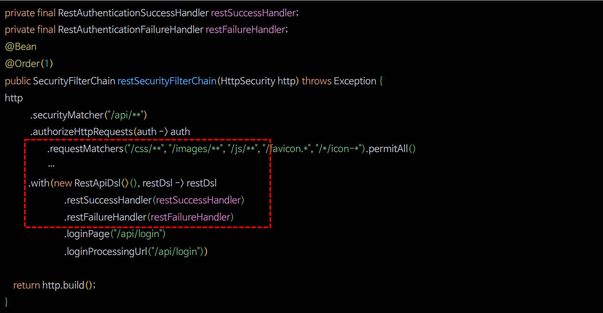
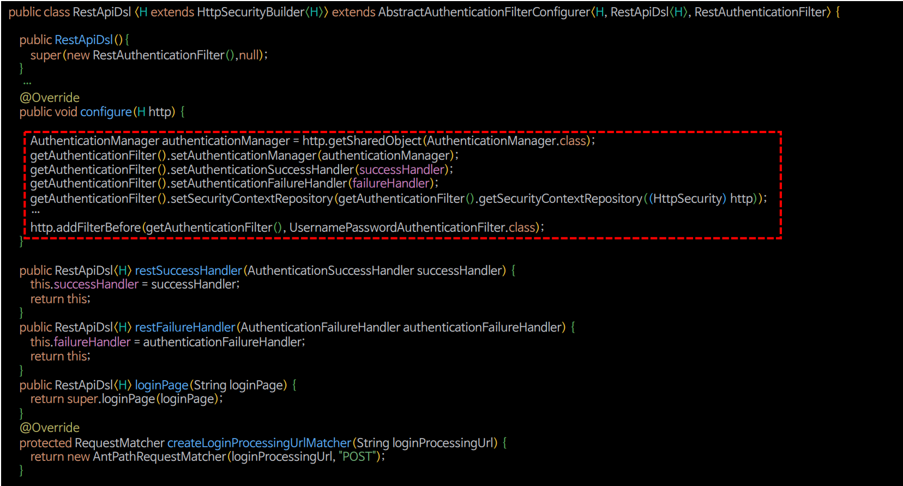
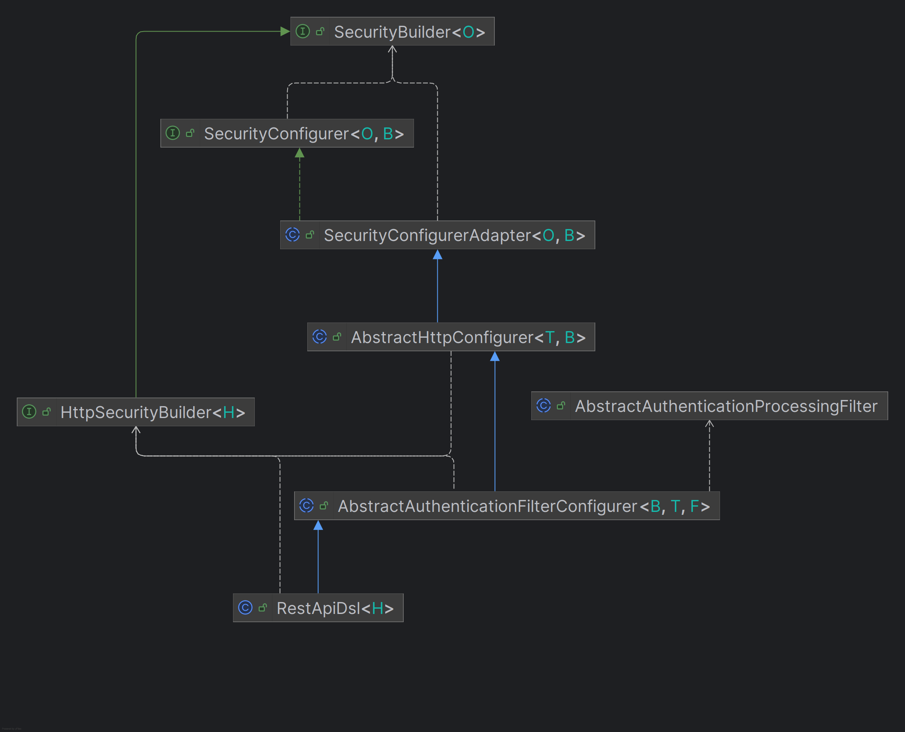

# 비동기 인증 - Rest DSLs 구현

## [Custom DSL](https://github.com/genesis12345678/TIL/blob/main/Spring/security/security/MultiSecurity/CustomDSL.md) 설정



> 기존에 인증 성공 및 실패 핸들러랑 로그인 관련 설정들을 필터에 설정한 것을 `dsl`을 만들어 `dsl`에서 필터를 만들어서 필터를 참조하도록 한다.
> 
> 이러한 구성은 통일성 있게 되어 유지보수성을 높일 수 있다.



> - `AbstractAuthenticationFilterConfigurer` : `FormLoginConfigurer` 설정 클래스가 이 클래스를 상속 받아서 `dsl`을 구현하고 있다.
> - `AbstractHttpConfigurer`로 `dsl`을 정의할 수도 있다. 지금 같은 경우 인증 필터를 다뤄야 하기 때문에 인증 필터 관련된 기능이 더 많은 `AbstractAuthenticationFilterConfigurer`를 사용한다.
> - `getAuthenticationFilter()`에서 가져오는 필터는 생성자에서 지정한 필터이다.

---

### RestApiDsl

```java
public class RestApiDsl <H extends HttpSecurityBuilder<H>> extends
        AbstractAuthenticationFilterConfigurer<H, RestApiDsl<H>, RestAuthenticationFilter> {

    private AuthenticationSuccessHandler successHandler;
    private AuthenticationFailureHandler failureHandler;

    public RestApiDsl(){
        super(new RestAuthenticationFilter(),null);
    }
    @Override
    public void init(H http) throws Exception {
        super.init(http);
    }

    @Override
    public void configure(H http) {

        AuthenticationManager authenticationManager = http.getSharedObject(AuthenticationManager.class);

        getAuthenticationFilter().setAuthenticationManager(authenticationManager);
        getAuthenticationFilter().setAuthenticationSuccessHandler(successHandler);
        getAuthenticationFilter().setAuthenticationFailureHandler(failureHandler);
        getAuthenticationFilter().setSecurityContextRepository(getAuthenticationFilter().getSecurityContextRepository((HttpSecurity) http));

        SessionAuthenticationStrategy sessionAuthenticationStrategy = http.getSharedObject(SessionAuthenticationStrategy.class);
        if (sessionAuthenticationStrategy != null) {
            getAuthenticationFilter().setSessionAuthenticationStrategy(sessionAuthenticationStrategy);
        }

        RememberMeServices rememberMeServices = http.getSharedObject(RememberMeServices.class);
        if (rememberMeServices != null) {
            getAuthenticationFilter().setRememberMeServices(rememberMeServices);
        }

        http.setSharedObject(RestAuthenticationFilter.class, getAuthenticationFilter());
        http.addFilterBefore(getAuthenticationFilter(), UsernamePasswordAuthenticationFilter.class);
    }

    public RestApiDsl<H> restSuccessHandler(AuthenticationSuccessHandler successHandler) {
        this.successHandler = successHandler;
        return this;
    }

    public RestApiDsl<H> restFailureHandler(AuthenticationFailureHandler authenticationFailureHandler) {
        this.failureHandler = authenticationFailureHandler;
        return this;
    }

    public RestApiDsl<H> loginPage(String loginPage) {
        return super.loginPage(loginPage);
    }

    public RestApiDsl<H> setSecurityContextRepository(SecurityContextRepository securityContextRepository) {
        return super.securityContextRepository(securityContextRepository);
    }

    @Override
    protected RequestMatcher createLoginProcessingUrlMatcher(String loginProcessingUrl) {
        return new AntPathRequestMatcher(loginProcessingUrl, "POST");
    }
}
```

> **전체적인 구조**
> 
> 

### RestAuthenticationFilter

```java
public class RestAuthenticationFilter extends AbstractAuthenticationProcessingFilter {

    private final ObjectMapper objectMapper = new ObjectMapper();

    public RestAuthenticationFilter() {
        super(new AntPathRequestMatcher("/api/login", "POST"));
    }

    //수정
    public SecurityContextRepository getSecurityContextRepository(HttpSecurity http) {
        SecurityContextRepository scr = http.getSharedObject(SecurityContextRepository.class);
        if (scr == null) {
            scr = new DelegatingSecurityContextRepository(
                    new RequestAttributeSecurityContextRepository(),
                    new HttpSessionSecurityContextRepository()
            );
        }
        return scr;
    }

    @Override
    public Authentication attemptAuthentication(HttpServletRequest request, HttpServletResponse response) throws AuthenticationException, IOException, ServletException {

        if (!HttpMethod.POST.name().equals(request.getMethod()) || !WebUtil.isAjax(request)) {
            throw new IllegalArgumentException("Authentication method is not supported");
        }
        AccountDto accountDto = objectMapper.readValue(request.getReader(), AccountDto.class);
        if (!StringUtils.hasText(accountDto.getUsername()) || !StringUtils.hasText(accountDto.getPassword())) {
            throw new AuthenticationServiceException("Username or Password is not provided");
        }

        RestAuthenticationToken authenticationToken = new RestAuthenticationToken(accountDto.getUsername(), accountDto.getPassword());

        return getAuthenticationManager().authenticate(authenticationToken);
    }
}
```

```java
@Configuration
@EnableWebSecurity
@RequiredArgsConstructor
public class SecurityConfig {

    private final FormAuthenticationProvider formAuthenticationProvider;
    private final RestAuthenticationProvider restAuthenticationProvider;

    private final AuthenticationDetailsSource<HttpServletRequest, WebAuthenticationDetails> authenticationDetailsSource;

    private final FormAuthenticationSuccessHandler formSuccessHandler;
    private final FormAuthenticationFailureHandler formFailureHandler;

    private final RestAuthenticationSuccessHandler restSuccessHandler;
    private final RestAuthenticationFailureHandler restFailureHandler;

    /**
     * 폼 인증 설정
     */
    @Bean
    public SecurityFilterChain securityFilterChain(HttpSecurity http) throws Exception{
        http
            .authorizeHttpRequests(auth -> auth
                .requestMatchers("/css/**", "/js/**", "/images/**", "/webjars/**", "/favicon.*", "/*/icon-*").permitAll() //정적 자원 관리
                .requestMatchers("/", "/signup", "/login*").permitAll()
                .requestMatchers("/user").hasRole("USER")
                .requestMatchers("/manager").hasRole("MANAGER")
                .requestMatchers("/admin").hasRole("ADMIN")
                .anyRequest().authenticated()
            )
            .formLogin(form -> form
                .loginPage("/login").permitAll()
                .authenticationDetailsSource(authenticationDetailsSource)
                .successHandler(authenticationSuccessHandler)
                .failureHandler(authenticationFailureHandler)
            )
            .authenticationProvider(authenticationProvider)
            .exceptionHandling(exception -> exception
                .accessDeniedHandler(new FormAccessDeniedHandler("/denied"))
            )
        ;

        return http.build();
    }

    /**
     * 비동기 인증 설정
     */
    @Bean
    @Order(1)
    public SecurityFilterChain restSecurityFilterChain(HttpSecurity http) throws Exception {

        AuthenticationManagerBuilder managerBuilder = http.getSharedObject(AuthenticationManagerBuilder.class);
        managerBuilder.authenticationProvider(restAuthenticationProvider);
        AuthenticationManager authenticationManager = managerBuilder.build();

        http
            .securityMatcher("/api/**")
            .authorizeHttpRequests(auth -> auth
                .requestMatchers("/css/**", "/js/**", "/images/**", "/webjars/**", "/favicon.*", "/*/icon-*").permitAll() //정적 자원 관리
                .requestMatchers("/api", "/api/login").permitAll()
                .requestMatchers("/api/user").hasRole("USER")
                .requestMatchers("/api/manager").hasRole("MANAGER")
                .requestMatchers("/api/admin").hasRole("ADMIN")
                .anyRequest().authenticated()
            )
            .csrf(AbstractHttpConfigurer::disable)
            .authenticationManager(authenticationManager)
            .exceptionHandling(exception -> exception
                .authenticationEntryPoint(new RestAuthenticationEntryPoint())
                .accessDeniedHandler(new RestAccessDeniedHandler())
            )
            //추가
            .with(new RestApiDsl<>(), restDsl -> restDsl
                            .restSuccessHandler(restSuccessHandler)
                            .restFailureHandler(restFailureHandler)
                            .loginPage("/api/login")
                            .loginProcessingUrl("/api/login")
            )
        ;

        return http.build();
    }
}
```

---

[이전 ↩️ - 비동기 인증 - Rest CSRF 구현](https://github.com/genesis12345678/TIL/blob/main/Spring/security/security/Projects/%EB%B9%84%EB%8F%99%EA%B8%B0_%EC%9D%B8%EC%A6%9D/CSRF/Main.md)

[메인 ⏫](https://github.com/genesis12345678/TIL/blob/main/Spring/security/security/main.md)

[다음 ↪️ - 회원 관리 시스템 - 기본 구성](https://github.com/genesis12345678/TIL/blob/main/Spring/security/security/Projects/%ED%9A%8C%EC%9B%90_%EA%B4%80%EB%A6%AC_%EC%8B%9C%EC%8A%A4%ED%85%9C/%EA%B8%B0%EB%B3%B8%EA%B5%AC%EC%84%B1/Main.md)
