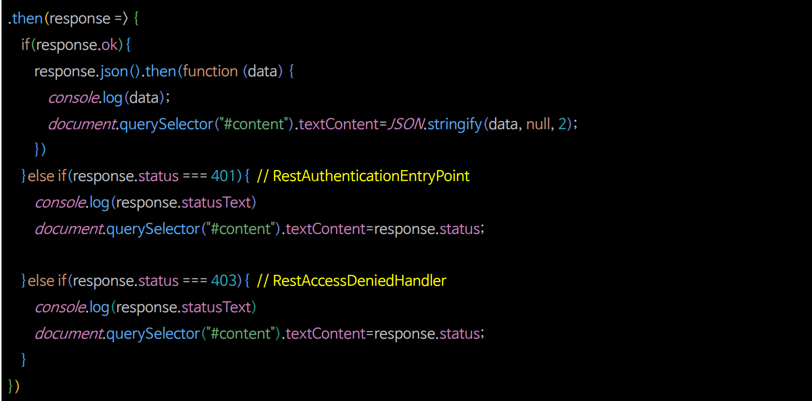

# 비동기 인증 - Rest 예외 처리

---


> - **authenticationEntryPoint**
>   - 인증을 받지 않은 상태에서 접근을 거부 당했을 때(인증 에러, 401)
> - **accessDeniedHandler**
>   - 인증을 받은 상태에서 접근을 거부 당했을 때(인가 에러, 403)



---

### RestAuthenticationEntryPoint

```java
public class RestAuthenticationEntryPoint implements AuthenticationEntryPoint {

    private final ObjectMapper objectMapper = new ObjectMapper();

    @Override
    public void commence(HttpServletRequest request, HttpServletResponse response, AuthenticationException authException) throws IOException, ServletException {
        response.setStatus(HttpStatus.UNAUTHORIZED.value());
        response.setContentType(MediaType.APPLICATION_JSON_VALUE);
        response.getWriter().write(objectMapper.writeValueAsString(HttpServletResponse.SC_UNAUTHORIZED));
    }
}
```

### RestAccessDeniedHandler

```java
public class RestAccessDeniedHandler implements AccessDeniedHandler {

    private final ObjectMapper objectMapper = new ObjectMapper();

    @Override
    public void handle(HttpServletRequest request, HttpServletResponse response, AccessDeniedException accessDeniedException) throws IOException, ServletException {
        response.setStatus(HttpStatus.FORBIDDEN.value());
        response.setContentType(MediaType.APPLICATION_JSON_VALUE);
        response.getWriter().write(objectMapper.writeValueAsString(HttpServletResponse.SC_FORBIDDEN));
    }
}
```

###

```java
@Configuration
@EnableWebSecurity
@RequiredArgsConstructor
public class SecurityConfig {

    private final FormAuthenticationProvider formAuthenticationProvider;
    private final RestAuthenticationProvider restAuthenticationProvider;

    private final AuthenticationDetailsSource<HttpServletRequest, WebAuthenticationDetails> authenticationDetailsSource;

    private final FormAuthenticationSuccessHandler formSuccessHandler;
    private final FormAuthenticationFailureHandler formFailureHandler;

    private final RestAuthenticationSuccessHandler restSuccessHandler;
    private final RestAuthenticationFailureHandler restFailureHandler;

    @Bean
    public SecurityFilterChain securityFilterChain(HttpSecurity http) throws Exception{...}

    @Bean
    @Order(1)
    public SecurityFilterChain restSecurityFilterChain(HttpSecurity http) throws Exception {

        AuthenticationManagerBuilder managerBuilder = http.getSharedObject(AuthenticationManagerBuilder.class);
        managerBuilder.authenticationProvider(restAuthenticationProvider);
        AuthenticationManager authenticationManager = managerBuilder.build();

        http
                .securityMatcher("/api/**")
                .authorizeHttpRequests(auth -> auth
                        .requestMatchers("/css/**", "/js/**", "/images/**", "/webjars/**", "/favicon.*", "/*/icon-*").permitAll() //정적 자원 관리
                        .requestMatchers("/api", "/api/login").permitAll()
                        .requestMatchers("/api/user").hasRole("USER")
                        .requestMatchers("/api/manager").hasRole("MANAGER")
                        .requestMatchers("/api/admin").hasRole("ADMIN")
                        .anyRequest().authenticated()
                )
                .csrf(AbstractHttpConfigurer::disable)
                .addFilterBefore(restAuthenticationFilter(http, authenticationManager), UsernamePasswordAuthenticationFilter.class)
                .authenticationManager(authenticationManager)
                .exceptionHandling(exception -> exception
                        .authenticationEntryPoint(new RestAuthenticationEntryPoint())
                        .accessDeniedHandler(new RestAccessDeniedHandler())
                )
        ;

        return http.build();
    }

    private RestAuthenticationFilter restAuthenticationFilter(HttpSecurity http, AuthenticationManager authenticationManager) {
        RestAuthenticationFilter restAuthenticationFilter = new RestAuthenticationFilter(http);
        restAuthenticationFilter.setAuthenticationManager(authenticationManager);
        restAuthenticationFilter.setAuthenticationSuccessHandler(restSuccessHandler);
        restAuthenticationFilter.setAuthenticationFailureHandler(restFailureHandler);

        return restAuthenticationFilter;
    }
}
```

---

[이전 ↩️ - 비동기 인증 - Rest 인증 상태 영속하기](https://github.com/genesis12345678/TIL/blob/main/Spring/security/security/Projects/%EB%B9%84%EB%8F%99%EA%B8%B0_%EC%9D%B8%EC%A6%9D/%EC%9D%B8%EC%A6%9D%EC%83%81%ED%83%9C%EC%98%81%EC%86%8D/Main.md)

[메인 ⏫](https://github.com/genesis12345678/TIL/blob/main/Spring/security/security/main.md)

[다음 ↪️ - 비동기 인증 - Rest 로그아웃 구현](https://github.com/genesis12345678/TIL/blob/main/Spring/security/security/Projects/%EB%B9%84%EB%8F%99%EA%B8%B0_%EC%9D%B8%EC%A6%9D/%EB%A1%9C%EA%B7%B8%EC%95%84%EC%9B%83/Main.md)