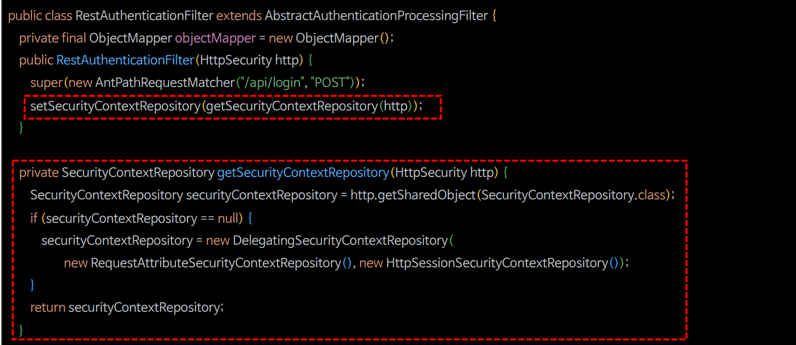

# 비동기 인증 - Rest 인증 상태 영속하기

---

## [SecurityContextRepository](https://github.com/genesis12345678/TIL/blob/main/Spring/security/security/AuthenticationPersistence/ContextRepository.md) 설정



> - 인증에 성공했을 때는 다음 두 가지 중요한 후속처리를 해야 한다.
>   - 인증 객체(`Authentication`)를 **SecurityContext**에 저장하고 이것을 다시 `ThreadLocal`에 저장시킨다.
>   - 인증 상태를 영속화 하기 위해 **SecurityContext**를 세션에 저장한다.
> - 스프링 시큐리티의 폼 인증 같은 경우는 위와 같은 과정을 모두 처리해준다.
> - 하지만 직접 필터를 정의하여 인증 처리를 할 경우에는 위와 같은 과정을 직접 처리해 주어야 한다.
> - `AbstractAuthenticationProcessingFilter`는 첫 번째 과정을 처리해준다. 따라서 인증 상태를 영속화 하는 과정은 직접 처리해 주어야 한다.

> - 인증 필터에서 인증에 성공한 이후 인증객체를 세션에 저장할 수 있도록 **HttpSessionSecurityContextRepository**를 지정한다.
> - `AbstractAuthenticationProcessingFilter`를 상속하면 **RequestAttributeSecurityContextRepository**가 기본으로 설정된다.

> 위와 같은 설정은 세션 기능을 사용할 때만 해줘도 되며, JWT와 같은 토큰 기반의 인증을 사용할 경우에는 하지 않아도 된다.

---

### RestAuthenticationFilter

```java
public class RestAuthenticationFilter extends AbstractAuthenticationProcessingFilter {

    private final ObjectMapper objectMapper = new ObjectMapper();

    public RestAuthenticationFilter(HttpSecurity http) {
        super(new AntPathRequestMatcher("/api/login", "POST"));
        setSecurityContextRepository(getSecurityContextRepository(http));
    }

    private SecurityContextRepository getSecurityContextRepository(HttpSecurity http) {
        SecurityContextRepository scr = http.getSharedObject(SecurityContextRepository.class);
        if (scr == null) {
            scr = new DelegatingSecurityContextRepository(
                    new RequestAttributeSecurityContextRepository(),
                    new HttpSessionSecurityContextRepository()
            );
        }
        return scr;
    }

    @Override
    public Authentication attemptAuthentication(HttpServletRequest request, HttpServletResponse response) throws AuthenticationException, IOException, ServletException {

        if (!HttpMethod.POST.name().equals(request.getMethod()) || !WebUtil.isAjax(request)) {
            throw new IllegalArgumentException("Authentication method is not supported");
        }
        AccountDto accountDto = objectMapper.readValue(request.getReader(), AccountDto.class);
        if (!StringUtils.hasText(accountDto.getUsername()) || !StringUtils.hasText(accountDto.getPassword())) {
            throw new AuthenticationServiceException("Username or Password is not provided");
        }

        RestAuthenticationToken authenticationToken = new RestAuthenticationToken(accountDto.getUsername(), accountDto.getPassword());

        return getAuthenticationManager().authenticate(authenticationToken);
    }
}
```

```java
@Configuration
@EnableWebSecurity
@RequiredArgsConstructor
public class SecurityConfig {

    private final FormAuthenticationProvider formAuthenticationProvider;
    private final RestAuthenticationProvider restAuthenticationProvider;

    private final AuthenticationDetailsSource<HttpServletRequest, WebAuthenticationDetails> authenticationDetailsSource;

    private final FormAuthenticationSuccessHandler formSuccessHandler;
    private final FormAuthenticationFailureHandler formFailureHandler;

    private final RestAuthenticationSuccessHandler restSuccessHandler;
    private final RestAuthenticationFailureHandler restFailureHandler;

    @Bean
    public SecurityFilterChain securityFilterChain(HttpSecurity http) throws Exception{...}

    @Bean
    @Order(1)
    public SecurityFilterChain restSecurityFilterChain(HttpSecurity http) throws Exception {

        AuthenticationManagerBuilder managerBuilder = http.getSharedObject(AuthenticationManagerBuilder.class);
        managerBuilder.authenticationProvider(restAuthenticationProvider);
        AuthenticationManager authenticationManager = managerBuilder.build();

        http
                .securityMatcher("/api/login")
                .authorizeHttpRequests(auth -> auth
                        .requestMatchers("/css/**", "/js/**", "/images/**", "/webjars/**", "/favicon.*", "/*/icon-*").permitAll() //정적 자원 관리
                        .anyRequest().permitAll()
                )
                .csrf(AbstractHttpConfigurer::disable)
                .addFilterBefore(restAuthenticationFilter(http, authenticationManager), UsernamePasswordAuthenticationFilter.class)
                .authenticationManager(authenticationManager)
        ;

        return http.build();
    }

    private RestAuthenticationFilter restAuthenticationFilter(HttpSecurity http, AuthenticationManager authenticationManager) {
        RestAuthenticationFilter restAuthenticationFilter = new RestAuthenticationFilter(http);
        restAuthenticationFilter.setAuthenticationManager(authenticationManager);
        restAuthenticationFilter.setAuthenticationSuccessHandler(restSuccessHandler);
        restAuthenticationFilter.setAuthenticationFailureHandler(restFailureHandler);

        return restAuthenticationFilter;
    }
}
```

---

[이전 ↩️ - 비동기 인증 - Rest 인증 성공 및 실패 핸들러](https://github.com/genesis12345678/TIL/blob/main/Spring/security/security/Projects/%EB%B9%84%EB%8F%99%EA%B8%B0_%EC%9D%B8%EC%A6%9D/%EC%9D%B8%EC%A6%9D%ED%95%B8%EB%93%A4%EB%9F%AC/Main.md)

[메인 ⏫](https://github.com/genesis12345678/TIL/blob/main/Spring/security/security/main.md)

[다음 ↪️ - 비동기 인증 - Rest 예외 처리](https://github.com/genesis12345678/TIL/blob/main/Spring/security/security/Projects/%EB%B9%84%EB%8F%99%EA%B8%B0_%EC%9D%B8%EC%A6%9D/%EC%98%88%EC%99%B8%EC%B2%98%EB%A6%AC/Main.md)