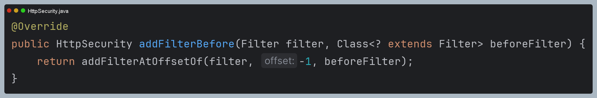

# 비동기 인증 - Rest 인증 필터 구현

## 스프링 시큐리티 필터 설정

- 스프링 시큐리티는 **HttpSecurity** 설정을 통해 애플리케이션의 보안 요구사항에 맞게 필터 체인을 추가할 수 있도록 제공한다.
- 필터 추가는 4개의 메서드를 사용하여 필터의 순서와 위치를 제어할 수 있다.

### addFilterBefore

- 지정된 필터를 필터 체인의 특정 필터 이전에 추가한다.
- 주로 특정 처리가 다른 필터보다 먼저 실행되어야 할 때 사용된다.
- `http.addFilterBefore(커스텀 필터, 기존 필터.class)` : 커스텀 필터가 기존 필터 이전에 실행되도록 한다.



### addFilterAfter

- 지정된 필터를 필터 체인의 특정 필터 이후에 추가한다.
- 특정 작업이 다른 필터의 처리를 따라야 할 때 유용하다.
- `http.addFilterAfter(커스텀 필터, 기존 필터.class)` : 커스텀 필터가 기존 필터 이후에 실행되도록 한다.


### addFilter

- 시큐리티 필터 체인에 새로운 필터를 추가하며, 필터의 위치를 지정하지 않고 필터의 유형에 따라 자동으로 적절한 위치에 필터를 추가한다.
- 추가하는 필터가 **스프링 시큐리티의 필터를 상속받을 경우**에 해당하며 그렇지 않을 경우 예외가 발생한다.
- `http.addFilter(커스텀 필터)`


### addFilterAt

- 지정된 필터를 필터 체인의 특정 필터 위치에 추가하며 이때 특정 필터를 대체하지는 않는다.
- `http.addFilterAt(커스텀 필터, 기존 필터.class)`


> 

---

### RestAuthenticationFilter
```java
public class RestAuthenticationFilter extends AbstractAuthenticationProcessingFilter {

    private final ObjectMapper objectMapper = new ObjectMapper();

    public RestAuthenticationFilter() {
        super(new AntPathRequestMatcher("/api/login", "POST"));
    }

    @Override
    public Authentication attemptAuthentication(HttpServletRequest request, HttpServletResponse response) throws AuthenticationException, IOException, ServletException {

        if (!HttpMethod.POST.name().equals(request.getMethod()) || !WebUtil.isAjax(request)) {
            throw new IllegalArgumentException("Authentication method is not supported");
        }
        AccountDto accountDto = objectMapper.readValue(request.getReader(), AccountDto.class);
        if (!StringUtils.hasText(accountDto.getUsername()) || !StringUtils.hasText(accountDto.getPassword())) {
            throw new AuthenticationServiceException("Username or Password is not provided");
        }

        RestAuthenticationToken authenticationToken =
            RestAuthenticationToken.unauthenticated(accountDto.getUsername(), accountDto.getPassword());

        return getAuthenticationManager().authenticate(authenticationToken);
    }
}
```
> - `/api/login`을 `POST`로 요청할 때만 이 필터가 동작하도록 한다.
> - `POST`가 아니거나 비동기 통신(AJAX)이 아닌 경우에는 예외를 던진다.


### WebUtil
```java
public class WebUtil {

    private static final String XML_HTTP_REQUEST = "XMLHttpRequest";
    private static final String X_REQUESTED_WITH = "X-Requested-With";
    private static final String CONTENT_TYPE = "Content-Type";
    private static final String CONTENT_TYPE_JSON = "application/json";

    public static boolean isAjax(HttpServletRequest request) {
        return XML_HTTP_REQUEST.equals(request.getHeader(X_REQUESTED_WITH));
    }

    public static boolean isContentTypeJson(HttpServletRequest request) {
        return request.getHeader(CONTENT_TYPE).equals(CONTENT_TYPE_JSON);
    }
}
```
> 헤더의 값을 통해 비동기 통신임을 확인한다.

### RestAuthenticationToken

```java
public class RestAuthenticationToken extends AbstractAuthenticationToken {

    private final Object principal;
    private final Object credentials;

    public RestAuthenticationToken(Collection<? extends GrantedAuthority> authorities,
                                   Object principal,
                                   Object credentials) {
        super(authorities);
        this.principal = principal;
        this.credentials = credentials;
        setAuthenticated(true);
    }

    public RestAuthenticationToken(Object principal,
                                   Object credentials) {
        super(null);
        this.principal = principal;
        this.credentials = credentials;
        setAuthenticated(false);
    }

    public static RestAuthenticationToken unauthenticated(Object principal, Object credentials) {
        return new RestAuthenticationToken(principal, credentials);
    }

    public static RestAuthenticationToken authenticated(Object principal, Object credentials,
                                                        Collection<? extends GrantedAuthority> authorities) {
        return new RestAuthenticationToken(authorities, principal, credentials);
    }

    @Override
    public Object getCredentials() {
        return this.credentials;
    }

    @Override
    public Object getPrincipal() {
        return this.principal;
    }
}
```
> - `AuthenticationManager`에게 전달할 인증 객체 정의
> - 권한을 가진 생성자와 권한이 없는 생성자를 갖는다.

### SecurityConfig

```java
@Configuration
@EnableWebSecurity
@RequiredArgsConstructor
public class SecurityConfig {

    private final AuthenticationProvider authenticationProvider;
    private final AuthenticationDetailsSource<HttpServletRequest, WebAuthenticationDetails> authenticationDetailsSource;
    private final AuthenticationSuccessHandler authenticationSuccessHandler;
    private final AuthenticationFailureHandler authenticationFailureHandler;

    /**
     * 폼 인증 설정
     */
    @Bean
    public SecurityFilterChain securityFilterChain(HttpSecurity http) throws Exception{
        http
            .authorizeHttpRequests(auth -> auth
                .requestMatchers("/css/**", "/js/**", "/images/**", "/webjars/**", "/favicon.*", "/*/icon-*").permitAll() //정적 자원 관리
                .requestMatchers("/", "/signup", "/login*").permitAll()
                .requestMatchers("/user").hasRole("USER")
                .requestMatchers("/manager").hasRole("MANAGER")
                .requestMatchers("/admin").hasRole("ADMIN")
                .anyRequest().authenticated()
            )
            .formLogin(form -> form
                .loginPage("/login").permitAll()
                .authenticationDetailsSource(authenticationDetailsSource)
                .successHandler(authenticationSuccessHandler)
                .failureHandler(authenticationFailureHandler)
            )
            .authenticationProvider(authenticationProvider)
            .exceptionHandling(exception -> exception
                .accessDeniedHandler(new FormAccessDeniedHandler("/denied"))
            )
        ;

        return http.build();
    }

    /**
     * 비동기 인증 설정
     */
    @Bean
    @Order(1)
    public SecurityFilterChain restSecurityFilterChain(HttpSecurity http) throws Exception {

        AuthenticationManagerBuilder managerBuilder = http.getSharedObject(AuthenticationManagerBuilder.class);
        AuthenticationManager authenticationManager = managerBuilder.build();

        http
            .securityMatcher("/api/login")
            .authorizeHttpRequests(auth -> auth
                .requestMatchers("/css/**", "/js/**", "/images/**", "/webjars/**", "/favicon.*", "/*/icon-*").permitAll() //정적 자원 관리
                .anyRequest().permitAll()
            )
            .csrf(AbstractHttpConfigurer::disable)
            .addFilterBefore(restAuthenticationFilter(authenticationManager), UsernamePasswordAuthenticationFilter.class)
            .authenticationManager(authenticationManager)
        ;

        return http.build();
    }

    private RestAuthenticationFilter restAuthenticationFilter(AuthenticationManager authenticationManager) {
        RestAuthenticationFilter restAuthenticationFilter = new RestAuthenticationFilter();
        restAuthenticationFilter.setAuthenticationManager(authenticationManager);

        return restAuthenticationFilter;
    }
}
```

---

[이전 ↩️ - 비동기 인증 - Rest 인증 보안 및 화면 구성](https://github.com/genesis12345678/TIL/blob/main/Spring/security/security/Projects/%EB%B9%84%EB%8F%99%EA%B8%B0_%EC%9D%B8%EC%A6%9D/Rest%ED%99%94%EB%A9%B4%EA%B5%AC%EC%84%B1/Main.md)

[메인 ⏫](https://github.com/genesis12345678/TIL/blob/main/Spring/security/security/main.md)

[다음 ↪️ - 비동기 인증 - `RestAuthenticationProvider` 구현](https://github.com/genesis12345678/TIL/blob/main/Spring/security/security/Projects/%EB%B9%84%EB%8F%99%EA%B8%B0_%EC%9D%B8%EC%A6%9D/RestAuthenticationProvider/Main.md)