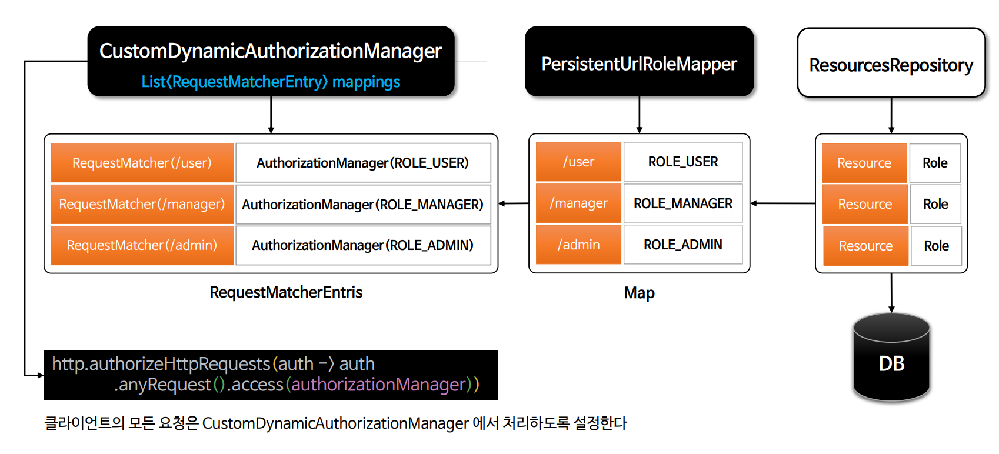

# 회원 관리 시스템 - DB 연동 프로그래밍 방식 인가 구현

- DB 방식으로 권한과 자원을 매핑하기 위해 `UrlRoleMapper` 인터페이스를 구현한 **PersistenceUrlRoleMapper** 클래스를 만든다.



---

### UrlRoleMapper

```java
public interface UrlRoleMapper {
    Map<String, String> getUrlRoleMappings();
}
```

### PersistentUrlRoleMapper

```java
public class PersistentUrlRoleMapper implements UrlRoleMapper{

    private final LinkedHashMap<String, String> urlRoleMappings = new LinkedHashMap<>();
    private final ResourcesRepository resourcesRepository;

    public PersistentUrlRoleMapper(ResourcesRepository resourcesRepository) {
        this.resourcesRepository = resourcesRepository;
    }

    @Override
    public Map<String, String> getUrlRoleMappings() {
        List<Resources> resourcesList = resourcesRepository.findAllResources();

        resourcesList.forEach(resources -> {
            resources.getRoleSet().forEach(role -> {
                urlRoleMappings.put(resources.getResourceName(), role.getRoleName());
            });
        });

        return urlRoleMappings;
    }
}
```

> 하나의 자원에는 여러 권한을 가지고 있다. 

### 

```java
@Component
@RequiredArgsConstructor
public class CustomDynamicAuthorizationManager implements AuthorizationManager<RequestAuthorizationContext> {

    private List<RequestMatcherEntry<AuthorizationManager<RequestAuthorizationContext>>> mappings;
    private static final AuthorizationDecision ACCESS = new AuthorizationDecision(true);
    private static final AuthorizationDecision DENY = new AuthorizationDecision(false);

    private final HandlerMappingIntrospector handlerMappingIntrospector;
    private final ResourcesRepository resourcesRepository;

    @PostConstruct
    public void mapping() {
        DynamicAuthorizationService das = new DynamicAuthorizationService(new PersistentUrlRoleMapper(resourcesRepository));
        mappings = das.getUrlRoleMappings()
                      .entrySet()
                      .stream()
                      .map(entry -> new RequestMatcherEntry<>(
                              new MvcRequestMatcher(handlerMappingIntrospector, entry.getKey()),
                              customAuthorizationManager(entry.getValue())
                      ))
                      .toList();
    }

    private AuthorizationManager<RequestAuthorizationContext> customAuthorizationManager(String role) {
        if (role != null) {
            if (role.startsWith("ROLE")) {
                return AuthorityAuthorizationManager.hasAuthority(role);
            } else {
                return new WebExpressionAuthorizationManager(role);
            }
        }
        return null;
    }

    /**
     * RequestMatcherDelegatingAuthorizationManager 클래스에 check() 메서드 그대로
     */
    @Override
    public AuthorizationDecision check(Supplier<Authentication> authentication, RequestAuthorizationContext request) {
        for (RequestMatcherEntry<AuthorizationManager<RequestAuthorizationContext>> mapping : this.mappings) {

            RequestMatcher matcher = mapping.getRequestMatcher();
            RequestMatcher.MatchResult matchResult = matcher.matcher(request.getRequest());

            if (matchResult.isMatch()) {
                AuthorizationManager<RequestAuthorizationContext> manager = mapping.getEntry();
                return manager.check(authentication,
                        new RequestAuthorizationContext(request.getRequest(), matchResult.getVariables()));
            }
        }
        return ACCESS;
    }

    @Override
    public void verify(Supplier<Authentication> authentication, RequestAuthorizationContext object) {
        AuthorizationManager.super.verify(authentication, object);
    }
}
```

---

[이전 ↩️ - 회원 관리 시스템 - 메모리 기반 프로그래밍 방식 인가 구현](https://github.com/genesis12345678/TIL/blob/main/Spring/security/security/Projects/%ED%9A%8C%EC%9B%90_%EA%B4%80%EB%A6%AC_%EC%8B%9C%EC%8A%A4%ED%85%9C/%EB%A9%94%EB%AA%A8%EB%A6%AC%EA%B8%B0%EB%B0%98/Main.md)

[메인 ⏫](https://github.com/genesis12345678/TIL/blob/main/Spring/security/security/main.md)

[다음 ↪️ - 회원 관리 시스템 - 인가 설정 실시간 반영](https://github.com/genesis12345678/TIL/blob/main/Spring/security/security/Projects/%ED%9A%8C%EC%9B%90_%EA%B4%80%EB%A6%AC_%EC%8B%9C%EC%8A%A4%ED%85%9C/%EC%8B%A4%EC%8B%9C%EA%B0%84%EB%B0%98%EC%98%81/Main.md)