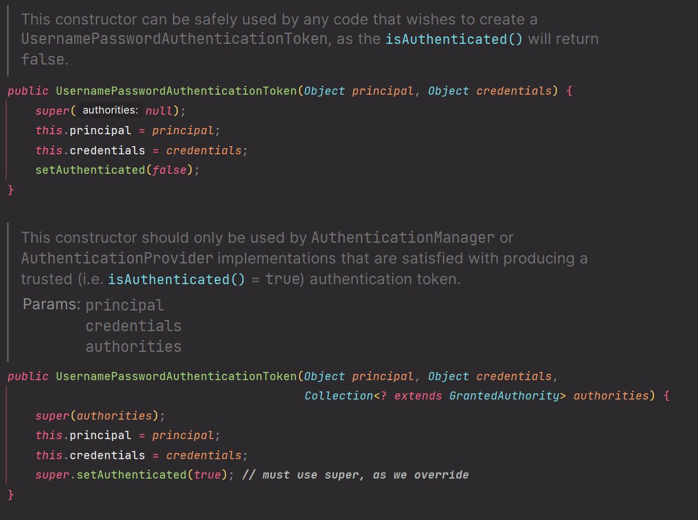

# 회원 인증 시스템 - 커스텀 AuthenticationProvider 구현

---

## [AuthenticationProvider](https://github.com/genesis12345678/TIL/blob/main/Spring/security/security/AuthenticationArchitecture/AuthenticationProvider.md) 구현


---

### FormAuthenticationProvider

```java
@Component("authenticationProvider")
@RequiredArgsConstructor
public class FormAuthenticationProvider implements AuthenticationProvider {

    private final UserDetailsService userDetailsService;
    private final PasswordEncoder passwordEncoder;

    @Override
    public Authentication authenticate(Authentication authentication) throws AuthenticationException {
        String loginId = authentication.getName();
        String password = (String) authentication.getCredentials();

        AccountContext accountContext = (AccountContext) userDetailsService.loadUserByUsername(loginId);

        if (!passwordEncoder.matches(password, accountContext.getPassword())) {
            throw new BadCredentialsException("Invalid password");
        }

        return new UsernamePasswordAuthenticationToken(
                accountContext.getAccountDto(), null, accountContext.getAuthorities()
        );
    }

    @Override
    public boolean supports(Class<?> authentication) {
        return authentication.isAssignableFrom(UsernamePasswordAuthenticationToken.class);
    }
}
```

- `UsernamePasswordAuthenticationToken`는 두 개의 생성자가 있다.



<details>
    <summary> 참고 - UsernamePasswordAuthenticationToken</summary>

**폼 인증 과정**


1. 사용자가 `username`과 `password`를 제출하면 **UsernamePasswordAuthenticationFilter**는 `HttpServletRequest`에서 `username`과 `password`를 추출하여 
    인증 유형(`Authentication`)인 `UsernamePasswordAuthenticationToken`을 생성한다.
2. `UsernamePasswordAuthenticationToken` 이 인증을 위해 [AuthenticationManager](https://github.com/genesis12345678/TIL/blob/main/Spring/security/security/AuthenticationArchitecture/AuthenticationManager.md) 에게 전달된다.
    `AuthenticationManager`의 세부 사항은 사용자 정보가 저장되는 방식에 따라 달라진다.
3. 인증에 실패했을 때
   1. `SecurityContextHolder`가 지워진다.
   2. `RememberMeServices.loginFail`이 호출된다. 기억하기 인증을 구성하지 않은 경우에는 아무런 작업도 수행되지 않는다.
   3. `AuthenticationFailureHandler`가 호출된다.
4. 인증에 성공했을 때
   1. `SessionAuthenticationStrategy`에 새 로그인이 통보된다.
   2. `Authentication`이 `SecurityContextHolder`에 저장된다.
   3. `RememberMeServices.loginSuccess`이 호출된다. 기억하기 인증을 구성하지 않은 경우에는 아무런 작업도 수행되지 않는다.
   4. `ApplicationEventPublisher`는 **InteractiveAuthenticationSuccessEvent**를 발행한다.
   5. `AuthenticationSuccessHandler`가 호출된다. 일반적으로 로그인 페이지로 리다이렉션 할 때 **ExceptionTranslationFilter**에 의해 저장된 요청으로 리다이렉션 되는 `SimpleUrlAuthenticationSuccessHandler`이다.


> [참고 - 스프링 공식 문서](https://docs.spring.io/spring-security/reference/servlet/authentication/passwords/form.html)
</details>

---

### SecurityConfig

```java
@Configuration
@EnableWebSecurity
@RequiredArgsConstructor
public class SecurityConfig {

    private final AuthenticationProvider authenticationProvider;

    @Bean
    public SecurityFilterChain securityFilterChain(HttpSecurity http) throws Exception {
        http
                .authorizeHttpRequests(auth -> auth
                        .requestMatchers("/css/**", "/js/**", "/images/**", "/webjars/**", "/favicon.*", "/*/icon-*").permitAll() //정적 자원 관리
                        .requestMatchers("/", "/signup").permitAll()
                        .anyRequest().authenticated())
                .formLogin(form -> form.loginPage("/login").permitAll()) //커스텀 로그인 페이지
                .authenticationProvider(authenticationProvider)
        ;

        return http.build();
    }
}
```

### AuthConfig

```java
@Configuration
public class AuthConfig {

    @Bean
    public PasswordEncoder passwordEncoder() {
        return PasswordEncoderFactories.createDelegatingPasswordEncoder();
    }
}
```
- 보안 설정 클래스랑 보안을 위한 빈을 생성하는 클래스를 분리한다.

---

[이전 ↩️ - 회원 인증 시스템 - 커스텀 `UserDetailsService`](https://github.com/genesis12345678/TIL/blob/main/Spring/security/security/Projects/%ED%9A%8C%EC%9B%90_%EC%9D%B8%EC%A6%9D_%EC%8B%9C%EC%8A%A4%ED%85%9C/userDetailsService/UserDetailsService.md)

[메인 ⏫](https://github.com/genesis12345678/TIL/blob/main/Spring/security/security/main.md)

[다음 ↪️ - 회원 인증 시스템 - 커스텀 로그아웃](https://github.com/genesis12345678/TIL/blob/main/Spring/security/security/Projects/%ED%9A%8C%EC%9B%90_%EC%9D%B8%EC%A6%9D_%EC%8B%9C%EC%8A%A4%ED%85%9C/Logout/Main.md)