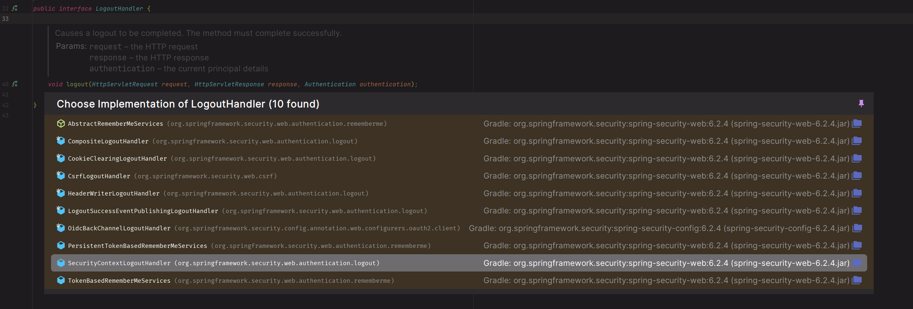

# 회원 인증 시스템 - 커스텀 로그아웃


- 스프링 시큐리티는 기본적으로 보안을 위해 CSRF 토큰을 포함하도록 요청하게 하기 위해서 `POST` 방식으로 로그아웃 요청을 받는다.
- CSRF 기능은 기본값으로 두고 `GET` 방식으로 로그아웃을 구현할 수 있다.
- `LogoutFilter`를 통해 로그아웃을 처리하는 게 아닌 직접 만든 스프링 MVC에서 로그아웃을 처리하는 것이다.


- 타임리프의 확장 버전을 통해 인증 여부에 따라 화면을 다르게 보여줄 수 있다.

**Thymeleaf 보안 표현식 종류**


- 인증 표현식 사용 예


---

### build.gradle 추가
```text
implementation 'org.thymeleaf.extras:thymeleaf-extras-springsecurity6:3.1.2.RELEASE'
```

### header.html 추가
```html
<!DOCTYPE html>
<html lang="ko" xmlns:th="http://www.thymeleaf.org"
      xmlns:sec="http://www.thymeleaf.org/thymeleaf-extras-springsecurity6">

<header th:fragment="header">
    <nav class="navbar navbar-expand-lg navbar-custom">
        <a class="navbar-brand" href="#">Spring Security Master</a>
        <div class="collapse navbar-collapse" id="navbarSupportedContent">
            <ul class="navbar-nav ml-auto">
                <li class="nav-item" sec:authorize="isAnonymous()">
                    <a class="nav-link" href="/login">로그인</a>
                </li>
                <li class="nav-item" sec:authorize="isAuthenticated()">
                    <a class="nav-link" href="/logout">로그아웃</a>
                </li>
                <li class="nav-item" sec:authorize="isAnonymous()">
                    <a class="nav-link" href="/signup">회원가입</a>
                </li>
            </ul>
        </div>
    </nav>
</header>
```

> 인증되지 않은 익명 사용자에게는 로그아웃이 보여지지 않고, 인증받은 사용자는 로그아웃만 보여진다.

### Controller
```java
@Controller
public class LoginController {

    @GetMapping("/login")
    public String login() {
        return "login/login";
    }

    @GetMapping("/signup")
    public String signup() {
        return "login/signup";
    }

    @GetMapping("/logout")
    public String logout(HttpServletRequest request, HttpServletResponse response) {
        Authentication authentication = SecurityContextHolder.getContextHolderStrategy().getContext().getAuthentication();
        if (authentication != null) {
            new SecurityContextLogoutHandler().logout(request, response, authentication);
        }

        return "redirect:/login";
    }
}
```



> `LogoutHandler`의 구현체는 여러 가지가 있으며 `SecurityContextLogoutHandler`는 세션을 무효화 시키고 **SecurityContext**에서 `Authentication`을 제거하는 등의 수행을 한다.
> 
> 

이렇게 `GET` 방식으로도 로그아웃을 간단하게 구현할 수 있지만 `POST` 요청으로 **LogoutFilter**가 로그아웃을 처리하도록 하는 것이 안전한 방법이다.

---

[이전 ↩️ - 회원 인증 시스템 - 커스텀 `AuthenticationProvider`](https://github.com/genesis12345678/TIL/blob/main/Spring/security/security/Projects/%ED%9A%8C%EC%9B%90_%EC%9D%B8%EC%A6%9D_%EC%8B%9C%EC%8A%A4%ED%85%9C/AuthenticationProvider/AuthenticationProvider.md)

[메인 ⏫](https://github.com/genesis12345678/TIL/blob/main/Spring/security/security/main.md)

[다음 ↪️ - 회원 인증 시스템 - 커스텀 인증상세 구현](https://github.com/genesis12345678/TIL/blob/main/Spring/security/security/Projects/%ED%9A%8C%EC%9B%90_%EC%9D%B8%EC%A6%9D_%EC%8B%9C%EC%8A%A4%ED%85%9C/%EC%9D%B8%EC%A6%9D%EC%83%81%EC%84%B8/Main.md)
