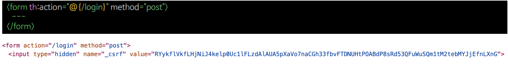
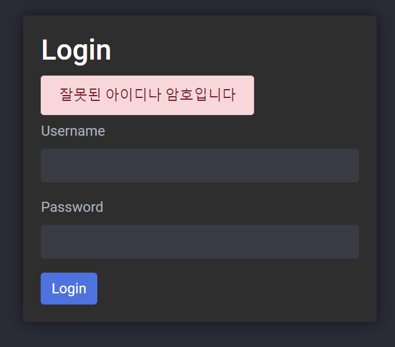

# 회원 인증 시스템 - 로그인 페이지 만들기

---


> 스프링 시큐리티에서 정적 자원을 설정해주는 메서드를 제공 해주지만 `permitAll`을 권장한다.
> 
> [참고](https://github.com/genesis12345678/TIL/blob/main/Spring/security/security/AuthorizeProcess/StaticResource.md)

- CSRF 코드 자동 생성 - 타임리프 폼 태그



> - 스프링 시큐리티는 기본적으로 CSRF 기능을 활성화 한다.
> - 로그인에 HTTP Method는 `POST` 이므로 CSRF 토큰을 필요로 한다.
> - 타임리프의 폼 태그는 CSRF 토큰을 자동으로 생성해 준다.

---

```java
@Configuration
@EnableWebSecurity
public class SecurityConfig {

    @Bean
    public SecurityFilterChain securityFilterChain(HttpSecurity http) throws Exception {
        http
                .authorizeHttpRequests(auth -> auth
                        .requestMatchers("/css/**", "/js/**", "/images/**", "/webjars/**", "/favicon.*", "/*/icon-*").permitAll() //정적 자원 관리
                        .requestMatchers("/").permitAll()
                        .anyRequest().authenticated())
                .formLogin(form -> form.loginPage("/login").permitAll()); //커스텀 로그인 페이지

        return http.build();
    }

    @Bean
    public UserDetailsService userDetailsService() {
        UserDetails user = User.withUsername("user").password("{noop}1111").roles("USER").build();
        return new InMemoryUserDetailsManager(user);
    }
}
```
```java
@Controller
public class LoginController {

    @GetMapping("/login")
    public String login() {
        return "login/login";
    }
}
```

- `login/login.html`

```html
<!DOCTYPE html>
<html xmlns:th="http://www.thymeleaf.org">
<head>
...
</head>
<body>
<div th:replace="~{layout/header::header}"></div>
<div class="container-fluid">
    <div class="row">
        <div class="col-md-2 sidebar">
            <div th:replace="~{layout/sidebar::sidebar}"></div>
        </div>
        <div class="col-md-10 content">
            <div class="login-form">
                <h2>Login</h2>
                <div th:if="${param.error}" class="form-group">
                    <span th:text="${exception}?: '잘못된 아이디나 암호입니다'" class="alert alert-danger"></span>
                </div>
                <form th:action="@{/login}" method="post">
                    <div class="form-group">
                        <label for="username">Username</label>
                        <input type="text" class="form-control" id="username" name="username" required>
                    </div>
                    <div class="form-group">
                        <label for="password">Password</label>
                        <input type="password" class="form-control" id="password" name="password" required>
                    </div>
                    <button type="submit" class="btn btn-primary">Login</button>
                </form>
            </div>
        </div>
    </div>
</div>
<div class="footer" th:replace="~{layout/footer::footer}"></div>
</body>
</html>
```
> - `th:if="${param.error}"` : 스프링 시큐리티에서 인증에 실패했을 때 자동으로 쿼리 파라미터에 `error`를 생성해 주는데, 이때 지정한 메시지를 화면에 보여주도록 한다.
> - `class="alert alert-danger"` : `danger` 외에도 다양한 스타일이 부트스트랩에 정의되어 있다.([참고](https://getbootstrap.com/docs/4.0/components/alerts/#examples))


> 타임리프가 `hidden` 타입으로 CSRF 토큰과 같이 폼 태그를 전송하는 것을 확인할 수 있다.

- 인증에 실패했을 때 : `http://localhost:8080/login?error`



---

[이전 ↩️ - 회원 인증 시스템 - 사용자 정의 보안 설정 및 기본 사용자 구성](https://github.com/genesis12345678/TIL/blob/main/Spring/security/security/Projects/%ED%9A%8C%EC%9B%90_%EC%9D%B8%EC%A6%9D_%EC%8B%9C%EC%8A%A4%ED%85%9C/%EB%B3%B4%EC%95%88%EC%84%A4%EC%A0%95/Main.md)

[메인 ⏫](https://github.com/genesis12345678/TIL/blob/main/Spring/security/security/main.md)

[다음 ↪️ - 회원 인증 시스템 - 회원가입(`PasswordEncoder`)](https://github.com/genesis12345678/TIL/blob/main/Spring/security/security/Projects/%ED%9A%8C%EC%9B%90_%EC%9D%B8%EC%A6%9D_%EC%8B%9C%EC%8A%A4%ED%85%9C/%ED%9A%8C%EC%9B%90%EA%B0%80%EC%9E%85/Main.md)