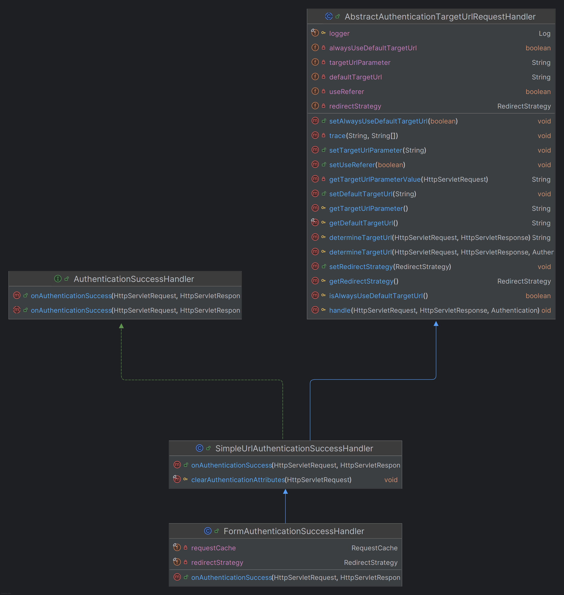

# 회원 인증 시스템 - 커스텀 인증성공 핸들러

### FormAuthenticationSuccessHandler

```java
@Component
public class FormAuthenticationSuccessHandler extends SimpleUrlAuthenticationSuccessHandler {

    private final RequestCache requestCache = new HttpSessionRequestCache();
    private final RedirectStrategy redirectStrategy = new DefaultRedirectStrategy();

    @Override
    public void onAuthenticationSuccess(HttpServletRequest request, HttpServletResponse response, Authentication authentication) throws IOException, ServletException {
        setDefaultTargetUrl("/");

        SavedRequest savedRequest = requestCache.getRequest(request, response);
        if (savedRequest != null) {
            String targetUrl = savedRequest.getRedirectUrl();
            redirectStrategy.sendRedirect(request, response, targetUrl);
            return;
        }

        redirectStrategy.sendRedirect(request, response, getDefaultTargetUrl());
    }
}
```

> 사용자가 인증 정보를 제공하기 전에 어떤 요청 정보가 있을 때는 인증이 된 후에 이전 요청 정보로 리다이렉트 하도록 한다. 요청 정보가 없으면 루트(`/`)로 리다이렉트 하도록 한다.



### SecurityConfig
```java
@Configuration
@EnableWebSecurity
@RequiredArgsConstructor
public class SecurityConfig {

    private final AuthenticationProvider authenticationProvider;
    private final AuthenticationDetailsSource<HttpServletRequest, WebAuthenticationDetails> authenticationDetailsSource;
    private final AuthenticationSuccessHandler authenticationSuccessHandler;

    @Bean
    public SecurityFilterChain securityFilterChain(HttpSecurity http) throws Exception {
        http
            .authorizeHttpRequests(auth -> auth
                .requestMatchers("/css/**", "/js/**", "/images/**", "/webjars/**", "/favicon.*", "/*/icon-*").permitAll() //정적 자원 관리
                .requestMatchers("/", "/signup").permitAll()
                .anyRequest().authenticated())
            .formLogin(form -> form
                .loginPage("/login").permitAll()
                .authenticationDetailsSource(authenticationDetailsSource)
                .successHandler(authenticationSuccessHandler) //추가
            )
            .authenticationProvider(authenticationProvider)
        ;

        return http.build();
    }
}
```

---

[이전 ↩️ - 회원 인증 시스템 - 커스텀 인증상세 구현](https://github.com/genesis12345678/TIL/blob/main/Spring/security/security/Projects/%ED%9A%8C%EC%9B%90_%EC%9D%B8%EC%A6%9D_%EC%8B%9C%EC%8A%A4%ED%85%9C/%EC%9D%B8%EC%A6%9D%EC%83%81%EC%84%B8/Main.md)

[메인 ⏫](https://github.com/genesis12345678/TIL/blob/main/Spring/security/security/main.md)

[다음 ↪️ - 회원 인증 시스템 - 커스텀 인증실패 핸들러](https://github.com/genesis12345678/TIL/blob/main/Spring/security/security/Projects/%ED%9A%8C%EC%9B%90_%EC%9D%B8%EC%A6%9D_%EC%8B%9C%EC%8A%A4%ED%85%9C/%EC%9D%B8%EC%A6%9D%EC%8B%A4%ED%8C%A8%ED%95%B8%EB%93%A4%EB%9F%AC/Main.md)
