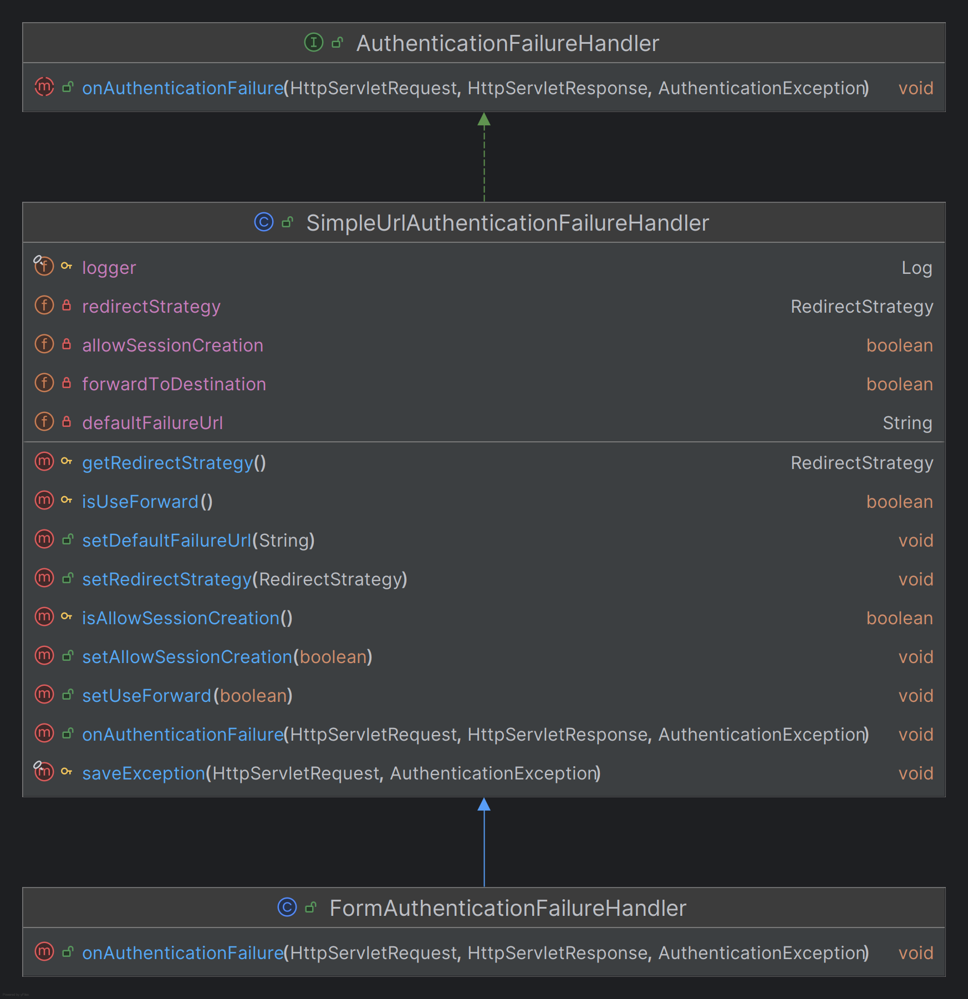
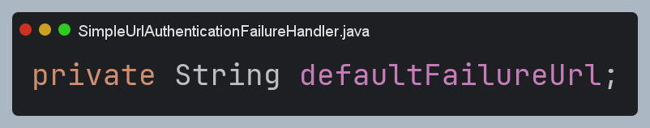
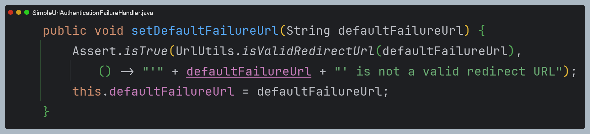
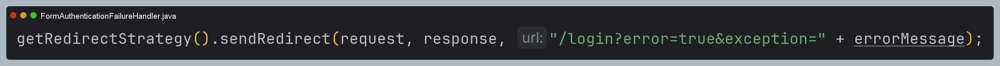

# 회원 인증 시스템 - 커스텀 인증실패 핸들러

### FormAuthenticationFailureHandler

```java
@Component
public class FormAuthenticationFailureHandler extends SimpleUrlAuthenticationFailureHandler {

    @Override
    public void onAuthenticationFailure(HttpServletRequest request, HttpServletResponse response, AuthenticationException exception) throws IOException, ServletException {

        String errorMessage = "Invalid Username or Password";

        if (exception instanceof BadCredentialsException) {
            errorMessage = "Invalid Username or Password";
        } 
        else if (exception instanceof UsernameNotFoundException) {
            errorMessage = "User not exists";
        }
        else if (exception instanceof CredentialsExpiredException) {
            errorMessage = "Expired password";
        } 
        else if (exception instanceof SecretException) {
            errorMessage = "Invalid Secret Key";
        }
        
        setDefaultFailureUrl("/login?error=true&exception=" + errorMessage);
        super.onAuthenticationFailure(request, response, exception);
    }
}
```
> 예외 타입에 따라 사용자에게 보여지는 메시지를 다르게 처리한다.



> **👏 참고 - `setDefaultFailureUrl("/login?error=true&exception=" + errorMessage);`는 Thread Safe 하지 않을 수 있다.**
> 
> 
> 
> 
> 
> - `onAuthenticationFailure`에서 사용되는 `errorMessage` 변수는 지역 변수이기 때문에 여기까지는 동시성의 문제가 없다.
> - 하지만 `setDefaultFailureUrl`을 설정하는 부분은 모든 스레드가 접근할 수 있다.
> - 따라서 `/login?error=true` 정도까지만 설정하는 것이 안전할 수 있으며, 대안으로 다음과 같이 설정할 수 있다.
> 
> 

### Controller

```java
@Controller
public class LoginController {

    @GetMapping("/login")
    public String login(@RequestParam(value = "error", required = false) String error,
                        @RequestParam(value = "exception", required = false) String exception,
                        Model model) {
        model.addAttribute("error", error);
        model.addAttribute("exception", exception);
        return "login/login";
    }
}
```

### SecurityConfig

```java
@Configuration
@EnableWebSecurity
@RequiredArgsConstructor
public class SecurityConfig {

    private final AuthenticationProvider authenticationProvider;
    private final AuthenticationDetailsSource<HttpServletRequest, WebAuthenticationDetails> authenticationDetailsSource;
    private final AuthenticationSuccessHandler authenticationSuccessHandler;
    private final AuthenticationFailureHandler authenticationFailureHandler;

    @Bean
    public SecurityFilterChain securityFilterChain(HttpSecurity http) throws Exception {
        http
            .authorizeHttpRequests(auth -> auth
                .requestMatchers("/css/**", "/js/**", "/images/**", "/webjars/**", "/favicon.*", "/*/icon-*").permitAll() //정적 자원 관리
                .requestMatchers("/", "/signup", "/login*").permitAll()
                .anyRequest().authenticated()
            )
            .formLogin(form -> form
                .loginPage("/login").permitAll()
                .authenticationDetailsSource(authenticationDetailsSource)
                .successHandler(authenticationSuccessHandler)
                .failureHandler(authenticationFailureHandler) //추가
            )
            .authenticationProvider(authenticationProvider)
        ;

        return http.build();
    }
}
```
> `.requestMatchers("/", "/signup", "/login*").permitAll()` : `/login`을 포함한 모든 쿼리 요청을 허용하기 위해서 `/login*`과 같이 정의한다.

---

[이전 ↩️ - 회원 인증 시스템 - 커스텀 인증성공 핸들러](https://github.com/genesis12345678/TIL/blob/main/Spring/security/security/Projects/%ED%9A%8C%EC%9B%90_%EC%9D%B8%EC%A6%9D_%EC%8B%9C%EC%8A%A4%ED%85%9C/%EC%9D%B8%EC%A6%9D%EC%84%B1%EA%B3%B5%ED%95%B8%EB%93%A4%EB%9F%AC/Main.md)

[메인 ⏫](https://github.com/genesis12345678/TIL/blob/main/Spring/security/security/main.md)

[다음 ↪️ - 회원 인증 시스템 - 커스텀 접근 제한하기](https://github.com/genesis12345678/TIL/blob/main/Spring/security/security/Projects/%ED%9A%8C%EC%9B%90_%EC%9D%B8%EC%A6%9D_%EC%8B%9C%EC%8A%A4%ED%85%9C/%EC%A0%91%EA%B7%BC%EC%A0%9C%ED%95%9C/Main.md)
