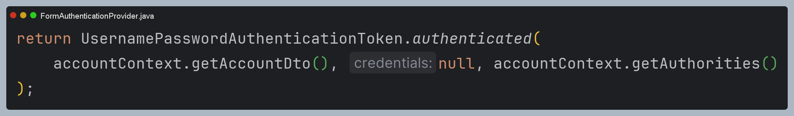

# 회원 인증 시스템 - 커스텀 접근 제한하기

### FormAccessDeniedHandler

```java
public class FormAccessDeniedHandler implements AccessDeniedHandler {

    private final RedirectStrategy redirectStrategy = new DefaultRedirectStrategy();
    private final String errorPage;

    public FormAccessDeniedHandler(String errorPage) {
        this.errorPage = errorPage;
    }

    @Override
    public void handle(HttpServletRequest request, HttpServletResponse response, AccessDeniedException accessDeniedException) throws IOException, ServletException {
        String deniedUrl = errorPage + "?exception=" + accessDeniedException.getMessage();
        redirectStrategy.sendRedirect(request, response, deniedUrl);
    }
}
```

### SecurityConfig

```java
@Configuration
@EnableWebSecurity
@RequiredArgsConstructor
public class SecurityConfig {

    private final AuthenticationProvider authenticationProvider;
    private final AuthenticationDetailsSource<HttpServletRequest, WebAuthenticationDetails> authenticationDetailsSource;
    private final AuthenticationSuccessHandler authenticationSuccessHandler;
    private final AuthenticationFailureHandler authenticationFailureHandler;

    @Bean
    public SecurityFilterChain securityFilterChain(HttpSecurity http) throws Exception {
        http
            .authorizeHttpRequests(auth -> auth
                .requestMatchers("/css/**", "/js/**", "/images/**", "/webjars/**", "/favicon.*", "/*/icon-*").permitAll() //정적 자원 관리
                .requestMatchers("/", "/signup", "/login*").permitAll()
                .requestMatchers("/user").hasRole("USER")
                .requestMatchers("/manager").hasRole("MANAGER")
                .requestMatchers("/admin").hasRole("ADMIN")
                .anyRequest().authenticated()
            )
            .formLogin(form -> form
                    .loginPage("/login").permitAll()
                    .authenticationDetailsSource(authenticationDetailsSource)
                    .successHandler(authenticationSuccessHandler)
                    .failureHandler(authenticationFailureHandler)
            )
            .authenticationProvider(authenticationProvider)
            .exceptionHandling(exception -> exception
                    .accessDeniedHandler(new FormAccessDeniedHandler("/denied")) //추가
            )
        ;

        return http.build();
    }
}
```

### Controller

```java
@Controller
public class LoginController {
    
    @GetMapping("/denied")
    public String accessDenied(@RequestParam(value = "exception", required = false) String exception,
                               @AuthenticationPrincipal AccountDto accountDto,
                               Model model) {
        model.addAttribute("username", accountDto.getUsername());
        model.addAttribute("exception", exception);

        return "login/denied";
    }
}
```
> `FormAuthenticationProvider`에서 인증 객체 `Principal` 속성에 `AccountDto`로 설정했기 때문에 `@AuthenticationPrincipal`에서
> `AccountDto`를 참조할 수 있다. ([참고](https://github.com/geun-00/TIL/blob/main/Spring/security/security/Integration/SpringMVC.md))
> 
> 
> 

### login/denied.html

```html
<!DOCTYPE html>
<html xmlns:th="http://www.thymeleaf.org">
<head>
...
</head>
<body>
<div th:replace="~{layout/header::header}"></div>
<div class="container-fluid">
    <div class="row">
        <div class="col-md-2 sidebar">
            <div th:replace="~{layout/sidebar::sidebar}"></div>
        </div>
        <div class="col-md-10 content">
            <div>
                <h3 th:text="${exception}"></h3>
                <br />
                <span th:text="${username} != null ? ${username} + ' 님은 접근 권한이 없습니다' : '비 정상적인 접근입니다'" ></span>
            </div>
        </div>
    </div>
</div>
<div class="footer" th:replace="~{layout/footer::footer}"></div>
</body>
</html>
```

---

[이전 ↩️ - 회원 인증 시스템 - 커스텀 인증실패 핸들러](https://github.com/genesis12345678/TIL/blob/main/Spring/security/security/Projects/%ED%9A%8C%EC%9B%90_%EC%9D%B8%EC%A6%9D_%EC%8B%9C%EC%8A%A4%ED%85%9C/%EC%9D%B8%EC%A6%9D%EC%8B%A4%ED%8C%A8%ED%95%B8%EB%93%A4%EB%9F%AC/Main.md)

[메인 ⏫](https://github.com/genesis12345678/TIL/blob/main/Spring/security/security/main.md)

[다음 ↪️ - 비동기 인증 - Rest 인증 보안 및 화면 구성](https://github.com/genesis12345678/TIL/blob/main/Spring/security/security/Projects/%EB%B9%84%EB%8F%99%EA%B8%B0_%EC%9D%B8%EC%A6%9D/Rest%ED%99%94%EB%A9%B4%EA%B5%AC%EC%84%B1/Main.md)
