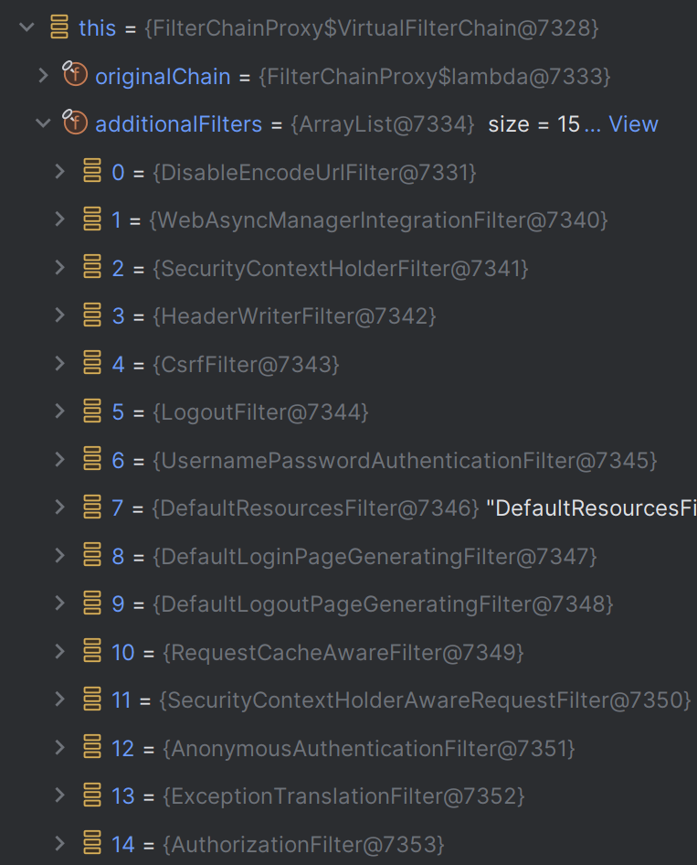
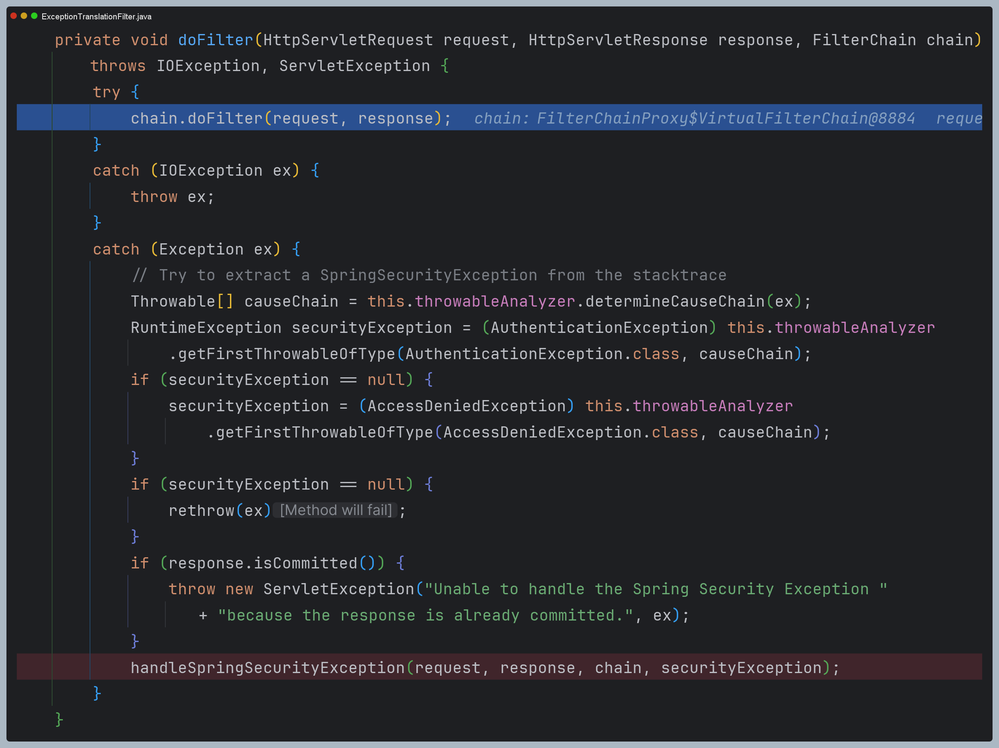
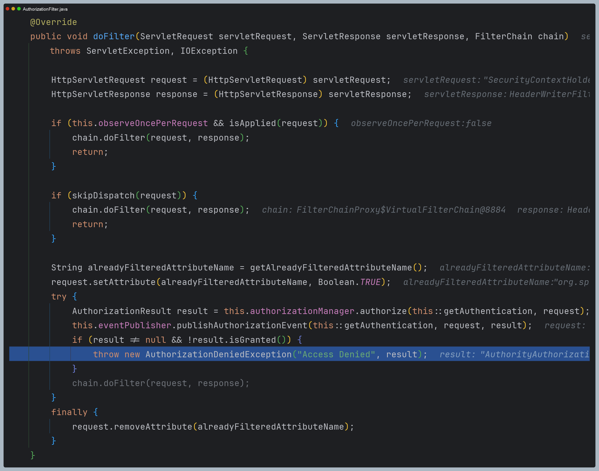
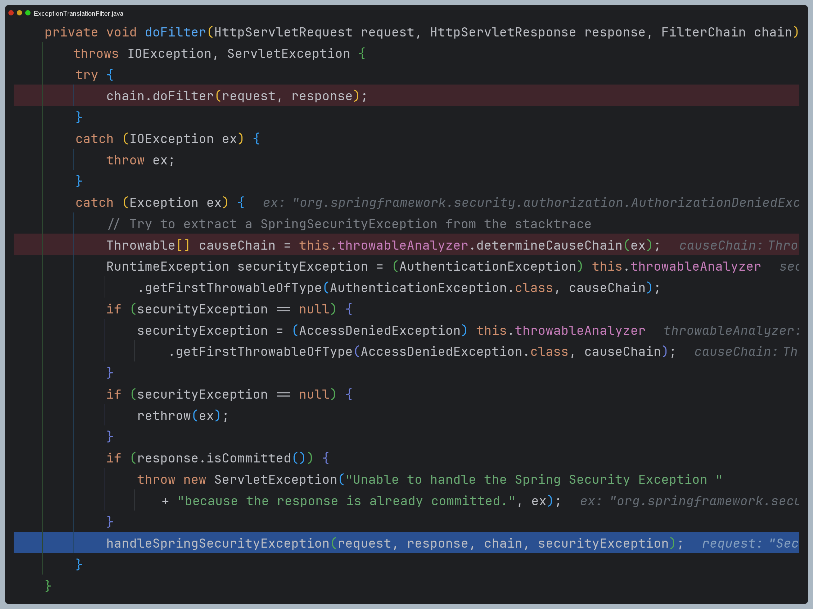
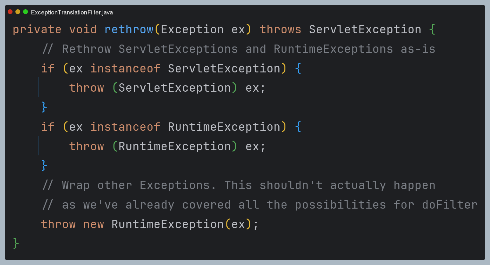
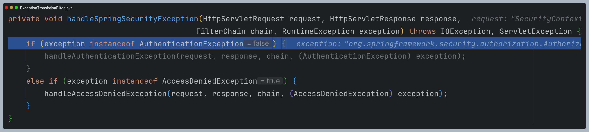
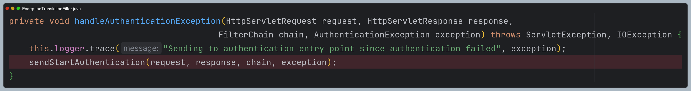
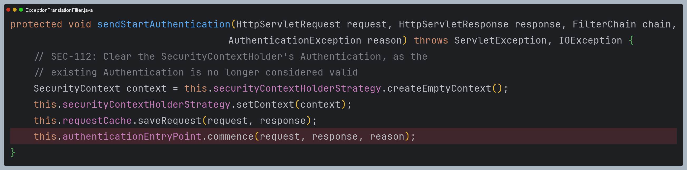
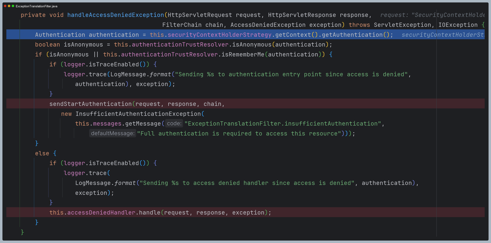

# 예외 필터

## ExceptionTranslationFilter

- `AuthorizationFilter`는 **FilterChainProxy**의 필터들 중에서 가장 마지막에 있는 필터고, `ExceptionTranslationFilter`는 `AuthorizationFilter` 바로 앞에 있는 필터이다.
- `ExceptionTranslationFilter`는 인증 예외는 다루지 않고, **인가 예외만 다룬다.**
- `AccessDeniedException`에서 익명 사용자나 기억하기 인증 중 하나에 해당되는 경우, 인증 예외(`AuthenticationException`) 처리로 이동 된다.
> `ExceptionTranslationFilter`는 인증 및 인가 처리를 위한 필터이다. 하지만 의도와는 다르게 스프링 MVC에서 발생한 예외를 처리하지 못하면 `ExceptionTranslationFilter`까지 다시 예외가 넘어가게 되어 
    제한적으로 예외 처리가 될 수 있다.

---

# 예외 처리 과정 디버깅

- 우선 필터 체인을 보면 마지막에 `AuthorizationFilter`가 있고, 그 앞에 `ExceptionTranslationFilter`가 있는 것을
확인할 수 있다.

## 1. ExceptionTranslationFilter

- `ExceptionTranslationFilter`를 보면 `try` 안에는 다음 필터를 호출하는 것 외에 아무일도 하지 않는다.
- 즉 `AuthorizationFilter`의 처리 과정에서 넘어오는 예외를 처리하는 일만 한다.

## 2. AuthorizationFilter

- 인가 예외가 발생하면 `AuthorizationFilter`에서는 오직 `AccessDeniedException`만 `throw` 하는 것을 확인할 수 있다.
  - `AuthorizationDeniedException`이 `AccessDeniedException`을 상속받은 구조

## 3. ExceptionTranslationFilter

- `AuthorizationFilter`에서 예외를 받아 `catch`문으로 오게 되었다.
- 여기서 코드를 보면 `AuthenticationException` 또는 `AccessDeniedException` 외에 예외는 예외를 처리하지 않고
예외를 다시 던지는 것을 확인할 수 있다.

> **🙄 스프링 MVC에서 발생한 예외는?**
> - 정상적으로 인증 및 인가 처리가 완료되어 스프링 MVC로 넘어오고, 스프링 MVC에서 발생하는 예외는 어떻게 될까?
> - 보통 `ControllerAdvice`로 처리를 하겠지만, 누락되어 처리하지 못한 예외가 있을 수 있다.
> - 이때는 다시 `ExceptionTranslationFilter`의 `catch`문으로 예외가 넘어온다.
> - 하지만 `ExceptionTranslationFilter`는 인증 및 인가 예외만 처리하도록 설계되어 있어 다른 예외는 처리하지 못한다.
> - 따라서 `rethrow()`가 호출되어 예외를 처리하지 못하고 애플리케이션 에러가 발생하게 된다.
> - 그러나 스프링 MVC에서 의도적으로 `AuthenticationException` 또는 `AccessDeniedException` 타입의 예외를 던지면 
> `ExceptionTranslationFilter`에서 처리를 할 수 있게 된다는 점도 알아두자.

- 예외를 처리하는 `handleSpringSecurityException()` 메서드를 봐보자.
- 예외가 **인증 예외** 또는 **인가 예외**에 따라 처리하는 로직이 다르다.

### 3-1. 인증 예외 처리

- 인증 예외의 경우 특별한 로직 없이 바로 인증 예외 처리 로직을 수행한다.

### 3-2. 인가 예외 처리

- 반면 인가 예외 처리의 경우 익명 사용자 또는 기억하기 인증에 해당하는 경우 인증 예외와 똑같은 처리를 한다.
- 그 외의 경우는 `AccessDeniedHandler`를 호출하는 것을 확인할 수 있다.

---

[이전 ↩️ - 예외 처리(`exceptionHandling()`)](https://github.com/genesis12345678/TIL/blob/main/Spring/security/security/exception/ExceptionHandling.md)

[메인 ⏫](https://github.com/genesis12345678/TIL/blob/main/Spring/security/security/main.md)