# SecurityBuilder & SecurityConfigurer

- `SecurityBuilder`는 빌더 클래스로서 웹 보안을 구성하는 빈 객체와 설정 클래스들을 생성하는 역할을 하며 대표적으로 `WebSecurity`, `HttpSecurity`가 있다.
- **SecurityConfigurer**는 Http 요청과 관련된 보안처리를 담당하는 **필터들을 생성**하고 여러 초기화 설정에 관여한다.
- `SecurityBuilder`는 **SecurityConfigurer**를 참조하고 있으며, 인증 및 인가 초기화 작업은 **SecurityConfigurer**에 의해 진행된다.

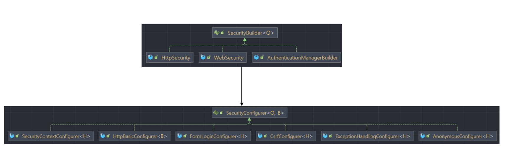


- **SecurityConfigurer**의 `init`, `configure` 메서드에 매개 변수로 `SecurityBuilder`가 넘어간다.

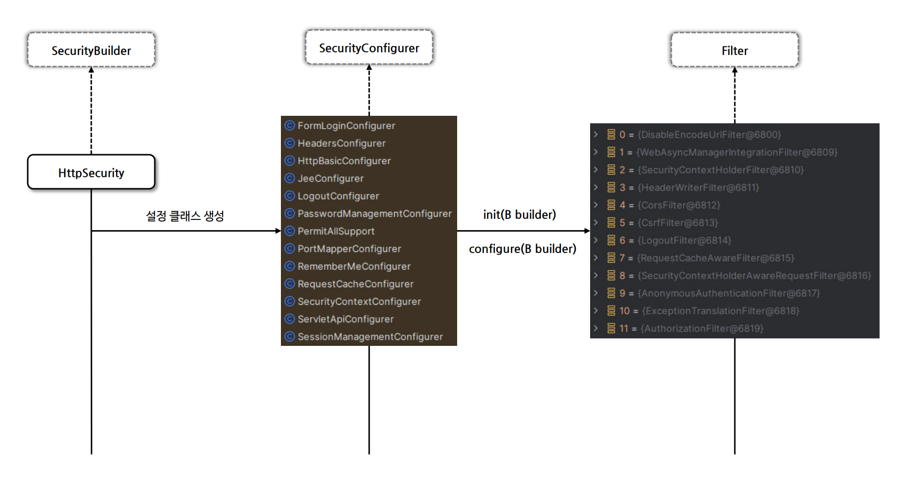

---

```java
package org.springframework.security.config.annotation.web.configuration;

@Configuration(proxyBeanMethods = false)
class HttpSecurityConfiguration {
    
    ...
    
    @Bean(HTTPSECURITY_BEAN_NAME)
    @Scope("prototype")
    HttpSecurity httpSecurity() throws Exception {
        ...
        http
                .csrf(withDefaults())
                .addFilter(webAsyncManagerIntegrationFilter)
                .exceptionHandling(withDefaults())
                .headers(withDefaults())
                .sessionManagement(withDefaults())
                .securityContext(withDefaults())
                .requestCache(withDefaults())
                .anonymous(withDefaults())
                .servletApi(withDefaults())
                .apply(new DefaultLoginPageConfigurer<>());
        http.logout(withDefaults());
        // @formatter:on
        applyCorsIfAvailable(http);
        applyDefaultConfigurers(http);
        return http;
    }
    
    ...
}
```
- 각 설정에 맞는 `XxxConfigurer`가 생성되어 `HttpSecurity`에 담겨지고, 이것을 매개변수로 받는 `SecurityFilterChain`을 생성하는 단계로 넘어간다.
- `SecurityFilterChain`을 생성하면서 `HttpSecurity`에 추가적으로 필요한 설정들을 더해준다.
- 마지막으로 `SecurityFilterChain` 빈을 생성하는 코드에서 `return httpSecurity.build()`를 하면 각각의 `configurer`가 `init()`과 `configure()`를 실행하면서 초기화가 수행된다.

---

# 초기화 과정 디버깅

### `SecurityBuilder`

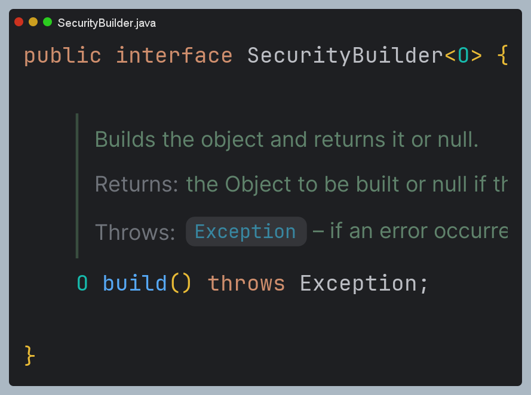

### `SecurityConfigurer`

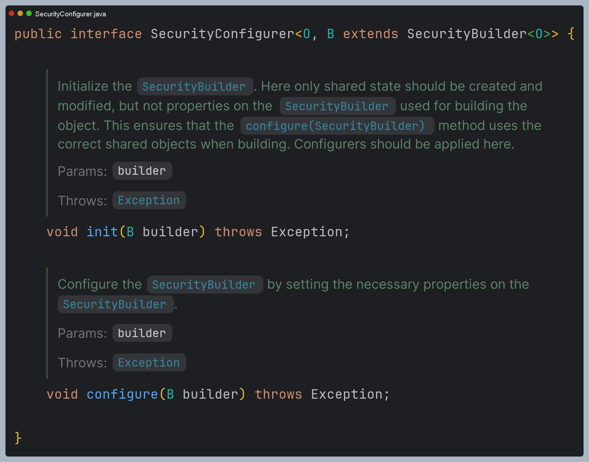

## 1. `HttpSecurityConfiguration`

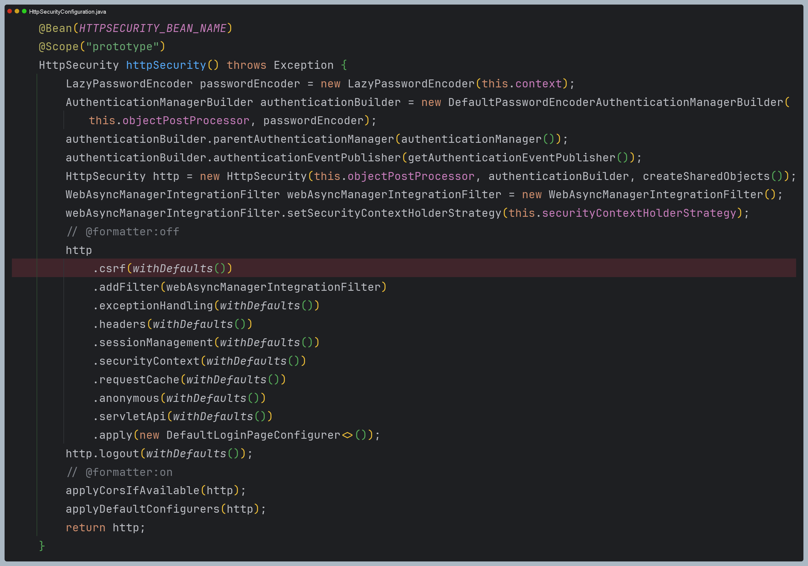

- `HttpSecurity`에 있는 `csrf()`, `addFilter()` 등의 메서드를 호출해 `XxxConfigurer`와 같은 `SecurityConfigurer`의 하위 타입의 클래스들을 생성한다.
- 예시로 `csrf()`와 `exceptionHandling()` 메서드를 보자.

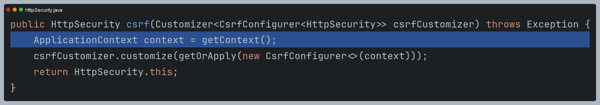

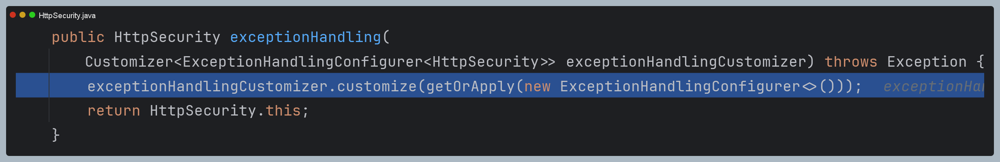

## 2. `SpringBootWebSecurityConfiguration`

- `HttpSecurityConfiguration`에서 생성된 `HttpSecurity` 스프링 빈이 `SpringBootWebSecurityConfiguration`으로 넘어온다.
- 넘어온 `HttpSecurity` 안에는 여러 `SecurityConfigurer`들이 생성되어 있는 것을 확인할 수 있다.
- 여기에 추가로 formLogin과 httpBasic에 관련된 `SecurityConfigurer`를 생성한다.

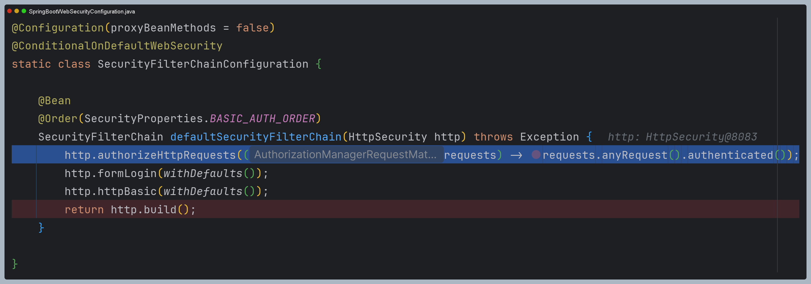

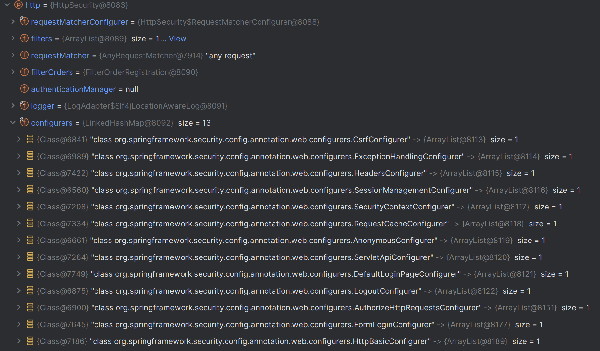

## 3. `AbstractConfiguredSecurityBuilder`

- `SpringBootWebSecurityConfiguration`에서 `http.build()`를 호출하면 `AbstractConfiguredSecurityBuilder`에 `doBuild()`로 간다.
- 여기서 각각의 `SecurityConfigurer`에 있는 `init()`과 `configure()`를 호출하여 초기화를 수행한다.

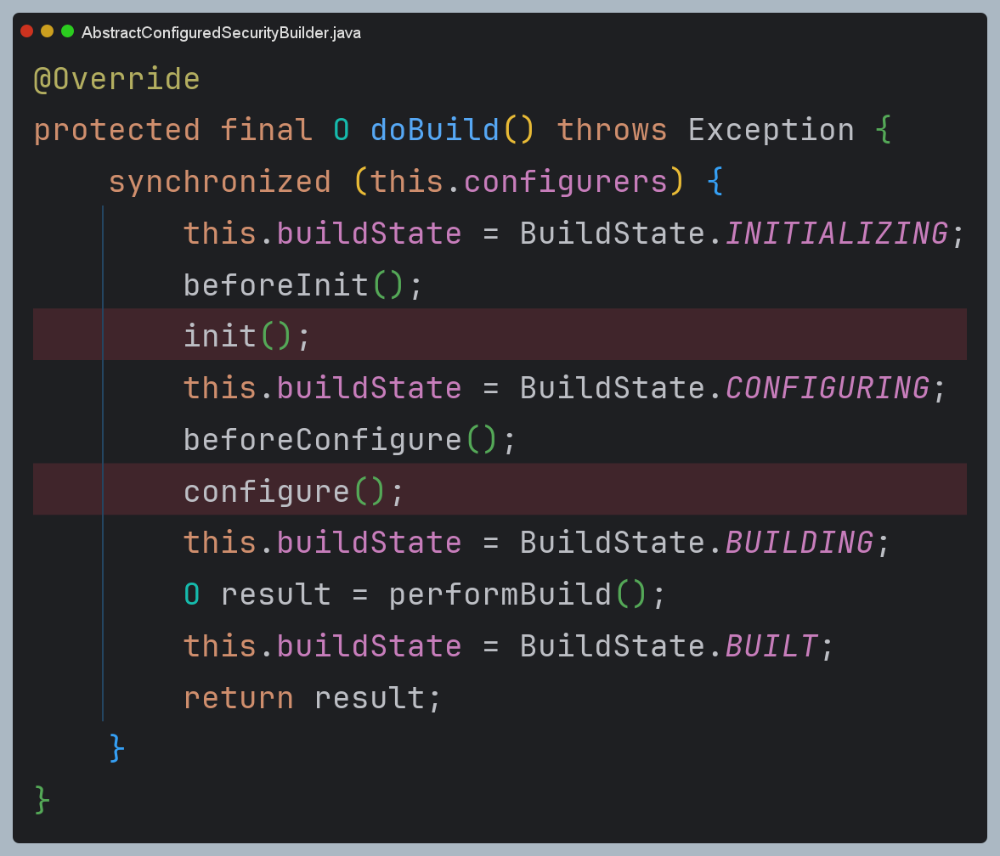

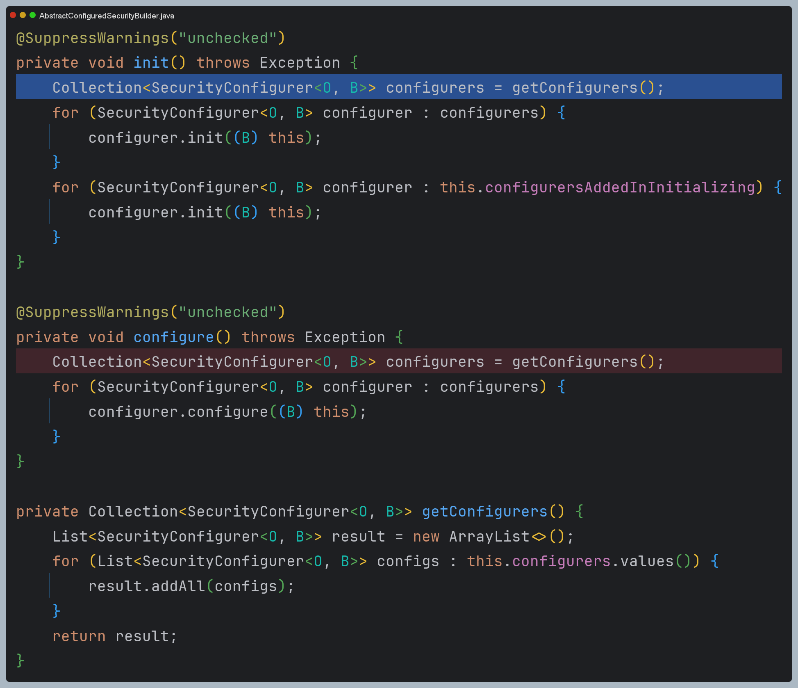

---

[이전 ↩️ - 스프링 시큐리티 초기화 과정](https://github.com/genesis12345678/TIL/blob/main/Spring/security/security/init/Init.md)

[메인 ⏫](https://github.com/genesis12345678/TIL/blob/main/Spring/security/security/main.md)

[다음 ↪️ - HttpSecurity & WebSecurity](https://github.com/genesis12345678/TIL/blob/main/Spring/security/security/init/HttpSecurity.md)