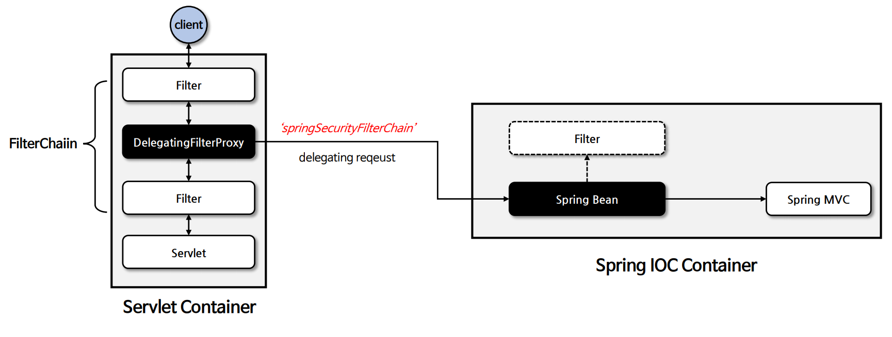
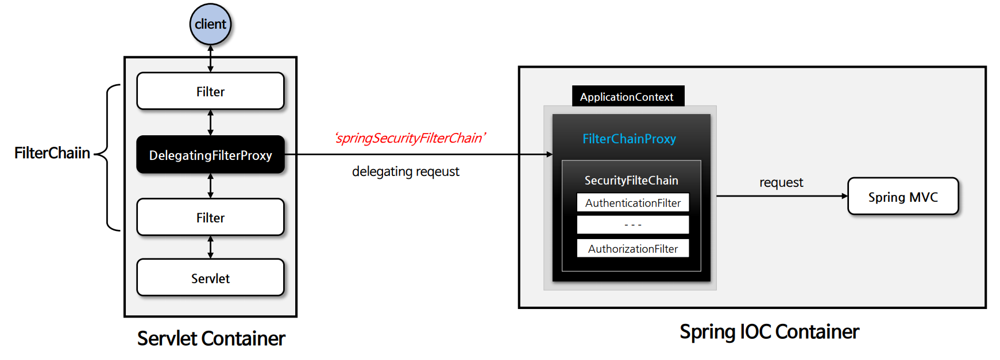

# DelegatingFilterProxy & FilterChainProxy

---
## Filter
- [서블릿 필터](https://github.com/genesis12345678/TIL/blob/main/Spring/springmvc_2/login_2/filter/login_filter.md)는 웹 애플리케이션에서 클라이언트의 요청과
    서버의 응답을 가공하거나 검사하는 데 사용되는 구성 요소이다.
- **서블릿 필터**는 클라이언트의 요청이 서블릿에 도달하기 전이나 서블릿이 응답을 클라이언트에게 보내기 전에 특정 작업을 수행할 수 있다.
- **서블릿 필터**는 서블릿 컨테이너(WAS)에서 생성되고 실행되고 종료된다.

---
## DelegatingFilterProxy
- **DelegatingFilterProxy**는 스프링에서 사용되는 특별한 서블릿 필터로, **서블릿 컨테이너와 스프링 애플리케이션 컨텍스트 간의 연결고리 역할을 하는 필터이다.**
- **DelegatingFilterProxy**는 서블릿 필터의 기능을 수행하는 동시에 스프링의 의존성 주입 및 빈 관리 기능과 연동되도록 설계된 필터라 할 수 있다.
- **DelegatingFilterProxy**는 `springSecurityFilterChain` 이름으로 생성된 빈을 `ApplicationContext`에서 찾아 요청을 위임한다.
- **실제 보안 처리를 수행하지 않는다.**

- 스프링 시큐리티는 필터를 기반으로 동작하며, 필터는 스프링 컨테이너와는 상관이 없기 때문에 `DI`, `AOP` 같은 스프링 기능을 사용할 수 없다.
- **DelegatingFilterProxy**는 스프링 컨테이너에 요청을 위임하는 역할만 함으로써 서블릿 필터에서 스프링 기술을 사용할 수 있게 해준다.

---
## FilterChainProxy
- `springSecurityFilterChain`의 이름으로 생성되는 필터 빈으로서, **DelegatingFilterProxy**로부터 요청을 위임 받고 보안 처리 역할을 한다.
- 내부적으로 하나 이상의 `SecurityFilterChain` 객체들을 가지고 있으며, 요청 URL 정보를 기준으로 적절한 `SecurityFilterChain`을 선택하여 필터들을 호출한다.
- `HttpSecurity`를 통해 API 추가 시 관련 필터들이 추가된다.
- 사용자의 요청을 필터 순서대로 호출해 보안 기능을 동작시키고 필요 시 직접 필터를 생성해서 기존의 필터 전후로 추가 가능하다.

- `FilterChainProxy`는 0번째 필터부터 15번째 필터까지 순서대로 호출하면서 요청을 처리한다.
- 맨 마지막 인가 처리를 하는 필터까지 특별한 예외나 오류가 발생하지 않으면 성공적으로 요청이 서블릿으로 넘어가게 된다.

---

[이전 ↩️ - HttpSecurity & WebSecurity](https://github.com/genesis12345678/TIL/blob/main/Spring/security/init/HttpSecurity.md)

[메인 ⏫](https://github.com/genesis12345678/TIL/blob/main/Spring/security/main.md)

[다음 ↪️ - 사용자 정의 보안 설정](https://github.com/genesis12345678/TIL/blob/main/Spring/security/init/Custom.md)