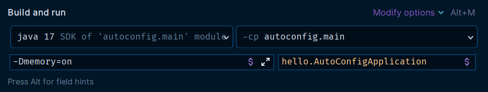

# 스프링 부트의 자동 구성

스프링 부트는 자동 구성(Auto Configuration)이라는 기능을 제공한다.<br>
일반적으로 자주 사용하는 수 많은 빈들을 자동으로 등록해주는 기능이다.

스프링 부트는 `spring-boot-autoconfigure`라는 프로젝트 안에서 수 많은 자동 구성을 제공한다.

```java
package org.springframework.boot.autoconfigure.jdbc;

@AutoConfiguration(after = DataSourceAutoConfiguration.class)
@ConditionalOnClass({ DataSource.class, JdbcTemplate.class })
@ConditionalOnSingleCandidate(DataSource.class)
@EnableConfigurationProperties(JdbcProperties.class)
@Import({ DatabaseInitializationDependencyConfigurer.class, JdbcTemplateConfiguration.class,
		NamedParameterJdbcTemplateConfiguration.class })
public class JdbcTemplateAutoConfiguration {

}
```
- `JdbcTemplate`을 설정하고 빈으로 등록해주는 자동 구성 클래스다.
- `@AutoConfiguration` : 자동 구성을 사용하려면 이 어노테이션을 등록해야 한다.
  - 내부에 `@Configuration`이 있어서 빈을 등록하는 자바 설정 파일로 사용할 수 있다.
- `after = DataSourceAutoConfiguration.class` : 자동 구성이 실행되는 순서 지정
  - `JdbcTemplate`은 `DataSource`가 필요하기 때문에 `DataSource`가 등록된 다음에 실행하도록 설정되어 있다.
- `@ConditionalOnClass({ DataSource.class, JdbcTemplate.class })` : `if`문과 유사한 기능을 제공한다.
  - 이런 클래스가 있는 경우에만 설정이 동작한다. 없으면 여기 있는 설정들이 무효화 되고, 빈도 등록되지 않는다.
  - `JdbcTemplate`은 `DataSource`, `JdbcTemplate`이라는 클래스가 있어야 동작할 수 있다.

`@Import`의 대상이 되는 `JdbcTemplateConfiguration`를 보자.

```java
@Configuration(proxyBeanMethods = false)
@ConditionalOnMissingBean(JdbcOperations.class)
class JdbcTemplateConfiguration {

	@Bean
	@Primary
	JdbcTemplate jdbcTemplate(DataSource dataSource, JdbcProperties properties) {
		JdbcTemplate jdbcTemplate = new JdbcTemplate(dataSource);
		JdbcProperties.Template template = properties.getTemplate();
		jdbcTemplate.setFetchSize(template.getFetchSize());
		jdbcTemplate.setMaxRows(template.getMaxRows());
		if (template.getQueryTimeout() != null) {
			jdbcTemplate.setQueryTimeout((int) template.getQueryTimeout().getSeconds());
		}
		return jdbcTemplate;
	}
}
```
- `@ConditionalOnMissingBean(JdbcOperations.class)`
  - `JdbcOperations` 빈이 없을 때 동작한다.
  - `JdbcTemplate`의 부모 인터페이스가 `JdbcOperations`이다.
  - 즉 `JdbcTemplate`이 빈으로 등록되어 있지 않은 경우에만 동작한다.
  - 이런 기능이 없으면 개발자가 직접 등록한 `JdbcTemplate` 빈과 중복 등록되는 문제가 발생할 수 있다.

스프링 부트는 수 많은 자동 구성을 제공하고 `spring-boot-autoconfigure`에 자동 구성을 모아둔다.
- 스프링 부트 프로젝트를 사용하면 이 라이브러리는 기본적으로 사용된다.
- [스프링 부트가 제공하는 자동 구성](https://docs.spring.io/spring-boot/docs/current/reference/html/auto-configuration-classes.html)

**Auto Configuration은 주로 다음 두 용어로 번역되어 사용된다.**
- 자동 설정
- 자동 구성

**자동 설정**
- `Configuration`이라는 단어가 컴퓨터 용어에서는 환경 설정이라는 뜻으로 자주 사용된다.
- Auto Configuration은 크게 보면 빈들을 자동으로 등록해서 스프링이 동작하는 환경을 자동으로 설정해주기 때문에 자동 설정이라는 용어도 맞다.

**자동 구성**
- `Configuration`은 구성, 배치라는 뜻도 있다.
- 예를 들어 컴퓨터는 CPU, 메모리 등을 배치해야 컴퓨터가 동작하다. 이렇게 배치하는 것을 구성이라 한다.
- 스프링도 스프링 실행에 필요한 빈들을 적절하게 배치해야 한다.
- 자동 구성은 스프링 실행에 필요한 빈들을 자동으로 배치해주는 것이다.

자동 설정은 넓게 사용되는 의미이고, 자동 구성은 실행에 필요한 컴포넌트 조각을 자동으로 배치한다는 더 좁은 의미에 가깝다.

**스프링 부트가 제공하는 자동 구성 기능을 이해하려면 이 두 가지 개념을 이해해야 한다.**
- `@Conditional` : 특정 조건에 맞을 때 설정이 동작하도록 한다.
- `@AutoConfiguration` : 자동 구성이 어떻게 동작하는지 내부 원리 이해

## 자동 구성 직접 만들어보기

실시간으로 자바 메모리 사용량을 웹으로 확인하는 예제를 만들어보자.<br>
패키지는 `main/java`바로 밑에 둔다. 

```java
@AllArgsConstructor
@Getter
@ToString
public class Memory {
    private Long used;//사용 중인 메모리
    private Long max;//최대 메모리
}
```
```java
@Slf4j
public class MemoryFinder {

    public Memory get() {
        long max = Runtime.getRuntime().maxMemory();
        long total = Runtime.getRuntime().totalMemory();
        long free = Runtime.getRuntime().freeMemory();

        long used = total - free;
        return new Memory(used, max);
    }

    @PostConstruct
    public void init() {
        log.info("init memoryFinder");
    }
}
```
- JVM에서 메모리 정보를 실시간으로 조회하는 기능이다.
- `max`는 JVM이 사용할 수 있는 최대 메모리
- `total`은 JVM이 확보한 전체 메모리(JVM은 처음부터 `max`까지 다 확보하지 않고 필요할 때 마다 조금씩 확보한다.)
- `free`는 `total`중에 사용하지 않은 메모리
- `used`는 JVM이 사용 중인 메모리

```java
@Slf4j
@RestController
@RequiredArgsConstructor
public class MemoryController {
    private final MemoryFinder memoryFinder;

    @GetMapping("/memory")
    public Memory system() {
        Memory memory = memoryFinder.get();
        log.info("memory={}", memory);
        return memory;
    }
}
```
- 메모리 정보를 조회하는 컨트롤러

```java
@Configuration
public class MemoryConfig {

    @Bean
    public MemoryFinder memoryFinder() {
        return new MemoryFinder();
    }

    @Bean
    public MemoryController memoryController() {
        return new MemoryController(memoryFinder());
    }
}
```

## @Conditional

- 위에서 만든 메모리 조회 기능을 항상 사용되는 것이 아니라 특정 조건일 때만 해당 기능이 활성화 되도록 해보자.
- 핵심은 소스 코드를 고치지 않고 가능해야 한다는 점이다.
- 같은 소스 코드인데 특정 상황일 때만 특정 빈들을 등록해서 사용하도록 도와주는 기능이 `@Conditional`이다.
- 이름 그대로 특정 조건을 만족하는가 하지 않는가를 구별하는 기능이다.

이 기능을 사용하려면 `Condition` 인터페이스를 구현해야 한다.
```java
package org.springframework.context.annotation;

@FunctionalInterface
public interface Condition {
    boolean matches(ConditionContext context, AnnotatedTypeMetadata metadata);
}
```
- `matches()` 메서드가 `true`를 반환하면 조건에 만족해서 동작하고 `false`를 반환하면 동작하지 않는다.
- `ConditionContext` : 스프링 컨테이너, 환경 정보 등을 담고 있다.
- `AnnotatedTypeMetadata` : 어노테이션 메타 정보를 담고 있다.

자바 시스템 속성이 `memory=on`이라고 되어 있을 때만 메모리 기능이 동작하도록 해보자.

```java
@Slf4j
public class MemoryCondition implements Condition {
    @Override
    public boolean matches(ConditionContext context, AnnotatedTypeMetadata metadata) {
        //-Dmemory=on
        String memory = context.getEnvironment().getProperty("memory");
        log.info("memory={}", memory);
        return "on".equals(memory);
    }
}
```
- 환경 정보에 `memory=on`이라고 되어 있는 경우에만 `true`를 반환한다.

```java
@Configuration
@Conditional(MemoryCondition.class)//추가
public class MemoryConfig {

    @Bean
    public MemoryFinder memoryFinder() {
        return new MemoryFinder();
    }

    @Bean
    public MemoryController memoryController() {
        return new MemoryController(memoryFinder());
    }
}
```
- `MemoryConfig`에 `@Conditional`을 추가했다.
- 이제 `MemoryConfig` 적용 여부는 `MemoryCondition`의 `matches()` 메서드 반환 결과에 따라 달라진다.
- `true`면 빈으로 등록이 되고, `false`면 빈으로 등록되지 않는다.



그냥 실행하면 실행이 안 되고 `add VM option`에 설정을 추가해야 정상 동작한다.

`Condition` 인터페이스를 구현하지 않아도 **스프링은 이미 필요한 대부분의 구현체를 만들어 두었다.**

```java
@Configuration
//@Conditional(MemoryCondition.class)
@ConditionalOnProperty(name = "memory", havingValue = "on")
public class MemoryConfig { ... }
```
- 앞서 만든 기능과 동일하다.

`@ConditionalOnProperty`도 내부에 `@Conditional`을 사용한다. 그리고 이 안에 `Condition`인터페이스를 구현한 `onPropertyCondition`을 가지고 있다.

**스프링은 `@Conditional`과 관련해서 개발자가 편리하게 사용할 수 있도록 수 많은 `@ConditionalXxx`를 제공한다.**

대표적인 몇가지
- `@ConditionalOnclass`, `@ConditionalOnMissingClass`
  - 클래스가 있는 경우 동작, 나머지는 그 반대
- `@ConditionalOnBean`, `@ConditionalOnMissingBean`
  - 빈이 등록되어 있는 경우 동작, 나머지는 그 반대
- `@ConditionalOnProperty`
  - 환경 정보가 있는 경우 동작
- `@ConditionalOnResource`
  - 리소스가 있는 경우 동작
- `@ConditionalOnWebApplication`, `@ConditionalOnNotWebApplication`
  - 웹 애플리케이션인 경우 동작
- `@ConditionalOnExpression`
  - SpEL 표현식에 만족하는 경우 동작

