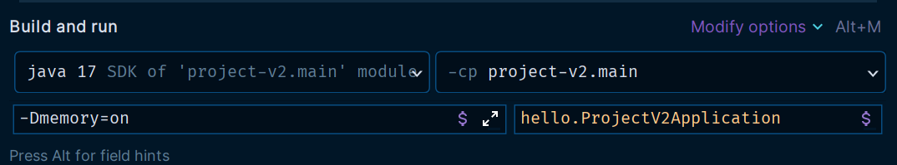

# 스프링 부트의 자동 구성

## 순수 라이브러리 만들어 보기

`@AutoConfiguration`을 이해하기 위해서는 먼저 라이브러리가 어떻게 사용되는지 이해해야 한다.

- 새 프로젝트 생성
```groovy
plugins {
    id 'java'
}

group = 'memory'
sourceCompatibility = '17'

repositories {
    mavenCentral()
}

dependencies {
    implementation 'org.springframework.boot:spring-boot-starter-web:3.0.2'
    compileOnly 'org.projectlombok:lombok:1.18.24'
    annotationProcessor 'org.projectlombok:lombok:1.18.24'
    testImplementation 'org.springframework.boot:spring-boot-starter-test:3.0.2'
}

test {
    useJUnitPlatform()
}
```
- 스프링 부트 플러그인을 사용하면 실행 가능한 Jar 구조를 기본으로 만든다.
- 여기서는 실행 가능한 Jar가 아니라 다른 곳에 포함되어서 사용할 순수 라이브러리 Jar를 만드는 것이 목적이므로 스프링 부트 플러그인을 사용하지 않는다.

```java
@AllArgsConstructor
@Getter
@ToString
public class Memory {
    private Long used;//사용 중인 메모리
    private Long max;//최대 메모리
}
```
```java
@Slf4j
public class MemoryFinder {

    public Memory get() {
        long max = Runtime.getRuntime().maxMemory();
        long total = Runtime.getRuntime().totalMemory();
        long free = Runtime.getRuntime().freeMemory();

        long used = total - free;
        return new Memory(used, max);
    }

    @PostConstruct
    public void init() {
        log.info("init memoryFinder");
    }
}
```
```java
@Slf4j
@RestController
@RequiredArgsConstructor
public class MemoryController {
    private final MemoryFinder memoryFinder;

    @GetMapping("/memory")
    public Memory system() {
        Memory memory = memoryFinder.get();
        log.info("memory={}", memory);
        return memory;
    }
}
```

**빌드**
- `./gradlew clean build`

빌드된 jar 파일은 스스로 동작하지는 못하고 다른 곳에 포함되어서 동작하는 라이브러리이다.

## 순수 라이브러리 사용

- 새 프로젝트 생성

```groovy
plugins {
    id 'org.springframework.boot' version '3.0.2'
    id 'io.spring.dependency-management' version '1.1.0'
    id 'java'
}

group = 'hello'
version = '0.0.1-SNAPSHOT'
sourceCompatibility = '17'

configurations {
    compileOnly {
        extendsFrom annotationProcessor
    }
}

repositories {
    mavenCentral()
}

dependencies {
    implementation files('libs/memory-v1.jar')//추가
    implementation 'org.springframework.boot:spring-boot-starter-web'
    compileOnly 'org.projectlombok:lombok'
    annotationProcessor 'org.projectlombok:lombok'
    testImplementation 'org.springframework.boot:spring-boot-starter-test'
}

tasks.named('test') {
    useJUnitPlatform()
}
```
- `implementation files('libs/memory-v1.jar')`
  - 현재 프로젝트 바로 밑에 폴더 `libs`를 생성하고 이 폴더 안에 위에서 빌드한 파일을 복사했다.

```java
@Configuration
public class MemoryConfig {

    @Bean
    public MemoryFinder memoryFinder() {
        return new MemoryFinder();
    }

    @Bean
    public MemoryController memoryController() {
        return new MemoryController(memoryFinder());
    }
}
```
- 스프링 부트 자동 구성을 사용하는 것이 아니기 때문에 빈을 직접 등록해 주어야 한다.

**정리**
- 외부 라이브러리를 직접 만들고 그것을 프로젝트에 불러서 적용한다.
- 라이브러리 내부에 어떤 빈을 등록해야 하는지 알아보고 그것을 하나하나 빈으로 등록한다.
- **이런 부분을 자동으러 처리해 주는 것이 스프링 부트 자동 구성이다.**

**프로젝트에 라이브러리를 추가만 하면 모든 구성이 자동으로 처리 되도록 해보자. 스프링 빈들이 자동으로 등록되는 것이다.**

```java
@AutoConfiguration
@ConditionalOnProperty(name = "memory", havingValue = "on")
public class MemoryAutoConfig { ... }
```
- `@AutoConfiguration` : 스프링 부트가 제공하는 자동 구성 기능을 적용할 때 사용하는 어노테이션
- `@ConditionalOnProperty` 
  - `memory=on`이라는 환경 정보가 있을 때 라이브러리를 적용한다.(스프링 빈을 등록한다.)
  - 라이브러리를 가지고 있더라도 상황에 따라서 해당 기능을 켜고 끌 수 있다.

**그리고 스프링 부트 자동 구성 기능을 적용하려면 다음 파일에 자동 구성 대상을 지정해 주어야 한다.**

- `src\main\resources\META-INF\spring\org.springframework.boot.autoconfigure.AutoConfiguration.imports`
```text
memory.MemoryAutoConfig
```
- 패키지를 포함해서 지정해준다.
- 스프링 부트는 시작 시점에 이 파일의 정보를 읽어서 자동 구성으로 사용한다.

**이제 이 프로젝트를 `빌드`하고 사용할 프로젝트에서 적용해보자.**

```groovy
dependencies {
    implementation files('libs/memory-v2.jar')
    ...
}
```

이 프로젝트에서는 환경 설정만 추가해주면 자동으로 스프링 빈들이 등록이 된다.



## 자동 구성 이해

스프링 부트는 다음 경로에 있는 파일을 읽어서 스프링 부트 자동 구성으로 사용한다.<br>
`src\main\resources\META-INF\spring\org.springframework.boot.autoconfigure.AutoConfiguration.imports`

스프링 부트는 보통 다음과 같은 방법으로 실행한다.

```java
@SpringBootApplication
public class AutoConfigApplication {
    
    public static void main(String[] args) {
        SpringApplication.run(AutoConfigApplication.class, args);
    }
}
```
- `run()`에 넘겨주는 클래스를 설정 정보로 사용한다.
- `@SpringBootApplication` 어노테이션에는 중요한 설정 정보들이 들어있다.

```java
@SpringBootConfiguration
@EnableAutoConfiguration
@ComponentScan(excludeFilters = { @Filter(type = FilterType.CUSTOM, classes = TypeExcludeFilter.class),
		@Filter(type = FilterType.CUSTOM, classes = AutoConfigurationExcludeFilter.class) })
public @interface SpringBootApplication { ... }
```
- `@EnableAutoConfiguration` : 이름 그대로 자동 구성을 활성화 하는 기능을 제공한다.

```java
@AutoConfigurationPackage
@Import(AutoConfigurationImportSelector.class)
public @interface EnableAutoConfiguration { ... }
```
- `@Import`는 주로 스프링 설정 정보(`@Configuration`)를 포함할 때 사용한다.
- 그런데 `AutoConfigurationImportSelector`를 열어보면 `@Configuration`이 아니다.

**이 기능을 이해하려면 `ImportSelector`를 알아야 한다.**

`@Import`로 설정 정보를 추가하는 방법은 2가지가 있다.
1. 정적인 방법 : `@Import(클래스)`, 코드에 대상이 딱 박혀있다. 
2. 동적인 방법 : `@Import(ImportSelector)`, 코드로 프로그래밍해서 설정으로 사용할 대상을 동적으로 선택할 수 있다.

**정적인 방법**
```java
@Configuration
@Import({AConfig.class, BConfig.class}) 
public class AppConfig {...}
```

**동적인 방법**
- 스프링은 설정 정보 대상을 동적으로 선택할 수 있는 `ImportSelector` 인터페이스를 제공한다.

```java
public interface ImportSelector {
  String[] selectImports(AnnotationMetadata importingClassMetadata);
}
```

### ImportSelector 예제

```java
public class HelloBean {
}
```
- 빈으로 등록할 대상

```java
@Configuration
public class HelloConfig {

    @Bean
    public HelloBean helloBean() {
        return new HelloBean();
    }
}
```
```java
public class HelloImportSelector implements ImportSelector {
    @Override
    public String[] selectImports(AnnotationMetadata importingClassMetadata) {
        return new String[]{"hello.selector.HelloConfig"};
    }
}
```
- 설정 정보를 동적으로 선택할 수 있게 해주는 `ImportSelector` 인터페이스를 구현했다.
- 설정 정보로 사용할 클래스를 동적으로 프로그래밍 하면 된다.

```java
public class ImportSelectorTest {

    /**
     * 정적인 방식
     */
    @Test
    void staticConfig() {
        AnnotationConfigApplicationContext appContext = new AnnotationConfigApplicationContext(StaticConfig.class);
        HelloBean bean = appContext.getBean(HelloBean.class);
        
        assertThat(bean).isNotNull();
    }

    @Configuration
    @Import(HelloConfig.class)
    static class StaticConfig {
    }

    /**
     * 동적인 방식
     */
    @Test
    void selectConfig() {
        AnnotationConfigApplicationContext appContext = new AnnotationConfigApplicationContext(SelectorConfig.class);
        HelloBean bean = appContext.getBean(HelloBean.class);
        
        assertThat(bean).isNotNull();
    }
    
    @Configuration
    @Import(HelloImportSelector.class)
    static class SelectorConfig {
    }
}
```
- `selectorConfig`의 `@Import`에는 `ImportSelector`의 구현체를 사용했다.
- 스프링은 이 구현체를 실행하고 이 구현체에서 반환된 문자를 받는다.
- 스프링은 이 문자에 맞는 대상을 설정 정보로 사용한다.

### @EnableAutoConfiguration 동작 방식

```java
@AutoConfigurationPackage
@Import(AutoConfigurationImportSelector.class)
public @interface EnableAutoConfiguration { ... }
```
- `AutoConfigurationImportSelector`는 `ImportSelector`의 구현체이다. 설정 정보를 동적으로 선택할 수 있다.
- 실제로 이 코드는 모든 라이브러리에 있는 다음 경로의 파일을 확인한다.
- `META-INF/spring/org.springframework.boot.autoconfigure.AutoConfiguration.imports`
- 그리고 파일의 내용을 읽어서 설정 정보로 선택한다.

