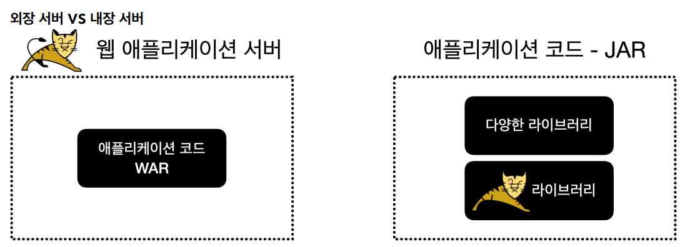

# 내장 톰캣

## WAR 배포 방식의 단점

웹 애플리케이션을 개발하고 배포하려면 이러한 과정을 거쳐야 한다.
- 톰캣 같은 WAS를 별도로 설치해야 한다.
- 애플리케이션 코드를 WAR로 빌드해야 한다.
- 빌드한 WAR 파일을 WAS에 베포해야 한다.

**단점**
- 톰캣 같은 WAS를 별도로 설치해야 한다.
- 개발 환경 설정이 복잡하다.
    - 단순한 자바라면 별도의 설정 없이 `main()`메서드만 실행하면 된다.
- 배포 과정이 복잡하다.
- 톰캣 버전을 변경하려면 톰캣을 재설치 해야 한다.

톰캣도 자바로 만들어져 있으니 톰캣을 마치 하나의 라이브러리 처럼 포함해서 사용해도 되지 않을까?

**이런 문제를 해결하기 위해 톰캣을 라이브러리로 제공하는 내장 톰캣 기능을 제공한다.**



- 왼쪽 그림은 웹 애플리케이션 서버에 WAR 파일을 배포하는 방식으로 WAS를 실행해서 동작한다.
- 오른쪽 그림은 애플리케이션 JAR 안에 다양한 라이브러리들과 WAS 라이브러리가 포함되는 방식으로 `main()`메서드를 실행해서 동작한다.

## 내장 톰캣 - 설정

```text
plugins {
    id 'java'
}

group = 'hello'
version = '0.0.1-SNAPSHOT'
sourceCompatibility = '17'

repositories {
    mavenCentral()
}

dependencies {
    //스프링 MVC 추가
    implementation 'org.springframework:spring-webmvc:6.0.9'

    //내장 톰켓 추가
    implementation 'org.apache.tomcat.embed:tomcat-embed-core:10.1.5'
}

tasks.named('test') {
    useJUnitPlatform()
}

//일반 Jar 생성
task buildJar(type: Jar) {
    manifest {
        attributes 'Main-Class': 'hello.embed.EmbedTomcatSpringMain'
    }
    with jar
}

//Fat Jar 생성
task buildFatJar(type: Jar) {
    manifest {
        attributes 'Main-Class': 'hello.embed.EmbedTomcatSpringMain'
    }
    duplicatesStrategy = DuplicatesStrategy.WARN
    from { configurations.runtimeClasspath.collect { it.isDirectory() ? it : zipTree(it) } }
    with jar
}
```
- `tomcat-embed-core` : 톰캣 라이브러리로, 톰캣을 라이브러리로 포함해서 톰캣 서버를 자바 코드로 실행할 수 있다.

## 내장 톰캣 - 서블릿
```java
public class EmbedTomcatServletMain {
    public static void main(String[] args) throws LifecycleException {
        System.out.println("EmbedTomcatServletMain.main");
        //톰캣 설정
        Tomcat tomcat = new Tomcat();
        Connector connector = new Connector();
        connector.setPort(8080);
        tomcat.setConnector(connector);

        //서블릿 등록
        Context context = tomcat.addContext("", "/");

        File docBaseFile = new File(context.getDocBase());
        if (!docBaseFile.isAbsolute()) {
            docBaseFile = new File((
                    (org.apache.catalina.Host) context.getParent()).getAppBaseFile(),
                    docBaseFile.getPath());
        }
        docBaseFile.mkdirs();

        tomcat.addServlet("", "helloServlet", new HelloServlet());
        context.addServletMappingDecoded("/hello-servlet", "helloServlet");
        tomcat.start();
    }
}
```
**내장 톰캣을 사용하여 톰캣 서버를 설치하지 않고 IDE에 별도 복잡한 톰캣 설정 없이 `main()`메서드만 실행하면 톰캣까지 실행할 수 있다.**

## 내장 톰캣 - 스프링 연동
```java
public class EmbedTomcatSpringMain {
    public static void main(String[] args) throws LifecycleException {
        System.out.println("EmbedTomcatSpringMain.main");

        //톰캣 설정
        Tomcat tomcat = new Tomcat();
        Connector connector = new Connector();
        connector.setPort(8080);
        tomcat.setConnector(connector);

        //스프링 컨테이너 생성
        AnnotationConfigWebApplicationContext ac = new AnnotationConfigWebApplicationContext();
        ac.register(HelloConfig.class);

        //스프링 MVC 디스패처 서블릿 생성, 스프링 컨테이너 연결
        DispatcherServlet dispatcher = new DispatcherServlet(ac);

        //디스패처 서블릿 등록
        Context context = tomcat.addContext("", "/");
        
        File docBaseFile = new File(context.getDocBase());
        if (!docBaseFile.isAbsolute()) {
            docBaseFile = new File((
                    (org.apache.catalina.Host) context.getParent()).getAppBaseFile(),
                    docBaseFile.getPath());
        }
        docBaseFile.mkdirs();
        
        tomcat.addServlet("", "dispatcher", dispatcher);
        context.addServletMappingDecoded("/", "dispatcher");
        tomcat.start();
    }
}
```
- 스프링 컨테이너를 생성하고 내장 톰캣에 디스패처 서블릿을 등록한다.
- `main()` 메서드 실행 과정
  - 내장 톰캣을 생성해서 `8080` 포트로 연결하도록 설정한다.
  - 스프링 컨테이너를 만들고 필요한 빈을 등록한다.
  - 스프링 MVC 디스패처 서블릿을 만들고 앞서 만든 스프링 컨테이너에 연결한다.
  - 디스패처 서블릿을 내장 톰캣에 등록한다.
  - 내장 톰캣을 실행한다.

## 내장 톰캣 - 빌드와 배포

`build.gradle` 에 다음과 같이 설정해 두었다.
```text
//일반 Jar 생성
task buildJar(type: Jar) {
    manifest {
        attributes 'Main-Class': 'hello.embed.EmbedTomcatSpringMain'
    }
    with jar
}
```
`jar`안에 `META-INF/MANIFEST.MF`파일에 실행할 `main()`메서드의 클래스를 지정해 준다.

**jar 빌드**
`./gradlew clean build`

**jar 파일 실행**
`java -jar Xxx-0.0.1-SNAPSHOT.jar`

실행하면 스프링 관련 클래스를 찾을 수 없다는 오류가 발생한다.<br>
`jar`파일을 `jar -xvf Xxx-0.0.1-SNAPSHOT.jar` 명령어로 압축을 풀어보면 스프링 라이브러리나 내장 톰캣 라이브러리가 전혀 없기 때문에 오류가 발생한 것이다.

WAR와 다르게 **JAR 파일은 내부에 라이브러리 역할을 하는 JAR 파일을 포함할 수 없다.** 이것이 JAR 파일의 한계다. 그렇다고 WAR를 사용하면 WAR는
WAS 위에서만 실행할 수 있다.

그래서 대안으로 `fat jar` 또는 `uber jar`라고 불리는 방법이 있다.<br>
JAR 안에는 JAR를 포함할 수 없지만, 클래스는 포함할 수 있다. 라이브러리에 사용되는 `jar`를 풀면 `class`들이 나오는데 이 `class`들을 뽑아서 
새로 만드는 `jar`에 포함하는 것이다.

`build.gradle` 에 다음과 같이 설정해 두었다.
```text
//Fat Jar 생성
task buildFatJar(type: Jar) {
    manifest {
        attributes 'Main-Class': 'hello.embed.EmbedTomcatSpringMain'
    }
    duplicatesStrategy = DuplicatesStrategy.WARN
    from { configurations.runtimeClasspath.collect { it.isDirectory() ? it : zipTree(it) } }
    with jar
}
```

**jar 빌드**
`./gradlew clean buildFatJar`

**jar 파일 실행**
`java -jar Xxx-0.0.1-SNAPSHOT.jar`

`jar`파일을 `jar -xvf Xxx-0.0.1-SNAPSHOT.jar` 명령어로 압축을 풀어보면 직접 만든 클래스를 포함해서 수 많은 라이브러리에서 제공되는 클래스들이 포함된다.

**Fat Jar 장점**
- 하나의 jar 파일에 필요한 라이브러리들을 내장할 수 있다.
- 내장 톰캣 라이브러리들을 jar 내부에 내장할 수 있다.
- 하나의 jar 파일로 배포부터 웹 서버 설치와 실행까지 모든 것이 단순화 된다.

**Fat Jar 단점**
- 어떤 라이브러리가 포함되어 있는지 확인하기 어렵다.(모두 클래스로 풀려있다.)
- 파일명 중복을 해결할 수 없다.
  - 클래스나 리소스 명이 같은 경우 하나를 포기해야 한다.

## 편리한 부트 클래스 만들기

**스프링 부트로 넘어가기 전에 내장 톰캣 실행, 스프링 컨테이너 생성, 디스패처 서블릿 등록의 모든 과정을 처리해주는 부트 클래스를 만들어보자.**

```java
public class MySpringApplication {

    public static void run(Class configClass, String[] args) {
        System.out.println("MySpringApplication.run args = " + List.of(args));

        //톰캣 설정
        Tomcat tomcat = new Tomcat();
        Connector connector = new Connector();
        connector.setPort(8080);
        tomcat.setConnector(connector);

        //스프링 컨테이너 생성
        AnnotationConfigWebApplicationContext ac = new AnnotationConfigWebApplicationContext();
        ac.register(configClass);

        //스프링 MVC 디스패처 서블릿 생성, 스프링 컨테이너 연결
        DispatcherServlet dispatcher = new DispatcherServlet(ac);

        //디스패처 서블릿 등록
        Context context = tomcat.addContext("", "/");
        
        // ==코드 추가==
        File docBaseFile = new File(context.getDocBase());
        if (!docBaseFile.isAbsolute()) {
            docBaseFile = new File((
                    (org.apache.catalina.Host) context.getParent()).getAppBaseFile(),
                    docBaseFile.getPath());
        }
        docBaseFile.mkdirs();
        
        tomcat.addServlet("", "dispatcher", dispatcher);
        context.addServletMappingDecoded("/", "dispatcher");
        try {
            tomcat.start();
        } catch (LifecycleException e) {
            throw new RuntimeException(e);
        }
    }
}
```
- `MySpringApplication.run()`을 실행하면 바로 작동한다.

```java
@Target(ElementType.TYPE)
@Retention(RetentionPolicy.RUNTIME)
@Documented
@ComponentScan
public @interface MySpringBootApplication {
}
```
- 컴포넌트 스캔 기능이 있는 어노테이션이다.

```java
@MySpringBootApplication
public class MySpringBootMain {
    public static void main(String[] args) {
        System.out.println("MySpringBootMain.main");
        MySpringApplication.run(MySpringBootMain.class, args);
    }
}
```
- 이제 이 기능을 사용하는 개발자는 `@MySpringBootApplication` 어노테이션과 `MySpringApplication.run()` 메서드만 기억하면 된다.
- 이렇게 하면 내장 톰캣 실행, 스프링 컨테이너 생성, 디스패처 서블릿, 컴포넌트 스캔까지 모든 기능이 한 번에 동작한다.

**이것이 바로 스프링 부트이다.**

## 스프링 부트와 웹 서버

스프링 부트는 지금까지 고민한 문제를 해결해준다.
- 내장 톰캣을 사용해서 빌드와 배포를 편리하게 한다.
- 빌드시 하나의 `Jar`를 사용하면서 동시에 `Fat Jar` 문제도 해결한다.
- 내장 톰캣 서버를 실행하기 위한 복잡한 과정을 모두 자동으로 처리한다.

**새 프로젝트 생성**

`build.gradle`
```text
plugins {
	id 'java'
	id 'org.springframework.boot' version '3.2.2'
	id 'io.spring.dependency-management' version '1.1.4'
}

group = 'hello'
version = '0.0.1-SNAPSHOT'
sourceCompatibility = '17'

repositories {
	mavenCentral()
}

dependencies {
	implementation 'org.springframework.boot:spring-boot-starter-web'
	testImplementation 'org.springframework.boot:spring-boot-starter-test'
}

tasks.named('test') {
	useJUnitPlatform()
}
```
- `spring-boot-starter-web`을 사용하면 내부에서 내장 톰캣을 사용한다.
- 스프링 부트를 사용하면 라이브러리 뒤에 버전 정보가 없다.
- 스프링 부트는 현재 부트 버전에 가장 적절한 외부 라이브러리 버전을 자동으로 선택해준다.

## 스프링 부트 웹 서버 - 실행 과정

```java
@SpringBootApplication
public class BootApplication {
	public static void main(String[] args) {
		SpringApplication.run(BootApplication.class, args);
	}
}
```
- 스프링 부트를 실행할 때는 `main()` 메서드에서 `SpringApplication.run()`을 호출하면 된다.
- 여기에 메인 설정 정보를 넘겨주는데 보통 `@SpringBootApplication`어노테이션이 있는 현재 클래스를 지정해주면 된다.
- 이 어노테이션 안에는 컴포넌트 스캔을 포함한 여러 기능이 설정되어 있다.

**이 단순해 보이는 코드 한줄 안에서는 수 많은 일들이 발생하는데 핵심은 2가지다.**
1. 스프링 컨테이너 생성
2. WAS(내장 톰캣) 생성

스프링 부트도 스프링 컨테이너를 만들고 내장 톰캣을 생성하고 그 둘을 연결하는 과정들을 진행한다.

## 스프링 부트 웹 서버 - 빌드와 배포

`jar`파일을 빌드하고 압축을 풀어보면 `Fat Jar`같은 구조가 아닌 완전히 새로운 구조로 되어 있다. 그리고 jar 내부에 jar가 포함되어 있다.

`Fat jar`는 이런 단점이 있었다.
- 어떤 라이브러리가 포함되어 있는지 확인하기 어렵다.
- 파일명 중복을 해결할 수 없다.

스프링 부트는 이런 문제를 해결하기 위해 jar 내부에 jar를 포함할 수 있는 특별한 구조의 jar를 만들고 동시에 만든 jar를 내부 jar를 포함해서 실행할 수 있게 했다.<br>
**이것을 실행 가능 Jar라고 한다.**

**실행 가능 Jar 내부 구조**
- `Xxx-0.0.1-SNAPSHOT.jar`
  - `META-INF`
    - `MANIFEST.MF`
  - `org/springframework/boot/loader`
    - `JarLauncher.class` : 스프링 부트 `main()` 실행 클래스
  - `BOOT-INF`
    - `classes` : 우리가 개발한 class 파일과 리소스 파일
    - `lib` : 외부 라이브러리
    - `classpath.idx` : 외부 라이브러리 모음
    - `layers.idx` : 스프링 부트 구조 정보

`java -jar Xxx.jar`를 실행하면 우선 `META-INF/MANIFEST.MF` 파일을 찾는다.<br>
그리고 여기에 있는 `Main-Class`를 읽어서 `main()` 메서드를 실행한다.

`META-INF/MANIFEST.MF`
```text
Manifest-Version: 1.0
Main-Class: org.springframework.boot.loader.launch.JarLauncher <-
Start-Class: hello.boot.BootApplication <-
Spring-Boot-Version: 3.2.2
Spring-Boot-Classes: BOOT-INF/classes/
Spring-Boot-Lib: BOOT-INF/lib/
Spring-Boot-Classpath-Index: BOOT-INF/classpath.idx
Spring-Boot-Layers-Index: BOOT-INF/layers.idx
Build-Jdk-Spec: 17
Implementation-Title: boot
Implementation-Version: 0.0.1-SNAPSHOT
```
- `Main-Class`
  - `main()`메서드가 있는 클래스가 아니라 `JarLauncher`라는 전혀 다른 클래스를 실행하고 있다.
  - `JarLauncher`는 스프링 부트가 빌드 시에 넣어준다.
  - 스프링 부트는 jar 내부에 jar를 읽어들이는 기능이 필요하다. 또 특별한 구조에 맞게 클래스 정보도 읽어들여야 하는데 `JarLauncher`가 이런 일을 처리해준다.
  - 이런 작업을 먼저 처리한 다음 `Start-Class`에 지정된 `main()`을 호출한다.

**실행 과정 정리**
1. `java -jar xxx.jar`
2. `MANIFEST.MF` 인식
3. `JarLauncher.main()` 실행
   - `BOOT-INF/classes/` 인식
   - `BOOT-INF/lib/` 인식
4. `BootApplication.main()` 실행

> **참고**<br>
> 실행 가능 Jar가 아니라, IDE에서 직접 실행할 때는 `BootApplication.main()`을 바로 실행한다.<br>
> IDE는 필요한 라이브러리를 모두 인식할 수 있게 도와주기 때문에 `JarLauncher`가 필요하지 않다.