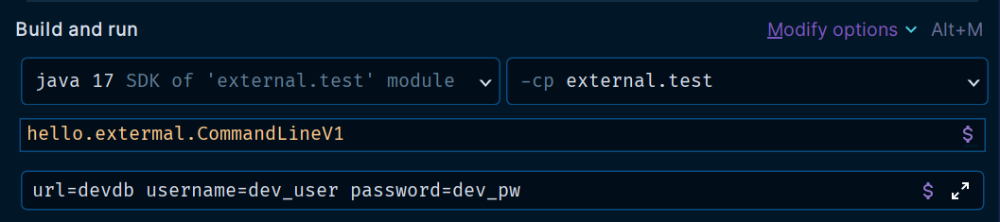
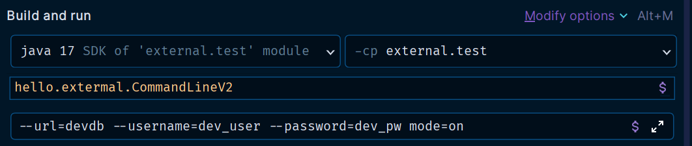
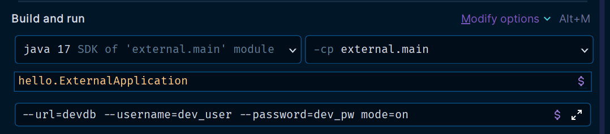

# 외부 설정 - 커맨드 라인 인수

커맨드 라인 인수(Command line arguments)는 애플리케이션 실행 시점에 외부 설정값을 `main(args)` 메서드의 `args` 파라미터로 전달하는 방법이다.

사용 방법
- 예) `java -jar xxx.jar dataA dataB`
- 필요한 데이터를 마지막 위치에 스페이스로 구분해서 전달한다. `dataA`, `dataB` 2개의 문자가 `args`에 전달된다.

```java
@Slf4j
public class CommandLineV1 {
    public static void main(String[] args) {
        for (String arg : args) {
            log.info("arg {}", arg);
        }
    }
}
```



- 애플리케이션을 개발할 때는 보통 `key=value` 형식으로 데이터를 받는 것이 편리해서 `key=value` 형식으로 입력해 주었다.
- 하지만 실행 결과를 보면 `key=value` 형식이 아닌 단순한 문자다.

이것은 파싱되지 않은 통 문자이다.<br>
이 경우 개발자가 직접 `=`을 기준으로 데이터를 파싱해서 `key=value` 형식에 맞도록 분리해야 한다. 그리고 형식이 배열이기 때문에 루프를 돌면서 원하는 
데이터를 찾아야 하는 번거로움도 발생한다.

커맨드 라인에 전달하는 값은 형식이 없고 단순히 띄어쓰기로 구분한다.

## 커맨드 라인 옵션 인수

스프링에서는 커맨드 라인 인수를 `key=value` 형식으로 편리하게 사용할 수 있도록 스프링 만의 표준 방식을 정의했는데 이것을 **커맨드 라인 옵션 인수**라고 한다.

커맨드 라인에 `--`를 연결해서 시작하면 `key=value` 형식으로 정하고 이것을 커맨드 라인 옵션 인수라 한다.

```java
@Slf4j
public class CommandLineV2 {
    public static void main(String[] args) {
        for (String arg : args) {
            log.info("arg {}", arg);
        }

        ApplicationArguments appArgs = new DefaultApplicationArguments(args);
         
        log.info("SourceArgs = {}", List.of(appArgs.getSourceArgs()));
        log.info("NonOptionsArgs = {}", appArgs.getNonOptionArgs());
        log.info("OptionNames = {}", appArgs.getOptionNames());

        Set<String> optionNames = appArgs.getOptionNames();
        for (String optionName : optionNames) {
            log.info("option arg {}={}", optionName, appArgs.getOptionValues(optionName));
        }

        List<String> url = appArgs.getOptionValues("url");
        List<String> username = appArgs.getOptionValues("username");
        List<String> password = appArgs.getOptionValues("password");
        List<String> mode = appArgs.getOptionValues("mode");

        log.info("url={}", url);
        log.info("username={}", username);
        log.info("password={}", password);
        log.info("mode={}", mode);
    }
}
```



마지막에 `--`(대쉬)가 없는 `mode=on`이라는 옵션도 추가했다.

```text
## 실헹 결과
CommandLineV2 - arg --url=devdb
CommandLineV2 - arg --username=dev_user
CommandLineV2 - arg --password=dev_pw
CommandLineV2 - arg mode=on

CommandLineV2 - SourceArgs = [--url=devdb, --username=dev_user, --password=dev_pw, mode=on]
CommandLineV2 - NonOptionsArgs = [mode=on]

CommandLineV2 - OptionNames = [password, url, username]
CommandLineV2 - option arg password=[dev_pw]
CommandLineV2 - option arg url=[devdb]
CommandLineV2 - option arg username=[dev_user]

CommandLineV2 - url=[devdb]
CommandLineV2 - username=[dev_user]
CommandLineV2 - password=[dev_pw]
CommandLineV2 - mode=null
```
- `args` : 커맨드 라인의 입력 결과를 그대로 출력
- `SourceArgs` : 커맨드 라인 인수 전부를 출력
- `NonOptionsArgs` : `mode=on` 앞에는 `--`를 사용하지 않았다.

참고로 `appArgs.getOptionValues()`는 리스트를 반환하는데, 옵션 인수는 하나의 키에 여러 값을 포함할 수 있기 때문이다.

## 커맨드 라인 옵션 인수와 스프링 부트

스프링 부트는 커맨드 라인을 포함해서 커맨드 라인 옵션 인수를 활용할 수 있는 `ApplicationArguments`를 스프링 빈으로 등록해 둔다.<br>
그리고 이 안에 커맨드 라인을 저장해 둔다. 해당 빈을 주입 받으면 커맨드 라인으로 입력한 값을 사용할 수 있다.

```java
@Slf4j
@Component
public class CommandLineBean {

    private final ApplicationArguments arguments;

    public CommandLineBean(ApplicationArguments arguments) {
        this.arguments = arguments;
    }

    @PostConstruct
    public void init() {
        log.info("source {}", List.of(arguments.getSourceArgs()));
        log.info("optionNames {}", arguments.getOptionNames());
        Set<String> optionNames = arguments.getOptionNames();
        for (String optionName : optionNames) {
            log.info("option args {}={}", optionName, arguments.getOptionValues(optionName));
        }
    }
}
```



```text
## 실행 결과

CommandLineBean  : source [--url=devdb, --username=dev_user, --password=dev_pw, mode=on]
CommandLineBean  : optionNames [password, url, username]
CommandLineBean  : option args password=[dev_pw]
CommandLineBean  : option args url=[devdb]
CommandLineBean  : option args username=[dev_user]
```