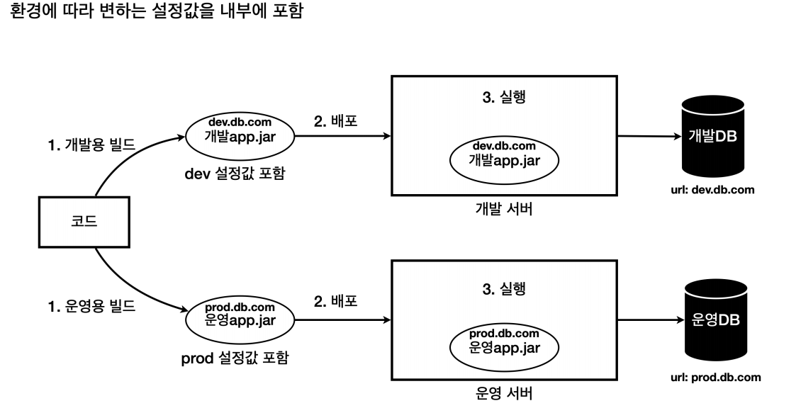
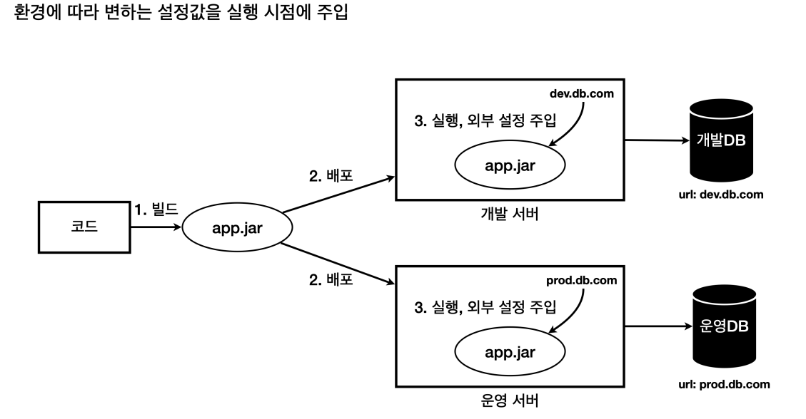
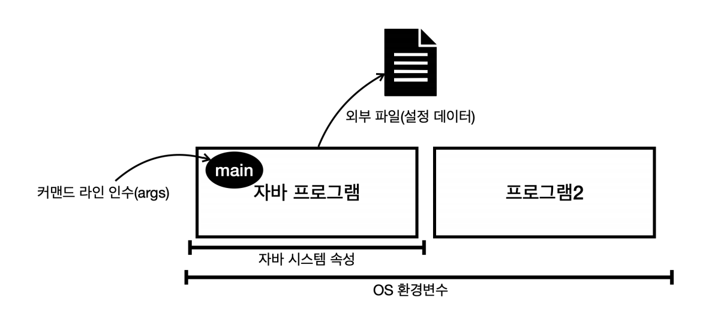

# 외부 설정

## 외부 설정이란?

하나의 애플리케이션을 여러 다른 환경에서 사용해야 할 때가 있다. 
대표적으로 개발이 잘 진행되고 있는지 내부에서 확인하는 용도의 개발 환경, 그리고 실제 고객에게 서비스하는 운영 환경이 있다.

문제는 각각의 환경에 따라서 서로 다른 설정값이 존재한다는 것이다. 개발용 DB와 운영용 DB의 URL이 서로 다른 것이다. 
이 문제를 해결하는 가장 단순한 방법은 각각의 환경에 맞게 애플리케이션을 빌드 하는 것이다.

이렇게 하면 각각의 환경에 맞는 `jar`파일이 만들어지므로 이 파일을 각 환경별로 배포하면 된다.

**하지만 당연히 좋은 방법은 아니다.**
- 환경에 따라서 빌드를 여러번 해야 한다.
- 개발 버전과 운영 버전의 빌드 결과물이 다르다.
  - 개발 환경에서 검증이 되더라도 운영 환경에서 다른 빌드 결과를 사용하기 때문에 예상치 못한 문제가 발생할 수 있다.

**그래서 보통은 빌드는 한번만 하고 각 환경에 맞추어 실행 시점에 외부 설정값을 주입하는 방법을 사용한다.**

이렇게 하면 빌드도 한번만 하면 되고, 개발 버전과 운영 버전의 빌드 결과물이 같기 때문에 개발환경에서 검증되면 운영환경에서도 믿고 사용할 수 있다.

**유지보수하기 좋은 애플리케이션을 개발하는 단순하면서도 가장 중요한 원칙은 변하는 것과 변하지 않는 것을 분리하는 것이다.** 
각 환경에 따라 변하는 외부 설정값은 분리하고 변하지 않는 코드와 빌드 결과물은 유지했다.

외부 설정은 일반적으로 4가지 방법이 있다.

- OS 환경 변수 : OS에서 지원하는 외부 설정으로, 해당 OS를 사용하는 모든 프로세스에서 사용된다.
- 자바 시스템 속성 : 자바에서 지원하는 외부 설정으로, 해당 JVM 안에서 사용된다.
- 자바 커맨드 라인 인수 : 커맨트 라인에서 전달하는 외부 설정으로, 실행시 `main(args)` 메서드에서 사용된다.
- 외부 파일(설정 데이터) : 프로그램에서 외부 파일을 직접 읽어서 사용한다.
  - 애플리케이션에서 특정 위치의 파일을 읽도록 한다.
  - 각 서버마다 해당 파일안에 다른 설정 정보를 남겨둔다.

 

- [OS 환경 변수]()
- [자바 시스템 속성]()
- [커맨드 라인 인수]()
- [스프링 통합]()
- [설정 데이터]()
- [외부 설정 사용]()
- [YAML]()
- [@Profile]()