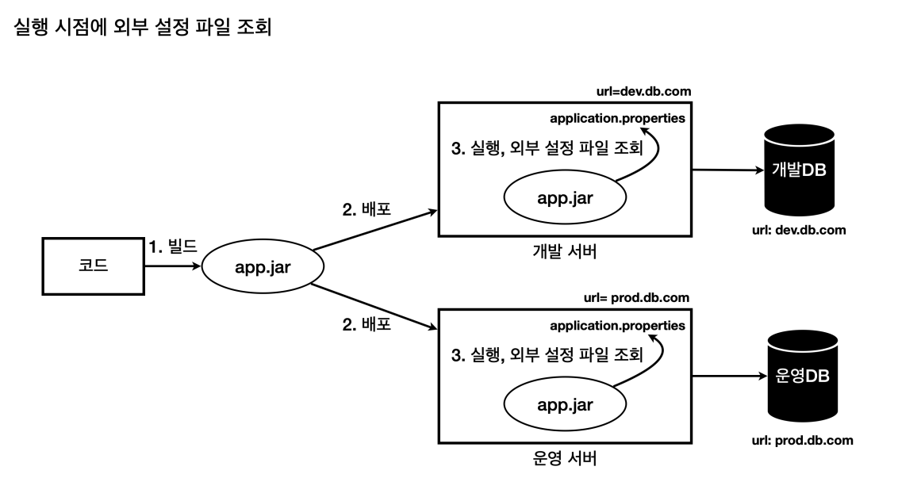
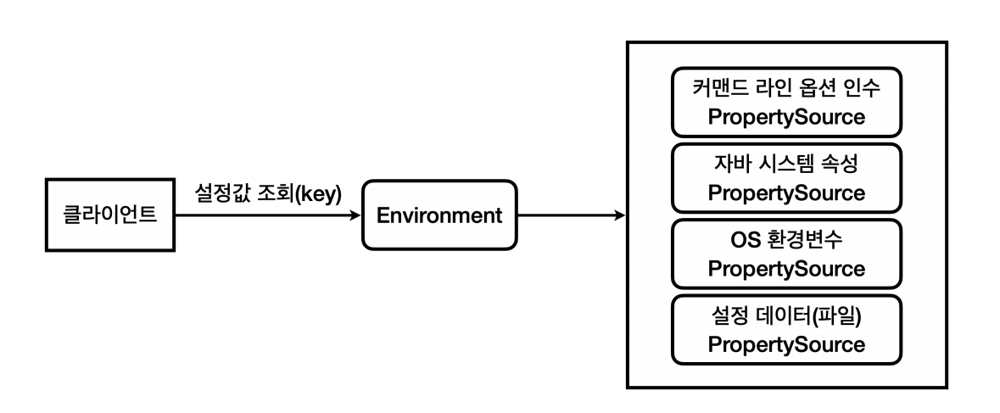
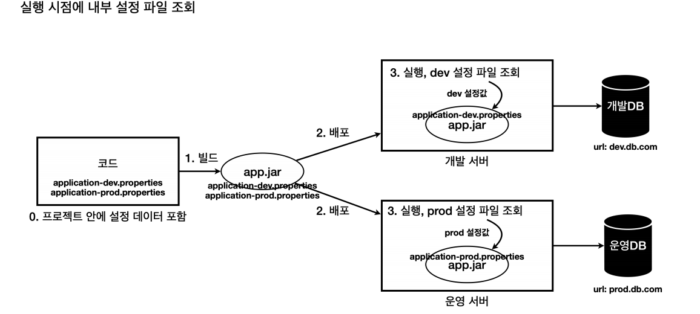
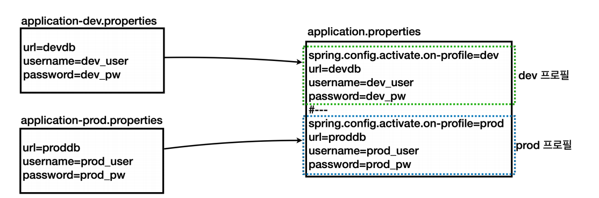

# 설정 데이터 - 외부 파일

OS 환경 변수, 자바 시스템 속성, 커맨드 라인 옵션 인수는 사용해야 하는 값이 늘어날수록 사용하기 불편해진다.

그래서 대안으로는 설정값을 파일에 넣어서 관리하는 방법이 있다. 그리고 애플리케이션 로딩 시점에 해당 파일을 읽어들이면 된다.<br>
그 중에서도 `.properties`라는 파일은 `key=value`형식을 사용해서 설정값을 관리하기에 적합하다.



개발자는 `application.properties`라는 이름의 파일을 자바를 실행하는 위치에 만들어 두기만 하면 된다. 그러면 스프링이 해당 파일을 읽어서
사용할 수 있는 `PropertySource`의 구현체를 제공한다.<br>
스프링에서는 이러한 `application.properties` 파일을 설정 데이터(Config Data)라 한다. 당연히 설정 데이터도 `Environment`를 통해서 조회할 수 있다.



- `./gradlew clean build`
- `build/libs`에 `application.properties` 파일 생성
```properties
url=dev.db.com 
username=dev_user 
password=dev_pw
```
- `java -jar xxx.jar` 실행

이렇게 각각의 환경에 따라 설정 파일의 내용을 다르게 준비하면 된다. 설정값의 내용이 많고 복잡해도 파일로 편리하게 관리할 수 있게 된다.

**문제점**
- 외부 설정을 별도의 파일로 관리하게 되면 설정 파일 자체를 관리하기 번거로운 문제가 발생한다.
- 서버가 10대면 변경사항이 있을 때 10대 서버의 설정 파일을 모두 각각 변경해야 한다.
- 설정 파일이 별도로 관리되기 때문에 설정값의 변경 이력을 확인하기 어렵다.

## 설정 데이터 - 내부 파일 분리

설정 파일을 외부에서 관리하는 것은 번거로운 일이다.

이 문제를 해결하는 간단한 방법은 설정 파일을 프로젝트 내부에 포함해서 관리하는 것이다. 그리고 빌드 시점에 함께 빌드되게 하는 것이다.<br>
이렇게 하면 애플리케이션을 배포할 때 설정 파일의 변경 사항도 함께 배포할 수 있게 된다.



0. 프로젝트 안에 소스 코드 뿐만 아니라 각 환경에 필요한 설정 데이터도 함께 포함해서 관리한다.
1. 빌드 시점에 개발, 운영 설정 파일을 모두 포함해서 빌드한다.
2. `xxx.jar`는 개발, 운영 두 설정 파일을 모두 가지고 배포된다.
3. 실행할 때 어떤 설정 데이터를 읽어야 할지 최소한의 구분은 필요하다.
   - 실행할 때 외부 설정을 사용해서 개발 서버는 `dev`라는 값을 제공하고, 운영 서버는 `prod`라는 값을 제공한다.(프로필)
   - `dev` 프로필이 넘어오면 `application-dev.properties`를 읽어서 사용한다.
   - `prod` 프로필이 넘어오면 `application-prod.properties`를 읽어서 사용한다.

**스프링은 설정 데이터를 내부에 파일로 분리해두고 외부 설정값(프로필)에 따라 각각 다른 파일을 읽는 방법이 구현되어있다.**

- `src/main/application-dev.properties`
```properties
url=dev.db.com
username=dev_user
password=dev_pw
```

- `src/main/application-prod.properties`
```properties
url=prod.db.com
username=prod_user
password=prod_pw
```

**스프링은 이런 곳에서 사용하기 위해 `프로필`이라는 개념을 지원한다.**

- IDE에서 커맨드 라인 옵션 인수 실행
  - `--spring.profiles.active=dev`
- IDE에서 자바 시스템 속성 실행
  - `-Dspring.profiles.active=dev`
- Jar 실행
  - `./gradlew clean build`
  - `build/libs` 이동
  - `java -Dspring.profiles.active=dev -jar xxx.jar`
  - `java -jar xxx.jar --spring.profiles.active=dev`

이제 설정 데이터를 프로젝트 안에서 함께 관리할 수 있게 되었고 배포 시점에 설정 정보도 함께 배포된다.

**하지만 설정 파일을 각각 분리해서 관리하면 한눈에 들어오지 않는 단점이 있다.**

## 설정 데이터 - 내부 파일 합체



- 스프링은 하나의 `.properties`파일 안에서 논리적으로 영역을 구분하는 방법을 제공한다.
  - `.properties`구분 방법 : `#---` 또는 `!---`
  - `.yml`구분 방법 : `---`
- 프로필에 따라 논리적으로 구분된 설정 데이터를 활성화 하는 방법
  - spring.config.activate.on-profile`에 프로필 값 지정

```properties
spring.config.activate.on-profile=dev
url=dev.db.com
username=dev_user
password=dev_pw
#---
spring.config.activate.on-profile=prod
url=prod.db.com
username=prod_user
password=prod_pw
```

이렇게 `application.properties`파일 하나로 통합해서 다양한 프로필의 설정 데이터를 관리할 수 있다.

## 설정 데이터 - 우선순위

**만약 `--spring.profiles.active=dev`이런 옵션을 지정하지 않으면 어떻게 될까?**

```text
No active profile set, falling back to 1 default profile: "default"
...
env url=null
env username=null
env password=null
```
- 실행 결과를 보면 활성 프로필이 없어서` default`라는 이름의 프로필이 활성화 됐다고 나온다.
- 스프링은 프로필을 지정하지 않고 실행하면 기본적으로 `default`라는 이름의 프로필을 사용한다.

로컬(`local`)환경에서도 항상 프로필을 지정하면서 실행하는 것은 꽤 피곤할 것이다.<br>
설정 데이터에는 기본 값을 지정할 수 있다. 프로필 지정과 무관하게 이 값은 항상 사용된다.
```properties
url=local.db.com
username=local_user
password=local_pw
#---
spring.config.activate.on-profile=dev
url=dev.db.com
username=dev_user
password=dev_pw
#---
spring.config.activate.on-profile=prod
url=prod.db.com
username=prod_user
password=prod_pw
```
- **스프링은 문서를 위에서 아래로 순서대로 읽으면서 설정한다.**
- 처음에 나오는 논리 문서는 `spring.config.activate.on-profile`같은 프로필 정보가 없다.
- 따라서 프로필과 무관하게 설정 데이터를 읽어서 사용한다.(기본값)

**스프링은 단순하게 문서를 위에서 아래로 순서대로 읽으면서 값을 설정하며 이때 기존 데이터가 있으면 덮어쓴다.**<br>
그리고 논리 문서에 `spring.config.activate.on-profile` 옵션이 있으면 해당 프로필을 사용할 때만 논리 문서를 적용한다.

```properties
url=local.db.com 
username=local_user 
password=local_pw 
#---
spring.config.activate.on-profile=dev 
url=dev.db.com
```
만약 이 상태에서 `dev`프로필을 적용하면 이렇게 된다.

```properties
url=local.db.com 
username=local_user 
password=local_pw 
```
먼저 순서대로 `local` 관련 정보가 입력된다.

이후에 `dev` 관련 문서를 읽고 `url=dev.db.com` 만 설정한다.

```properties
The following 1 profile is active: "dev"
...
url=dev.db.com 
username=local_user 
password=local_pw
```
최종적으로는 `url` 부분만 `dev`프로필에서 적용한 것이 반영되고 나머지는 처음에 입력한 기본값이 유지된다.

### 우선순위 - 전체

**우선순위는 위에서 아래로 적용된다. 아래가 더 우선순위가 높다.**

- **자주 사용하는 우선순위**
  - 설정 데이터(`application.properties`)
  - OS 환경 변수
  - 자바 시스템 속성
  - 커맨드 라인 옵션 인수
  - `@TestPropertySource`(테스트에서 사용)


- **설정 데이터 우선순위**
  - jar 내부 `application.properties`
  - jar 내부 프로필 적용 파일 `application-{profile}.properties`
  - jar 외부 `application.properties`
  - jar 외부 프로필 적용 파일 `application-{profile}.properties`

**우선순위는 상식 선에서 2가지만 기억하자.**
1. 더 유연한 것이 우선권을 가진다.
   - 예) 변경하기 어려운 파일보다 실행시 원하는 값을 줄 수 있는 자바 시스템 속성이 더 우선권을 가진다.
2. 범위가 넓은 것보다 좁은 것이 우선권을 가진다.
   - OS 환경 변수보다 자바 시스템 속성이 우선권이 있다.
   - 자바 시스템 속성보다 커맨드 라인 옵션 인수가 우선권이 있다.

**추가 또는 변경되는 방식**<br>
`Environment`를 통해서 조회하는 관점에서 보면 외부 설정값들은 계속 추가되거나 기존 값을 덮어서 변경하는 것 처럼 보인다. 물론 실제 값을 덮어서 
변경하는 것은 아니고 우선순위가 높은 값이 조회되는 것이다.

예를 들어 설정 데이터(`application.properties`)에 다음과 같이 설정했다.
```properties
url=local.db.com
```

**자바 시스템 속성 추가**
- `-Dusername=local_user`

**조회 결과**
```properties
url=local.db.com
username=local_user
```
- 자바 시스템 속성에서 기존에 없던 키 값을 추가했기 때문에 속성이 추가되었다.

**커맨드 라인 옵션 인수 추가**
- `--url=dev.db.com`

**조회 결과**
```properties
url=dev.db.com
username=local_user
```
- 커맨드 라인 옵션 인수는 기존에 있던 `url`이라는 키 값을 사용했기 때문에 기존에 있던 값이 새로운 값으로 변경되었다.
- 커맨드 라인 옵션 인수가 우선순위가 더 높다.

> **이렇게 우선순위에 따라서 설정을 추가하거나 변경하는 방식은 편리하고 유연한 구조를 만들어준다.**<br>
> 대부분은 `application.properties`에 외부 설정값들을 보관하고 기본으로 사용하다가 일부 속성을 변경이 필요한 상황이 생기면 더 높은 우선순위를 가지는
> 자바 시스템 속성이나 커맨드 라인 옵션 인수를 사용할 수 있는 것이다.