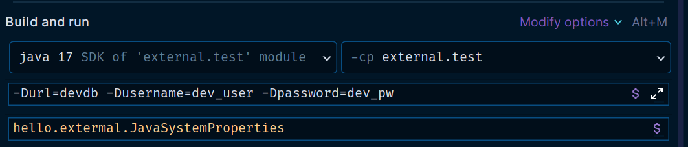

# 외부 설정 - 자바 시스템 속성

자바 시스템 속성(Java System properties)은 실행한 JVM 안에서 접근 가능한 외부 설정이다.

자바 시스템 속성은 자바 프로그램을 실행할 때 사용한다.
- 예) `java -Durl=dev -jar xxx.jar`
- `-D ` VM 옵션을 통해서 `key=value` 형식을 주면 된다.
- 순서에 주의해야 한다. `-D`옵션이 `-jar`보다 앞에 있어야 한다.

```java
@Slf4j
public class JavaSystemProperties {
    public static void main(String[] args) {
        Properties properties = System.getProperties();
        for (Object key : properties.keySet()) {
            log.info("prop {} = {}", key, System.getProperty(String.valueOf(key)));
        }
    }
}
```
- `System.getProperties()`를 사용하면 `Map`과 유사한(`Map`의 자식 타입) `key=value` 형식의 `Properties`를 받을 수 있다.


**사용자가 직접 정의하는 자바 시스템 속성을 추가해보자.**
```java
@Slf4j
public class JavaSystemProperties {
    public static void main(String[] args) {
        Properties properties = System.getProperties();
        for (Object key : properties.keySet()) {
            log.info("prop {} = {}", key, System.getProperty(String.valueOf(key)));
        }

        //=== 추가 ===
        String url = System.getProperty("url");
        String username = System.getProperty("username");
        String password = System.getProperty("password");

        log.info("url = {}", url);
        log.info("username = {}", username);
        log.info("password = {}", password);
    }
}
```



- VM options에 시스템 속성을 추가했다.

```text
## 실행 결과
.
.
.
JavaSystemProperties - url = devdb
JavaSystemProperties - username = dev_user
JavaSystemProperties - password = dev_pw
```

**Jar**<br>
`jar`로 빌드되어 있다면 실행시 자바 시스템 속성을 추가할 수 있다.<br>
- `java -Durl=devdb -Dusername=dev_user -Dpassword=dev_pw -jar xxx.jar`

**자바 시스템 속성 자바 코드로 설정**<br>
자바 시스템 속성은 `-D`옵션을 통해 실행 시점에 전달할 수도 있고, 자바 코드 내부에서 추가하는 것도 가능하다.
- 설정 : `System.setProperty(propertyName, "propertyValue");`
- 조회 : `System.getProperty(propertyName);`
이 방식은 코드 안에서 사용하는 것이기 때문에 외부로 설정을 분리하는 효과는 없다.