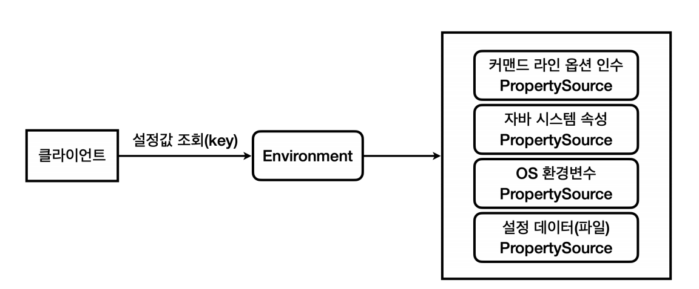
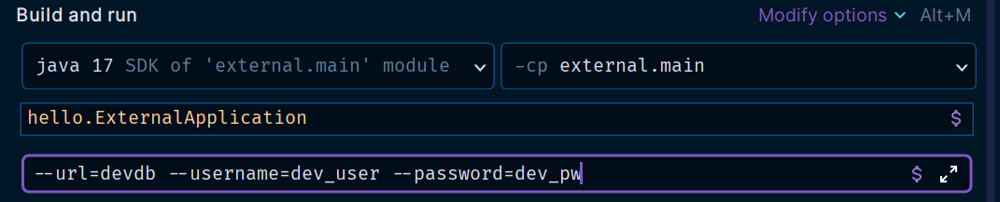
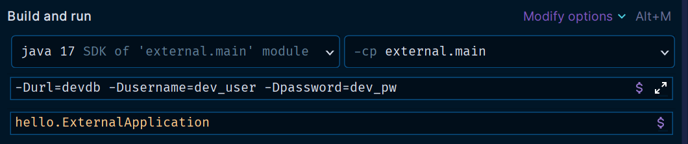
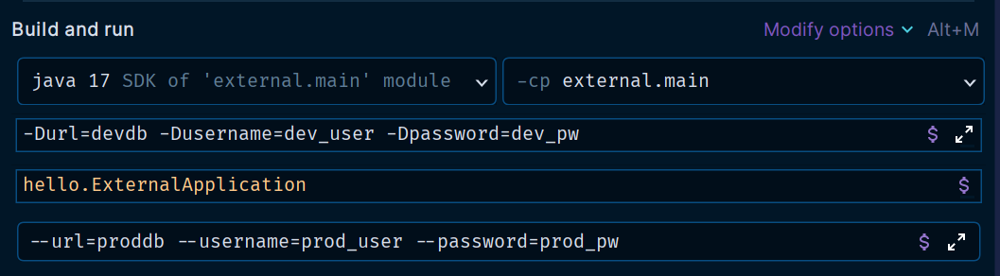

# 스프링 통합

OS 환경 변수, 자바 시스템 속성, 커맨드 라인 옵션 인수는 모두 외부 설정을 `key=value` 형식으로 사용할 수 있는 방법이다.<br>
그런데 이 외부 설정값을 읽어서 사용하는 개발자 입장에서 생각해보면 모두 `key=value` 형식이고 설정값을 외부로 뽑아둔 것이다.<br>
**그런데 어디에 있는 외부 설정값을 읽어야 하는지에 따라서 각각 읽는 방법이 다르다는 단점이 있다.**<br>
에를 들어 OS 환경 변수는 `System.getenv()`, 자바 시스템 속성은 `System.getProperty()`를 사용해야 한다. 만약 환경 변수를 설정하는 정책이 변경된다면
관련 코드들을 모두 변경해야 한다.

스프링은 이 문제를 `Environment`와 `PropertySource`라는 추상화를 통해서 해결한다.



**PropertySource**
- 스프링은 `PropertySource`라는 추상 클래스를 제공하고 각각의 외부 설정을 조회하는 `XxxPropertySource` 구현체를 만들어두었다.
- 스프링은 로딩 시점에 필요한 `PropertySource`들을 생성하고 `Environment`에서 사용할 수 있게 연결해둔다.

**Environment**
- `Environment`를 통해서 특정 외부 설정에 종속되지 않고 일관성 있게 `key=value` 형식의 외부 설정에 접근할 수 있다.
- 모든 외부 설정은 이제 `Environment`를 통해서 조회하면 된다.

**설정 데이터(파일)**
- 여기에 `application.properties`, `application.yml`도 `PropertySource`에 추가된다.
- `Environment`를 통해서 접근할 수 있다.

```java
@Slf4j
@Component
@RequiredArgsConstructor
public class EnvironmentCheck {

    private final Environment env;

    @PostConstruct
    public void init() {
        String url = env.getProperty("url");
        String username = env.getProperty("username");
        String password = env.getProperty("password");

        log.info("env url = {}", url);
        log.info("env username = {}", username);
        log.info("env password = {}", password);
    }
}
```
- 커맨드 라인 옵션 인수



- 자바 시스템 속성



```text
## 실행 결과

EnvironmentCheck : env url = devdb
EnvironmentCheck : env username = dev_user
EnvironmentCheck : env password = dev_pw
```

**만약 커맨드 라인 옵션 인수와 자바 시스템 속성을 중복해서 설정하면 어떻게 될까?**



```text
## 실행 결과

EnvironmentCheck : env url = proddb
EnvironmentCheck : env username = prod_user
EnvironmentCheck : env password = prod_pw
```

커맨드 라인 옵션 인수에 입력한 데이터가 출력됐다.

**우선순위는 딱 2가지만 기억하면 된다(상식 선)**
1. 더 유연한 것이 우선권을 가진다.
   - 변경하기 어려운 파일 보다 실행 시 원하는 값을 줄 수 있는 자바 시스템 속성이 더 우선권을 가진다.
2. 범위가 넓은 것 보다 좁은 것이 우선권을 가진다.
   - 자바 시스템 속성은 해당 JVM 안에서 모두 접근할 수 있다.
   - 반면에 커맨드 라인 옵션 인수는 `main`의 `args`를 통해서 들어오기 때문에 범위가 더 좁다.