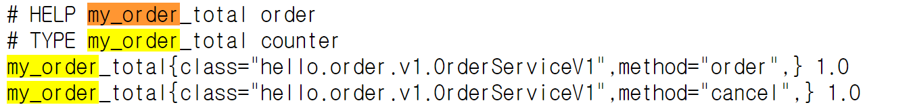
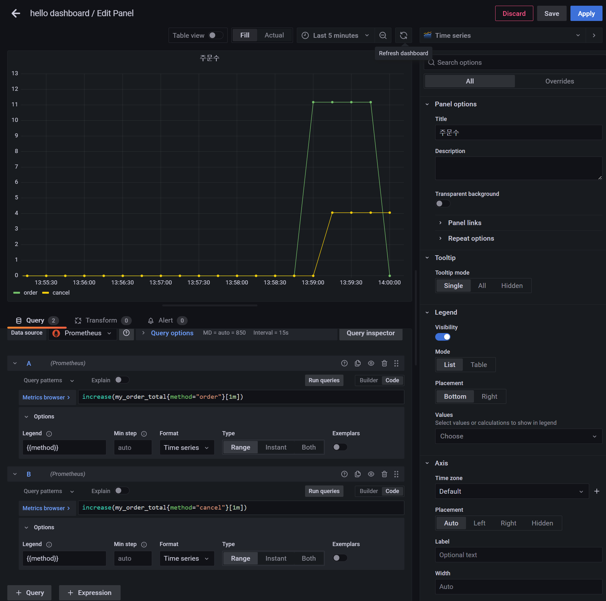

# 메트릭 등록 - 카운터

**MeterRegistry**
- 마이크로미터 기능을 제공하는 핵심 컴토넌트
- 스프링을 통해서 주입 받아서 사용하고 이곳을 통해서 카운터, 게이지 등을 등록한다.

**[Counter](https://prometheus.io/docs/concepts/metric_types/#counter)**
- 단조롭게 증가하는 단일 누적 측정항목
  - 단일 값이고, 보통 하나씩 증가한다.
  - 누적이므로 전체 값을 포함한다.(`total`)
  - 프로메테우스에서는 일반적으로 카운터의 이름 마지막에 `_total`을 붙여서 표현한다.
- 값을 증가하거나 0으로 초기화 하는 것만 가능하다.
- 마이크로미터에서 값을 감소하는 기능도 지원하지만 목적에 맞지 않는다.
- 예) HTTP 요청 수

## 카운터 - V1

```java
..
import io.micrometer.core.instrument.Counter;
import io.micrometer.core.instrument.MeterRegistry;
..

@Slf4j
@RequiredArgsConstructor
public class OrderServiceV1 implements OrderService {

    private final MeterRegistry meterRegistry;
    private AtomicInteger stock = new AtomicInteger(100);

    @Override
    public void order() {
        log.info("주문");
        stock.decrementAndGet();

        Counter.builder("my.order")
                .tag("class", this.getClass().getName())
                .tag("method", "order")
                .description("order")
                .register(meterRegistry)
                .increment();
    }

    @Override
    public void cancel() {
        log.info("취소");
        stock.incrementAndGet();

        Counter.builder("my.order")
                .tag("class", this.getClass().getName())
                .tag("method", "cancel")
                .description("order")
                .register(meterRegistry)
                .increment();
    }

    @Override
    public AtomicInteger getStock() {
        return stock;
    }
}
```
- `Counter.builder(name)` : 카운터를 생성한다. `name`에 메트릭 이름을 지정하면 된다.
- `tag` : 프로메테우스에서 필터할 수 있는 레이블로 사용된다.
- 주문과 취소는 메트릭 이름은 같고 `tag`를 통해서 구분한다.
- `register(meterRegistry)` : 만든 카운터를 `MeterRegistry`에 등록한다. 이렇게 등록해야 실제 등록한다.
- `increment()` : 카운터의 값을 하나 증가한다.

```java
@Configuration
public class OrderConfigV1 {

    @Bean
    public OrderService orderService(MeterRegistry registry) {
        return new OrderServiceV1(registry);
    }
}
```
```java
@SpringBootApplication(scanBasePackages = "hello.controller")
@Import(OrderConfigV1.class)
public class ActuatorApplication {

    public static void main(String[] args) {
        SpringApplication.run(ActuatorApplication.class, args);
    }
}
```

- 이제 `/order`, `/cancel`을 한 번씩 실행하고 메트릭을 확인해보면 `my.order`라는 이름으로 메트릭이 등록이 된다.
  - 최소 한 번은 호출해야 메트릭이 등록 된다.

```json
// 20240224135433
// http://localhost:8080/actuator/metrics/my.order
{
  "name": "my.order",
  "description": "order",
  "measurements": [
    {
      "statistic": "COUNT",
      "value": 2.0
    }
  ],
  "availableTags": [
    {
      "tag": "method",
      "values": [
        "cancel",
        "order"
      ]
    },
    {
      "tag": "class",
      "values": [
        "hello.order.v1.OrderServiceV1"
      ]
    }
  ]
}
```
- `method`로 구분할 수 있게 나온다.



- 프로메테우스는 `.`대신 `_`를 사용한다.
- 프로메테우스는 관례상 카운터 이름의 끝에 `_total`을 붙인다.

### 그라파나 등록



- 카운터는 계속 증가하기 때문에 특정 시간에 얼마나 증가했는지 확인하기 위해서는 `increase()`, `rate()` 같은 함수와 함께 사용하는 것이 좋다.

## 카운터 - V2

위에서 만든 코드의 단점은 메트릭을 관리하는 로직이 핵심 비즈니스 로직에 침투했다는 점이다. 이런 부분을 분리하려면 스프링 AOP를 사용하면 된다.

직접 AOP를 만들어서 적용해도 되지만 마이크로미터는 이런 상황에 맞추어 필요한 AOP 구성 요소를 이미 다 만들어두었다.

```java
import io.micrometer.core.annotation.Counted;
..

@Slf4j
public class OrderServiceV2 implements OrderService {

  private AtomicInteger stock = new AtomicInteger(100);

  @Counted("my.order")
  @Override
  public void order() {
    log.info("주문");
    stock.decrementAndGet();
  }

  @Counted("my.order")
  @Override
  public void cancel() {
    log.info("취소");
    stock.incrementAndGet();
  }

  @Override
  public AtomicInteger getStock() {
    return stock;
  }
}
```
- `@Counted` 어노테이션을 측정을 원하는 메서드에 적용하면 된다.
- 그리고 메트릭 이름을 지정하면 된다.(`my.order`)
- 이렇게 사용하면 `tag`에 `method`가 자동으로 적용된다.

```java
@Configuration
public class OrderConfigV2 {

    @Bean
    public OrderService orderService() {
        return new OrderServiceV2();
    }

    @Bean
    public CountedAspect countedAspect(MeterRegistry registry) {
        return new CountedAspect(registry);
    }
}
```
- **`CountedAspect`를 빈으로 등록해야 `@Counted` 관련 AOP가 동작한다.**

```java
@SpringBootApplication(scanBasePackages = "hello.controller")
@Import(OrderConfigV2.class)
public class ActuatorApplication {
    public static void main(String[] args) {
        SpringApplication.run(ActuatorApplication.class, args);
    }
}
```

```json
// 20240224140904
// http://localhost:8080/actuator/metrics/my.order

{
  "name": "my.order",
  "measurements": [
    {
      "statistic": "COUNT",
      "value": 9.0
    }
  ],
  "availableTags": [
    {
      "tag": "result",
      "values": [
        "success"
      ]
    },
    {
      "tag": "exception",
      "values": [
        "none"
      ]
    },
    {
      "tag": "method",
      "values": [
        "cancel",
        "order"
      ]
    },
    {
      "tag": "class",
      "values": [
        "hello.order.v2.OrderServiceV2"
      ]
    }
  ]
}
```
- `@Counted`를 사용하면 `result`, `exception`, `method`, `class` 같은 다양한 `tag`를 자동으로 적용한다.

