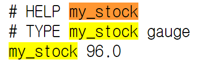
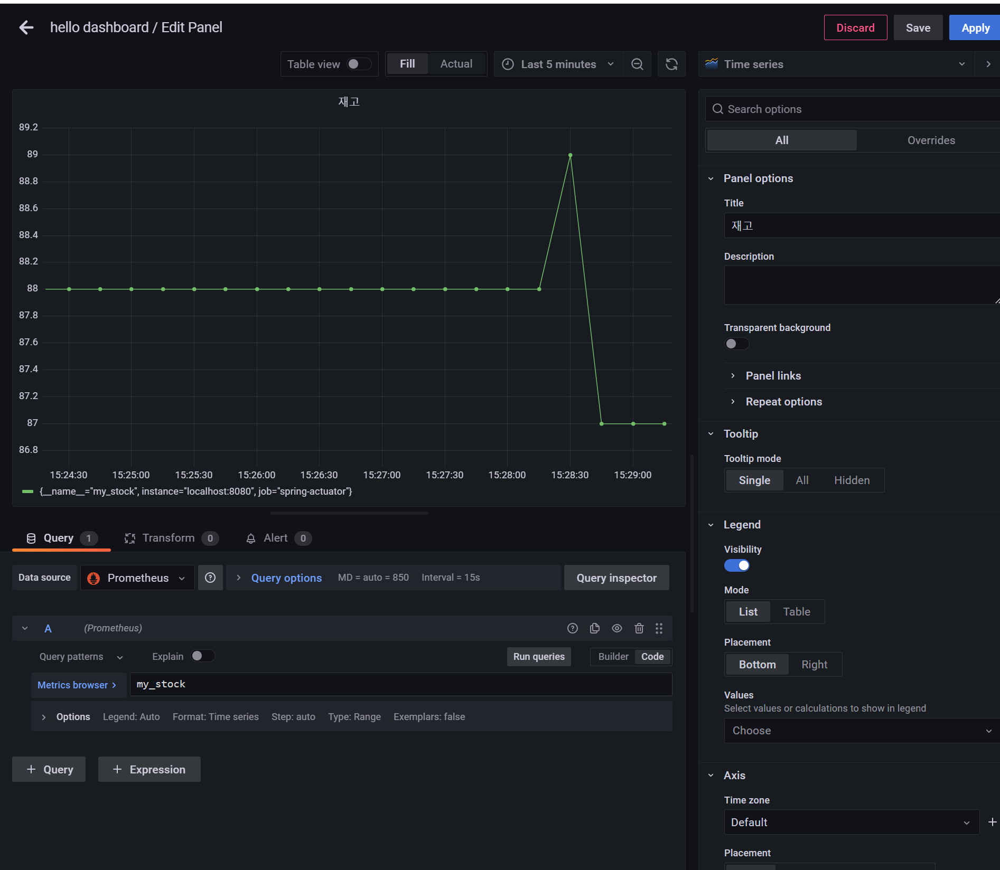

# 메트릭 등록 - 게이지

**[Gauge](https://prometheus.io/docs/concepts/metric_types/#gauge)**
- 게이지는 임의로 오르내릴 수 있는 단일 숫자 값을 나타내는 메트릭이다.
- 값의 현재 상태를 보는데 사용한다.
- 값이 증가하거나 감소할 수 있다.
- 예) CPU 사용량, 메모리 사용량

**카운터와 게이지를 구분할 때는 값이 감소할 수 있는가를 고민해보면 도움이 된다.**

## 게이지 - V1

```java
import io.micrometer.core.instrument.Gauge;
import io.micrometer.core.instrument.MeterRegistry;
..

@Configuration
public class StockConfigV1 {

    @Bean
    public MyStockMetric myStockMetric(OrderService orderService, MeterRegistry registry) {
        return new MyStockMetric(orderService, registry);
    }

    @Slf4j
    static class MyStockMetric {
        private final OrderService orderService;
        private final MeterRegistry registry;

        public MyStockMetric(OrderService orderService, MeterRegistry registry) {
            this.orderService = orderService;
            this.registry = registry;
        }

        @PostConstruct
        public void init() {
            Gauge.builder("my.stock", orderService, service -> {
                
                log.info("stock gauge call");
                return service.getStock().get();
            })
                .register(registry);
        }
    }
}
```
- `my.stock`이라는 이름으로 게이지를 등록한다.
- 게이지를 만들 때 함수를 전달했다. 이 함수는 외부에서 메트릭을 확인할 때 마다 호출된다.
  - 이 함수의 반환 값이 게이지의 값이다.

```java
@SpringBootApplication(scanBasePackages = "hello.controller")
@Import({OrderConfigV4.class, StockConfigV1.class})
public class ActuatorApplication {

    public static void main(String[] args) {
        SpringApplication.run(ActuatorApplication.class, args);
    }
}
```
- 이대로 실행하면 `log.info("stock gauge call");` 로그 내용이 계속해서 남는다.
- 게이지를 확인하는 함수는 외부에서 메트릭을 확인할 때 호출 되는데, 현재 프로메테우스가 다음 경로를 통해 주기적으로 메트릭을 확인하기 때문이다.
  - `localhost:8080/actuator/prometheus`
- 프로메테우스를 종료하면 해당 함수가 호출되지 않는다. 메트릭 확인 경로를 직접 호출해야 해당 함수가 호출된다.
- 카운터와 다르게 게이지는 무언가를 누적할 필요도 없고 딱 현재 시점의 값을 보여주면 된다.
- 측정 시점에 현재 값을 반환한다.

```json
// 20240224151109
// http://localhost:8080/actuator/metrics/my.stock

{
  "name": "my.stock",
  "measurements": [
    {
      "statistic": "VALUE",
      "value": 96.0
    }
  ],
  "availableTags": [
    
  ]
}
```
- 게이지는 현재 값을 그대로 보여주면 되므로 단순하다.



### 그라파나 등록



## 게이지 - V2

```java
import io.micrometer.core.instrument.Gauge;
import io.micrometer.core.instrument.binder.MeterBinder;
..

@Slf4j
@Configuration
public class StockConfigV2 {

  @Bean
  public MeterBinder stockSize(OrderService orderService) {
    return registry -> Gauge.builder("my.stock", orderService, service -> {

      log.info("stock gauge call");
      return service.getStock().get();

    }).register(registry);
  }
}
```
- `MeterBinder` 타입을 바로 반환하면서 단순하게 등록할 수도 있다.

```java
@SpringBootApplication(scanBasePackages = "hello.controller")
@Import({OrderConfigV4.class, StockConfigV2.class})
public class ActuatorApplication {

    public static void main(String[] args) {
        SpringApplication.run(ActuatorApplication.class, args);
    }
}
```