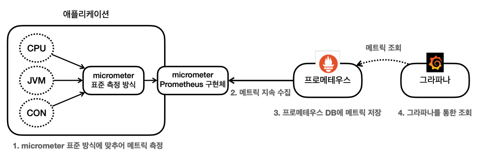
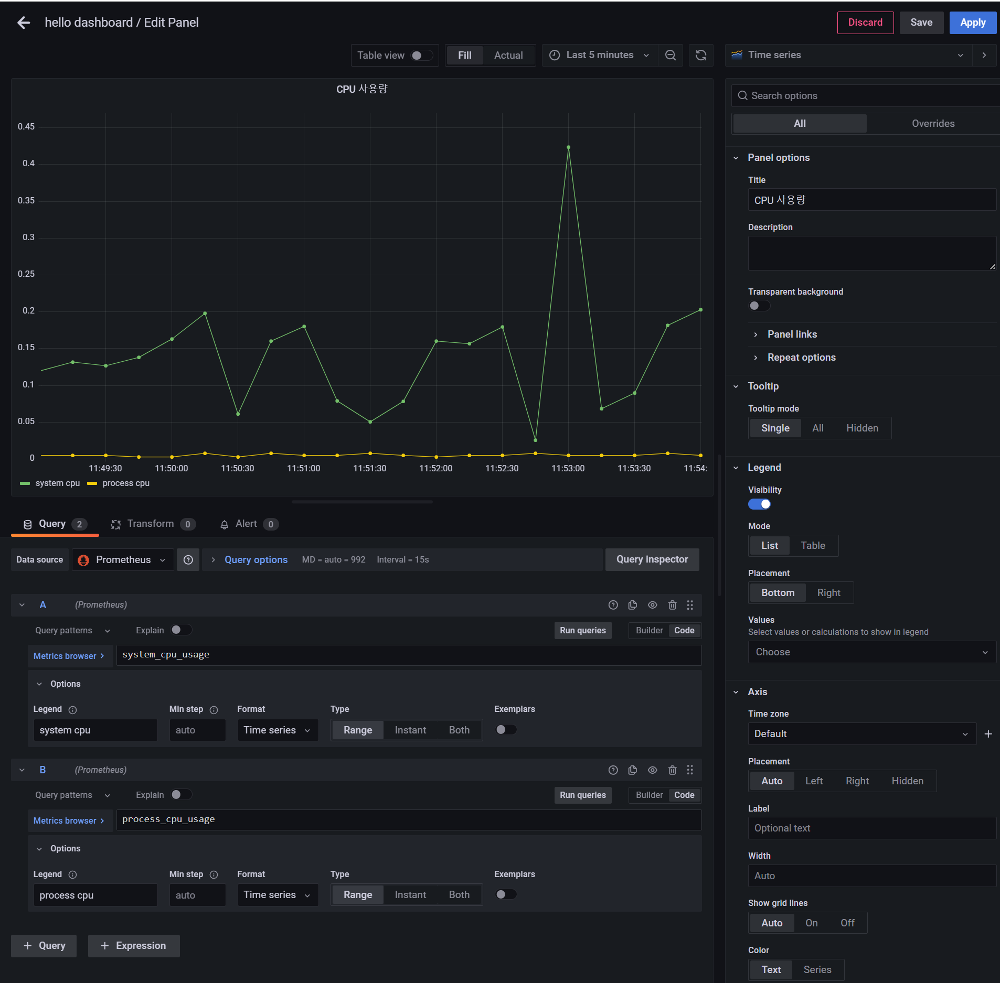
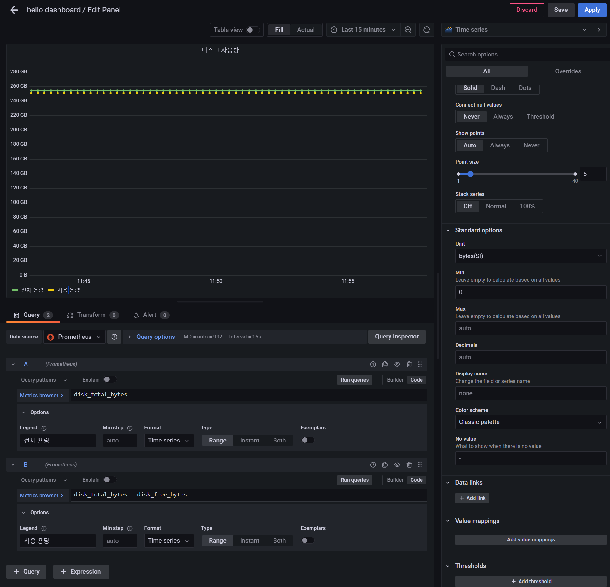

# 그라파나

- [그라파나 설치](https://grafana.com/grafana/download?platform=windows)
- `bin` 이동
- `grafana-server.exe` 실행
- `localhost:3000` 실행
- 계정을 생성하거나 username, password를 `admin`으로 실행



그라파나에서 프로메테우스를 데이터소스로 사용해서 데이터를 읽어와야 한다.

- 톱니바퀴(설정) -> `Configuration` -> `Data sources` -> `Add data source`
- `Prometheus` 선택 -> URL : `http://localhost:9090` -> 맨 밑에 `Save & test`

## 대시보드 만들기

**애플리케이션, 프로메테우스, 그라파나가 실행되어 있어야 한다.**

**대시보드 생성**
1. 왼쪽 메뉴에서 `Dashboard` 선택(사각형 4개 모양)
2. `New` -> `New Dashboard`
3. 오른쪽 상단의 `Save dashboard`(디스크 모양) 선택
4. `Dashboard name` 정하고 `Save`

**대시보드에 패널 생성**
1. 왼쪽 메뉴에서 `Dashboard` 선택(사각형 4개 모양)쪽
2. 위에서 만든 대시보드 선택
3. 오른쪽 상단 `Add panel` 선택(차트 모양)
4. `Add a new panel` 선택
5. 아래 `Query`의 `Run queries` 오른쪽에 `Builder`와 `Code`중에 `Code` 선택
6. `Enter a PromQL query..` 부분에 메트릭을 입력해서 만들면 된다.

### CPU 메트릭 만들어보기

- `system_cpu_usage` : 시스템의 CPU 사용량
- `process_cpu_usage` : JVM 프로세스 CPU 사용량
- 밑에 `+ Query`로 여러 쿼리를 수행할 수 있다.

`Enter a PromQL query..`에 위 쿼리를 입력하고 `Run queries`를 누르면 패널에 그래프로 확인할 수 있다.

**그래프 데이터 이름 변경**
- 그래프의 범례가 기본적으로 메트릭 이름을 그대로 하는 `JSON` 으로 나온다. 보기 좋게 바꿔줘야 한다.
- 쿼리를 입력한 곳 바로 밑에 `Options` 선택
- `Legend` -> `Custom` 선택
- 원하는 이름 지정

**패널 이름 설정**
- 오른쪽 메뉴 `Panel options` 선택
- `Title` 수정

**패널 저장**
- 오른쪽 상단의 `Save`또는 `Apply` 선택



### 디스크 사용량 메트릭 만들어보기



- `Standard options` -> `Unit` -> `Data` -> `bytes(SI)`로 하면 `GB`, `TB` 단위로 읽기 편하게 나온다.(설정 안하면 byte 단위)
- `Standard options` -> `Min` -> `0`으로 하면 그래프가 0부터 시작한다.

**이제 이런 식으로 필요한 메트릭들을 하나씩 추가하면 된다.**
- JVM 메트릭
- 시스템 메트릭
- 스프링 MVC 메트릭
- 로그 메트릭 등등...

**하지만 그라파나는 이미 만들어준 대시보드를 가져다가 사용할 수 있는 기능을 제공한다.**

## 공유 대시보드

- [공유 대시보드](https://grafana.com/grafana/dashboards/)

여기에 이미 누군가 만들어둔 수 많은 대시보드가 공개되어있다. 검색창에 `spring`이라고 검색해보면 다양한 대시보드가 나온다. 
가져다가 사용만 하면 된다.

- 원하는 대시보드 선택
- `Copy Id to clipboard` 선택
- 그라파나 `Dashboards` 메뉴 선택
- `New` -> `Import` 선택
- 복사한 `ID`를 붙여넣고 오른쪽 `Load` 선택
- `Options`에서 Prometheus 데이터소스 선택하고 `Import` 선택

대시보드를 확인해보면 거의 대부분의 메트릭이 이미 구현되어 있는 것을 확인할 수 있다. 각 항목들을 보고 대시보드를 어떻게 구성해야 하는지 학습할 수도 있다.<br>
일부 데이터의 경우 스프링 부트나 기타 라이브러리 버전이 변하면서 동작하지 않는 기능들도 있다. 이런 부분들은 수정해서 사용해야 한다.

## 메트릭을 통한 문제 확인

애플리케이션에 문제가 발생했을 때 그라파나를 통해서 어떻게 모니터링 하는지 알아보자.

- CPU 사용량 초과
- JVM 메모리 사용량 초과
- 커넥션 풀 고갈
- 에러 로그 급증

### CPU 사용량 초과

```java
@Slf4j
@RestController
public class TrafficController {

    @GetMapping("/cpu")
    public String cpu() {
        log.info("cpu");
        long value = 0;
        for (long i = 0; i < 1_000_000_000_000L; i++) {
            value++;
        }
        return "ok value=" + value;
    }
}
```
- 반복 횟수를 굉장히 크게 주어 CPU에 부하를 주는 코드다.
- `/cpu`를 호출하고 대시보드를 확인해보면 CPU 사용량이 증가하는 것을 확인할 수 있다.
- 여러 브라우저에서 동시에 요청하면 더 많은 CPU를 사용한다.

### JVM 메모리 사용량 초과

```java
@GetMapping("/jvm")
public String jvm() {
    log.info("jvm");
    for (int i = 0; i < 1_000_000; i++) {
        list.add("hello jvm" + i);
    }
    return "OK";
}

private List<String> list = new ArrayList<>();
```
- 리스트에 문자를 계속해서 추가한다.
- `/jvm`을 여러 번 요청하고 대시보드에서 JVM 메모리 사용량을 확인해보면 JVM 메모리 사용량이 계속 증가하다가 최대치를 넘는 순간 메트릭이 잡히지 않는다.
- JVM 내부에서 OOM(Out Of Memory)이 발생한 것이다.

### 커넥션 풀 고갈

```java
@Autowired DataSource dataSource;

@GetMapping("/jdbc")
public String jdbc() throws SQLException {
    log.info("jdbc");
    Connection conn = dataSource.getConnection();
    log.info("conn info={}", conn);
    //conn.close(); 커넥션을 닫지 않는다.
    return "OK";
}
```
- 커넥션을 획득하고 사용한 다음 커넥션을 닫지 않았다.
- `/jdbc`를 여러 번(최소 10번) 요청해본다.
- Active 커넥션이 커넥션 풀의 최대 숫자인 10개를 넘어가게 되면 커넥션을 획득하기 위해 대기(Pending)하게 된다.
- 그래서 커넥션 획득 부분에서 쓰레드가 대기하게 되고 결국 HTTP 요청을 응답하지 못한다.
- DB 커넥션을 획득하기 위해 대기하던 톰캣 쓰레드가 30초 이상 DB 커넥션을 획득하지 못하면 예외가 발생하면서 커넥션 획득을 포기한다.

### 에러 로그 급증

```java
@GetMapping("/error-log")
public String errorLog() {
    log.error("error log");
    return "OK";
}
```
- 애플리케이션에서 `ERROR`레벨의 로그가 급증한다면 심각한 문제가 발생한 것으로 이해할 수 있다.
- `/error-log`를 여러 번 실행하면 대시보드에서 에러 로그를 표시해주는 패널 그래프가 급증한 것을 볼 수 있다.

> **참고 : 메트릭을 보는 것은 정확한 값을 보는 것이 목적이 아니다. 대략적인 값과 추세를 확인하는 것이 주 목적이다.**