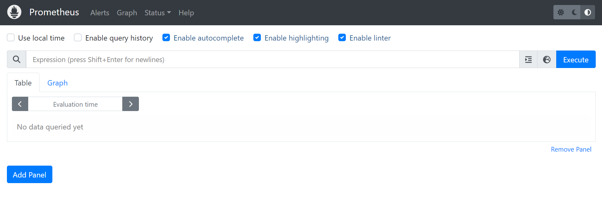
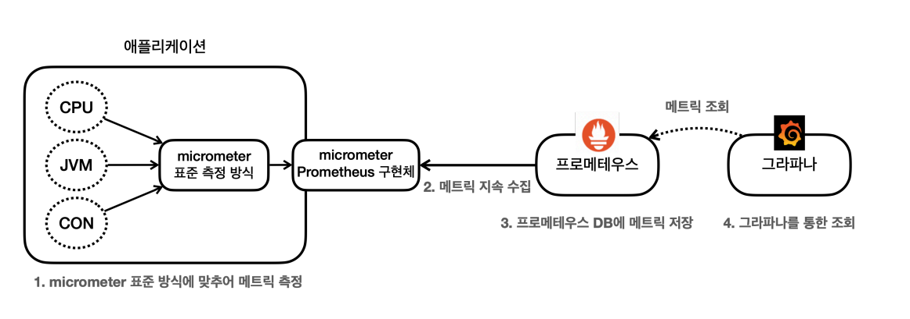
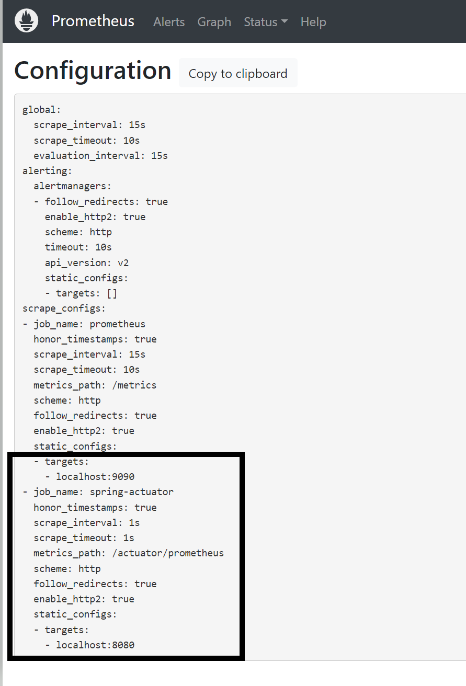
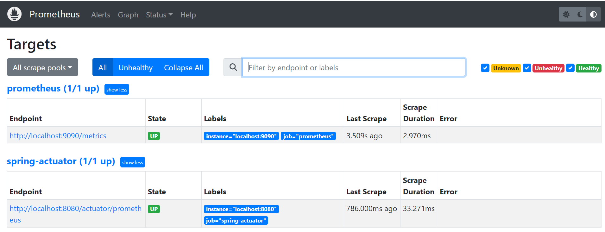
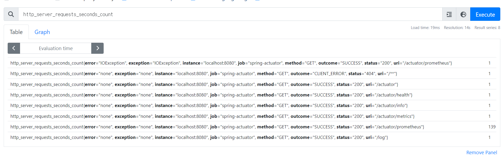
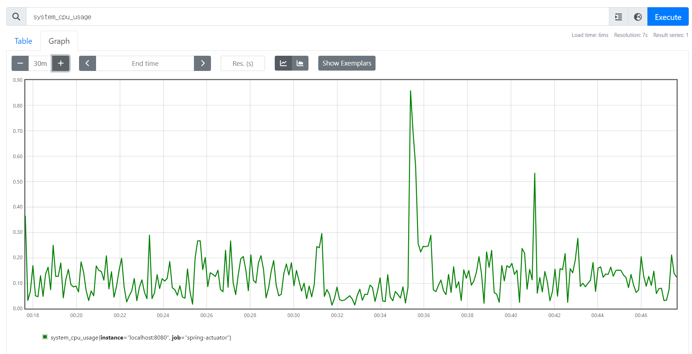
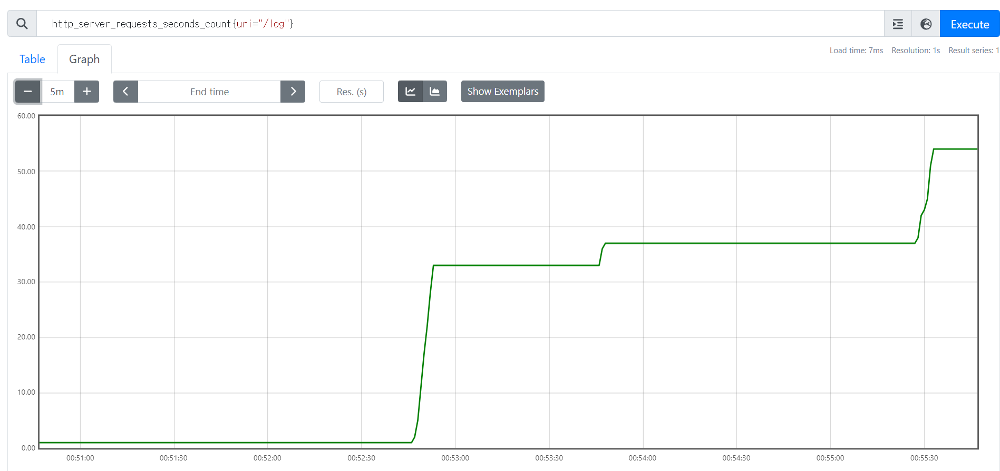
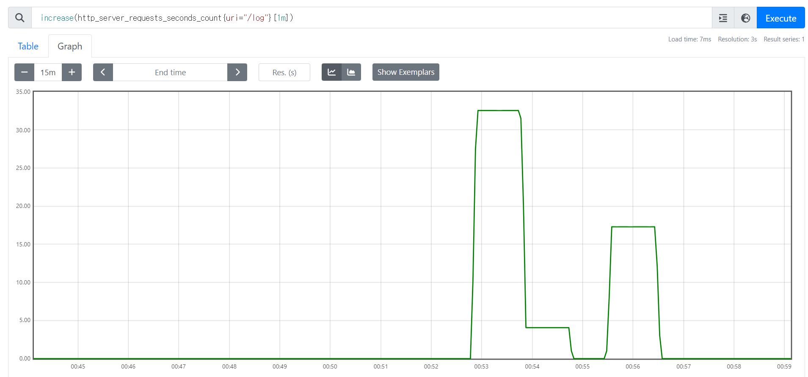

# 프로메테우스

- [프로메테우스 설치](https://prometheus.io/download/)
- `prometheus.exe` 실행
- `localhost:9090` 실행



## 애플리케이션 설정

프로메테우스는 메트릭을 수집하고 보관하는 DB이다. 프로메테우스가 애플리케이션의 메트릭을 수집하도록 연동해야한다.<br>
2가지 작업이 필요하다.
1. **애플리케이션 설정** : 프로메테우스가 애플리케이션의 메트릭을 가져갈 수 있도록 애플리케이션에서 프로메테우스 포맷에 맞추어 메트릭 만들기
2. **프로메테우스 설정** : 프로메테우스가 애플리케이션의 메트릭을 주기적으로 수집하도록 설정

### 애플리케이션 설정
프로메테우스가 애플리케이션의 메트릭을 가져가려면 프로메테우스가 사용하는 포맷에 맞추어 메트릭을 만들어야 한다.<br>
프로메테우스는 `/actuator/metrics`에서 본 포맷(`JSON`)은 이해하지 못한다.<br>
하지만 마이크로미터가 이런 부분을 모두 해결해준다.



각각의 메트릭들은 내부에서 마이크로미터 표준 방식으로 측정되고 있다. 따라서 어떤 구현체를 사용할지 지정만 해주면 된다.

- `build.gradle` 추가
```groovy
implementation 'io.micrometer:micrometer-registry-prometheus' //프로메테우스 추가
```
- 마이크로미터 프로메테우스 구현 라이브러리를 추가했다.
- 이렇게 하면 스프링 부트와 액츄에이터가 자동으로 마이크로미터 프로메테우스 구현체를 등록해서 동작하도록 설정해준다.
- 액츄에이터에 프로메테우스 메트릭 수집 엔드포인트가 추가된다.
  - `/actuator/prometheus`

위 경로로 실행해보면 모든 메트릭이 프로메테우스 포맷으로 만들어 진 것을 볼 수 있다.

**`/metrics`, `/prometheus` 포맷 차이**
- `jvm.info` -> `jvm_info` : 프로메테우스는 `.`대신에 `_`포맷을 사용한다.
- `logback.events` -> `logback_events_total` 
  - 로그수 처럼 지속해서 숫자가 증가하는 메트릭을 `카운터`라 한다.
  - 프로메테우스는 카운터 메트릭의 마지막에는 관례상 `_total`을 붙인다.
  - 참고로 CPU 사용량 같은 줄었다가 늘었다가 하는 것은 `게이지`라 한다.
- `http.server.requests` : 이 메트릭은 내부에 요청수, 시간 합, 최대 시간 정보를 가지고 있었다. 프로메테우스에서는 3가지로 분리된다.
  - `http_server_requests_seconds_count` : 요청 수
  - `http_server_requests_seconds_sum` : 시간 합(요청수의 시간을 합한다.)
  - `http_server_requests_seconds_max` : 최대 시간(가장 오래걸린 요청 시간)

### 프로메테우스 설정

프로메테우스가 애플리케이션의 `/actuator/prometheus`를 호출해서 메트릭을 주기적으로 수집하도록 설정해보자.

먼저 프로메테우스 폴더에 `prometheus.yml`파일을 수정해야 한다.

```yaml
global:
  scrape_interval: 15s 
  evaluation_interval: 15s

alerting:
  alertmanagers:
    - static_configs:
        - targets:

rule_files:

scrape_configs:
  - job_name: "prometheus"

    static_configs:
      - targets: ["localhost:9090"]
        
      #추가
  - job_name: "spring-actuator"
    metrics_path: '/actuator/prometheus'
    scrape_interval: 1s
    static_configs:
      - targets: [ 'localhost:8080' ]
```
- `job_name` : 수집하는 이름, 원하는 대로 지정하면 된다.
- `metrics-path` : 수집할 경로 지정
- `scrape_interval` : 수집할 주기(수집 주기가 너무 짧으면 애플리케이션 성능에 영향을 줄 수 있음, `10s ~ 1m` 정도 권장)
- `targets` : 수집할 서버의 `IP, PORT` 지정

이렇게 설정하면 프로메테우스는 `localhost:8080/actuator/prometheus` 경로를 1초에 한 번씩 호출해서 애플리케이션의 메트릭들을 수집한다.

**프로메테우스 연동 확인**
- `localhost:9090/config`에 `prometheus.yml`에서 입력한 부분이 포함되어 있어야 한다.



- `localhost:9090/targets`에 연동이 잘 되었는지 확인한다.



- `prometheus` : 프로메테우스 자체에서 제공하는 메트릭 정보(프로메테우스가 자신의 메트릭을 확인하는 것이다.)
- `spring-actuator` : 연동한 애플리케이션의 메트릭 정보
- `State`가 `UP`으로 되어 있으면 정상이고, `DOWN`으로 되어 있으면 연동이 안된 것이다.

## 프로메테우스 기본 기능

검색창에 `http_server_requests_seconds_count`를 검색해보았다.



- 태그와 레이블 : `error`, `exception`, `instance`, `job`, `method`, `outcome`, `status`, `uri`는 각각의 메트릭 정보를 구분해서 사용하기 위한 태그이다.
  - 마이크로미터에서는 `태그(Tag)`라고 하고, 프로메테우스에서는 `레이블(Label)`이라 한다.
- 맨 오른쪽 끝에 숫자는 해당 메트릭의 값이다.
- `Table` -> `Evaluation time`으로 과거 시간을 조회할 수 있다.
- `Graph`로 메트릭을 그래프로 조회할 수 있다.

### 필터

레이블을 기준으로 중괄호(`{}`)를 사용해 필터를 사용할 수 있다.
- `=`, `!=` : 문자열 비교
- `=~`, `!~` : 문자열과 정규식 비교

**예시**
- `uri=/log`, `method=GET` 조건 필터 : `http_server_requests_seconds_count{uri="/log", method="GET"}`
- `/actuator/prometheus`는 제외 조건 필터 : `http_server_requests_seconds_count{uri!="/actuator/prometheus"}`
- `method`가 `GET`, `POST`인 경우 포함 필터 : `http_server_requests_seconds_count{method=~"GET|POST"}`
- `/actuator`로 시작하는 `uri`는 제외 조건 필터 : `http_server_requests_seconds_count{uri!~"/actuator.*"}`

### 연산자

**sum**
- `sum(http_server_requests_seconds_count)`
- 값의 합계를 구한다.

**sum by**
- `sum by(method, status)(http_server_requests_seconds_count)`
- `method`와 `status`로 그룹핑된 결과를 볼 수 있다.
- SQL의 `group by`와 유사하다.

**count**
- `count(http_server_requests_seconds_count)`
- 메트릭 자체의 수 카운트

**topk**
- `topk(3, http_server_requests_seconds_count)`
- 상위 3개 메트릭 조회

**오프셋**
- `http_server_requests_seconds_count offset 10m`
- 현재를 기준으로 특정 과거 시점의 데이터를 보여준다.

**범위 벡터 선택기**
- `http_server_requests_seconds_count[1m]`
- 마지막에 `[1m]`, `[60s]`와 같이 표현, 지난 1분간의 모든 기록값을 선택한다.
- **범위 벡터 선택기는 차트에 바로 표현할 수 없다.** 데이터로는 확인할 수 있다.
- 차트에 표현하려면 약간의 작업이 필요하다.

## 게이지와 카운터

메트릭은 크게 `게이지`와 `카운터`라는 2가지로 분류할 수 있다.

**게이지(Gauge)**
- 임의로 오르내릴 수 있는 값
- CPU 사용량, 메모리 사용량, 사용중인 커넥션 등

**카운터(Counter)**
- 단순하게 증가하는 단일 누적 값
- HTTP 요청 수, 로그 발생 수 등

### 게이지

게이지는 오르고 내리고 하는 값이다. 현재 상태를 그대로 출력하면 된다.



- 대표적인 게이지인 CPU 사용량을 조회했다.(`system_cpu_usage`)
- CPU 사용량의 현재 상태를 계속 측정하고 그 값을 그대로 그래프에 출력하면 과거부터 지금까지의 CPU 사용량을 확인할 수 있다.
- 게이지는 가장 단순하고 사용하기 쉬운 메트릭이다. 있는 그대로를 사용하면 된다.

### 카운터

카운터는 단순하게 증가하는 단일 누적 값이다.



- HTTP 요청 메트릭을 그래프로 조회했다.
- 카운터는 계속 누적해서 증가하는 값이기 때문에 계속 증가하는 그래프만 보게된다.
- 이렇게 증가만 하는 그래프는 특정 시간에 얼마나 고객의 요청이 들어왔는지 확인하기가 어렵다.
- 그래서 `increase()`, `rate()` 함수를 사용해야 한다.

**increase()**
- 지정한 시간 단위별로 증가를 확인할 수 있다.
- 마지막에 `[시간]` 범위 벡터를 선택해야 한다.



- 1분당 고객 요청수를 조회했다.
- 분당 얼마나 고객의 요청이 어느정도 증가했는지 한눈에 파악할 수 있다.

**rate()**
- 범위 벡터에서 초당 평균 증가율을 계산한다.
- `increase()`가 숫자를 직접 카운트 한다면, `rate()`는 여기에 초당 평균을 나누어서 계산한다.
- `rate(...[1m])`에서 60초가 기준이 되므로 60을 나눈 수이다.
- **초당 얼마나 증가하는지 나타내는 지표로 보면 된다.**

**irate()**
- `rate()`와 유사한데 범위 벡터에서 초당 순간 증가율을 계산한다.
- 급격하게 증가한 내용을 확인하기 좋다.

<br>

> **프로메테우스의 단점은 한눈에 들어오는 대시보드를 만들기 어렵다는 점이다. 이 부분은 `그라파나`를 사용하면 된다.**