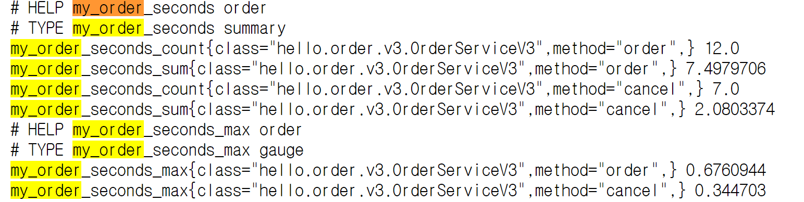
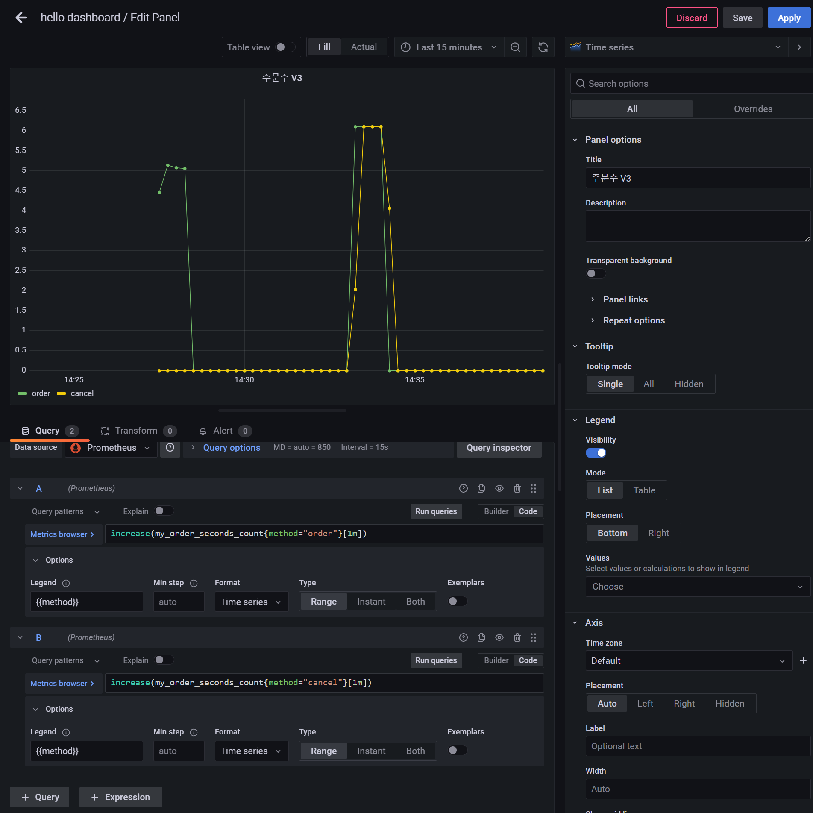
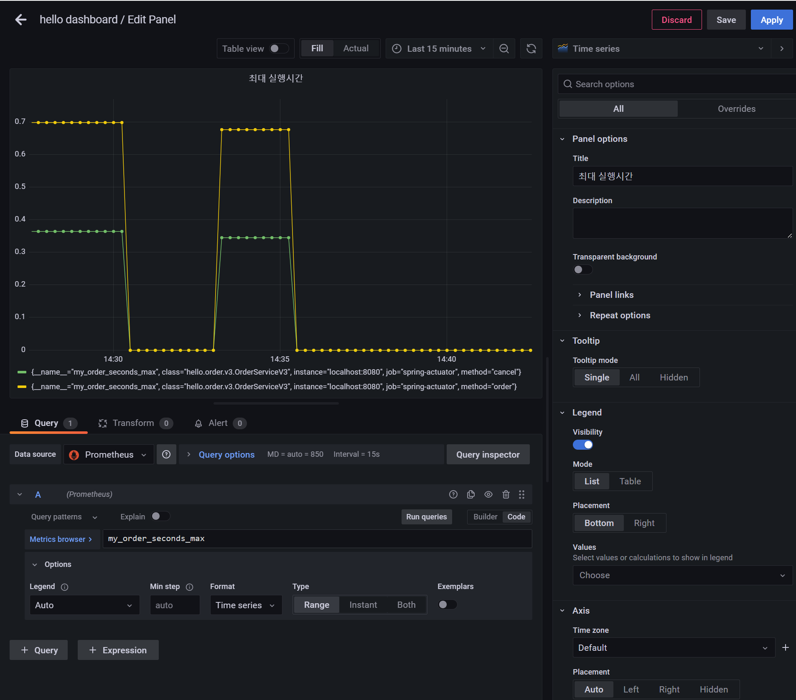
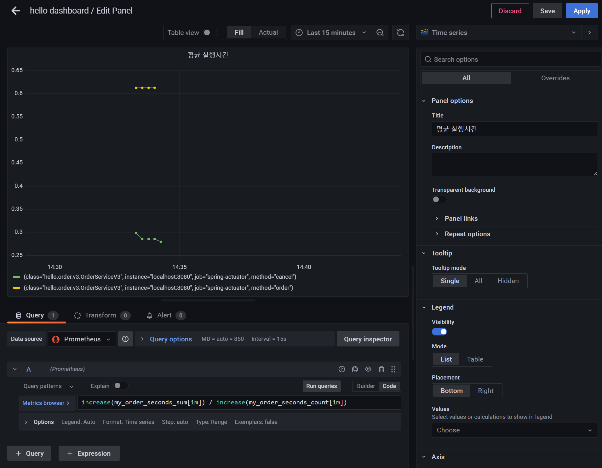

# 메트릭 등록 - 타이머

**MeterRegistry**
- 마이크로미터 기능을 제공하는 핵심 컴토넌트
- 스프링을 통해서 주입 받아서 사용하고 이곳을 통해서 카운터, 게이지 등을 등록한다.

**Timer**
- `Timer`는 조금 특별한 메트릭 측정 도구인데, 시간을 측정하는데 사용된다.
- 카운터와 유사한데 `Timer`를 사용하면 실행 시간도 함께 측정할 수 있다.
- `Timer`는 다음 내용을 한번에 측정해준다.
  - `seconds_count` : 누적 실행 수(`카운터`)
  - `seconds_sum` : 실행 시간의 합(`sum`)
  - `seconds_max` : 최대 실행 시간(가장 오래걸린 실행 시간)(`게이지`)
    - 내부에 타임 윈도우라는 개념이 있어서 1~3분마다 최대 실행 시간이 다시 계산된다.

## 타이머 - V1

```java
import io.micrometer.core.instrument.MeterRegistry;
import io.micrometer.core.instrument.Timer;
..

@Slf4j
@RequiredArgsConstructor
public class OrderServiceV3 implements OrderService {

    private final MeterRegistry registry;
    private AtomicInteger stock = new AtomicInteger(100);

    @Override
    public void order() {
        Timer timer = Timer.builder("my.order")
                            .tag("class", this.getClass().getName())
                            .tag("method", "order")
                            .description("order")
                            .register(registry);

        timer.record(()->{
            log.info("주문");
            stock.decrementAndGet();
            sleep(500);//최대 0.2초 추가 대기
        });
    }

    @Override
    public void cancel() {
        Timer timer = Timer.builder("my.order")
                            .tag("class", this.getClass().getName())
                            .tag("method", "cancel")
                            .description("order")
                            .register(registry);

        timer.record(()->{
            log.info("취소");
            stock.incrementAntGet();
            sleep(200);//최대 0.2초 추가 대기
        });
    }

    @Override
    public AtomicInteger getStock() {
        return stock;
    }

    private void sleep(int time) {
        try {
            Thread.sleep(time + new Random().nextInt(200));
        } catch (InterruptedException e) {
            throw new RuntimeException(e);
        }
    }
}
```
- `Timer.builder(name)` : 타이머를 생성한다. `name`에 메트릭 이름을 지정한다.
- `tag` : 프로메테우스에서 필터할 수 있는 레이블로 사용된다.
- 주문과 취소는 메트릭 이름은 같고 `tag`를 통해서 구분한다.
- `register(meterRegistry)` : 만든 타이머를 `MeterRegistry`에 등록한다. 이렇게 등록해야 실제 등록한다.
- 타이머를 사용할 때는 `timer.record()` 안에 시간을 측정할 내용을 함수로 포함하면 된다.

```java
@Configuration
public class OrderConfigV3 {
    @Bean
    public OrderService orderService(MeterRegistry registry) {
        return new OrderServiceV3(registry);
    }
}
```
```java
@SpringBootApplication(scanBasePackages = "hello.controller")
@Import(OrderConfigV3.class)
public class ActuatorApplication {
    
    public static void main(String[] args) {
        SpringApplication.run(ActuatorApplication.class, args);
    }
}
```

- 이제 `/order`, `/cancel`을 한 번씩 실행하고 메트릭을 확인해보면 `my.order`라는 이름으로 메트릭이 등록이 된다.
  - 최소 한 번은 호출해야 메트릭이 등록 된다.

```json
// 20240224142735
// http://localhost:8080/actuator/metrics/my.order

{
  "name": "my.order",
  "description": "order",
  "baseUnit": "seconds",
  "measurements": [
    {
      "statistic": "COUNT",
      "value": 7.0
    },
    {
      "statistic": "TOTAL_TIME",
      "value": 4.1808162
    },
    {
      "statistic": "MAX",
      "value": 0.6989487
    }
  ],
  "availableTags": [
    {
      "tag": "method",
      "values": [
        "cancel",
        "order"
      ]
    },
    {
      "tag": "class",
      "values": [
        "hello.order.v3.OrderServiceV3"
      ]
    }
  ]
}
```
- 타이머를 사용하면 3가지 측정 항목이 생긴다.
- `measurements`
  - `COUNT` : 누적 실행 수(카운터와 같다.)
  - `TOTAL_TIME` : 실행 시간의 합(각각의 실행 시간의 누적 합)
  - `MAX` : 최대 실행 시간(가장 오래 걸린 실행시간)



- 프로메테우스로 다음 접두사가 붙으면서 3가지 메트릭을 제공한다.
- `seconds_count` : 누적 실행 수
- `seconds_sum` : 실행 시간의 합
- `seconds_max` : 최대 실행 시간(가장 오래걸린 실행 시간), 프로메테우스의 `gauge`
  - 내부에 타임 윈도우라는 개념이 있어서 1~3분 마다 최대 실행 시간이 다시 계산된다.
- 여기서 평균 실행 시간도 계산할 수 있다.
  - `seconds_sum` / `seconds_count` = 평균 실행시간

### 그라파나 등록



- 카운터는 계속 증가하기 때문에 특정 시간에 얼마나 증가했는지 확인하기 위해서는 `increase()`, `rate()` 같은 함수와 함께 사용하는 것이 좋다.





## 타이머 - V2

타이머는 `@Timer` 어노테이션을 통해 AOP를 적용할 수 있다.

```java
import io.micrometer.core.annotation.Timed;
..

@Timed("my.order")
@Slf4j
public class OrderServiceV4 implements OrderService {

    private final AtomicInteger stock = new AtomicInteger(100);

    @Override
    public void order() {
        log.info("주문");
        stock.decrementAndGet();
        sleep(500);
    }

    @Override
    public void cancel() {
        log.info("취소");
        stock.incrementAndGet();
        sleep(200);
    }

    @Override
    public AtomicInteger getStock() {
        return stock;
    }

    private void sleep(int time) {
        try {
            Thread.sleep(time + new Random().nextInt(200));
        } catch (InterruptedException e) {
            throw new RuntimeException(e);
        }
    }
}
```
- `@Timed` 어노테이션은 타입이나 메서드에 적용할 수 있다.
  - 타입에 적용하면 해당 타입의 모든 `public` 메서드에 타이머가 적용된다.

```java
@Configuration
public class OrderConfigV4 {

    @Bean
    public OrderService orderService() {
        return new OrderServiceV4();
    }

    @Bean
    public TimedAspect timedAspect(MeterRegistry registry) {
        return new TimedAspect(registry);
    }
}
```
- **`TimedAspect`를 빈으로 등록해야 `@Timed` 관련 AOP가 적용된다.**

```java
@SpringBootApplication(scanBasePackages = "hello.controller")
@Import(OrderConfigV4.class)
public class ActuatorApplication {

    public static void main(String[] args) {
        SpringApplication.run(ActuatorApplication.class, args);
    }
}
```

```json
// 20240224145622
// http://localhost:8080/actuator/metrics/my.order

{
  "name": "my.order",
  "baseUnit": "seconds",
  "measurements": [
    {
      "statistic": "COUNT",
      "value": 5.0
    },
    {
      "statistic": "TOTAL_TIME",
      "value": 2.5645086
    },
    {
      "statistic": "MAX",
      "value": 0.6797469
    }
  ],
  "availableTags": [
    {
      "tag": "exception",
      "values": [
        "none"
      ]
    },
    {
      "tag": "method",
      "values": [
        "cancel",
        "order"
      ]
    },
    {
      "tag": "class",
      "values": [
        "hello.order.v4.OrderServiceV4"
      ]
    }
  ]
}
```
- 메트릭을 확인해보면 `tag`에 `exception`만 추가됐고 나머지는 V1에서 했던 것과 동일하다.
- 생성되는 프로메테우스 포맷도 V1과 같다.