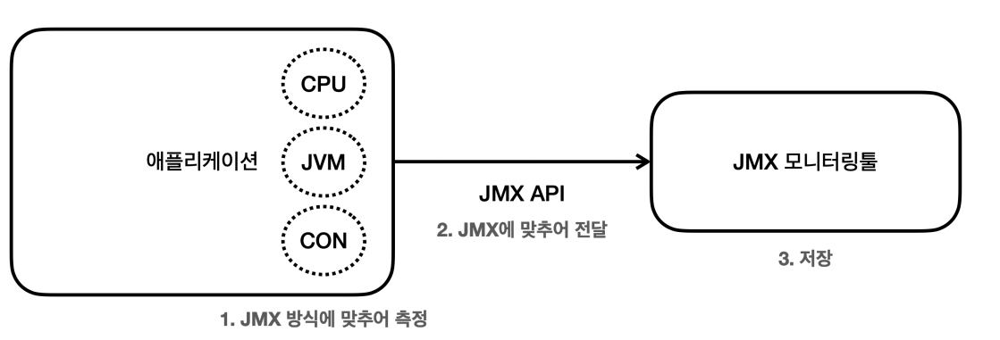
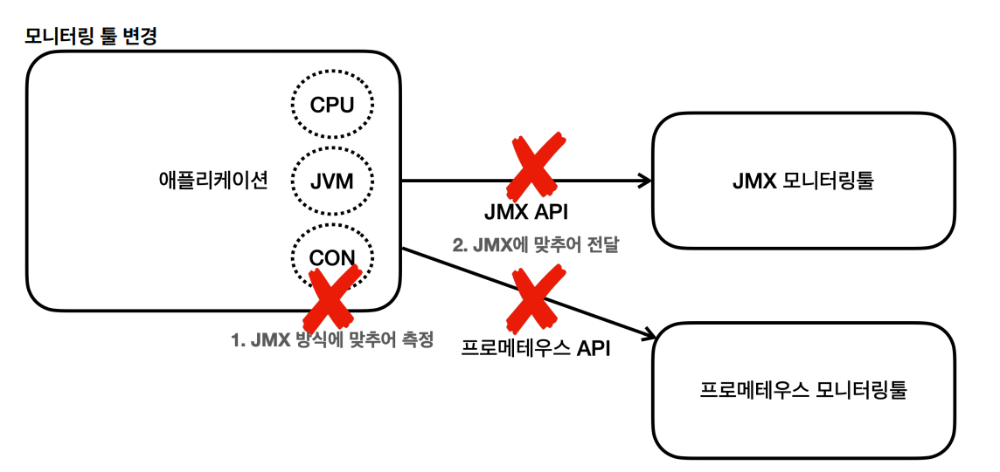
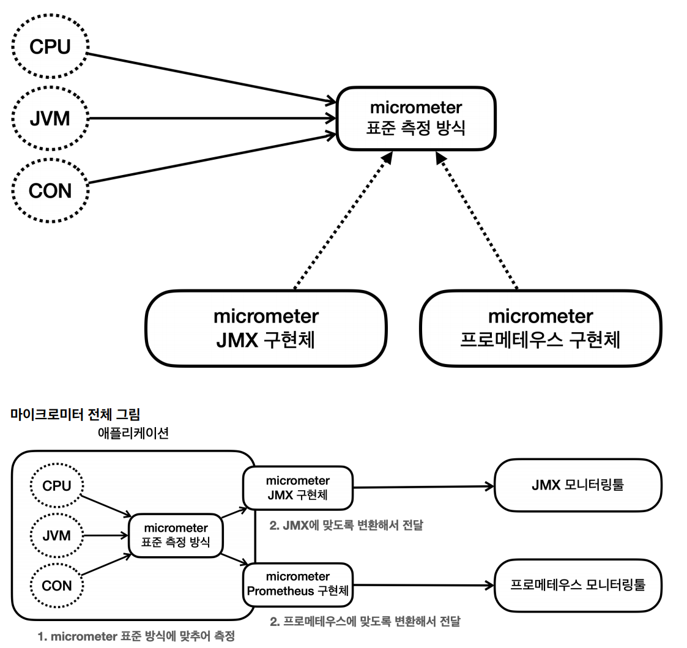
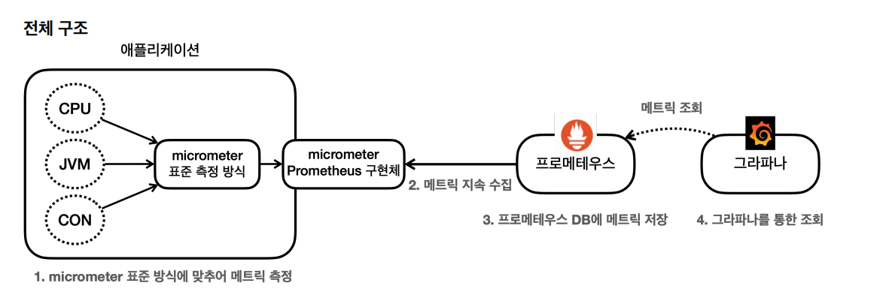
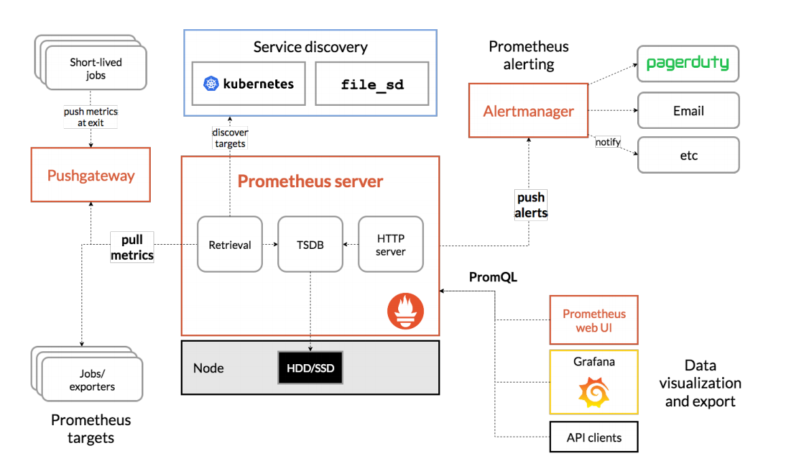

# 마이크로미터

서비스를 운영할 때는 애플리케이션의 CPU, 메모리, 커넥션 사용, 고객 요청 수 같은 수 많은 지표들을 확인하는 것이 필요하다. 그래야 어디에 어떤 
문제가 발생했는지 사전에 대응도 할 수 있고 문제가 발생해도 원인을 빠르게 파악해서 대처할 수 있다.

수 많은 모니터링 툴이 있고 시스템의 다양한 정보를 이 모니터링 툴에 전달해서 사용하게 된다.

이런 모니터링 툴이 작동하려면 시스템의 다양한 지표들을 각각의 모니터링 툴에 맞도록 만들어서 보내주어야 한다.



- 예들 들어 CPU, JVM, 커넥션 정보 등을 JMX 툴에 전달한다고 하면 각각의 정보를 JMX 모니터링 툴이 정한 포맷에 맞추어 측정하고 전달해야 한다.

**그런데 중간에 사용하는 모니터링 툴을 변경하면 어떻게 될까?**



- 기존에 측정했던 코드를 모두 변경한 툴에 맞도록 다시 변경해야 한다.
- 개발자 입장에서는 단순히 툴 하나를 변경했을 뿐인데 측정하는 코드까지 모두 변경해야 하는 문제가 발생한다.

**이런 문제를 해결하는 것이 마이크로미터라는 라이브러리다.**



- 마이크로미터는 애플리케이션 메트릭 퍼사드(Facade)라고 불리는데, 애플리케이션의 메트릭(측정 지표)을 마이크로미터가 정한 표준 방법으로 모아서 제공해준다.
- 마이크로미터가 추상화를 통해서 구현체를 쉽게 갈아끼울수 있도록 해 둔 것이다.

## 메트릭 확인하기

CPU, JVM, 커넥션 사용 등 수 많은 지표들을 어떻게 수집해야 할까?<br>
개발자가 각각의 지표를 직접 수집해서 그것을 마이크로미터가 제공하는 표준 방법에 따라 등록하면 된다.

다행히 마이크로미터는 다양한 지표 수집 기능을 이미 만들어서 제공한다. 그리고 **스프링 부트 액츄에이터는 마이크로미터가 제공하는 지표 수집을
`@AutoConfiguration`을 통해 자동으로 등록해준다.**

스프링 부트 액츄에이터를 사용하면 수 많은 메트릭(지표)을 편리하게 사용할 수 있는 것이다.

`mertics` 엔드포인트를 사용하면 기본으로 제공되는 메트릭들을 확인할 수 있다.
- `localhost:8080/actuator/metrics`

실행하면 정말 수 많은 기본 메트릭들이 나온다. 패턴을 사용해서 더 자세히 확인할 수 있다.
- `localhost:8080/actuator/metrics/{name}`
- 예) `localhost:8080/actuator/metrics/jvm.memory.used` : JVM 메모리 사용량을 조회한다.

```json
// 20240223195018
// http://localhost:8080/actuator/metrics/jvm.memory.used

{
  "name": "jvm.memory.used",
  "description": "The amount of used memory",
  "baseUnit": "bytes",
  "measurements": [
    {
      "statistic": "VALUE",
      "value": 121461216
    }
  ],
  "availableTags": [
    {
      "tag": "area",
      "values": [
        "heap",
        "nonheap"
      ]
    },
    {
      "tag": "id",
      "values": [
        "G1 Survivor Space",
        "Compressed Class Space",
        "Metaspace",
        "CodeCache",
        "G1 Old Gen",
        "G1 Eden Space"
      ]
    }
  ]
}
```

**Tag 필터**
- `availableTags`를 보면 항목들이 있다.
  - `tag`: area, values
  - `tag`: id, values

해당 Tag를 기반으로 정보를 필터링해서 확인할 수 있다.<br>
`tag=key:value` 형식을 사용하면 된다.

- `http://localhost:8080/actuator/metrics/jvm.memory.used?tag=area:heap`
- `http://localhost:8080/actuator/metrics/jvm.memory.used?tag=area:nonheap`

`tag`를 사용해서 힙 메모리, 힙이 아닌 메모리로 분류해서 데이터를 확인할 수 있다.

## 다양한 메트릭

### JVM 메트릭
`jvm.`으로 시작한다.
- 메모리 및 버퍼 풀 세부 정보
- 가비지 수집 관련 통계
- 쓰레드 활용
- 로드 및 언로드된 클래스 수
- JVM 버전 정보
- JIT 컴파일 시간

### 시스템 메트릭
`system.`, `process.`, `disk.`으로 시작한다.
- CPU 지표
- 파일 디스크립터 메트릭
- 가동 시간 메트릭
- 사용 가능한 디스크 공간

### 애플리케이션 시작 메트릭
- `application.started.time` : 애플리케이션을 시작하는 데 걸리는 시간
  - `ApplicationStartedEvent`로 측정
- `application.ready.time` : 애플리케이션이 요청을 처리할 준비가 되는데 걸리는 시간
  - `ApplicationReadyEvent`로 측정

### 스프링 MVC 메트릭
`http.server.requests`

여러 `tag`들이 있다.
- `uri` : 요청 URI
- `method` : HTTP 메서드
- `status` : HTTP Status 코드
- `exception` : 예외
- `outcome` : 상태코드를 그룹으로 모아서 확인

### 데이터소스 매트릭
`jdbc.connections.`으로 시작한다.

- `DataSource`, 커넥션 풀에 관한 메트릭을 확인할 수 있다.
- 최대, 최소, 활동, 대기 커넥션 수 등을 확인할 수 있다.
- 히카리 커넥션 풀을 사용하면 `hikaricp.`로 확인하면 된다.

### 로그 메트릭
`logback.events`

- 각각의 로그 레벨에 따른 로그 수를 확인할 수 있다.
- 예를 들어 `error` 로그 수가 급격히 증가한다면 위험한 상황으로 인지할 수 있다.

### 톰캣 매트릭
`tomcat.`으로 시작한다.

- 톰캣 매트릭을 모두 사용하려면 옵션을 켜야 한다.
  - 옵션을 켜지 않으면 `tomcat.session.` 관련 정보만 노출된다.
```yaml
server:
  tomcat:
    mbeanregistry:
      enabled: true
```
- 톰캣의 최대 쓰레드, 사용 쓰레드 수 등 다양한 메트릭을 확인할 수 있다.
- **`tomcat.threads.busy`, `tomcat.threads.config.max` 굉장히 유용하다.**

> [다양한 메트릭 공식 매뉴얼](https://docs.spring.io/spring-boot/docs/current/reference/html/actuator.html#actuator.metrics.supported)

**이러한 메트릭들을 어딘가에 지속해서 보관해야 과거의 데이터들도 확인할 수 있을 것이다. 메트릭을 지속적으로 수집하고 보관할 데이터베이스가 필요하다.**

## 프로메테우스와 그라파나

### 프로메테우스
애플리케이션에서 발생한 메트릭을 그 순간만 확인하는 것이 아니라 과거 이력까지 함께 확인하려면 메트릭을 보관하는 DB가 필요하다. <br>
이렇게 하려면 메트릭을 지속해서 수집하고 DB에 저장해야 한다. 프로메테우스가 이런 역할을 담당한다.

### 그라파나
프로메테우스가 DB라고 하면, 이 DB에 있는 데이터를 불러서 사용자가 보기 편하게 보여주는 대시보드가 필요하다.<br>
그라파나는 데이터를 그래프로 보여주는 툴이다. 수 많은 그래프를 제공하고 프로메테우스를 포함한 다양한 데이터소스를 지원한다.



1. 스프링 부트 액츄에이터와 마이크로미터를 사용하면 수 많은 메트릭을 자동으로 생성한다.
   - 마이크로미터 프로메테우스 구현체는 프로메테우스가 읽을 수 있는 포맷으로 메트릭을 생성한다.
2. 프로메테우스는 이렇게 만들어진 메트릭을 지속해서 수집한다.
3. 프로메테우스는 수집한 메트릭을 내부 DB에 저장한다.
4. 사용자는 그라파나 대시보드 툴을 통해 그래프로 편리하게 메트릭을 조회한다. 이때 필요한 데이터는 프로메테우스를 통해서 조회한다.

**프로메테우스 아키텍처**


### [프로메테우스]()
### [그라파나]()