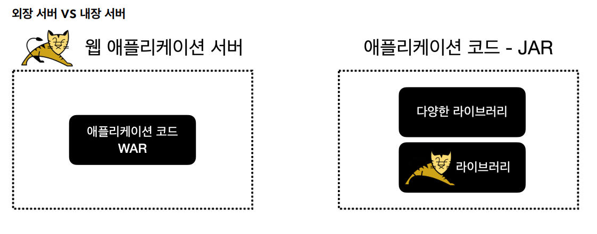
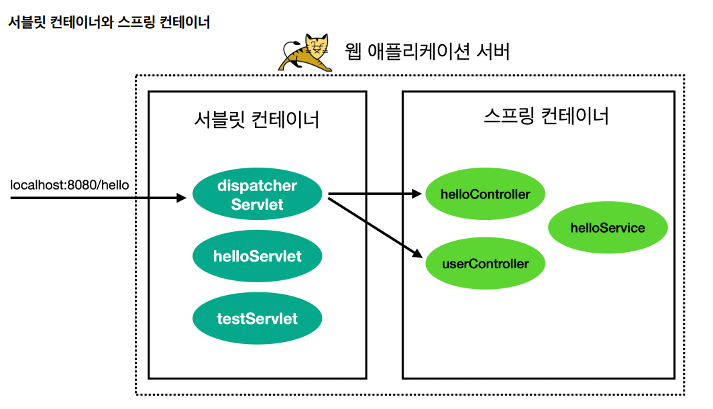
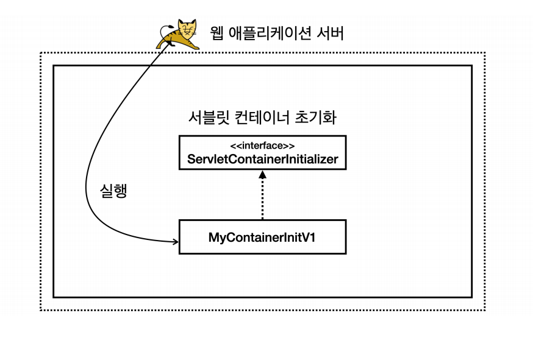
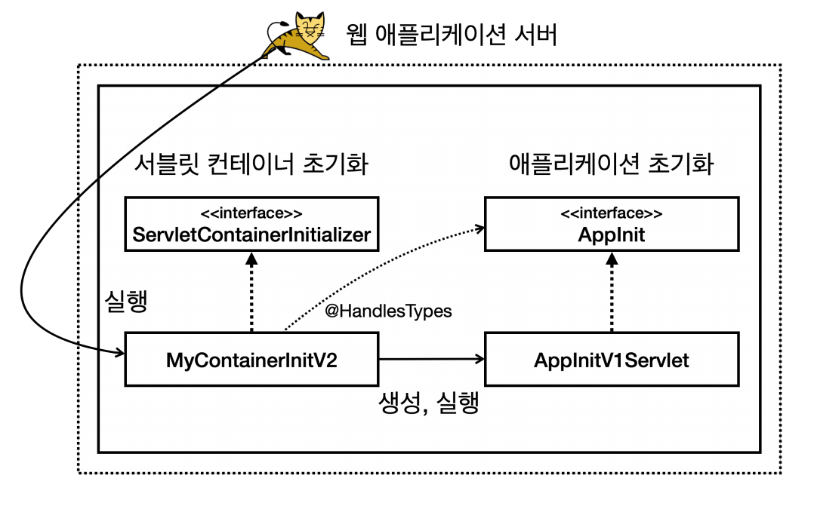
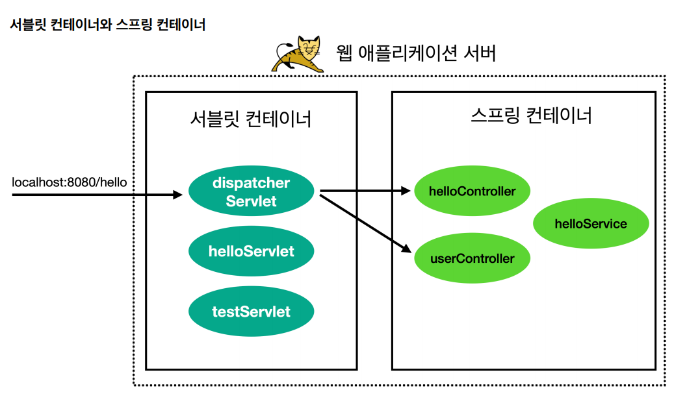
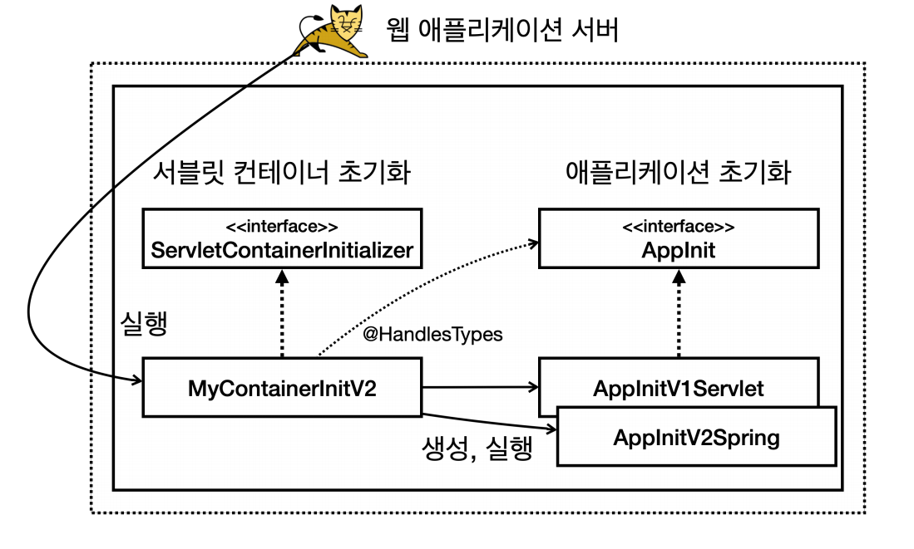
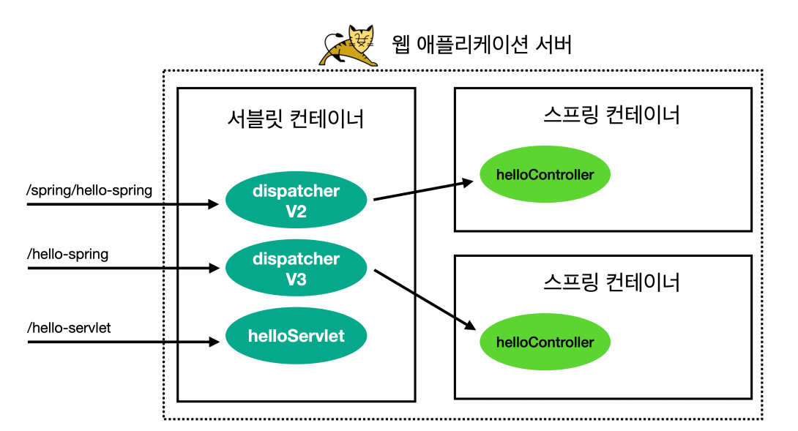
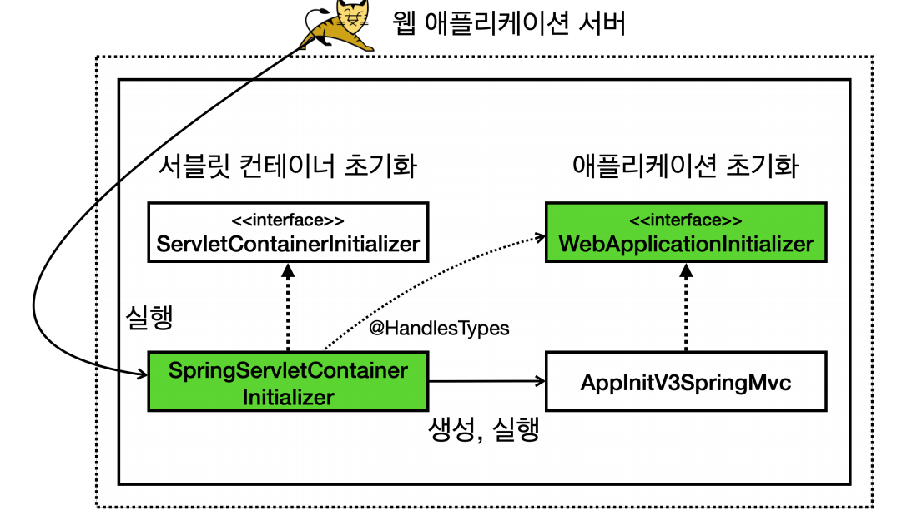

# 웹 서버와 서블릿 컨테이너

## 웹 서버와 스프링 부트



- **과거**
  - 과거에 자바로 웹 애플리케이션을 개발할 때는 먼저 서버에 톰캣 같은 WAS를 설치했다.
  - 그리고 WAS에서 동작하도록 서블릿 스펙에 맞추어 코드를 작성하고 WAR 형식으로 빌드해서 `war` 파일을 만들었다.
  - 이렇게 만들어진 `war` 파일을 WAS에 전달해서 배포하는 방식이다.
- **최근**
  - 최근에는 스프링 부트가 내장 톰캣을 포함하고 있다. 애플리케이션 코드 안에 톰캣 같은 WAS가 라이브러리로 내장되어 있다.
  - 코드를 작성하고 JAR로 빌드한 다음에 해당 JAR를 원하는 위치에서 실행하기만 하면 WAS도 함께 실행된다.
  - 개발자는 `main()`메서드만 실행하면 되고, WAS 설치나 IDE 같은 개발 환경에서 WAS와 연동하는 복잡한 일을 할 필요가 없다.

**톰캣 설치, WAR 빌드, 서블릿 컨테이너 설정, 스프링 컨테이너 등록 등 스프링 부트 없이 한번 개발해보자.**

## 프로젝트 설정

- build.gradle
```properties
plugins {
    id 'java'
    id 'war'
}

group = 'hello'
version = '0.0.1-SNAPSHOT'
sourceCompatibility = '17'

repositories {
    mavenCentral()
}

dependencies {
    //서블릿
    implementation 'jakarta.servlet:jakarta.servlet-api:6.0.0'
}

tasks.named('test') {
    useJUnitPlatform()
}
```
- `id 'war'` : 톰캣 같은 WAS 위에서 동작하는 WAR 파일을 만들어주는 플러그인
- `jakarta.servlet-api` : 서블릿을 사용할 때 필요한 라이브러리

<br>

- `src/main/webapp/index.html`
```html
<html>
<body>index html</body>
</html>
```

- 서블릿 등록
```java
@WebServlet(urlPatterns = "/test")
public class TestServlet extends HttpServlet {
    @Override
    protected void service(HttpServletRequest req, HttpServletResponse resp) throws ServletException, IOException {
        System.out.println("TestServlet.service");
        resp.getWriter().println("test");
    }
}
```
`http://localhost:8080/test` 로 요청이 오면 이 서블릿이 실행된다.

**이제 이 서블릿을 실행하려면 톰캣 같은 웹 애플리케이션 서버(WAS)에 이 코드를 배포해야 한다.**

## WAR 빌드와 배포

**프로젝트 빌드**
- `./gradlew build`
- WAR 파일 생성
  - `build/libs/Xxx-0.0.1-SNAPSHOT.war`

**war 파일의 압축을 풀어보자.**
- `build/libs` 이동
- `jar -xvf Xxx-0.0.1-SNAPSHOT.war` 명령어 실행

**war 파일 압축 푼 결과**
- `WEB-INF`
  - classes 
  - lib
- index.html

**JAR, WAR란?**

**JAR**<br>
자바는 여러 클래스와 리소스를 묶어서 `JAR`(Java Archive)라는 압축 파일을 만들 수 있다.<br>
이 파일은 JVM 위에서 직접 실행되거나 또는 다른 곳에서 사용하는 라이브러리로 제공된다. 직접 실행하는 경우 `main()`메서드가 필요하고 `MANIFEST.MF`파일에
실행할 메인 메서드가 있는 클래스를 지정해 두어야 한다.

`JAR`는 클래스와 관련 리소스를 압축한 단순한 파일이다. 필요한 경우 이 파일을 직접 실행할 수도 있고, 다른 곳에서 라이브러리로 사용할 수도 있다.

**WAR**<br>
`WAR(Web Application Archive)`라는 이름 그대로 웹 애플리케이션 서버(WAS)에 배포할 때 사용하는 파일이다.<br>
`JAR`파일이 JVM 위에서 실행된다면 `WAR`는 WAS 위에서 실행된다.<br>
WAS 위에서 실행되고, HTML 같은 정적 리소스나 클래스 파일을 모두 함께 포함하기 때문에 JAR와 비교해서 구조가 더 복잡하다.

그리고 WAR 구조를 지켜야 한다.
- `WEB-INF`
  - `classes` : 실행 클래스 모음
  - `lib` : 라이브러리 모음
  - `web.xml` : 웹 서버 배치 설정 파일(생략 가능)
- `index.html` : 정적 리소스
- `WEB-INF` 폴더 하위는 자바 클래스와 라이브러리, 그리고 설정 정보가 들어가는 곳이다.
- `WEB-INF`를 제외한 나머지 영역은 HTML, CSS 같은 정적 리소스가 사용되는 영역이다.

## 서블릿 컨테이너 초기화

- WAS를 실행하는 시점에 필요한 초기화 작업들이 있다.
  - 서비스에 필요한 필터와 서블릿 등록
  - 스프링을 사용한다면 스프링 컨테이너 생성
  - 서블릿과 스프링을 연결하는 디스패쳐 서블릿 등록
- WAS가 제공하는 초기화 기능을 사용하면 WAS 실행 시점에 이러한 초기화 과정을 진행할 수 있다.



서블릿은 `ServletContainerInitializer`라는 초기화 인터페이스를 제공한다. 이름 그대로 서블릿 컨테이너를 초기화 하는 기능을 제공한다.
```java
package jakarta.servlet;

public interface ServletContainerInitializer {
    public void onStartup(Set<Class<?>> c, ServletContext ctx) throws ServletException;
}
```
- 서블릿 컨테이너는 실행 시점에 초기화 메서드인 `onStartup()`을 호출해준다. 여기에 애플리케이션에 필요한 기능들을 초기화 하거나 등록할 수 있다.
- `Set<Class<?>> c` : 조금 더 유연한 초기화 기능을 제공한다. `@HandlesTypes` 어노테이션과 함께 사용한다.
- `ServletContext ctx` : 서블릿 컨테이너 자체의 기능을 제공한다. 이 객체를 통해 필터나 서블릿을 등록할 수 있다.

```java
public class MyContainerInitV1 implements ServletContainerInitializer {
    @Override
    public void onStartup(Set<Class<?>> c, ServletContext ctx) throws ServletException {
        System.out.println("MyContainerInitV1.onStartup");
        System.out.println("MyContainerInitV1 c = " + c);
        System.out.println("MyContainerInitV1 ctx = " + ctx);
    }
}
```

추가로 WAS에게 실행할 초기화 클래스를 알려주어야 한다.

- `src\main\resources\META-INF\services\jakarta.servlet.ServletContainerInitializer`
```text
hello.container.MyContainerInitV1
```
이렇게 하면 WAS를 실행할 때 해당 클래스를 초기화 클래스로 인식하고 로딩 시점에 실행한다.



**서블릿을 등록하는 방법에는 2가지가 있다.**
- `@WebServlet` 어노테이션
- 프로그래밍 방식

```java
public class HelloServlet extends HttpServlet {
    @Override
    protected void service(HttpServletRequest req, HttpServletResponse resp) throws  IOException {
        System.out.println("HelloServlet.service");
        resp.getWriter().println("hello servlet!");
    }
}
```

**서블릿 컨테이너는 조금 더 유연한 애플리케이션 초기화 기능을 지원한다.**

```java
public interface AppInit {
    void onStarter(ServletContext servletContext);
}
```
- 애플리케이션 초기화를 진행하기 위해 직접 만든 인터페이스다.
- 내용과 형식은 상관없고, 인터페이스는 꼭 필요하다.

```java
public class AppInitV1Servlet implements AppInit{
    @Override
    public void onStarter(ServletContext servletContext) {
        System.out.println("AppInitV1Servlet.onStarter");

        //순수 서블릿 코드 등록
        ServletRegistration.Dynamic helloServlet = 
                servletContext.addServlet("helloServlet", new HelloServlet());

        helloServlet.addMapping("/hello-servlet");
    }
}
```
- 프로그래밍 방식으로 `HelloServlet` 서블릿을 서블릿 컨테이너에 등록했다.

**여기서 애플리케이션 초기화(`AppInit`)는 어떻게 실행되는 것일까?**

```java
@HandlesTypes(AppInit.class)
public class MyContainerInitV2 implements ServletContainerInitializer {
    @Override
    public void onStartup(Set<Class<?>> c, ServletContext ctx) throws ServletException {
        System.out.println("MyContainerInitV2.onStartup");
        System.out.println("MyContainerInitV2 c = " + c);
        System.out.println("MyContainerInitV2 ctx = " + ctx);

        //class hello.container.AppInitV1Servlet
        for (Class<?> appInitClass : c) {
            try {
                //new AppInitV1Servlet()과 같은 코드
                AppInit appInit = (AppInit) appInitClass.getDeclaredConstructor().newInstance();
                appInit.onStarter(ctx);

            } catch (Exception e) {
                throw new RuntimeException(e);
            }
        }
    }
}
```
**애플리케이션 초기화 과정**
1. `@HandlesTypes` 어노테이션에 애플리케이션 초기화 인터페이스를 지정한다.
2. 서블릿 컨테이너 초기화(`ServletContainerInitializer`)는 파라미터로 넘어오는 `Set<Class<?>> c`에 애플리케이션 초기화 인터페이스의 구현체들을
    모두 찾아서 클래스 정보로 전달한다.
   - 참고로 객체 인스턴스가 아니라 클래스 정보를 전달하기 때문에 실행하려면 객체를 생성해서 사용해야 한다.
3. `appInitClass.getDeclaredConstructor().newInstance();` 
   - 리플렉션을 사용해서 객체를 생성한다.
4. `appInit.onStarter(ctx);` 
   - 애플리케이션 초기화 코드를 직접 실행하면서 서블릿 컨테이너 정보를 파라미터로 넘긴다.

- `src\main\resources\META-INF\services\jakarta.servlet.ServletContainerInitializer` 추가
```text
hello.container.MyContainerInitV1
hello.container.MyContainerInitV2 //추가
```



초기화 순서
1. 서블릿 컨테이너 초기화 실행
2. 애플리케이션 초기화 실행

## 스프링 컨테이너 등록

- 스프링 컨테이너 만들기
- 스프링 MVC 컨트롤러를 스프링 컨테이너에 빈으로 등록하기
- 스프링 MVC를 사용하는데 필요한 디스패처 서블릿을 서블릿 컨테이너 등록하기



- 라이브러리 추가
```text
dependencies {
    //서블릿
    implementation 'jakarta.servlet:jakarta.servlet-api:6.0.0'
    //스프링 MVC 추가
    implementation 'org.springframework:spring-webmvc:6.0.9'
}
```
`spring-webmvc`라이브러리를 추가하면 스프링 MVC 뿐만 아니라 `spring-core`를 포함한 스프링 핵심 라이브러리들도 함께 포함된다.

```java
@RestController
public class HelloController {

    @GetMapping("/hello-spring")
    public String hello() {
        System.out.println("HelloController.hello");
        return "hello spring!";
    }
}

@Configuration
public class HelloConfig {

    @Bean
    public HelloController helloController() {
        return new HelloController();
    }
}
```
간단한 스프링 컨트롤러와 수동 빈 등록

```java
public class AppInitV2Spring implements AppInit{
    @Override
    public void onStarter(ServletContext servletContext) {
        System.out.println("AppInitV2Spring.onStarter");

        //스프링 컨테이너 생성
        AnnotationConfigWebApplicationContext appContext = new AnnotationConfigWebApplicationContext();
        appContext.register(HelloConfig.class);

        //스프링 MVC 디스패처 서블릿 생성, 스프링 컨테이너 연결
        DispatcherServlet dispatcher = new DispatcherServlet(appContext);

        //디스패처 서블릿을 서블릿 컨테이너에 등록
        ServletRegistration.Dynamic servlet = servletContext.addServlet("dispatcherV2", dispatcher);

        // /spring/* 요청이 디스패처 서블릿을 통하도록 설정
        servlet.addMapping("/spring/*");
    }
}
```
- **스프링 컨테이너 생성**
  - `AnnotationConfigWebApplicationContext`가 스프링 컨테이너다.
  - 부모를 따라가보면 `ApplicationContext`인터페이스가 있다.
  - 이름 그대로 어노테이션 기반 설정과 웹 기능을 지원하는 스프링 컨테이너인 것이다.
  - `appContext.register(HelloConfig.class)` : 컨테이너에 스프링 설정을 추가한다.
- **스프링 MVC 디스패처 서블릿 생성, 스프링 컨테이너 연결**
  - `new DispatcherServlet(appContext)`
  - 스프링 MVC가 제공하는 디스패처 서블릿을 생성하고, 생성자에 스프링 컨테이너를 전달한다.
  - 이렇게 하면 디스패처 서블릿에 스프링 컨테이너가 연결된다.
  - 이 디스패처 서블릿에 HTTP 요청이 오면 디스패처 서블릿은 해당 스프링 컨테이너에 들어있는 컨트롤러 빈들을 호출한다.
- **디스패처 서블릿을 서블릿 컨테이너에 등록**
  - `servletContext.addServlet("dispatcherV2", dispatcher)`
  - 디스패처 서블릿을 서블릿 컨테이너에 등록한다.
  - `/spring/*` 요청이 디스패처 서블릿을 통하도록 설정한다.



## 스프링 MVC 서블릿 컨테이너 초기화 지원

위의 과정을 보면 서블릿 컨테이너를 초기화 하기 위해 복잡한 과정을 거쳤다.
- `ServletContainerInitializer` 인터페이스를 구현해서 서블릿 컨테이너 초기화 코드를 만들었다.
- 애플리케이션 초기화를 만들기 위해 `@HandlesTypes` 어노테이션을 적용했다.
- `src\main\resources\META-INF\services\jakarta.servlet.ServletContainerInitializer` 파일에 서블릿 컨테이너 초기화 클래스 경로를 등록했다.

**스프링 MVC는 이러한 서블릿 컨테이너 초기화 작업을 이미 만들어두었다.** 개발자는 서블릿 컨테이너 초기화 과정은 생략하고, 애플리케이션 초기화 코드만 작성하면 된다.

```java
package org.springframework.web;

public interface WebApplicationInitializer {
    void onStartup(ServletContext servletContext) throws ServletException;
}
```
스프링이 지원하는 애플리케이션 초기화를 사용하려면 이 인터페이스를 구현하면 된다.

```java
public class AppInitV3Springmvc implements WebApplicationInitializer {
    @Override
    public void onStartup(ServletContext servletContext) throws ServletException {
        System.out.println("AppInitV3Springmvc.onStartup");

        //스프링 컨테이너 생성
        AnnotationConfigWebApplicationContext appContext = new AnnotationConfigWebApplicationContext();
        appContext.register(HelloConfig.class);

        //스프링 MVC 디스패처 서블릿 생성, 스프링 컨테이너 연결
        DispatcherServlet dispatcher = new DispatcherServlet(appContext);

        //디스패처 서블릿을 서블릿 컨테이너에 등록
        ServletRegistration.Dynamic servlet = servletContext.addServlet("dispatcherV3", dispatcher);

        // 모든 요청이 디스패처 서블릿을 통하도록 설정
        servlet.addMapping("/");
    }
}
```



**스프링은 어떻게 `WebApplicationInitializer` 인터페이스 하나로 애플리케이션 초기화가 가능하게 할까?** <br>
스프링도 결국 서블릿 컨테이너에서 요구하는 부분을 모두 구현해야 한다.

`spring-web` 라이브러리를 열어보면 서블릿 컨테이너 초기화를 위한 등록 파일을 볼 수 있다.

- `jakarta.servlet.ServletContainerInitializer`
```text
org.springframework.web.SpringServletContainerInitializer
```

`SpringServletContainerInitializer` 안의 코드를 확인해보면
```java
@HandlesTypes(WebApplicationInitializer.class)
public class SpringServletContainerInitializer implements ServletContainerInitializer {
    @Override
    public void onStartup(@Nullable Set<Class<?>> webAppInitializerClasses, ServletContext servletContext) throws ServletException {...}
}
```
- 직접 만든 서블릿 컨테이너 초기화 코드와 비슷하다.
- `@HandlesTypes`의 대상이 `WebApplicationInitializer`이다. 이 인터페이스의 구현체를 생성하고 실행한다.



- 초록색은 이미 스프링이 만들어서 제공한다.

> **정리**
> 
> 스프링 MVC도 서블릿 컨테이너 초기화 파일에 초기화 클래스를 등록해 두었다. 그리고 `WebApplicationInitializer` 인터페이스를 애플리케이션 초기화
> 인터페이스로 지정해두고, 이것을 생성해서 실행한다.<br>
> 스프링 MVC를 사용한다면 `WebApplicationInitializer` 인터페이스만 구현하면 편리하게 애플리케이션 초기화를 사용할 수 있다.