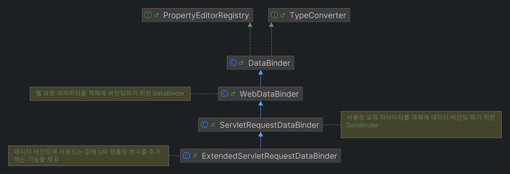
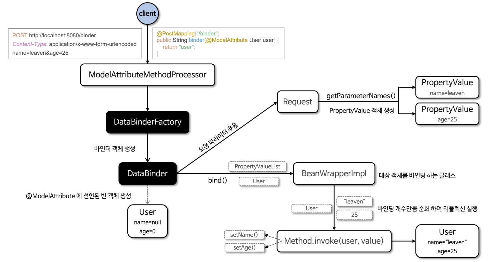
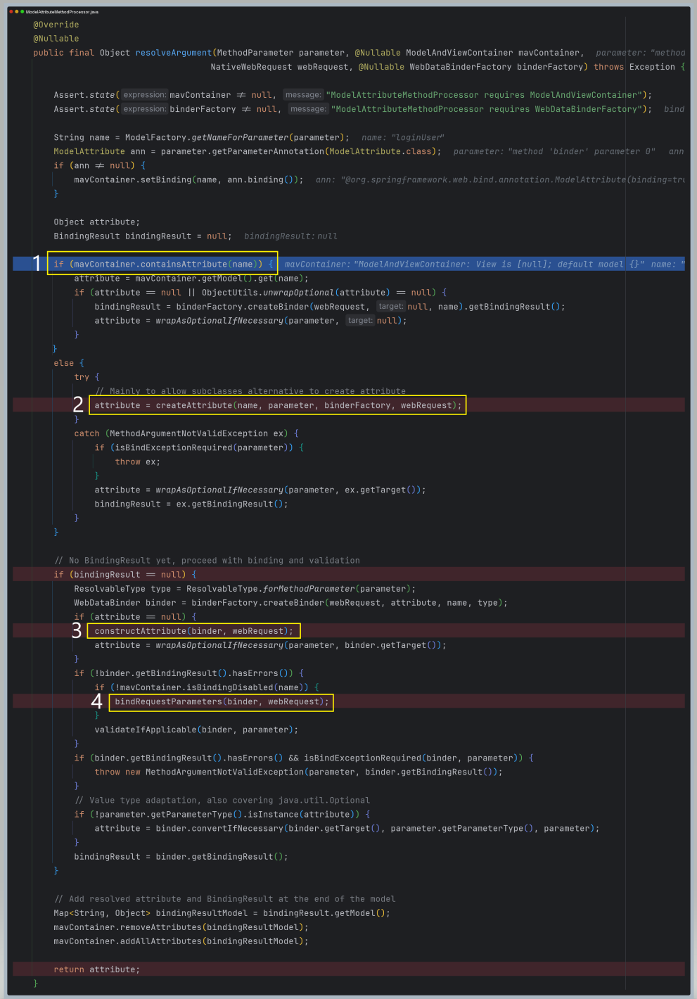
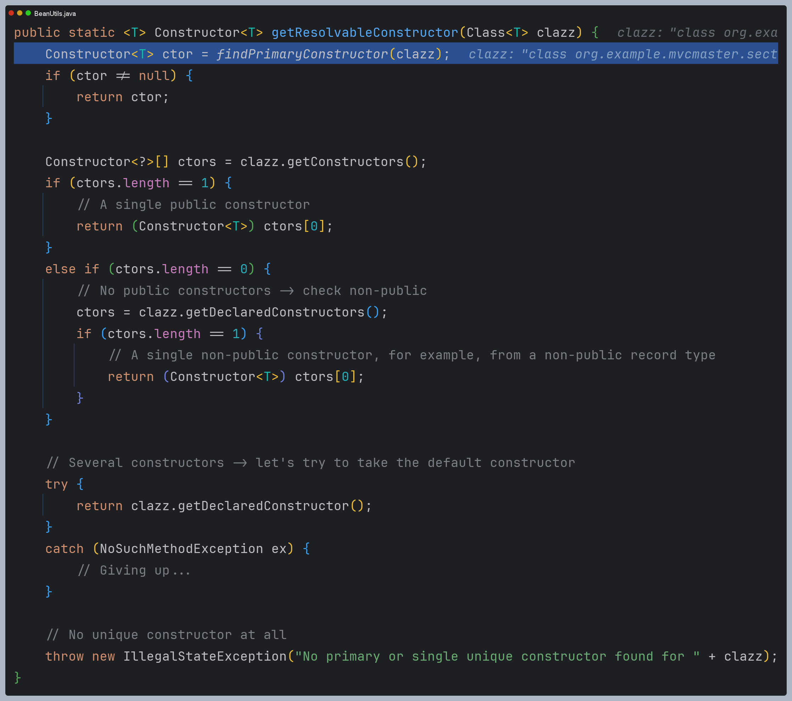

# 바인딩 - DataBinder

HTTP 요청에 대한 데이터 바인딩 방식은 크게 두 가지로 구분할 수 있다.

1. 쿼리 파라미터 및 폼 데이터 바인딩
   - 기본형, 문자열, 래퍼 클래스 등
     - `@RequestParam`을 적용하면 `RequestParamMethodArgumentResolver`가 요청을 처리
     - `@PathVariable`을 적용하면 `PathVariableMethodArgumentResolver`가 요청을 처리
   - **객체 : `@ModelAttribute`를 적용하면 `ServletModelAttributeMethodProcessor` 요청을 처리**
     - **`DataBinder`는 여기에 관여하는 전략이다.**
2. HTTP 본문 바인딩
   - Text, JSON 등 : `@RequestBody`를 적용하면 `RequestResponseBodyMethodProcessor`와 `HttpMessageConverter`가 요청을 처리

> **`DataBinder`와 `HttpMessageConverter` 비교**
> 
> | DataBinder                           | HttpMessageConverter                                                     |
> |--------------------------------------|--------------------------------------------------------------------------|
> | 웹 요청 파라미터를 객체에 바인딩                   | HTTP 요청 및 응답 본문을 객체로 변환하거나 객체를 HTTP 본문으로 변환                              |
> | 주로 폼 데이터, 쿼리 스트링, URL 경로 변수          | JSON, XML, Plain Text, Binary 등 HTTP 본문 데이터                              |
> | 메서드 파라미터에 `@ModelAttribute`를 선언해서 사용 | `@RequestBody`, `@ResponseBody`, `HttpEntity`, `ResponseEntity` 등과 함께 사용 |
> | 바인딩에 필요한 타입 변환과 검증 과정을 거침            | 본문 변환 후 검증 과정만 거침                                                        |

스프링의 `DataBinder`는 크게 3가지 특징을 가지고 있다.

1. **데이터 바인딩** : 요청 파라미터를 모델 객체의 속성에 자동으로 할당 (`BindingResult`)
2. **타입 변환** : 클라이언트의 요청 문자열로 전달된 데이터를 적절한 형식으로 변환 (`Converter`)
3. **유효성 검증** : 데이터가 유효한지 확인하고, 유효성 검사 오류를 기록 (`Validator`)

---

# 바인딩 흐름도 및 주요 내부 코드

`@ModelAttribute`가 선언된 컨트롤러 메서드에는 4가지 방식으로 객체에 값이 바인딩 될 수 있다.

1. 세션에 저장된 모델 객체가 있는 경우 해당 객체를 바로 가져온다. ([참고](https://github.com/geun-00/TIL/blob/main/Spring/springmvc_1/handlerAdapter/session/Session.md))
2. URI 템플릿 변수와 `@ModelAttribute`의 속성명이 같은 경우 컨터버를 통해 바인딩한다. ([참고](https://github.com/geun-00/TIL/blob/main/Spring/springmvc_1/handlerAdapter/modelAttribute/ModelAttribute.md#%EA%B2%BD%EB%A1%9C-%EB%B3%80%EC%88%98-%EC%9A%94%EC%B2%AD-%ED%8C%8C%EB%9D%BC%EB%AF%B8%ED%84%B0-%EA%B0%9D%EC%B2%B4-%EB%B0%94%EC%9D%B8%EB%94%A9))
3. 생성자를 통해 `DataBinder` 클래스 `target` 속성에 객체를 설정한다. 이때 객체에 매개변수가 있는 생성자가 정의되어 있다면
해당 매개변수는 객체에 바인딩이 될 수 있다.

> 
> 
> - 리플렉션 기술을 통해 생성자를 찾는데 하나의 `public` 생성자, 하나의 `private` 생성자, 하나의 기본 생성자 순서로 찾아서 반환한다.
> - 만약 생성자를 여러 개 설정하면 어떤 생성자를 선택해야 할지 결정할 수 없어 맨 마지막 오류를 발생시킨다.

4. 리플렉션으로 `setter`를 통해 값을 바인딩한다. `setter`가 없다면 기본값으로 설정된다.
