# HandlerAdapter 원리

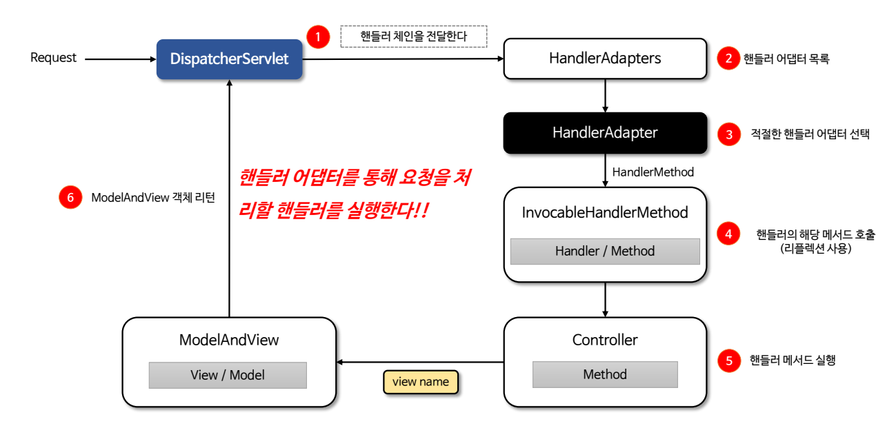

- `HandlerAdapter`는 스프링 MVC에서 핸들러를 호출하는 역할을 하는 인터페이스이다.
- `HandlerAdapter`는 다양한 타입의 핸들러들이 일관된 방식으로 호출될 수 있도록 해주며 핸들러가 다양한 타입으로 정의되더라도
그에 맞는 호출 방식을 제공해준다.
- 요청이 들어왔을 때 어떤 핸들러가 해당 요청을 처리할지 결정하는 것이 `HandlerMapping`이라면 `HandlerAdapter`는 결정된 핸들러를
호출하여 실행하는 역할을 한다.

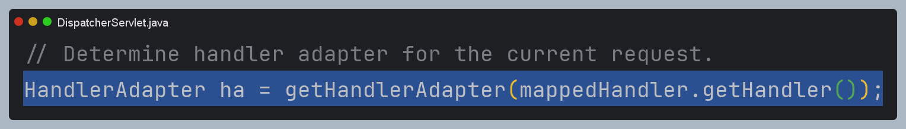

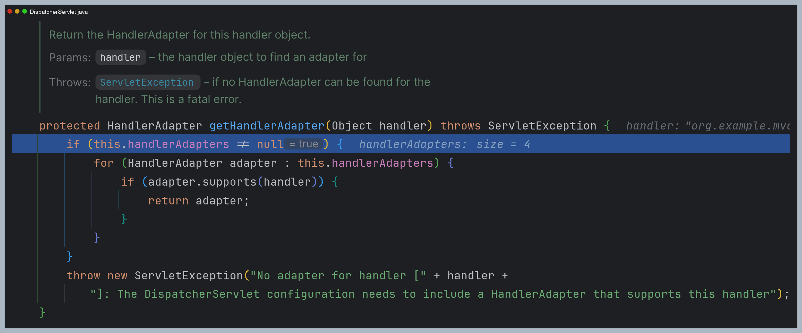

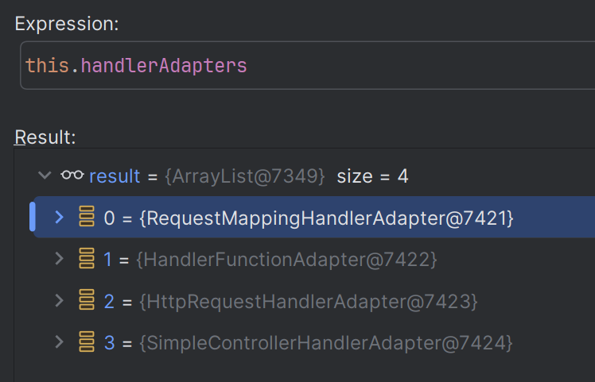

> 참고 : [어댑터 패턴](https://github.com/geun-00/TIL/blob/main/Java/java8/designpattern/structural/adapter/Adapter.md)

## HandlerAdapter 설계 의도

- `HandlerAdapter`는 `HandlerMapping`이 어떤 타입의 핸들러를 결정하더라도 타입과 상관없이 공통된 방식으로 핸들러를 호출할 수 있어야 한다.
- `HandlerAdapter`는 `HandlerMapping`으로부터 전달받은 핸들러의 타입 정보를 분석해서 해당 핸들러를 지원하는지 여부를 판단하고
지원한다면 핸들러를 호출한다.

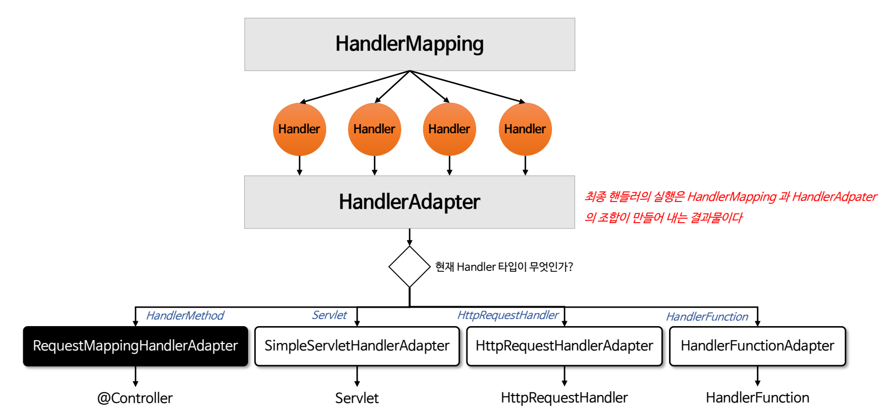

## RequestMappingHandlerAdapter

- `RequestMappingHandlerAdapter`는 `@RequestMapping` 어노테이션이 적용된 컨트롤러 메서드를 처리하는 데 사용되는 어댑터이다.
- `HandlerMethod`를 호출하고 메서드의 인자와 반환 값을 처리하는 역할을 하며 사용자 정의 `ArgumentResolver` 및 `ReturnValueHandler`를 구현하여
설정할 수 있다.

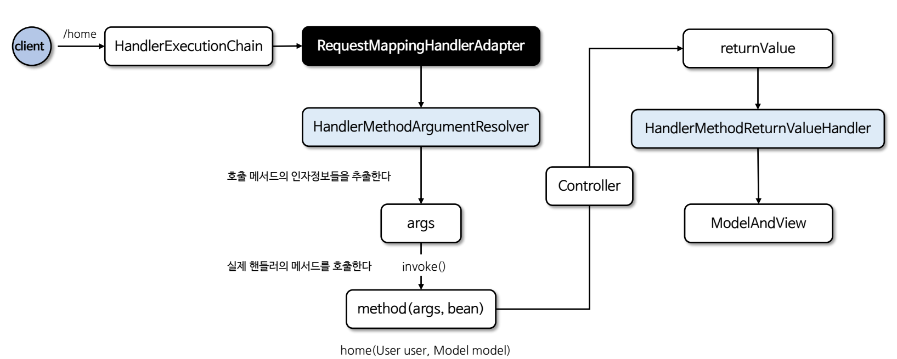

- `@RequestMapping`이 선언된 핸들러 메서드는 메서드에 전달되는 인자와 반환 값을 다양한 타입과 방식으로 유연하게 설정할 수 있다.
- 메서드 호출과 반환을 자유롭게 구현하기 위해서는 호출에 필요한 인자 정보와 반환에 필요한 타입 정보를 알 수 있어야 한다. 이것을 스프링에서는
**Method Arguments**와 **Return Values**로 나누어 API를 제공하고 있다.

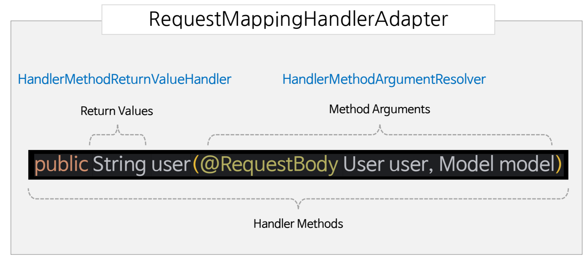

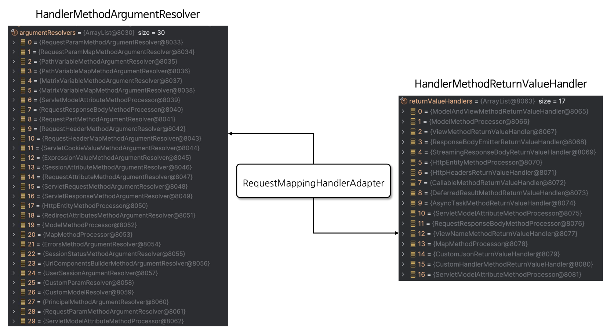

> - [스프링이 제공하는 `Method Arguments`](https://docs.spring.io/spring-framework/reference/web/webmvc/mvc-controller/ann-methods/arguments.html)
> - [스프링이 제공하는 `Return Values`](https://docs.spring.io/spring-framework/reference/web/webmvc/mvc-controller/ann-methods/return-types.html)

---

# 요청 과정 디버깅

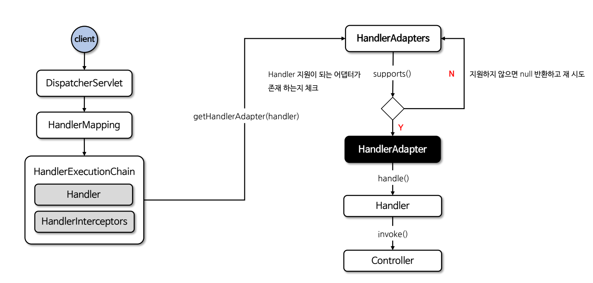

1. **`RequestMappingHandlerAdapter` 선택**

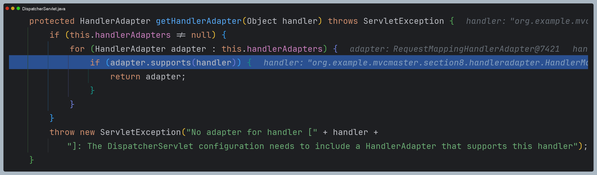

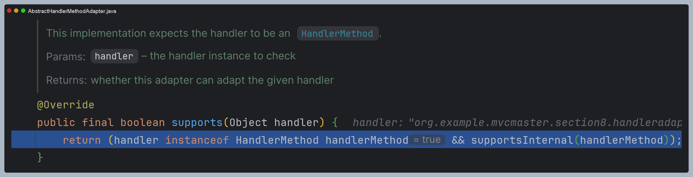

2. **핸들러 호출 시작**

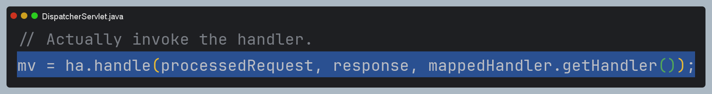

3. **호출할 핸들러 인자에 값을 리졸빙 한 후 실제 핸들러 호출**

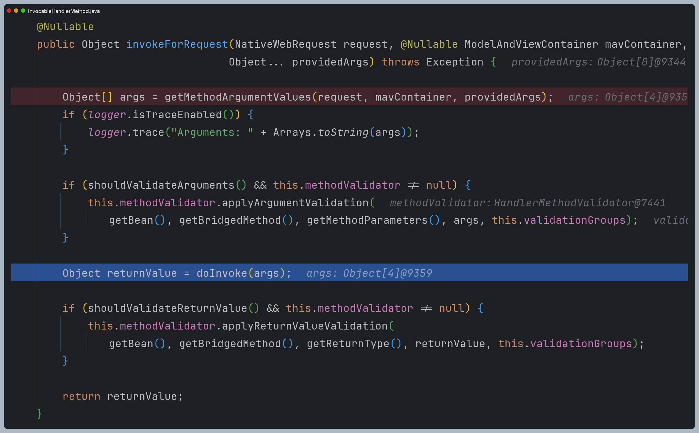

4. **컨트롤러의 반환 값으로 적절한 `ReturnValueHandler`를 찾아 처리를 위임**

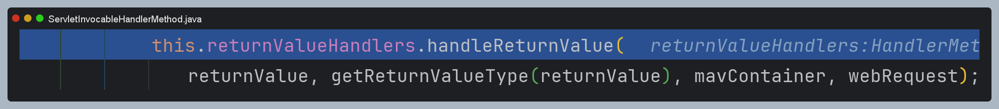

---

# Method Arguments

- 스프링의 메서드 매개변수 (Method Arguments)는 컨트롤러 메서드에서 HTTP 요청 데이터를 직접 접근하고 처리할 수 있도록
다양한 매개변수를 지원한다.
- 요청의 URL, 헤더, 메시지 바디, 쿠키, 세션과 같은 정보를 자동으로 매핑하여 개발자가 쉽게 활용할 수 있도록 제공한다.

## HandlerMethodArgumentResolver

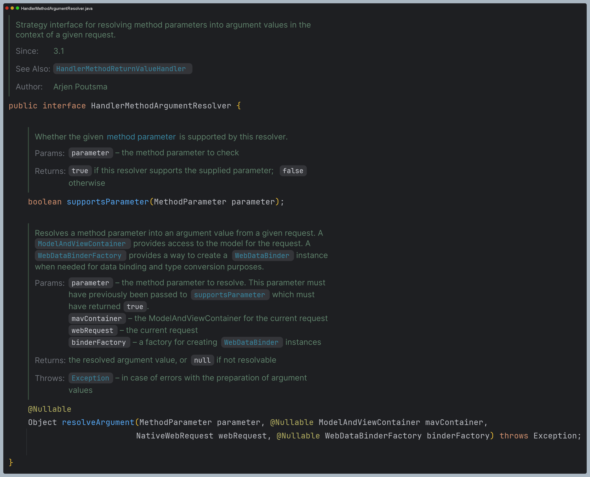

- HTTP 요청과 관련된 데이터를 컨트롤러 메서드의 파라미터로 변환하는 작업을 담당하는 인터페이스이다.
- `@RequestParam`, `@PathVariable`, `@RequestBody` 등 다양한 유형의 파라미터를 처리하기 위해 여러 `HandlerMethodArgumentResolver` 기본 구현체를 제공한다.
- 필요에 따라 직접 `HandlerMethodArgumentResolver`를 구현할 수 있다.

## HandlerMethodArgumentResolver 설계 의도

**메서드 호출은 최소한 두 가지가 만족되어야 한다.**

1. 스프링은 `HandlerMapping`을 통해 매핑한 핸들러에 **클래스** 정보와 **호출 메서드의 시그니처** 정보와 같은 정보를 저장한다.
2. 메서드 매개변수 개수만큼 각 타입별로 바인딩할 데이터를 생성해서 메서드 호출 시 전달해 주어야 한다. (내부적으로 리플렉션 기술 사용)

스프링은 메서드 매개변수의 값을 요청 파라미터로부터 추출해서 생성하는데 이 역할을 하는 클래스가 `HandlerMethodArgumentResolver`이다.

---

# 처리 과정 디버깅

1. **핸들러 호출 전 `Arguments Resolver` 작동**

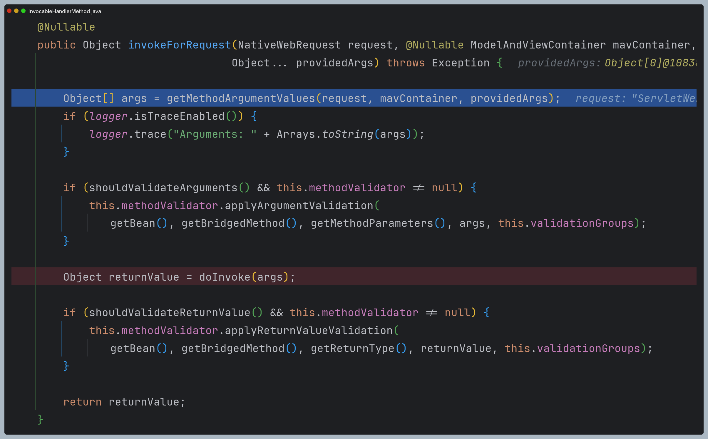

`doInvoke()` 메서드로 리플렉션을 사용하여 실제 핸들러를 호출하기 전 `getMethodArgumentValues()`를 거쳐 메서드 매개변수의 값을
설정한다.

2. **메서드 매개변수 값 설정**

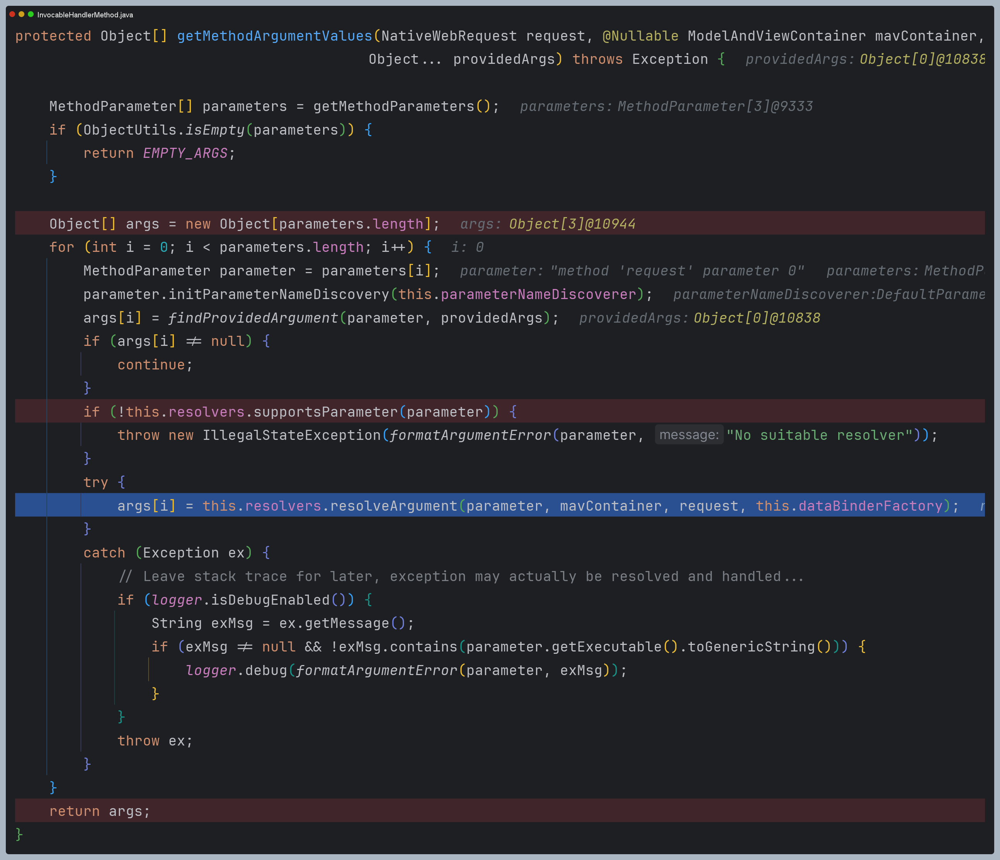

- 메서드 매개변수 정보를 추출하여 적절한 `ArgumentsResolver`가 각 매개변수를 처리하도록 한다.
- 여기서 `resolvers`는 `HandlerMethodArgumentResolverComposite` 클래스로 모든 `ArgumentsResolver`를 갖고 있다.

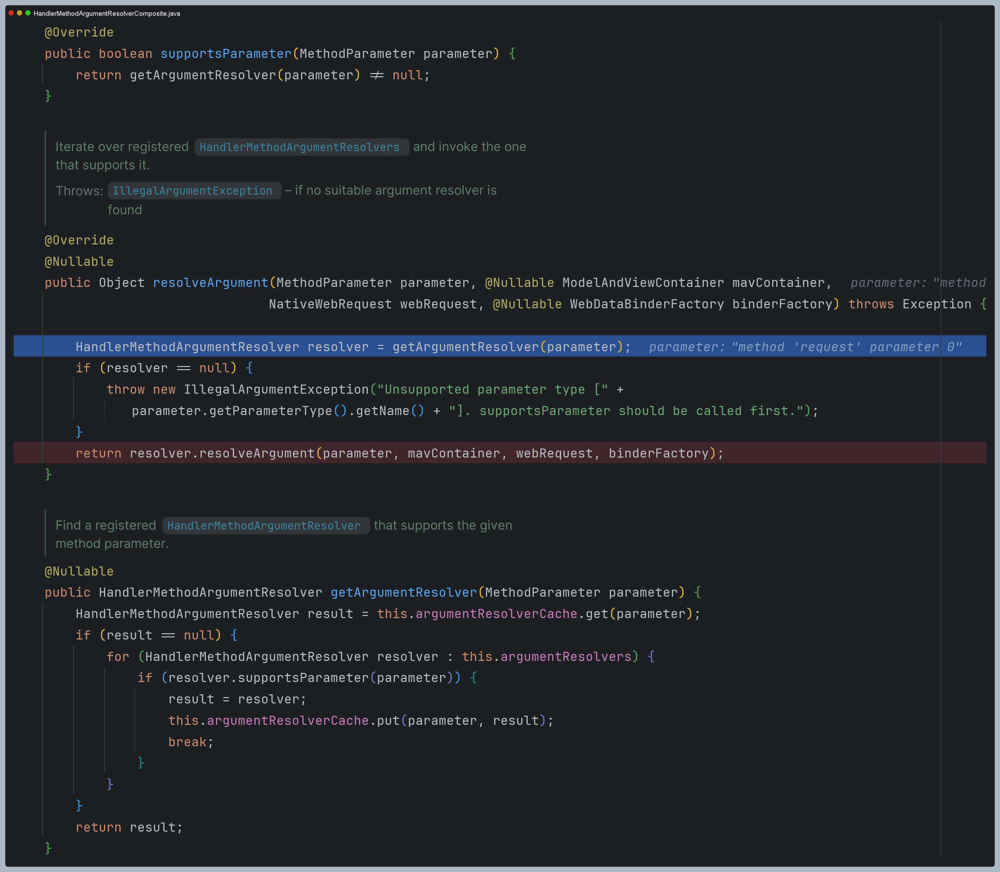
