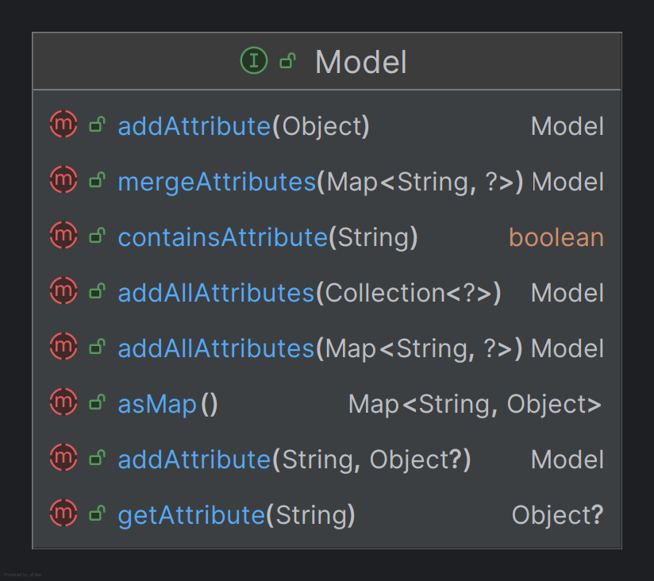

# Model 이해

- `Model`은 컨트롤러와 뷰 사이에서 데이터를 전달하는 역할을 하며 컨트롤러에서 데이터를 `Model` 객체에 추가하면
그 데이터는 뷰에서 접근할 수 있게 된다.
- `Model` 인터페이스는 주로 HTML 렌더링을 위한 데이터 보관소 역할을 하며 `Map`과 유사한 방식으로 동작한다.
- 내부적으로 `ModelMethodProcessor` 클래스가 사용된다.

## BindingAwareModelMap

- `Model` 인터페이스의 구현체로써 `@ModelAttribute`로 바인딩된 객체를 가지고 있으며 바인딩 결과를 저장하는
`BindingResult`를 생성하고 관리한다.

