# @ModelAttribute 원리

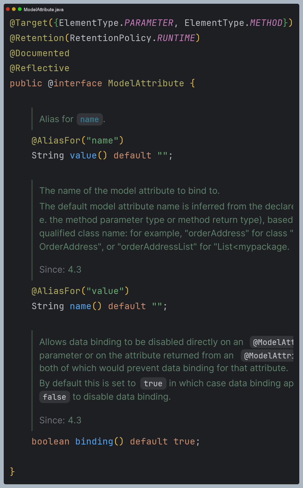

- `@ModelAttribute`는 스프링 MVC에서 주로 폼 데이터나 요청 파라미터를 모델 객체에 바인딩할 때 사용하는 어노테이션이다.
- `@ModelAttribute`는 요청 파라미터를 통해 특정 객체의 각 필드에 바인딩하고(요청 파라미터명과 일치할 때) 이후 자동으로 모델에 추가하여 뷰에서 사용할 수 있게 한다.
- 일반적으로 기본형 타입의 바인딩은 `@RequestParam`이 처리하고, 객체 타입은 `@ModelAttribute`가 처리한다.
- `binding = false` 설정으로 데이터 바인딩 없이 모델(객체)에 접근할 수 있다.

> `@BindParam`
> - `@ModelAttribute`는 요청 파라미터와 일치하는 생성자를 통해 객체를 생성할 수도 있는데 생성자 바인딩을 사용할 때는
>   `@BindParam`을 사용해 요청 파라미터의 이름을 수동으로 매핑할 수 있다.
> 
> 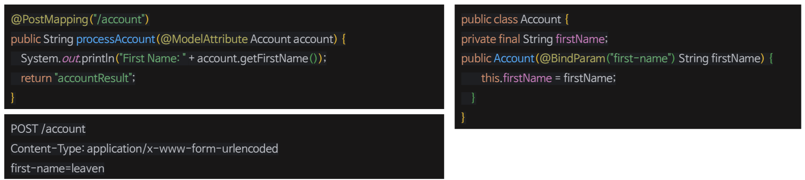
> 
> 원래라면 요청 파라미터의 이름을 `firstName`으로 매핑해야 하지만, `@BindParam`을 사용해 `first-name`으로 매핑하고 있다.

## 경로 변수, 요청 파라미터 객체 바인딩

컨버터가 등록되어 있고 `@ModelAttribute` 속성 이름이 경로 변수와 일치하는 경우 컨버터를 사용하여 모델 객체를 가져올 수 있다.

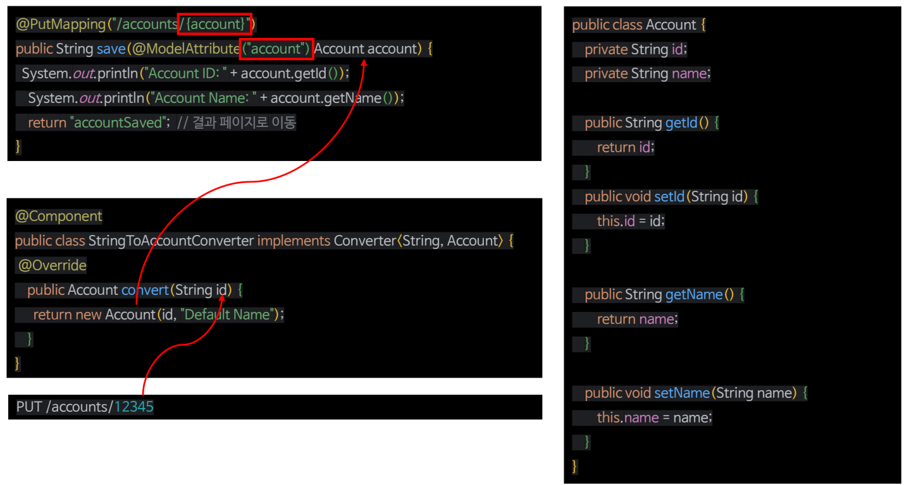

## 메서드에 @ModelAttribute 선언

- 메서드에 `@ModelAttribute`를 선언하면 컨트롤러에서 모델에 데이터를 추가해준다. 메서드가 리턴한 객체가 자동으로 모델에 추가된다.
- 주로 뷰에서 공통적으로 사용되는 데이터를 미리 모델에 추가할 때 사용한다. 공통적으로 사용되는 객체를 미리 준비하는 경우 유용하다.

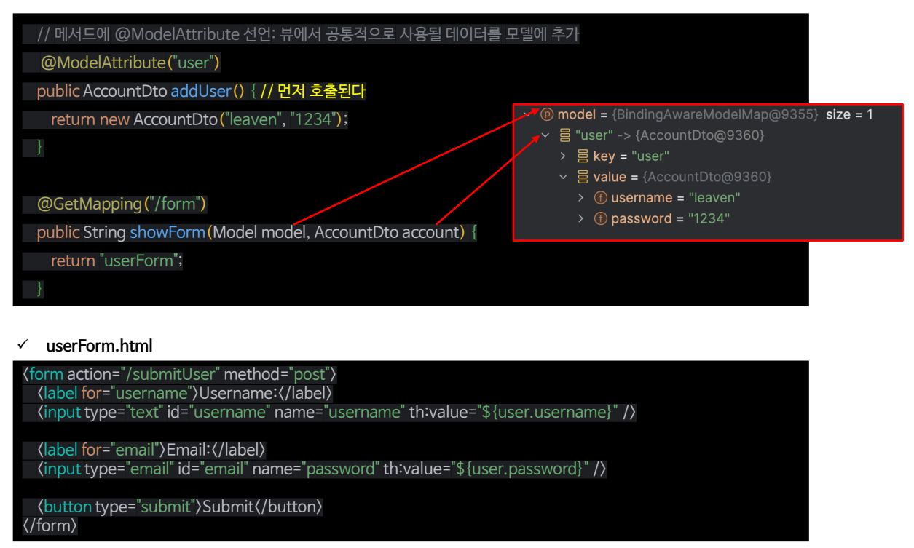

---

# 처리 과정 디버깅

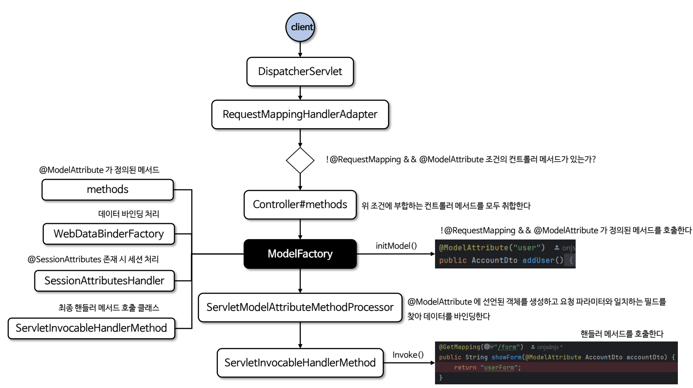

## 1. ModelFactory 생성

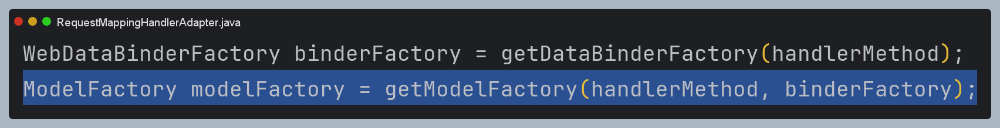

`@ModelAttribute` 어노테이션이 선언된 메서드를 추출

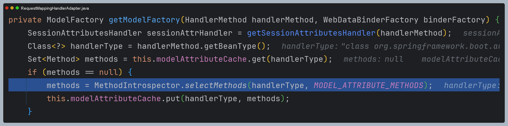

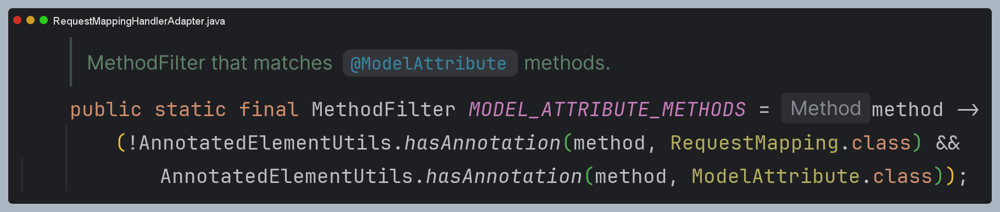

추출한 메서드를 `InvocableHandlerMethod`로 변환 후 `ModelFactory`에 감싸서 반환

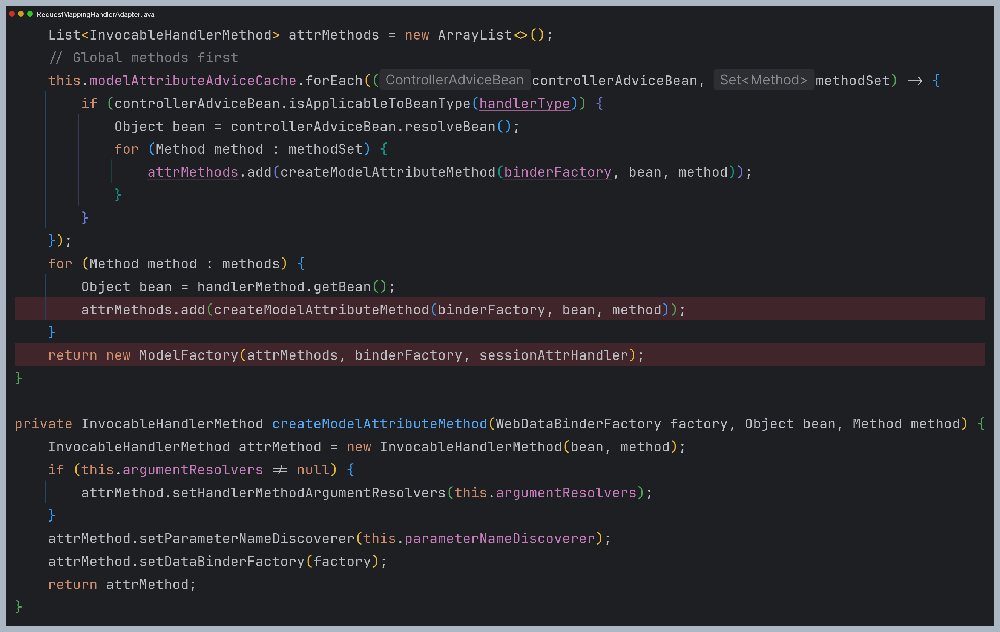

## 2. ServletInvocableHandlerMethod 생성

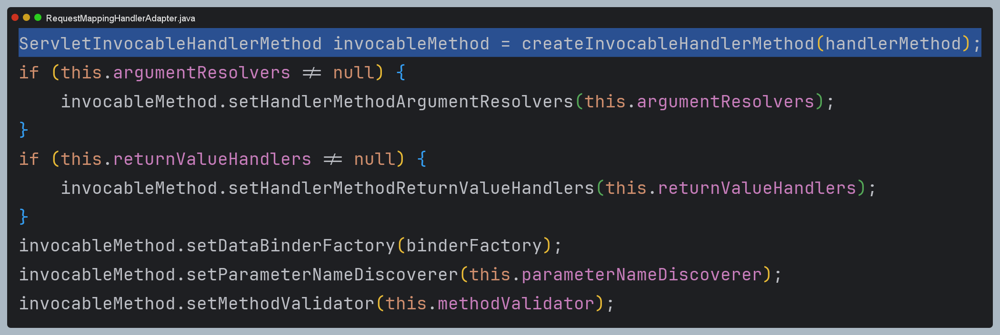

## 3. 초기화 작업 수행

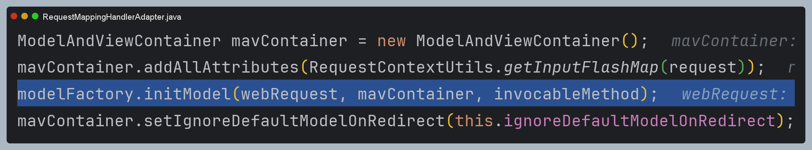

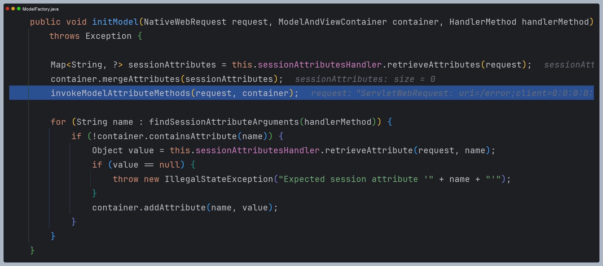

리플렉션을 이용해 `@ModelAttribute` 초기화 메서드를 호출

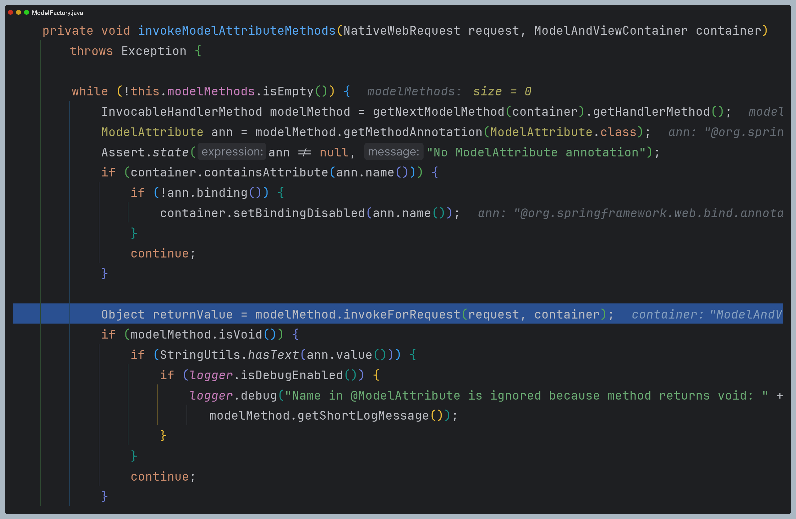

이때 초기화 메서드에도 매개변수가 있을 수 있으므로 `Argument Resolver`를 순회하면서 매개변수 값을 매핑하고 메서드를 호출한다.

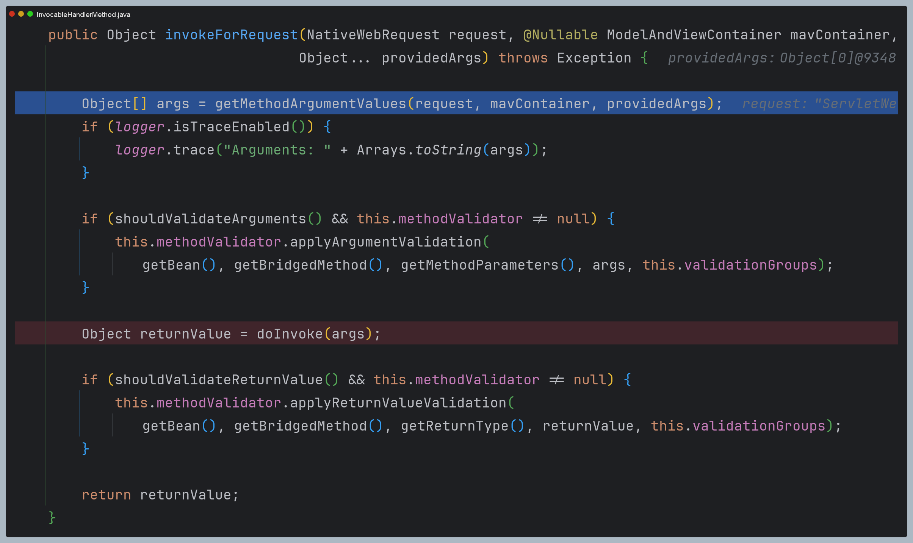

모델에 저장할 이름을 추출하여 모델에 저장한다.

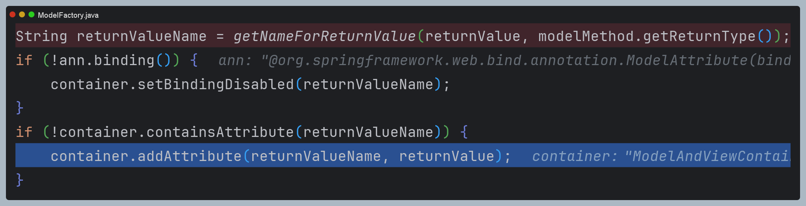

---

> 위 과정은 `@ModelAttribute`가 메서드에 선언되어 초기화 되는 과정이고, 파라미터에 선언되어 객체에 바인딩 되는 과정은
> [바인딩 - DataBinder]()에서 알아보자.