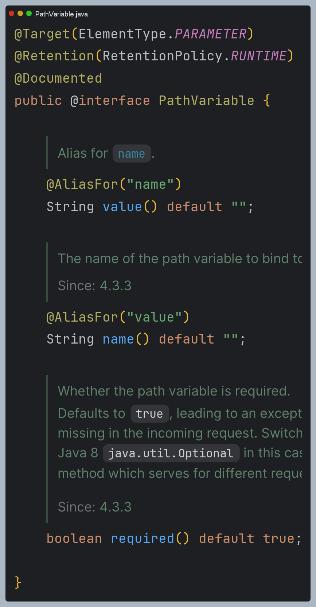
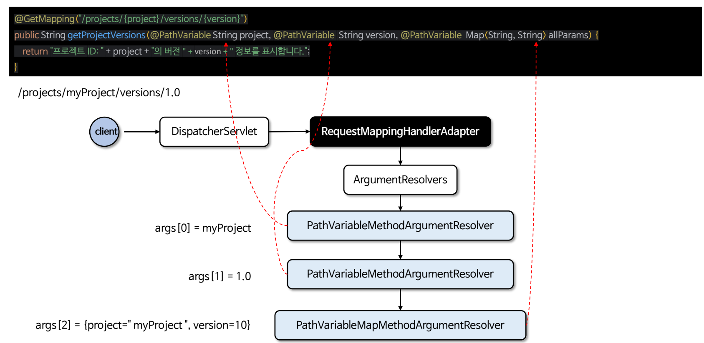
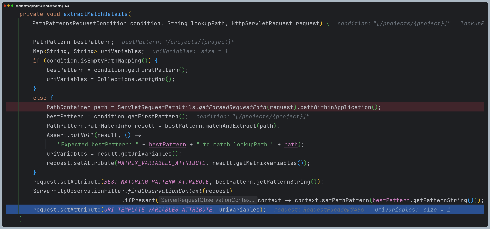
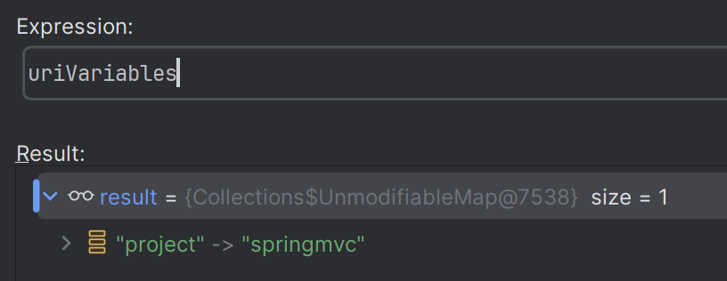
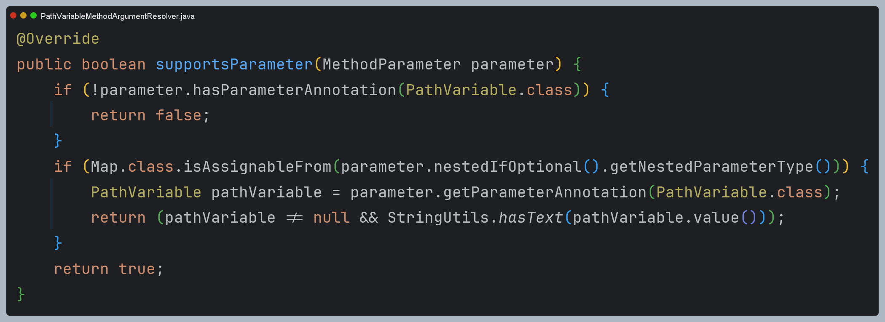
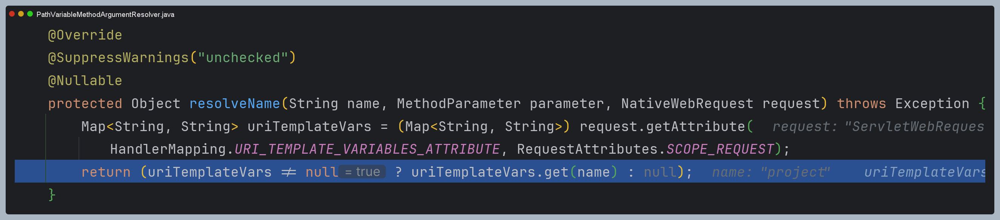
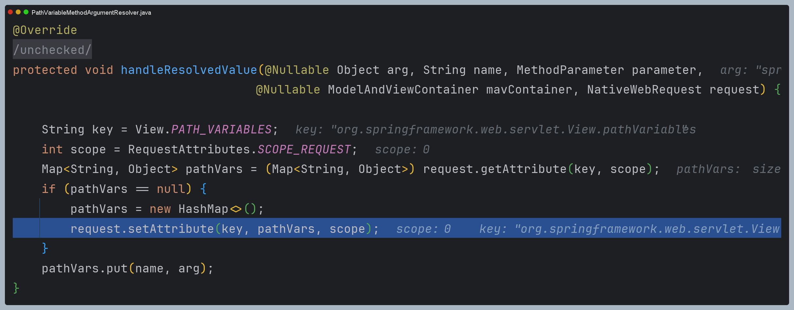

# @PathVariable 원리

- `@PathVariable`은 `@RequestMapping`에 지정한 URI 템플릿 변수에 포함된 값을 메서드의 매개변수로 전달하기 위해 사용되는 어노테이션이다.
- 내부적으로 `PathVariableMethodArgumentResolver` 구현체가 사용된다.

---

# 처리 과정 디버깅

1. **요청 파라미터를 분석해서 `request` 객체에 저장**

2. **해당 메서드가 `@PathVariable`을 처리해야 하는지 확인**

3. **`request` 객체에 저장된 데이터를 이용해서 값을 반환**

4. **타입 변환이 필요하면 타입 변환**

5. **뷰에서 사용할 수 있도록 `request`에 파라미터 값을 저장**

> 즉 `model.addAttribute(...)` 와 같은 추가 코드 없이 뷰에서 참조가 가능하다.