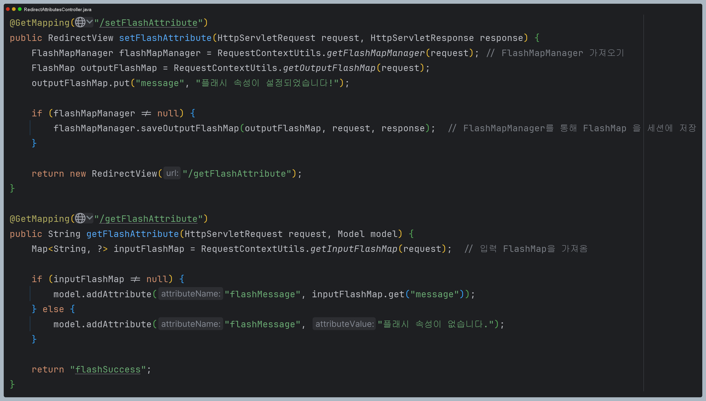

# RedirectAttributes

- 웹 애플리케이션에서 페이지 이동 중 데이터 전달이 필요한 경우가 발생한다. 예를 들어 사용자가 폼을 제출한 후, 성공 메시지나
에러 메시지를 다음 화면에서 표시하고자 할 때 리다이렉트를 사용하여 다른 URL로 이동시키면서 데이터를 전달해야 하는 상황이 발생할 수 있다.
- 이럴 때 사용할 수 있는 방식이 여러 가지가 있지만 단점이 존재한다.
  - **URL에 데이터를 포함** : 쿼리 파라미터를 URL에 추가하는 가장 기본적인 방법으로, 보안상 좋지 않다.
  - **세션 사용** : 세션은 다음 요청 이후에도 남아 있는 데이터를 수동으로 제거해야 하며 메모리를 많이 사용할 수 있다.
- 많은 경우 리다이렉트 후 한 번만 사용할 데이터를 전달할 수 있어야 하지만 쿼리 파라미터나 세션 방식은 이 요구를 충족하지 못한다.

**그래서 스프링은 `RedirectAttributes`와 `Flash Attributes`를 제공한다.** `RedirectAttributes`는 리다이렉트 요청시 데이터를 안전하고
효율적으로 전달할 수 있도록 돕는 인터페이스로, 리다이렉트 요청 간에 필요한 데이터를 URL에 포함할 수 있다. 
또한 `Flash Attributes`를 사용해서 URL에 표시되지 않도록 임시 데이터를 세션을 통해 전달할 수도 있다.

`RedirectAttributes`와 `Flash Attributes`는 [Post-Redirect-Get 패턴](https://github.com/geun-00/TIL/blob/main/Http/httpStatusCode/httpStatusCode.md#%EC%9D%BC%EC%8B%9C-%EB%A6%AC%EB%8B%A4%EC%9D%B4%EB%A0%89%EC%85%98302-303-307)에서 유용하게 사용된다.

## 구현 예 - URL 파라미터에 노출되는 방식

## 구현 예 - URL 파라미터에 노출되지 않는 방식

---

# Flash Attributes

- 스프링 MVC는 `Flash Attributes`를 지원하기 위해 두가지 주요 추상화인 `FlashMap`과 `FlashMapManager`를 제공한다.
- `FlashMap`은 플래시 속성을 저장하는 데 사용되고, `FlashMapManager`는 `FlashMap`객체를 저장, 조회 및 관리하는 역할을 한다.

## FlashMap

- 리다이렉트 후 다음 요청에서만 사용할 수 있는 임시적인 속성을 저장하는 `Map` 형태의 객체로, 리다이렉트가 일어나면 `FlashMap`이 세션에
저장되고 다음 요청에서 자동으로 제거된다.
- 현재 요청에서 이후 요청으로 데이터를 전달하는 출력 `FlashMap`과 이전 요청에서 전달된 데이터를 담고 있는 입력 `FlashMap`으로 구분한다.
- `FlashMap` 객체는 `RequestContextUtils` 클래스의 정적 메서드를 통해 스프링 MVC의 어디서든 접근이 가능하다.

## FlashMapManager

- `FlashMap` 객체를 생성하고 관리하는 역할을 하며 `FlashMap`을 세션에 저장하고 다음 요청에서 이를 가져와서 사용하거나
제거하는 작업을 수행한다.

- `saveOutputFlashMap()` : 리다이렉트 전에 호출하여 HTTP 세션이나 응답 쿠키에 `FlashMap`을 저장한다.
- `retrieveAndUpdate()` : 이전 요청에서 저장된 `FlashMap` 중 현재 요청과 일치하는 것을 찾아 이를 저장소에서 제거하고, 
    만료된 다른 `FlashMap` 객체도 함께 제거하며 이 메서드는 요청이 시작될 때마다 호출된다.

## 구현 예

> 대부분의 일반적인 리다이렉트 상황에서는 `RedirectAttributes`를 사용하는 것이 간편하고 충분하지만, `FlahMap`과 `FlashMapManager`를 직접 사용하여
> 더욱 세밀한 제어를 하는 것이 가능하다.

---

# 흐름도 및 주요 내부 코드

- `doDispatch()`를 호출하기 전에 `FlahMap`과 `FlashMapManager`를 `request`에 저장한다.

- `ModelAndViewContainer`애 `RedirectAttributesModelMap`을 저장한다.

- 초기 과정에서 저장한 `OutputFlashMap`에 핸들러에서 설정한 속성 값을 저장한다.

- `OutputFlashMap`을 세션에 저장한 다음 리다이렉트를 진행한다.

- 이전 단계에서 세션에 저장된 `OutputFlashMap`이 있으므로 이것을 `InputFlashMap`으로 하여 `request`에 저장한다.

- `FlashMap`에 저장된 일회성 데이터들을 세션으로부터 삭제한다.

- `InputFlashMap`에 담긴 데이터를 모델에 저장한다.

