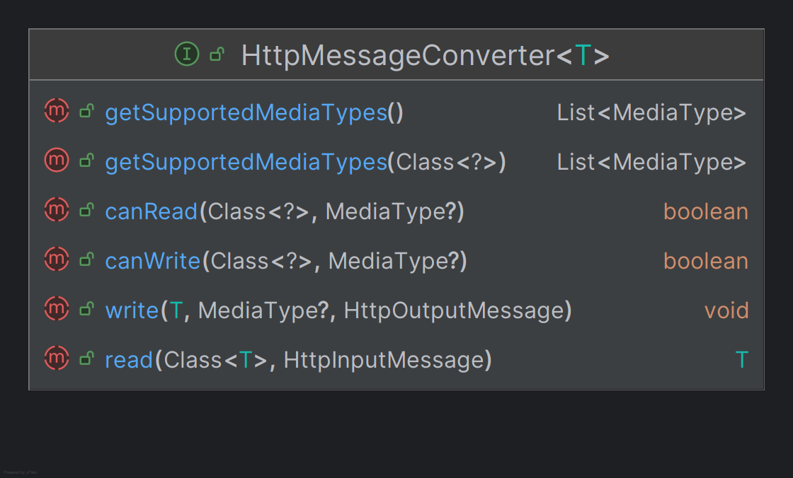

# Http 요청 본문 처리 이해

- HTTP 요청이 파라미터나 폼 데이터가 아닌 요청 본문(body)일 경우 `@RequestParam`이나 `@ModelAttribute`는 요청을 매개변수에
바인딩 할 수 없다.
- 일반적으로 헤더 정보가 `Content-Tpye = application/json`인 경우 HTTP 본문 요청은 `getParameter()`로 읽을 수 없으며
직접 `HttpServletRequest`의 `InputStream` 또는 `Reader`를 사용해서 본문 데이터를 파싱하는 방식으로 처리해야 한다.

---

# HttpEntity

- `HttpEntity`는 기존 `HttpServletRequest`나 `HttpServletResponse`를 사용하여 요청 및 응답 데이터를 처리하는
복잡성을 해결하기 위해 도입되었다.
- `HttpHeaders`와 `Body` 데이터를 하나의 객체로 통합하였고 JSON, XML, 문자열, 바이너리 데이터 등 다양한 본문 데이터 형식을
처리 가능하게 하였다.
- 내부적으로 `HttpMessageConverter` 객체가 작동되어 본문을 처리한다.

## RequestEntity

- `HttpEntity`의 확장 버전으로 HTTP 메서드와 대상 URL도 포함하여 RestTemplate에서 요청을 준비하거나 컨트롤러 메서드에서
요청 입력을 나타낼 때 사용된다.

## 흐름도

---

# @RequestBody

- `@RequestBody`는 HTTP 요청 본문(body)을 자동으로 객체로 매핑하는 데 사용되며 내부적으로 `HttpMessageConverter` 객체로 본문을 처리한다.
- `HttpEntity` 또는 `RequestEntity`도 요청 본문을 처리해 주지만 지정된 객체로 자동 매핑을 해주지는 않는다.
- `@Valid` 어노테이션과 함께 사용하여 요청 본문의 유효성을 쉽게 검증할 수 있다.
- `@RequestBody`는 반드시 요청 본문이 있어야 하며 요청 본문이 없을 경우 `HttpMessageNotReadableException` 예외가 발생한다.
- `required = false` 설정으로 요청 본문이 없을 때 null을 허용할 수 있다.

## @RequestBody와 HttpEntity(RequestEntity)

- `@RequestBody`는 요청의 `Content-Type` 헤더를 기반으로 적절한 `HttpMessgaeConverter`를 선택하기 때문에 `Content-Type` 헤더가 정확하게 설정되어야 한다.
- `@RequestBody`는 생략할 수 없다. 생략할 경우 기본형은 `@RequestParam`, 객체 타입은 `@ModelAttribute`가 작동하며 정확한 결과를
보장할 수 없다.

## 흐름도

---

# HttpMessageConverter

- `HttpMessageConverter`는 HTTP 요청과 응답의 본문(body) 내용을 객체로 변환하고 반대로 객체를 HTTP 메시지로 변환하는 데 사용되는 인터페이스이다.
- `HttpMessageConverter`는 클라이언트와 서버 간의 데이터를 직렬화 및 역직렬화하는 기능을 담당하여 주로 JSON, XML, Plain Text와 같은
다양한 데이터 포맷을 지원한다.
- `HttpMessageConverter`는 주로 Rest API 통신에서 사용된다.

- `canRead()` : 주어진 객체 타입과 미디어 타입(Content-Type)을 읽을 수 있는지 확인한다.
- `canWrite()` : 주어진 객체 타입과 미디어 타입(Content-Type)에 데이터를 쓸 수 있는지 확인한다.
- `read()` : HTTP 요청 데이터를 객체로 변환한다.
- `getSupportedMediaTypes()` : 특정 클래스 또는 이 컨버터가 지원하는 미디어 타입의 목록을 반환한다.
- `write()` : 객체를 HTTP 응답 데이터로 변환한다.

## HttpMessageConverter 요청 처리 흐름

1. **클라이언트 Content-Type 헤더**
    - 클라이언트가 서버로 데이터를 전송한다. 이때 HTTP 헤더에 `Content-Type`을 포함하여 서버에 데이터 형식을 알린다.
2. **ArgumentResolver 실행**
   - 스프링은 컨트롤러의 메서드 매개변수에 `@RequestBody` 또는 `HttpEntity` 등이 선언 되었는지 확인한다.
   - 선언 되었다면 HTTP 요청 본문 `ArgumentResolver`가 선택되고 `ArgumentResolver`는 `HttpMessageConverter`를 실행한다.
3. **HttpMessageConverter 작동**
   - `HttpMessageConverter`는 클라이언트의 `Content-Type` 헤더를 기준으로 요청 본문 데이터를 특정 객체로 변환한다.
   - 예를 들어 Text는 `StringHttpMessageConverter`, JSON은 `MappingJackson2HttpMessageConverter`가 작동된다.

## HttpMessageConverter 응답 처리 흐름

1. **클라이언트 Accept 헤더**
    - 클라이언트는 `Accept` 헤더를 통해 서버가 어떤 형식의 데이터를 반환해야 하는지 명시한다.
2. **ReturnValueHandler 실행**
    - 스프링은 컨트롤러의 반환 타입에 `@ResponseBody` 또는 `ResponseEntity` 등이 선언 되었는지 확인한다.
    - 선언 되었다면 HTTP 응답 본문 `ReturnValueHandler`가 선택되고 `ReturnValueHandler`는 `HttpMessageConverter`를 실행한다.
3. **HttpMessageConverter 작동**
    - `HttpMessageConverter`는 클라이언트의 `Accept` 헤더를 기준으로 데이터를 응답 본문에 기록한다.
    - 예를 들어 Text는 `StringHttpMessageConverter`, JSON은 `MappingJackson2HttpMessageConverter`가 작동된다.

## HttpMessageConverter 요청 및 응답 구조

> **HttpMessageConverter가 작동하지 않는 요청**
> 1. **`GET` 요청과 같은 본문이 없는 요청**
>    - `GET`, `DELETE`와 같은 HTTP 메서드는 일반적으로 본문을 포함하지 않으므로 이때 `HttpMessageConverter`는 작동하지 않는다.
> 2. **`Content-Type` 헤더가 지원되지 않는 요청**
>    - `POST`, `PUT` 등의 본문이 포함된 HTTP 요청이라도 `Content-Type` 헤더가 지원되지 않는 미디어 타입일 경우 `HttpMessageConverter`는 작동하지 않는다.
> 3. **`@RequestParam`, `@ModelAttribute`를 사용하는 경우**
>    - 쿼리 파라미터나 `application/x-www-form-urlencoded` 형식의 폼 데이터를 처리하는 경우 `HttpMessageConverter`는 작동하지 않는다.
> 4. **파일 업로드 요청 중 `@RequestPart` 또는 `MultipartFile`을 사용한 경우**
>    - `multipart/form-data` 요청에서 파일을 업로드 할 때, `MultipartFile`이나 `@RequestPart`를 사용하는 경우에는
>       `MultipartResolver`가 요청을 처리한다.
> 5. **컨트롤러에서 단순 문자열 반환 시 `@ResponseBody`나 `@RestController`가 없는 경우**
>    - 반환된 문자열은 뷰 이름으로 간주되며 이 경우에는 `ViewResolver`가 요청을 처리한다.