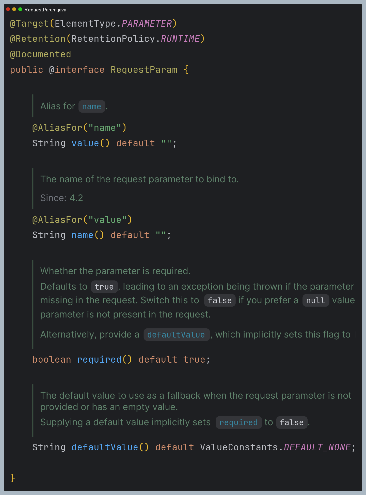
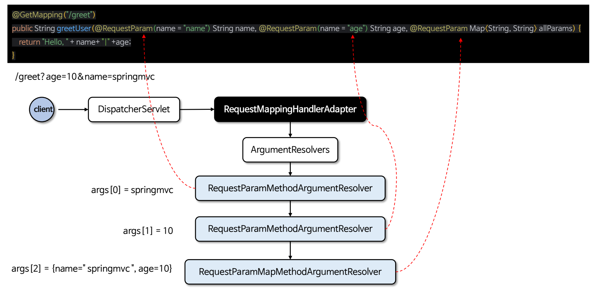
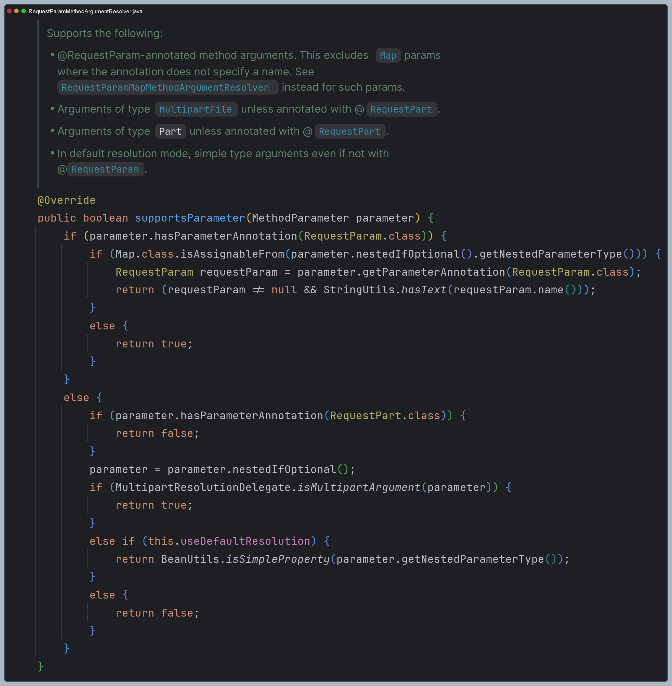
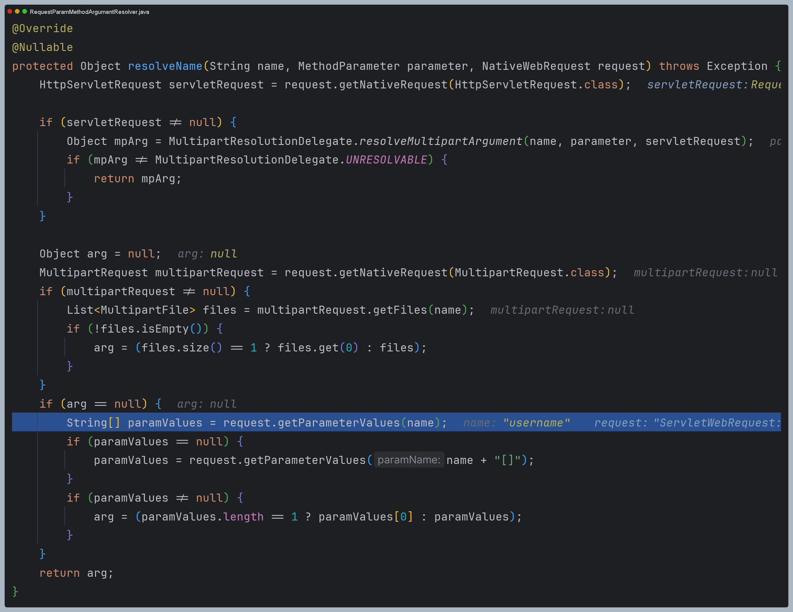
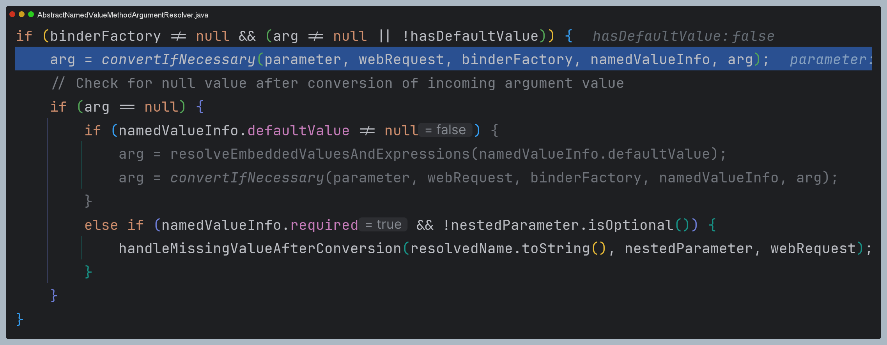

# @RequestParam 원리

- `@RequestParam` 어노테이션은 HTTP 요청의 파라미터를 메서드의 매개변수에 바인딩 해준다.
- `@RequestParam`은 URL 쿼리 파라미터, 폼 데이터, 멀티 파트 요청을 매핑하며 HTTP 본문 요청은 처리하지 않는다. (`HttpMessageConverter`가 처리)
- 주로 `int`, `long`과 같은 기본형, 기본형 래퍼 클래스, `String` 타입의 매개변수를 바인딩할 때 사용하며 대부분의 객체 타입은 처리하지 않는다. (`@ModelAttribute`가 처리)
- 내부적으로 `RequestParamMethodArgumentResolver` 구현체가 사용되며, `request.getParameterValues()`와 같은 API를 사용하여 바인딩을 해결하고 있다.

---

# 처리 과정 디버깅

1. **해당 메서드가 `@RequestParam`을 처리해야 하는지 확인**

2. **요청 URL에서 파라미터 값을 추출**

3. 타입 변환이 필요하면 타입 변환 후 반환

