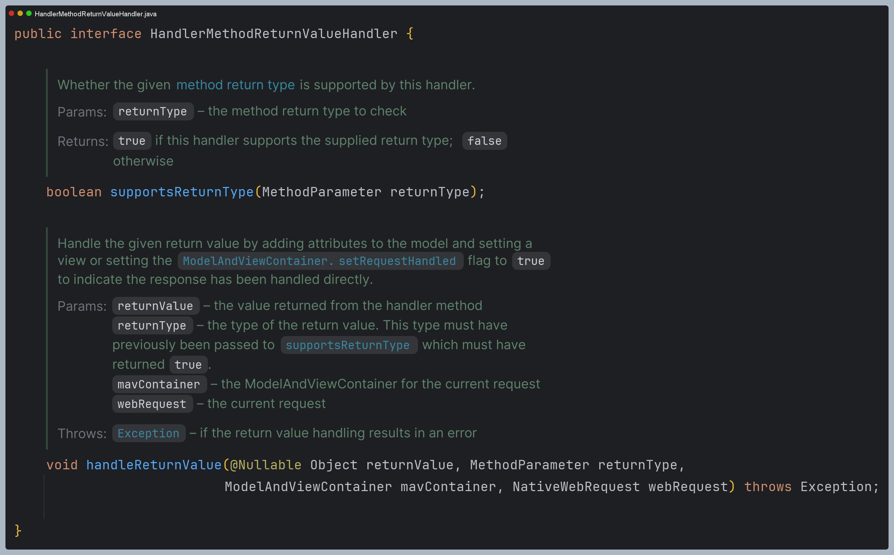
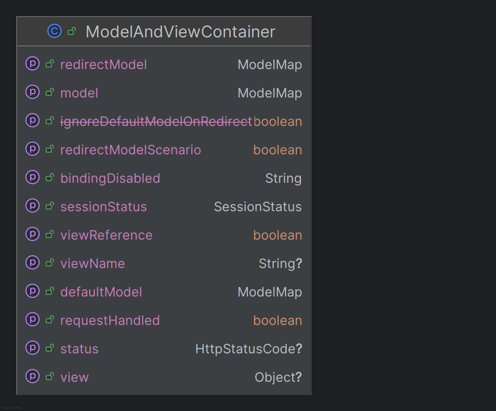
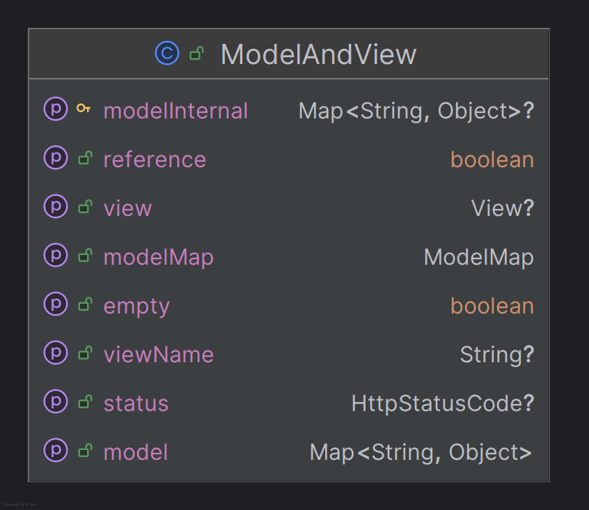
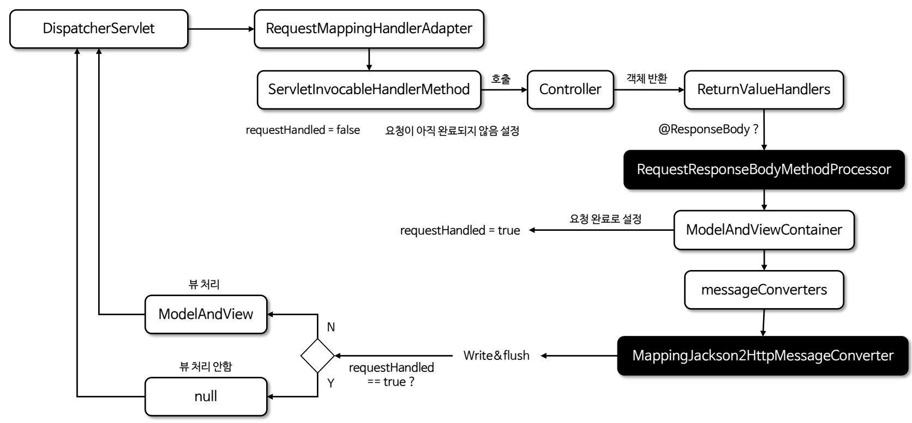
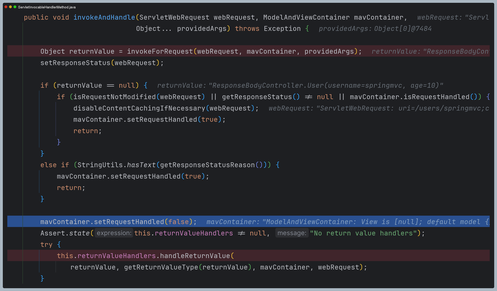
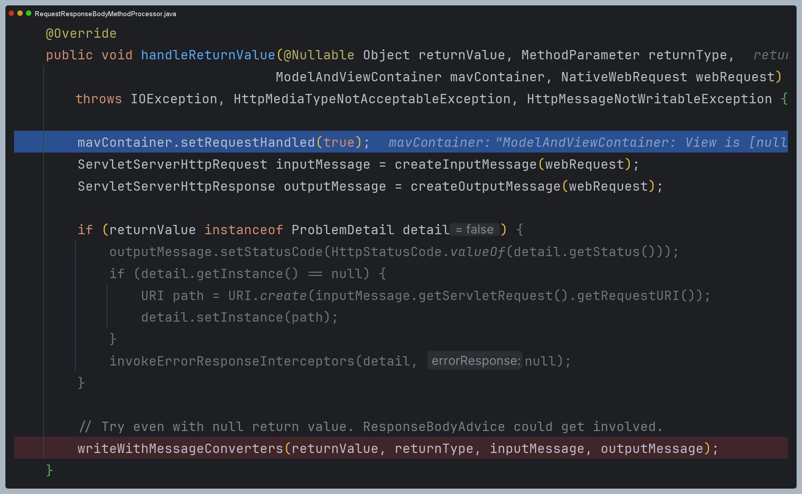
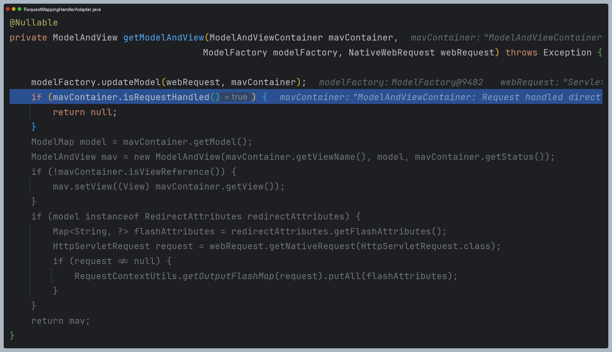
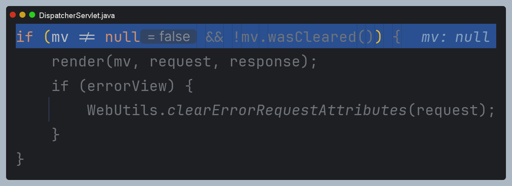
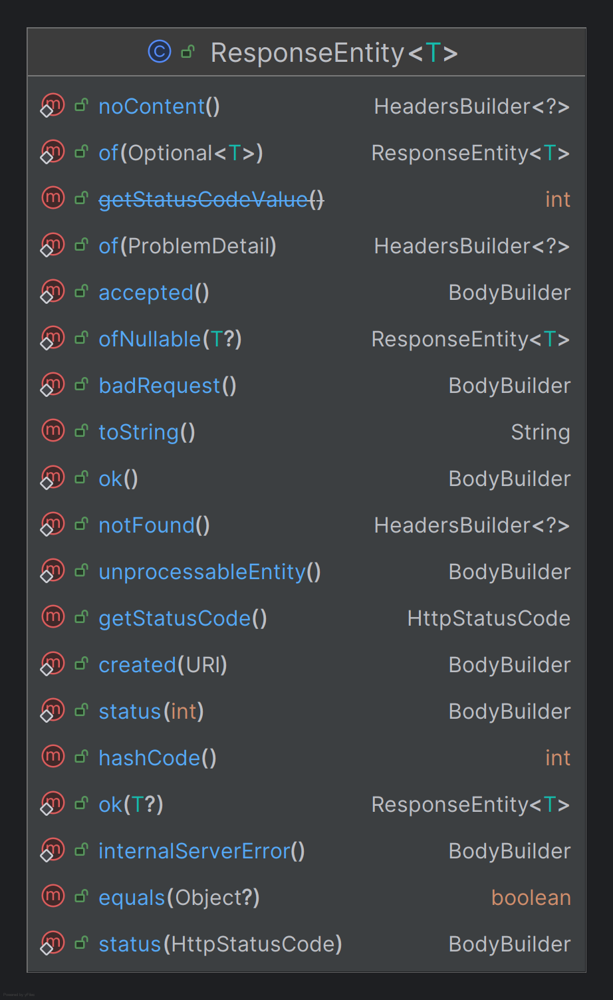
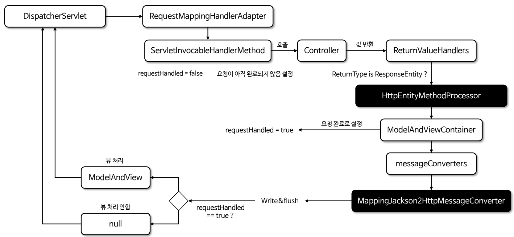

# Return Values 이해

스프링 MVC에서 컨트롤러 메서드의 반환 방식은 크게 **View**와 **HTTP 본문 응답**으로 나눌 수 있다.

1. **View 렌더링**
   - HTML과 같은 페이지를 클라이언트에게 반환한다.
   - 컨트롤러가 뷰 이름을 반환하고 뷰 레이어에서 해당 이름을 해석하여 적절한 HTML을 생성한다.
2. **HTTP 본문 응답**
   - JSON, XML 등 데이터 형식으로 응답을 직접 반환한다. 
   - 뷰가 아닌 데이터를 응답 본문에 담아 전달해서 클라이언트는 페이지가 아닌 데이터를 수신하게 된다.
   - REST API와 같은 데이터 중심의 애플리케이션에서 주로 사용된다.

## HandlerMethodReturnValueHandler



- 컨트롤러로부터 응답 결과를 받아 응답 처리를 위한 작업을 담당하는 인터페이스이다.
- 다양한 유형의 파라미터를 처리하기 위해 여러 기본 구현체들을 제공하고 있다.
- 개발자가 필요에 따라 직접 이 인터페이스를 구현할 수 있다.

> 참고 : [스프링이 제공하는 반환 타입](https://docs.spring.io/spring-framework/reference/web/webmvc/mvc-controller/ann-methods/return-types.html)

---

## View 렌더링 주요 반환 타입

1. **String** : 문자열로 뷰 이름을 반환하면 `ViewResolver`에 의해 해당 이름에 맞는 뷰가 렌더링 된다.
2. **ModelAndView** : 뷰 이름 외에도 모델 데이터를 함께 설정하여 전달할 수 있는 객체이다.
3. **View** : `View` 인터페이스를 구현한 객체를 직접 반환할 수 있다. 이 경우 `ViewResolver`에 의존하지 않고 특정 `View` 인스턴스를
직접 렌더링한다.
4. **Model** 또는 **Map** : 모델 데이터를 반환하면 뷰 이름은 요청 경로에 따라 자동으로 결정된다. `Model`이나 `Map`은 뷰에 전달할 데이터로만 사용된다.

```java
/*--------------컨트롤러--------------*/
// 1. String
@GetMapping("/home")
public String viewName() {
    return "home"; // ViewResolver에 의해 home.jsp 또는 home.html 렌더링
}

// 2. ModelAndView
@GetMapping("/modelAndView")
public ModelAndView modelAndView(Model model) {
    ModelAndView mav = new ModelAndView("home"); // 렌더링할 뷰 이름 설정
    model.addAttribute("message", "Hello World");  // 데이터 저장
    return mav;
}

// 3. View
@GetMapping(value = "/customView")
public ModelAndView getCustomView() {
    ModelAndView mav = new ModelAndView("customView");
    mav.addObject("message", "Hello, Custom View!");
    mav.addObject("status", "success");
    return mav;
}

// 4. Model or Map
@GetMapping("/model")
public Model model(Model model) {
    model.addAttribute("message", "Hello Model");
    return model;  // Model을 반환하여 데이터만 제공 (뷰 이름은 요청 경로를 기준으로 자동 결정)
}

/*--------------3. View 구현체--------------*/
public class CustomView implements View {
    private final ObjectMapper objectMapper = new ObjectMapper();

    @Override
    public String getContentType() {
        return "application/json";
    }

    @Override
    public void render(Map<String, ?> model, HttpServletRequest request, HttpServletResponse response) throws Exception {
        response.setContentType(getContentType());
        response.setCharacterEncoding("UTF-8");
        response.getWriter().write(objectMapper.writeValueAsString(model));
    }
}

/*--------------설정 클래스--------------*/
@Configuration
public class WebConfig {

    @Bean
    public ViewResolver viewResolver() {
        return (viewName, locale) -> {
            if ("customView".equals(viewName)) {
                return new CustomView(); // View 구현체를 반환
            }
            return null;
        };
    }
}
```

### ModelAndViewContainer



- 스프링 MVC가 내부적으로 요청 처리 시점에 자동으로 생성 및 관리하는 클래스이다.
- 요청 처리가 완료될 때까지 모델과 뷰 관련 데이터를 임시로 보관한다.

### ModelAndView



- 최종적으로 뷰를 렌더링 하기 위한 모델과 뷰의 정보를 제공하는 클래스이다.
- `ModelAndView` 객체를 직접 반환해도 되고 뷰 이름이나 뷰 객체를 반환하게 되면 내부적으로 `ModelAndView` 객체가 생성되어 응답을 구성한다.

---

## HTTP 본문 응답 주요 반환 타입

1. **@ResponseBody** : 컨트롤러 메서드의 반환 값을 `HttpMessageConverter`를 통해 JSON, XML 등으로 변환하여 응답 본문에 직접 작성한다.
2. **HttpEntity**, **ResponseEntity** : HTTP 응답을 구성할 수 있다.(헤더와 본문 모두) `ResponseEntity`는 상태 코드, 헤더, 본문을 모두 포함할 수 있어
더 정밀한 응답 구성이 가능하다.
3. **Callable**, **ListenableFuture**, **CompletableFuture** : 비동기 작업의 결과로 반환되는 타입을 사용할 수 있다.

```java
/*--------------컨트롤러--------------*/
// 1. @ResponseBody
@GetMapping("/user1")
@ResponseBody
public User user1() {
    return new User("hello",10);
    // User 객체가 JSON 형식으로 응답 본문에 작성된다.
}

// 2. ResponseEntity
@GetMapping("/user2")
public ResponseEntity<User> user2() {
    User user = new User("hello",10);
    return new ResponseEntity<>(user, HttpStatus.OK);
    // User 객체가 JSON 형식으로 반환되고 상태 코드는 200 OK가 된다
}

// 3. 비동기
@GetMapping("/user3")
public Callable<User> user3() {
    return () -> {
        Thread.sleep(2000);
        return new User("hello",10);
    };
    // 비동기 작업이 완료되면 User 객체가 JSON 형식으로 응답 본문에 작성된다.
}

@Data
@AllArgsConstructor
public static class User {
    private String username;
    private int age;
}
```

### @ResponseBody

- `@ResponseBody`는 메서드의 반환 값을 HTTP 응답 본문에 직접 직렬화하여 클라이언트에 전송하며 `HttpMessageConverter`를 사용하여 변환이 이루어진다.
- 일반적으로 컨트롤러는 HTTP 요청을 처리하고 View를 반환하는 방식으로 동작하는데 `@ResponseBody`를 사용하면 View를 반환하는 대신
메서드가 반환하는 객체를 바로 HTTP 응답 본문에 직렬화하여 전송하게 된다.

**흐름도 및 주요 내부 코드**



1. 핸들러에서 반환 값을 받고 `returnValueHandlers`를 호출하기 전에 `requestHandled`를 `false`로 설정한다.



2. `RequestResponseBodyMethodProcessor` 클래스에서 `requestHandled`를 `true`로 설정하고 `HttpMessageConverter`에 이후 작업을 넘긴다.



3. `requestHandled`가 `true`로 설정 되어 있기 때문에 `ModelAndView`를 반환하지 않는다.



4. `ModelAndView`가 `null`이기 때문에 렌더링 과정을 거치지 않는다.



### ResponseEntity

- `ResponseEntity`는 HTTP 응답을 나타내는 클래스로써 주로 응답 상태 코드, 헤더, 본문을 제어하고 반환하는 데 사용되며 `HttpEntity`를 상속하고 있다.
- `ResponseEntity`는 `@ResponseBody`와 비슷하지만 `@ResponseBody`는 메서드 반환 값을 HTTP 응답 본문으로 기록하는 반면
`ResponseEntity`는 상태 코드와 헤더, 본문까지 세밀하게 제어할 수 있는 기능을 제공한다.
- `ResponseEntity`는 `@RestController` 또는 `@ResponseBody`가 없어도 적절한 HTTP 응답을 반환할 수 있다.



```java
/*--------------ResponseEntity 사용 예제--------------*/
// 응답 본문 설정
@GetMapping("/body1")
public ResponseEntity<User> body1(@RequestBody User user) {
   return ResponseEntity.ok()
                        .body(user);
}

// 응답 본문 설정
@GetMapping("/body2")
public ResponseEntity<User> body2(@RequestBody User user) {
   return ResponseEntity.status(HttpStatus.OK)
                        .body(user);
}

// 생성자 방식
@GetMapping("/body3")
public ResponseEntity<User> body3(@RequestBody User user) {
   // 헤더 설정
   HttpHeaders headers = new HttpHeaders();
   headers.add("Custom-Header", "Custom-Value");
   return new ResponseEntity<>(user, headers, HttpStatus.CREATED);
}

// 빌더 패턴
@GetMapping("/body4")
public ResponseEntity<User> body4(@RequestBody User user) {
   return ResponseEntity.status(HttpStatus.CREATED)
                        .header("Custom-Header", "Custom-Value") // 헤더 설정
                        .location(URI.create("/users/" + user.getId())) // Location 설정
                        .body(user);
}

@Data
@AllArgsConstructor
public static class User {
   private Long id;
   private String username;
   private int age;
}
```

**흐름도는 처리되는 `ReturnValueHandler` 클래스만 다를 뿐 나머지는 모두 `@ResponseBody`와 똑같이 처리된다.**

