# @SessionAttributes

- `@SessionAttributes`는 세션에 속성 값을 저장하고 그 값을 다른 요청에서도 사용할 수 있도록 하기 위해 사용하는 어노테이션이다.
- `@SessionAttributes`는 클래스 레벨에 선언되며 특정 모델 속성 이름을 지정하면 세션에 자동으로 저장된다.
- `@SessionAttributes`는 모델에 저장된 객체를 세션에 저장하는 역할과 세션에 저장된 객체를 모델에 저장하는 역할을 한다.

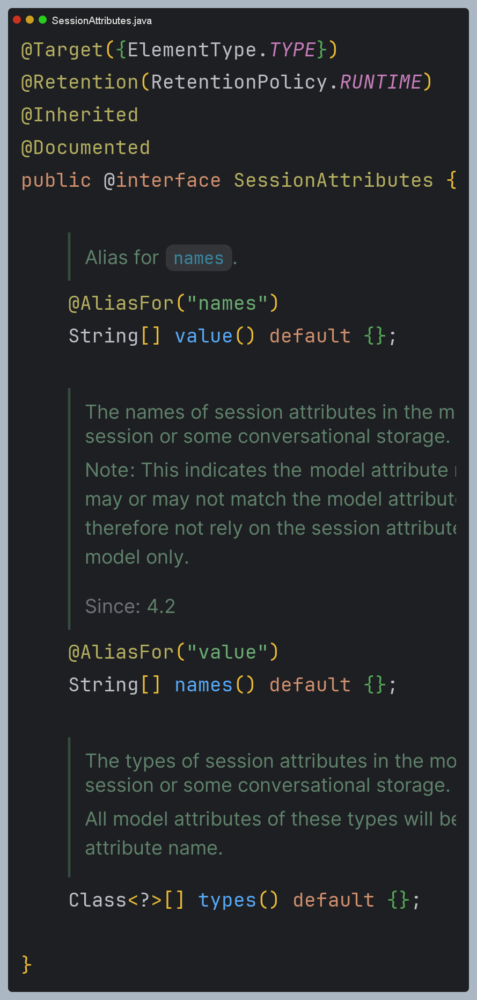

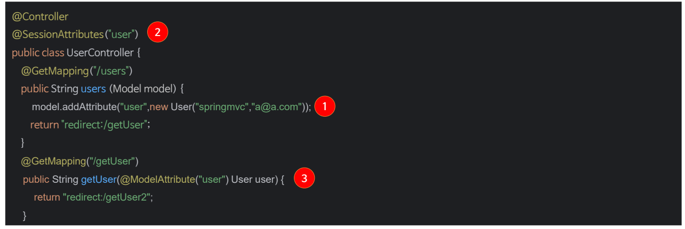

- 예를 들어 `/users`로 요청하면 다음과 같이 처리된다.
  - `@SessionAttributes`가 정의되어 있을 경우 우선 세션에서 객체를 찾고 존재하지 않으면 다음을 수행한다.
  - `users()`가 호출되어 `Model`에 객체를 저장한다.
  - `users()` 실행 이후 `@SessionAttributes`의 속성명과 모델에 저장한 **속성명이 동일한 경우** 세션에 객체를 저장한다.
  - `getUser()`를 실행하면 2번 과정을 통해 세션에 저장된 객체가 `Model`에 저장되며 `Model`로부터 객체를 꺼내 매개변수로 전달한다.
- 만약 `@ModelAttribute`의 속성명과 `@SessionAttributes`의 속성명이 서로 일치하지 않거나, `Model`에 먼저 객체를 저장하는
    과정이 없다면 `Expected session attribute {객체 이름}`과 같은 오류가 발생한다.
- 따라서 속성명을 반드시 일치시키고 `model.addAttribute(...)`로 객체를 직접 추가하거나 메서드에 `@ModelAttribute`를 선언하여
`Model`에 담긴 객체를 세션에 연결해 주도록 해야 한다.

## SessionStatus

- 스프링에서는 `SessionStatus`를 사용하여 세션 데이터를 제거할 수 있으며 세션 초기화 후에는 보통 다른 페이지로
리다이렉트하여 새로운 세션이 시작될 준비를 한다.
- 세션 초기화는 서버에서 특정 세션에 저장된 데이터를 삭제하고 세션 상태를 초기화하는 과정을 말한다.

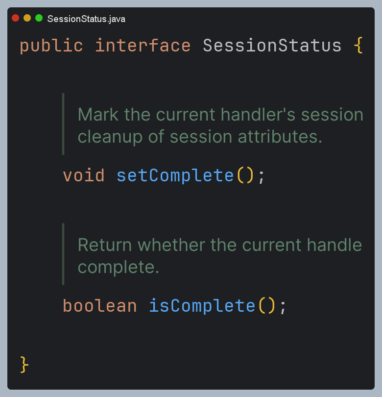

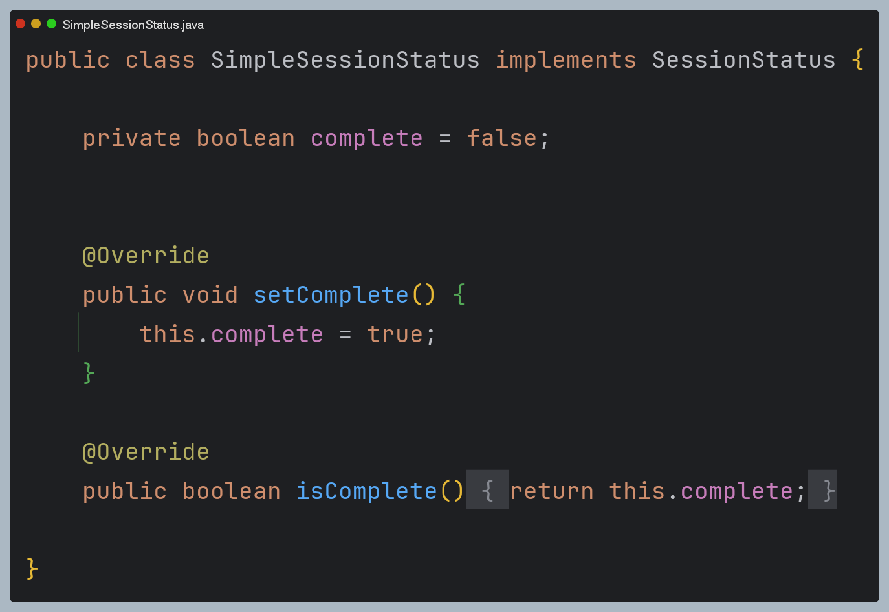

- 이때 세션 초기화 범위는 핸들러(컨트롤러)에서 `@SessionAttributes`로 선언된 세션 속성들에 한정된다.
- 즉 `setComplete()`는 해당 핸들러에서 관리하는 특정 세션 속성들만이 초기화 대상이고, 다른 곳에서 저장된 세션 데이터나
전체 세션 자체를 삭제하지는 않는다.
- 만약 세션 전체 무효화를 하기 위해서는 `HttpSession.invalidate()`를 사용할 수 있다.

## 흐름도 - 첫 요청

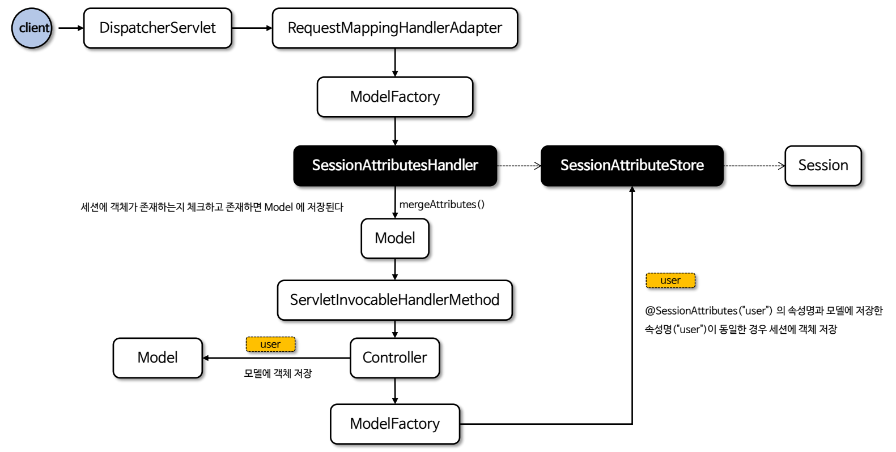

### 주요 내부 코드

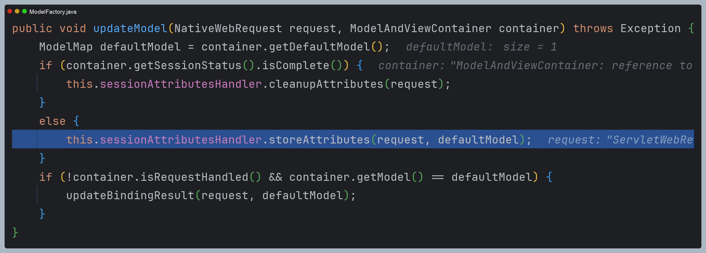

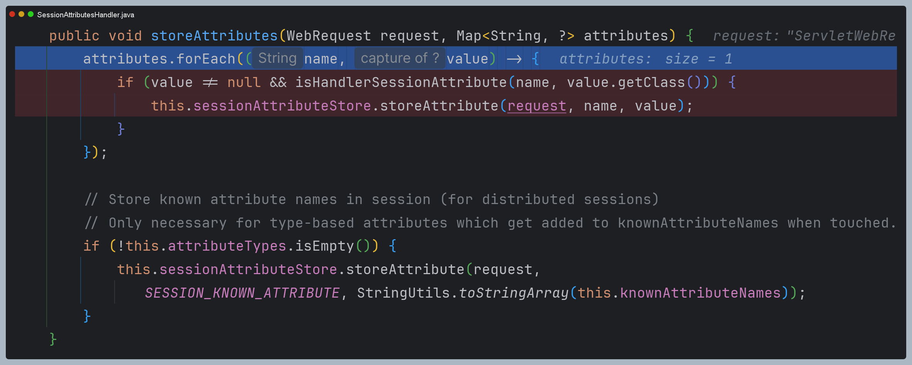

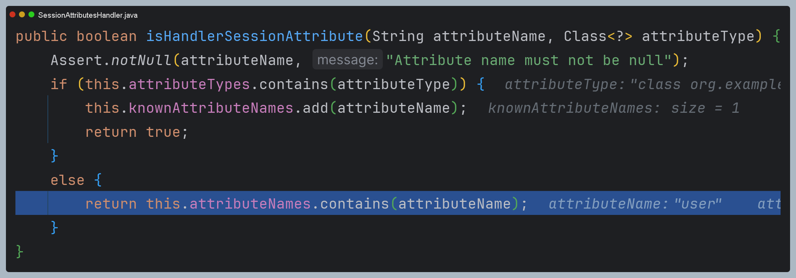

## 흐름도 - 재요청

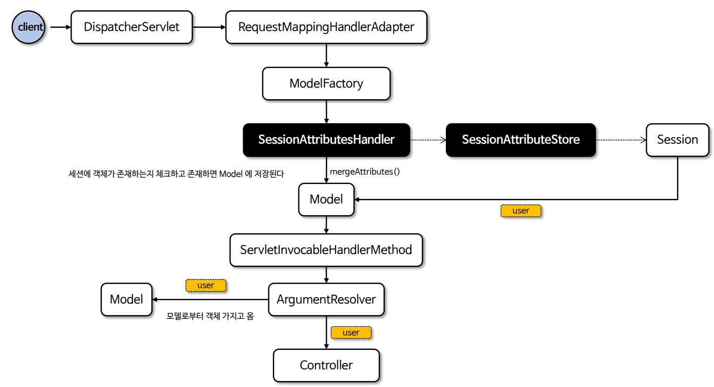

### 주요 내부 코드

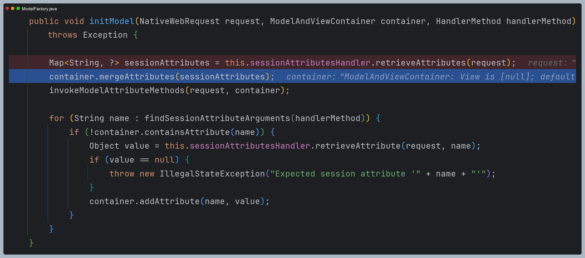

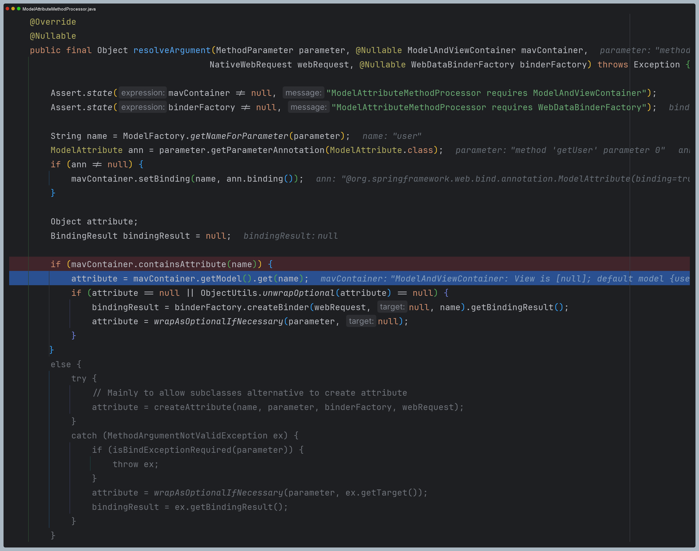

## 흐름도 - 예외 상황

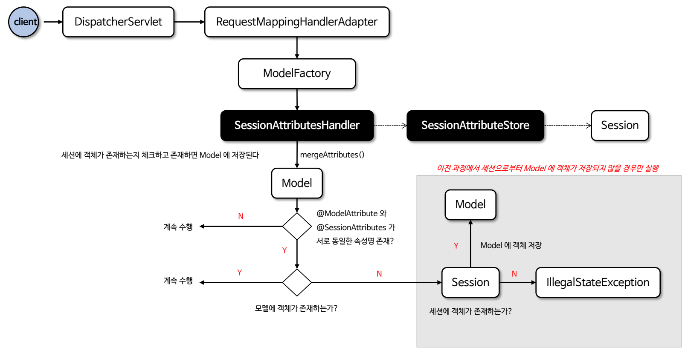

### 주요 내부 코드

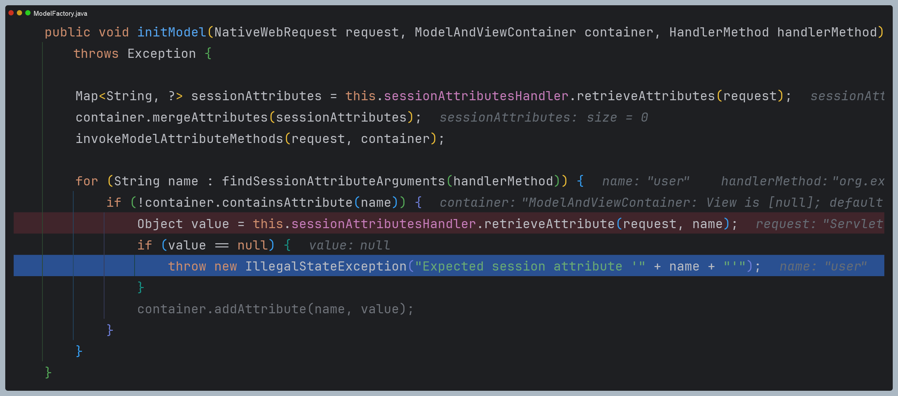

---

# @SessionAttribute

- `@SessionAttribute`는 세션에 저장된 특정 속성값을 메서드 파라미터로 가져오기 위해 사용되는 어노테이션이다.
- 세션에 저장된 속성값을 컨트롤러 메서드에 직접 접근할 수 있도록 해주며 전역적으로 관리되는 세션 속성에 접근할 때 유용하다.
- 내부적으로 `SessionAttributeMethodArgumentResolver` 클래스가 사용된다.

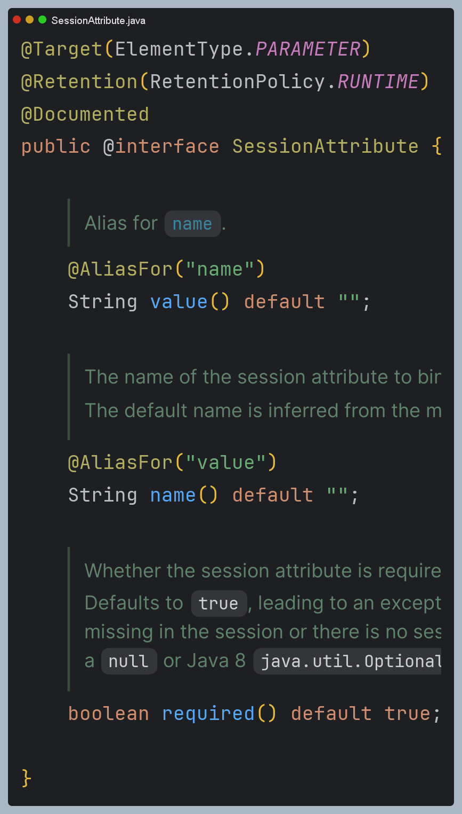
