# HandlerMapping 원리

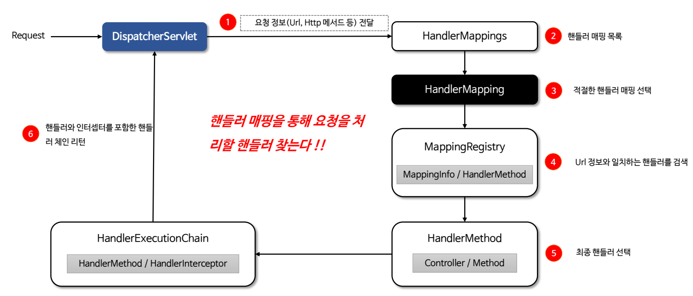

- `HandlerMapping`은 요청 URL과 이를 처리할 핸들러(일반적으로 컨트롤러)를 매핑하는 인터페이스이다.
- 클라이언트 요청이 들어오면 `DispatcherServlet`은 등록된 `HandlerMapping` 구현체를 탐색하여 적합한 핸들러를 찾아 반환하고
이후 적절한 `HandlerAdapter`를 통해 실행한다.
- `HandlerMapping`은 핸들러를 검색해서 찾는 역할만 할 뿐 핸들러를 실행하지 않는다. 핸들러 실행은 `HandlerAdapter`가 담당한다.

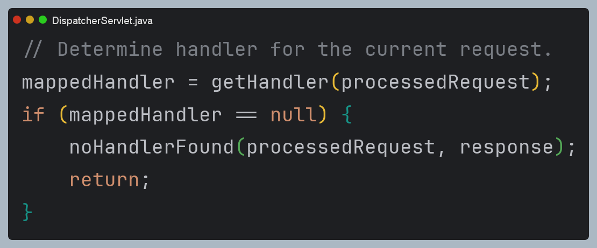

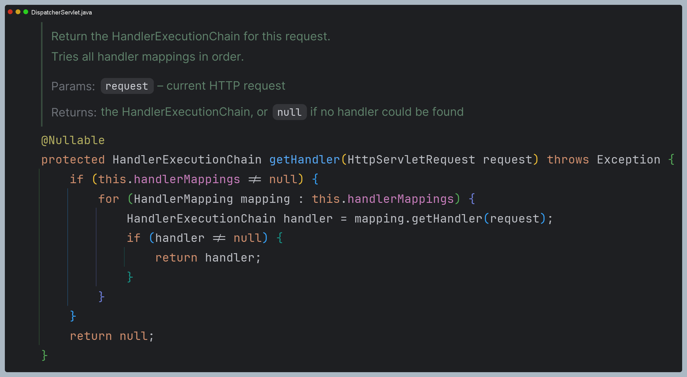

> `HandlerMapping` 구현체로 `BeanNameUrlHandlerMapping`, `SimpleUrlHandlerMapping` 등이 있지만 가장 우선순위가 높고
> 현재 가장 많이 사용하는 구현체는 **`RequestMappingHandlerMapping`** 이다.
> 
> 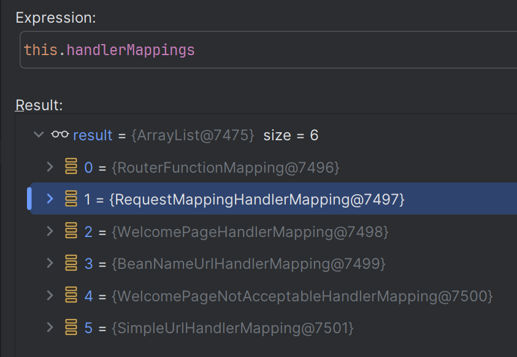

## HandlerMapping 설계 의도

- `DispatcherServlet`은 수 많은 요청들을 핸들러를 통해서 처리하는데 현재 요청이 어떤 핸들러에 의해 처리될 것인지 결정해서
  `DispatcherServlet`에게 알려 주어야 한다.
- `HandlerMapping`은 클라이언트의 요청 URL 정보를 분석해서 해당 URL과 매핑이 되어 있는 핸들러를 결정한다.

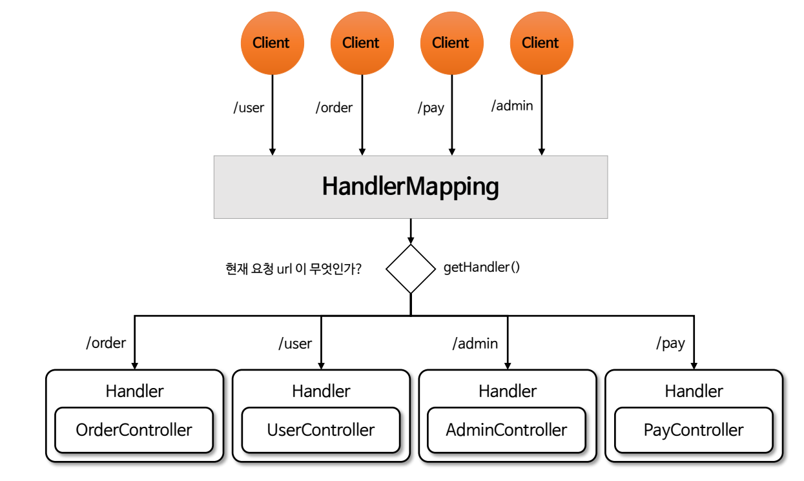

---

# RequestMappingHandlerMapping

**`RequestMappingHandlerMapping`** 은 `@RequestMapping`이 선언된 핸들러와 URL 경로를 매핑하고 검색하는 기능을 제공한다.

1. `RequestMappingHandlerMapping`은 스프링 부트 초기화 과정에서 `@RequestMapping`이 선언된 모든 핸들러를 검사하고 검사 결과
해당 핸들러와 URL 경로를 매핑하여 저장소에 저장한다.
2. 클라이언트 요청이 들어오면 매핑 저장소로부터 URL 패턴과 일치하는 핸들러를 검색하고 적합한 핸들러를 찾아 반환한다.

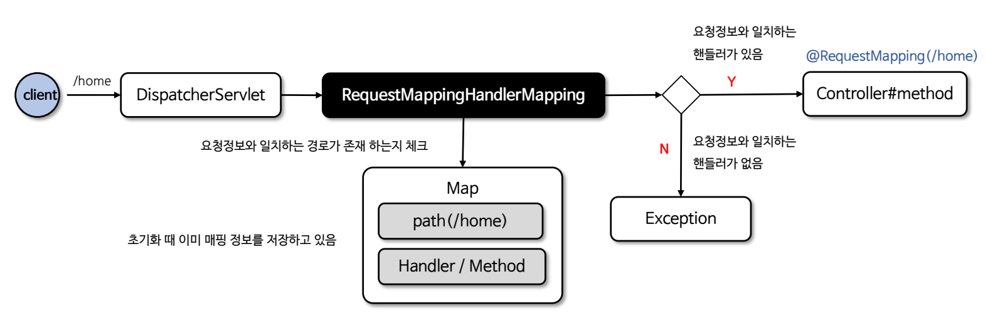

## @RequestMapping 핵심 클래스

- `RequestMappingHandlerMapping`
- `HandlerMethod`
  - 핸들러 객체로써 최종 호출할 컨트롤러와 메서드 정보를 포함하고 있다.
  - 메서드의 매개변수, 반환값, 메서드에 정의된 어노테이션 등에 쉽게 접근할 수 있는 기능을 제공한다.
- `RequestMappingInfo`
  - `@RequestMapping`에 선언된 여러 속성들의 값들을 추출해서 가지고 있는 객체
- `MappingRegistry`
  - 모든 `HandlerMethod` 및 매핑된 경로를 저장하고 관리하는 클래스로써 요청을 처리할 핸들러를 조회할 수 있다.
- `HandlerExecutionChain`
  - `HandlerMethod`와 `HandlerInterceptor`를 포함하고 있으며 `HandlerAdapter`에게 전달된다.

**초기화 매핑 예**

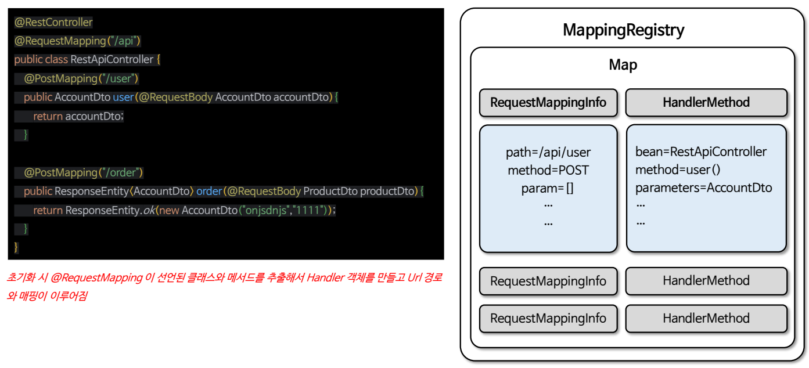

`RequestMappingInfo`에는 `@RequestMapping` 정보들이 저장 되어 있으며 `HandlerMethod`에는 컨트롤러와 메서드 정보가 들어 있다.

### 초기화 과정 디버깅

예제 컨트롤러

```java
@RestController
public class HomeController {

    @GetMapping("/user")
    public User user(User user) {
        return user;
    }

    @GetMapping("/product")
    public Product product(Product product) {
        return product;
    }
}
```

1. **스프링에 등록된 빈들 중 핸들러를 찾아서 초기화 수행**

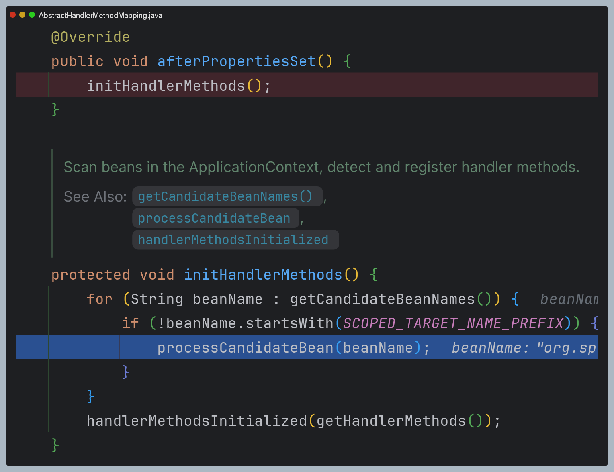

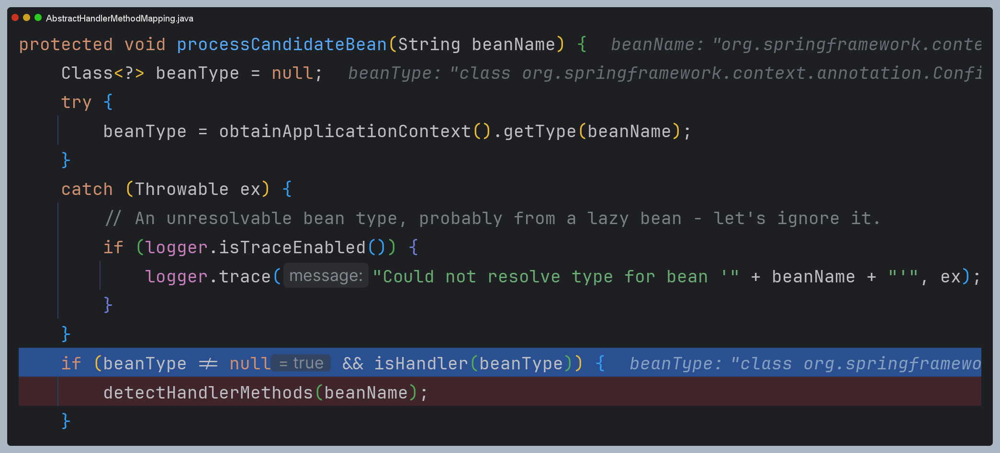

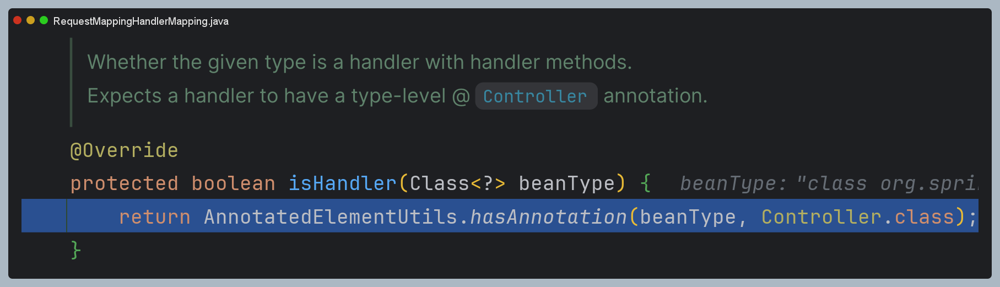

2. **`@RequestMapping` 어노테이션 정보를 가지고 `RequestMappingInfo`를 생성**

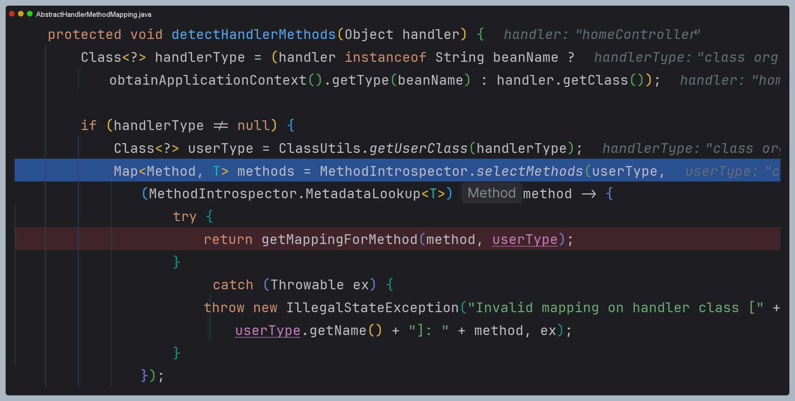

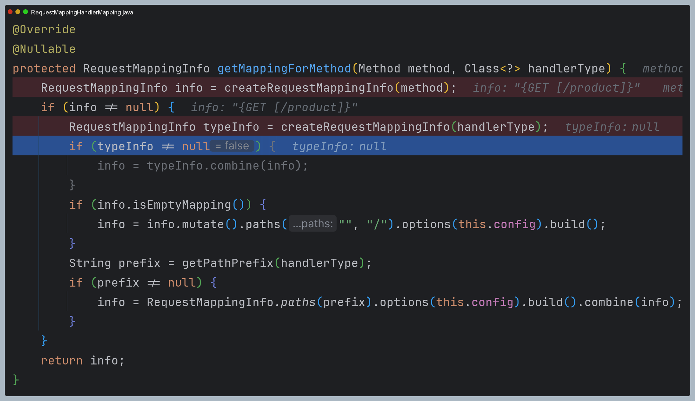

- `info`는 메서드 수준이고, `typeInfo`는 클래스 수준이다. 즉 클래스에 `@RequestMapping`이 선언되어 있으면 하위 메서드
수준에 모두 적용시킨다.

3. **추출된 매핑 정보를 저장소에 저장**

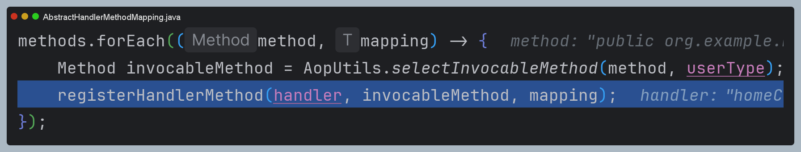

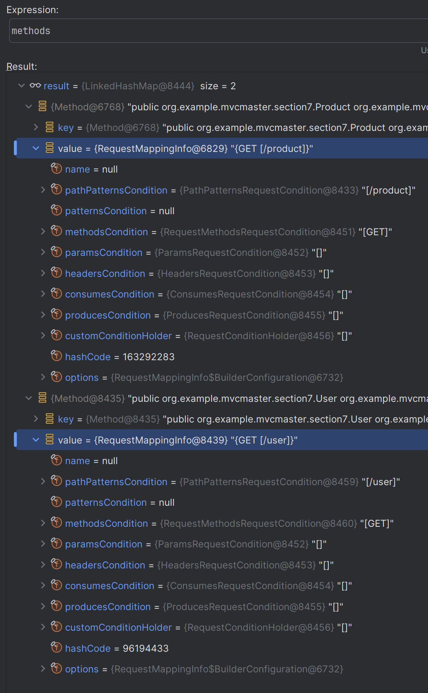

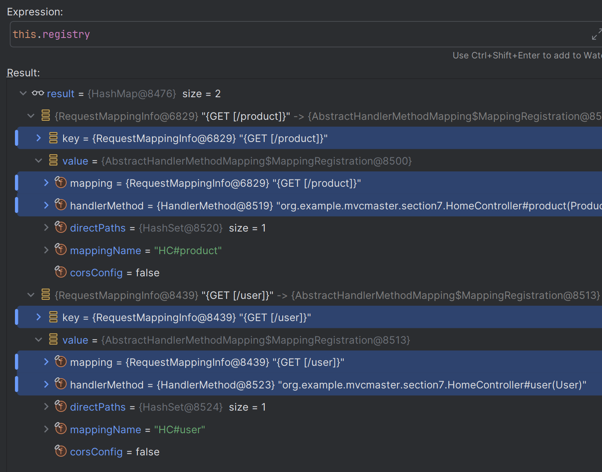

### 요청 흐름 디버깅

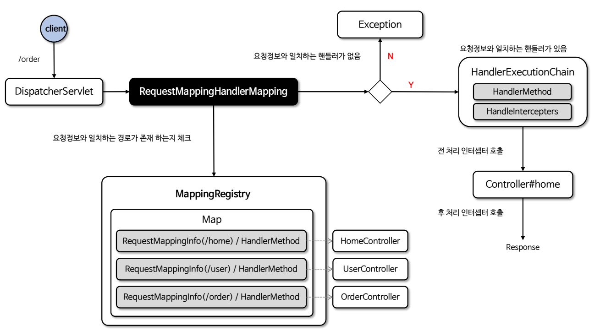

1. `handlerMappings` 조회

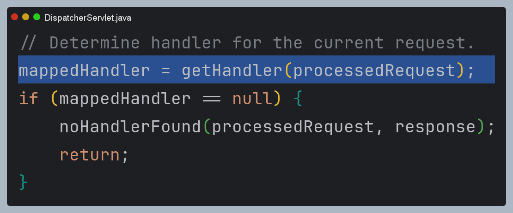

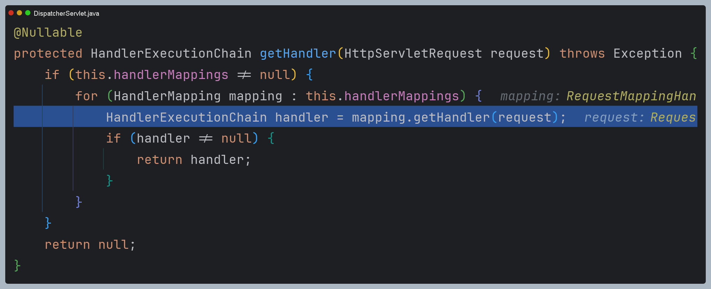

2. `RequestMappingHandlerMapping`에서 처리

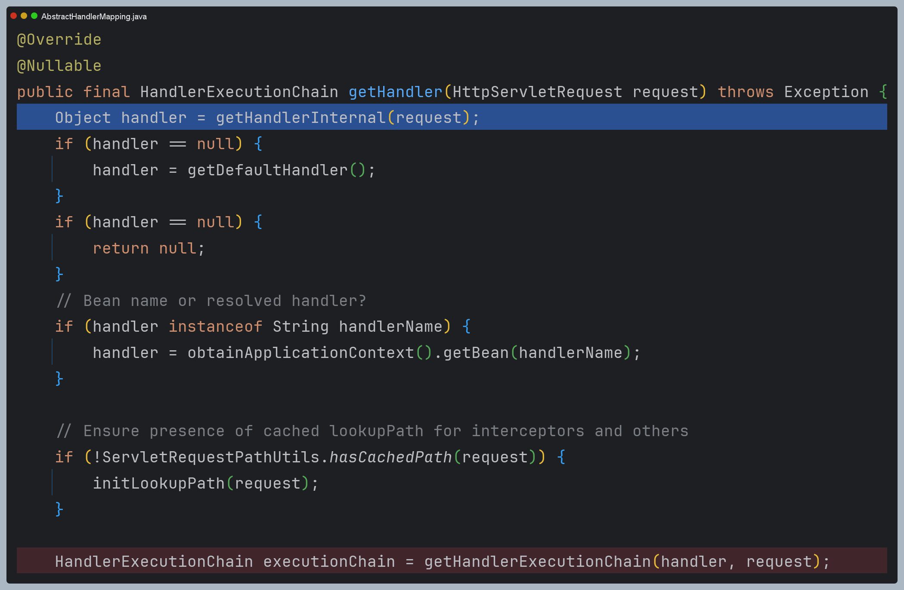

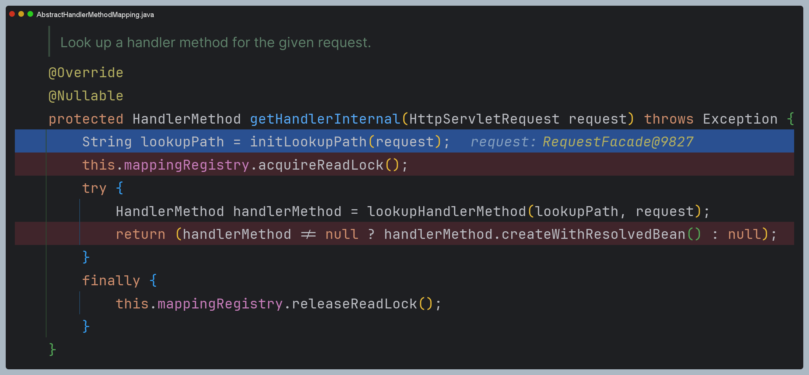

`MappingRegistry`에서 `HandlerMethod`를 찾고, 이를 인터셉터와 함께 `HandlerExecutionChain` 형태로 반환한다.

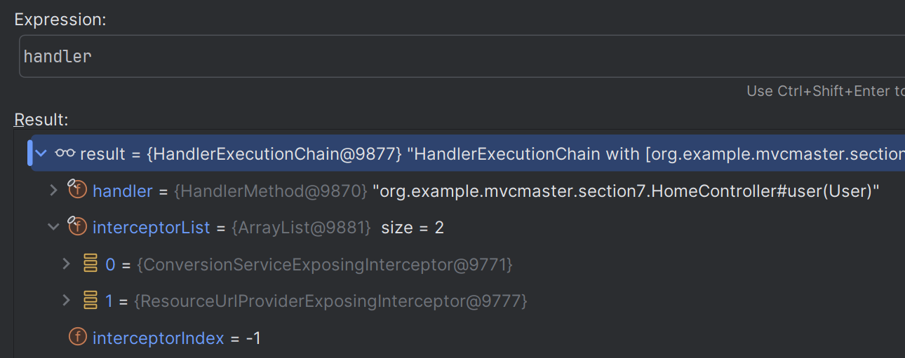