# 핸들러 메서드 호출 원리 이해

> 사전 지식 : [리플렉션](https://github.com/geun-00/TIL/blob/main/Java/adv_1/reflection/reflection.md)

- 스프링의 핸들러 메서드를 호출하기 위해 내부적으로 사용되는 클래스는 `InvocableHandlerMethod`와 이를 확장한 
`ServletInvocableHandlerMethod` 클래스가 있다.
- 메서드 호출 시 메서드 파라미터를 해석하기 위한 `HandlerMethodArgumentResolver`와 메서드 반환 값을 처리하기 위한
`HandlerMethodReturnValueHandler`와 같은 클래스와 연계하여 요청을 처리한다.
- `InvocableHandlerMethod`는 범용적 메서드 호출 클래스이며, `ServletInvocableHandlerMethod` HTTP 요청 및 응답 처리
클래스로 구분할 수 있다.

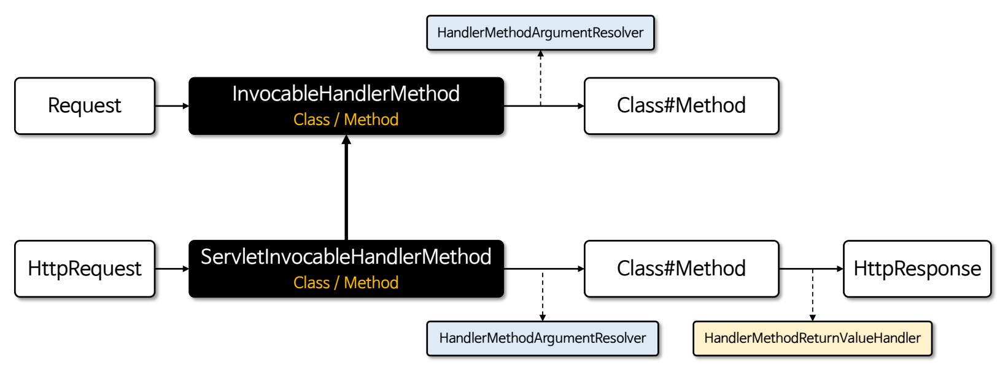

## InvocableHandlerMethod

- HTTP 프로토콜에 독립적이며 범용적인 메서드 호출 기능을 제공하고 매개변수 처리를 위해 `HandlerMethodArgumentResolver`를 사용한다.
- 메서드를 호출한 결과를 반환하지만 내부적으로 반환값을 추가로 처리하지는 않는다.

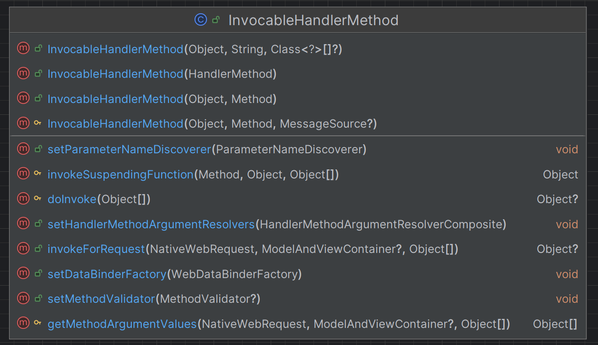

**InvocableHandlerMethod 사용 예제**

```java
/*--------------------Service--------------------*/
@Service
public class MyService {
    public String processRequest(User user) {
        return "Hello from MyService, " + user.getUsername() + ": " + user.getEmail();
    }
}

/*--------------------ArgumentResolver--------------------*/
public class MyArgumentResolver implements HandlerMethodArgumentResolver {

    @Override
    public boolean supportsParameter(MethodParameter parameter) {
        return parameter.getParameterType().equals(User.class);
    }

    @Override
    public Object resolveArgument(MethodParameter parameter,
                                  ModelAndViewContainer mavContainer,
                                  NativeWebRequest webRequest,
                                  WebDataBinderFactory binderFactory) {
        User user = new User();
        user.setUsername(webRequest.getParameter("username"));
        user.setEmail(webRequest.getParameter("email"));

        return user;
    }
}

/*--------------------Controller--------------------*/
@Controller
@RequiredArgsConstructor
public class MyController {

    private final MyService myService;

    @GetMapping("/invokeService1")
    public void invokeService1(HttpServletRequest request, HttpServletResponse response) throws Exception {

        //Service 클래스의 메서드 정보를 가져옴
        Method serviceMethod = myService.getClass().getMethod("processRequest", User.class);

        //InvocableHandlerMethod 생성
        InvocableHandlerMethod invocableHandlerMethod = new InvocableHandlerMethod(myService, serviceMethod);

        //Service 메서드 파라미터 해석을 위해 ArgumentResolver 설정
        HandlerMethodArgumentResolverComposite resolver = new HandlerMethodArgumentResolverComposite();
        resolver.addResolvers(new MyArgumentResolver());
        invocableHandlerMethod.setHandlerMethodArgumentResolvers(resolver);

        //요청 처리 객체 생성
        ServletWebRequest servletWebRequest = new ServletWebRequest(request, response);

        //모델 데이터 저장을 위해 필요
        ModelAndViewContainer modelAndViewContainer = new ModelAndViewContainer();

        //리플렉션으로 Service 메서드를 호출
        Object result = invocableHandlerMethod.invokeForRequest(servletWebRequest, modelAndViewContainer);

        //결과를 응답으로 출력
        response.getWriter().write(result.toString());
    }
}
```

## ServletInvocableHandlerMethod

- `InvocableHandlerMethod` 클래스를 상속한 클래스로 Servlet 환경(HttpServletRequest / HttpServletResponse)에 특화되어 있으며
HTTP 요청 및 응답을 포함한 핸들러 메서드를 호출한다.
- 메서드의 반환 값을 `HandlerMethodReturnValueHandler`를 통해 처리할 수 있으며 메서드 레벨의 `@ResponseStatus` 어노테이션을 지원하여
HTTP 응답 상태를 설정할 수 있다.

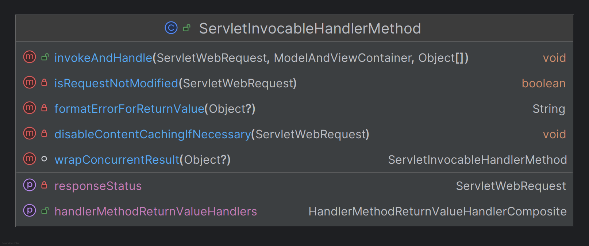

**ServletInvocableHandlerMethod 사용 예제**

```java
/*--------------------Service--------------------*/
@Service
public class MyService {
    public String processRequest(User user) {
        return "Hello from MyService, " + user.getUsername() + ": " + user.getEmail();
    }
}

/*--------------------ArgumentResolver--------------------*/
public class MyArgumentResolver implements HandlerMethodArgumentResolver {

    @Override
    public boolean supportsParameter(MethodParameter parameter) {
        return parameter.getParameterType().equals(User.class);
    }

    @Override
    public Object resolveArgument(MethodParameter parameter,
                                  ModelAndViewContainer mavContainer,
                                  NativeWebRequest webRequest,
                                  WebDataBinderFactory binderFactory) {
        User user = new User();
        user.setUsername(webRequest.getParameter("username"));
        user.setEmail(webRequest.getParameter("email"));

        return user;
    }
}

/*--------------------ReturnValueHandler--------------------*/
public class MyReturnValueHandler implements HandlerMethodReturnValueHandler {

    @Override
    public boolean supportsReturnType(MethodParameter returnType) {
        return returnType.getParameterType().equals(String.class);
    }

    @Override
    public void handleReturnValue(Object returnValue,
                                  MethodParameter returnType,
                                  ModelAndViewContainer mavContainer,
                                  NativeWebRequest webRequest) {
        if (returnValue != null) {
            mavContainer.addAttribute("result", returnValue);
        }
    }
}

/*--------------------Controller--------------------*/
@Controller
@RequiredArgsConstructor
public class MyController {

    private final MyService myService;

    @GetMapping("/invokeService2")
    public void invokeService2(HttpServletRequest request, HttpServletResponse response) throws Exception {

        //Service 클래스의 메서드 정보를 가져옴
        Method serviceMethod = myService.getClass().getMethod("processRequest", User.class);

        //ServletInvocableHandlerMethod 생성
        ServletInvocableHandlerMethod invocableHandlerMethod = new ServletInvocableHandlerMethod(myService, serviceMethod);

        //Service 메서드 파라미터 해석을 위해 ArgumentResolver 설정
        HandlerMethodArgumentResolverComposite resolver = new HandlerMethodArgumentResolverComposite();
        resolver.addResolvers(new MyArgumentResolver());
        invocableHandlerMethod.setHandlerMethodArgumentResolvers(resolver);

        //Service 메서드 반환값 처리를 위해 ReturnValueHandler 설정
        HandlerMethodReturnValueHandlerComposite returnValueHandler = new HandlerMethodReturnValueHandlerComposite();
        returnValueHandler.addHandler(new MyReturnValueHandler());
        invocableHandlerMethod.setHandlerMethodReturnValueHandlers(returnValueHandler);

        //요청 처리 객체 생성
        ServletWebRequest servletWebRequest = new ServletWebRequest(request, response);

        //모델 데이터 저장을 위해 필요
        ModelAndViewContainer modelAndViewContainer = new ModelAndViewContainer();

        //리플렉션으로 Service 메서드를 호출
        invocableHandlerMethod.invokeAndHandle(servletWebRequest, modelAndViewContainer);
        if (modelAndViewContainer.containsAttribute("result")) {
            //ModelAndViewContainer에 저장된 값으로 응답 작성
            response.getWriter().write(modelAndViewContainer.getModel().get("result").toString());
        }
    }
}
```

---

# 메서드 파라미터 실행 구조 이해

**핵심 클래스**
- **ServletInvocableHandlerMethod**
  - HTTP 요청 데이터를 받아 메서드를 실행시키는 클래스
  - `HandlerMethodArgumentResolver`를 통해 요청 데이터를 메서드의 매개변수에 맞게 변환하고 이를 사용해 메서드를 호출한다.
- **AnnotatedMethod**
  - 호출 메서드 및 메서드 파라미터 정보를 가지고 있으며 파라미터에 어노테이션 정보를 탐색할 수 있다.
- **MethodParameter**
  - 메서드에 있는 파라미터의 정보를 관리하는 클래스
  - 메서드의 어노테이션을 분석하고 파라미터가 어디에 있고 어떤 타입인지를 편리하게 알 수 있게 해준다.
- **MethodIntrospector**
  - 메서드를 탐색할 수 있게 해주는 클래스
  - 어노테이션이 적용된 메서드들의 리스트를 구하거나 메서드의 메타데이터를 찾도록 도와준다.

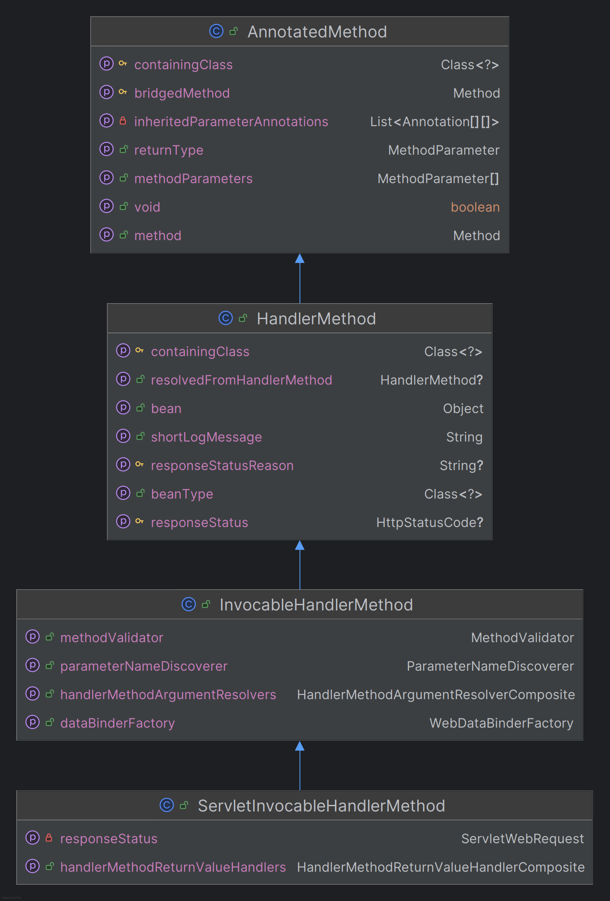

## MethodIntrospector 

- 스프링 부트 초기화 시점에 빈 클래스들을 스캔하면서 `@RequestMapping`이 선언된 `Method` 객체들을 생성한다.
- [참고 - @RequestMapping 초기화 과정](https://github.com/geun-00/TIL/blob/main/Spring/springmvc_1/handlerMapping/HandlerMapping.md#requestmappinghandlermapping)

## AnnotatedMethod & MethodParameter

스캔한 메서드들의 파라미터 메타 정보들을 가지는 `MethodParameter` 객체를 생성한다.

```java
/*---------------예제 컨트롤러---------------*/
@RestController
public class MyController {

    @GetMapping("/method1")
    public User method1(@RequestParam("username") String name, @ModelAttribute User user, Model model) {
        return user;
    }

    @GetMapping("/method2")
    public String method2(HttpServletRequest request, HttpServletResponse response) {
        return "Hello, World";
    }

    @Data
    @AllArgsConstructor
    @NoArgsConstructor
    public static class User {
        private String username;
        private String email;
    }
}
```

`method1`의 파라미터 메타 정보
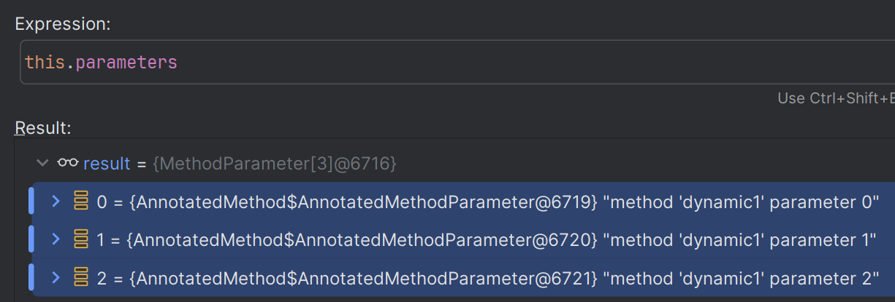

`method2`의 파라미터 메타 정보
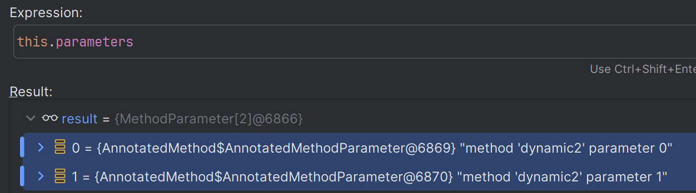

## ServletInvocableHandlerMethod

- `InvocableHandlerMethod` 클래스를 확장한 웹 처리용 클래스로써 핸들러의 메서드를 호출하는 기능을 가지고 있다.
- HTTP 요청 정보를 분석하고 해당 요청에 매핑되어 있는 `AnnotatedMethod` 객체를 찾아 새로운 `ServletInvocableHandlerMethod`를 생성하고 전달한다.
- `AnnotatedMethod`에 저장되어 있는 `Method`, `MethodParameter` 정보들을 `ServletInvocableHandlerMethod`에 복사한다.

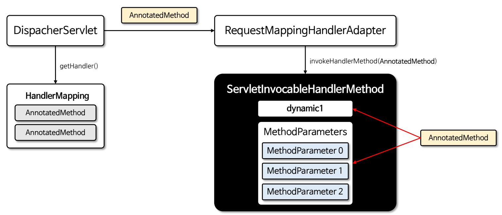

`RequestMappingHandlerAdapter`에서 HTTP 요청 마다 새로운 `ServletInvocableHandlerMethod`를 생성한다.

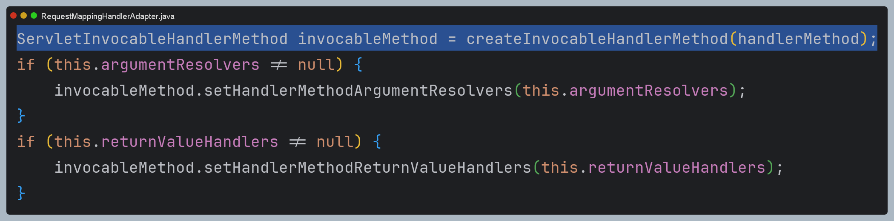

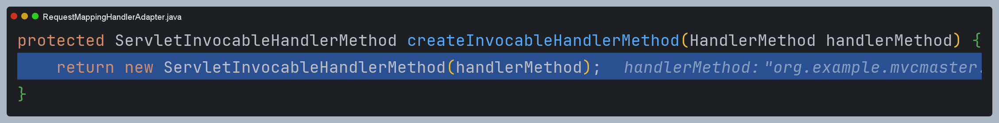

- `super()` 생성자를 반복해 최상위 클래스인 `AnnotatedMethod` 클래스까지 가서 초기화 시점에 초기화된 메서드와 파라미터 정보들을 그대로 복사한다.
- 이후 요청 처리에서는 이 복사된 값들을 그대로 사용한다.

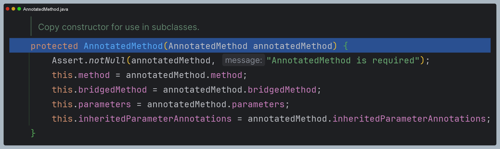

> **메서드 파라미터 실행 흐름도 요약**
> 
> 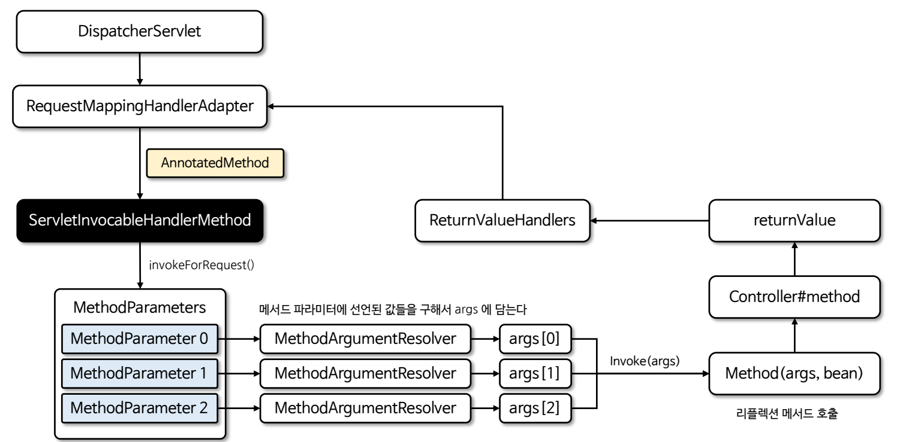