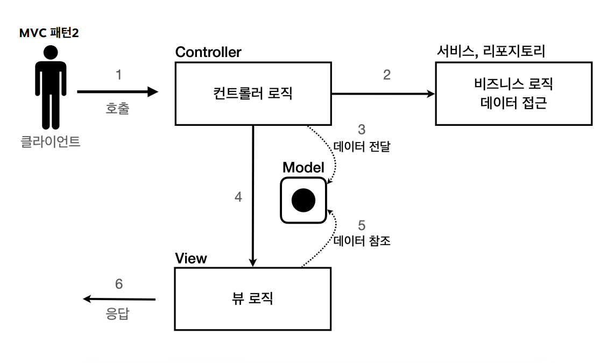

# JSP와 MVC 패턴
서블릿과 JSP로 회원 관리 웹 애플리케이션 만들기 예제

## 순수하게 서블릿으로만
도메인
```java
@Getter @Setter
@NoArgsConstructor
@ToString
public class Member {
    private Long id;
    private String username;
    private int age;

    public Member(String username, int age) {
        this.username = username;
        this.age = age;
    }
}
```
레포지토리
```java
public class MemberRepository {
    /**
     * 실무에서는 동시성 문제로 ConcurrentHashMap, AtomicLong을 사용하는 것이 좋다.
     */
    private static Map<Long, Member> store = new HashMap<>();
    private static long sequence = 0L;

    //싱글톤
    private static final MemberRepository instance = new MemberRepository();

    public static MemberRepository getInstance() {
        return instance;
    }

    private MemberRepository() {
    }
    //싱글톤

    public Member save(Member member) {
        member.setId(++sequence);
        store.put(member.getId(), member);
        return member;
    }

    public Member findById(Long id) {
        return store.get(id);
    }

    public List<Member> findAll() {
        return new ArrayList<>(store.values());
    }

    public void clearStore() {
        store.clear();
    }
}
```
테스트코드
```java
class MemberRepositoryTest {

    MemberRepository memberRepository = MemberRepository.getInstance();

    @AfterEach
    void afterEach() {
        memberRepository.clearStore();
    }

    @Test
    @DisplayName("회원가입에 성공한다.")
    void save() {
        // given
        Member member = new Member("hello", 20);
        // when
        Member savedMember = memberRepository.save(member);
        // then
        Member findMember = memberRepository.findById(savedMember.getId());
        assertThat(findMember).isEqualTo(savedMember);
    }

    @Test
    @DisplayName("회원 목록 조회에 성공한다.")
    void findAll() {
        // given
        Member member1 = new Member("member1", 10);
        Member member2 = new Member("member2", 10);
        // when
        memberRepository.save(member1);
        memberRepository.save(member2);

        List<Member> result = memberRepository.findAll();
        // then
        assertThat(result.size()).isEqualTo(2);
        assertThat(result).contains(member1, member2);
    }
}
```

서블릿으로 회원 등록 HTML 폼 제공
```java
@WebServlet(name = "memberFormServlet", urlPatterns = "/servlet/members/new-form")
public class MemberFormServlet extends HttpServlet {

    @Override
    protected void service(HttpServletRequest request, HttpServletResponse response) throws ServletException, IOException {
        response.setContentType("text/html");
        response.setCharacterEncoding("utf-8");

        PrintWriter w = response.getWriter();

        w.write("<!DOCTYPE html>\n" +
                "<html>\n" +
                "<head>\n" +
                "    <meta charset=\"UTF-8\">\n" +
                "    <title>Title</title>\n" +
                "</head>\n" +
                "<body>\n" +
                "<form action=\"/servlet/members/save\" method=\"post\">\n" +
                "    username: <input type=\"text\" name=\"username\" />\n" +
                "    age:      <input type=\"text\" name=\"age\" />\n" +
                "    <button type=\"submit\">전송</button>\n" +
                "</form>\n" +
                "</body>\n" +
                "</html>\n");
    }
}
```
개발자가 일일이 HTML 폼을 자바코드로 적어줘야 한다.

HTML Form에서 데이터를 입력하고 전송을 눌렀을 때 데이터를 처리할 서블릿
```java
@WebServlet(name = "memberSaveServlet", urlPatterns = "/servlet/members/save")
public class MemberSaveServlet extends HttpServlet {
    private final MemberRepository memberRepository = MemberRepository.getInstance();

    @Override
    protected void service(HttpServletRequest request, HttpServletResponse response) throws ServletException, IOException {
        System.out.println("MemberSaveServlet.service");

        String username = request.getParameter("username");
        int age = Integer.parseInt(request.getParameter("age"));

        Member member = new Member(username, age);
        System.out.println("member = " + member);
        memberRepository.save(member);

        response.setContentType("text/html");
        response.setCharacterEncoding("utf-8");
        PrintWriter w = response.getWriter();

        w.write("<html>\n" +
                "<head>\n" +
                "    <meta charset=\"UTF-8\">\n" +
                "</head>\n" +
                "<body>\n" +
                "성공\n" +
                "<ul>\n" +
                "    <li>id="+member.getId()+"</li>\n" +
                "    <li>username="+member.getUsername()+"</li>\n" +
                "    <li>age="+member.getAge()+"</li>\n" +
                "</ul>\n" +
                "<a href=\"/index.html\">메인</a>\n" +
                "</body>\n" +
                "</html>");
    }
}
```

회원 목록 서블릿
```java
@WebServlet(name = "memberListServlet", urlPatterns = "/servlet/members")
public class MemberListServlet extends HttpServlet {
    private final MemberRepository memberRepository = MemberRepository.getInstance();

    @Override
    protected void service(HttpServletRequest request, HttpServletResponse response) throws ServletException, IOException {

        response.setContentType("text/html");
        response.setCharacterEncoding("utf-8");
        List<Member> members = memberRepository.findAll();
        PrintWriter w = response.getWriter();
        w.write("<html>");
        w.write("<head>");
        w.write("    <meta charset=\"UTF-8\">");
        w.write("    <title>Title</title>");
        w.write("</head>");
        w.write("<body>");
        w.write("<a href=\"/index.html\">메인</a>");
        w.write("<table>");
        w.write("    <thead>");
        w.write("    <th>id</th>");
        w.write("    <th>username</th>");
        w.write("    <th>age</th>");
        w.write("    </thead>");
        w.write("    <tbody>");
        /*
                w.write("    <tr>");
                w.write("        <td>1</td>");
                w.write("        <td>userA</td>");
                    w.write("        <td>10</td>");
                w.write("    </tr>");
        */
        for (Member member : members) {
            w.write("    <tr>");
            w.write("        <td>" + member.getId() + "</td>");
            w.write("        <td>" + member.getUsername() + "</td>");
            w.write("        <td>" + member.getAge() + "</td>");
            w.write("    </tr>");
        }
        w.write("    </tbody>");
        w.write("</table>");
        w.write("</body>");
        w.write("</html>");
    }
}
```

서블릿과 자바코드 만으로는 너무 복잡하고 비효울적인 작업이다. 그래서 템플릿 엔진을 적용해 HTML 문서에서 필요한 곳만 코드를 적용해서 동적으로
쉽게 변경할 수 있도록 해야 한다.

<br>

## JSP
build.gradle
```java
implementation 'org.apache.tomcat.embed:tomcat-embed-jasper'
implementation 'jakarta.servlet:jakarta.servlet-api' //스프링부트 3.0 이상
implementation 'jakarta.servlet.jsp.jstl:jakarta.servlet.jsp.jstl-api' //스프링부트3.0 이상
implementation 'org.glassfish.web:jakarta.servlet.jsp.jstl' //스프링부트 3.0 이상
```

회원 등록 폼 JSP
```html
<%@ page contentType="text/html;charset=UTF-8" language="java" %> // JSP 문서
<html>
<head>
    <title>Title</title>
</head>
<body>
<form action="/jsp/members/save.jsp" method="post">
    username: <input type="text" name="username" />
    age:      <input type="text" name="age" />
    <button type="submit">전송</button>
</form>
</body>
</html>
```
회원 저장 JSP
```html
<%@ page import="hello.servlet.domain.member.MemberRepository" %> //자바 import문과 동일
<%@ page import="hello.servlet.domain.member.Member" %>
<%@ page contentType="text/html;charset=UTF-8" language="java" %>
<%
    // request, response 사용 가능
    MemberRepository memberRepository = MemberRepository.getInstance();
    System.out.println("save.jsp");
    String username = request.getParameter("username");
    int age = Integer.parseInt(request.getParameter("age"));
    Member member = new Member(username, age);
    System.out.println("member = " + member);
    memberRepository.save(member);
%> // <% ~~ %> -> 자바 코드 입력 
<html>
<head>
    <meta charset="UTF-8">
</head>
<body>
성공
<ul>
    <li>id=<%=member.getId()%></li> // <%= ~~ %> 자바 코드 출력
    <li>username=<%=member.getUsername()%></li>
    <li>age=<%=member.getAge()%></li>
</ul>
<a href="/index.html">메인</a>
</body>
</html>
```

회원 목록 JSP
```html
<%@ page import="java.util.List" %>
<%@ page import="hello.servlet.domain.member.MemberRepository" %>
<%@ page import="hello.servlet.domain.member.Member" %>
<%@ page contentType="text/html;charset=UTF-8" language="java" %>
<%
    MemberRepository memberRepository = MemberRepository.getInstance();
    List<Member> members = memberRepository.findAll();
%>
<html>
<head>
    <meta charset="UTF-8">
    <title>Title</title>
</head>
<body>
<a href="/index.html">메인</a>
<table>
    <thead>
    <th>id</th>
    <th>username</th>
    <th>age</th>
    </thead>
    <tbody>
    <%
        for (Member member : members) {
            out.write("    <tr>");
            out.write("        <td>" + member.getId() + "</td>");
            out.write("        <td>" + member.getUsername() + "</td>");
            out.write("        <td>" + member.getAge() + "</td>");
            out.write("    </tr>");
        }
    %>
    </tbody>
</table>
</body>
</html>
```

## 서블릿과 JSP 한계
서블릿은 HTML 문서가 자바 코드에 섞여서 지저분하고 복잡하다.

JSP를 사용하면 HTML 작업을 깔끔하게 가져가고, 중간중간 동적인 부분만 자바 코드를 적용했다.

하지만 문제는 JSP에 자바 코드, 레포지토리 등 다양한 코드가 노출되어 있고 JSP가 너무 많은 역할을 한다. 이런 구조는 유지보수 하기가 매우 힘들다.

이러한 문제를 해결하기 위해 MVC 패턴이 나온 것이다.

<br>

## MVC 패턴
> **Model View Controller**<br>
> 지금처럼 하나의 서블릿이나 JSP로 처리하던 것을 Controller와 View라는 영역으로 서로 역할을 나눈 것이다.

- **컨트롤러** 
  - HTTP 요청을 받아서 파라미터를 검증하고, 비즈니스 로직을 실행한다. 그리고 뷰에 전달할 결과 데이터를 모델에 담는다.
  - 컨트롤러에 비즈니스 로직을 포함하면 컨트롤러가 너무 많은 역할을 하게 된다. 일반적으로 비즈니스 로직은 서비스 계층에서 처리한다.
- **모델**
  - 뷰에 출력할 데이터를 담아둔다. 뷰가 필요한 데이터를 모두 모델에 담아서 전달해주기 때문에 뷰는 비즈니스 로직이나 데이터 접근을 몰라도 되고,
    화면을 렌더링 하는 일에만 집중하면 된다.
- **뷰**
  - 모델에 담겨있는 데이터를 사용해서 화면을 그리는 일에 집중한다.(HTML 생성)



<br>

## MVC 패턴 적용
> 서블릿이 컨트롤러, JSP가 뷰가 되고 ``HttpServletRequest`` 객체가 모델이 된다.<br>
> ``request.setAttribute()``, ``request.getAttribute()``로 데이터를 보관하고 조회할 수 있다.

### 회원 등록

회원 등록 폼 컨트롤러
```java
@WebServlet(name = "mvcMemberFormServlet", urlPatterns = "/servlet-mvc/members/new-form")
public class MvcMemberFormServlet extends HttpServlet {

        @Override
        protected void service(HttpServletRequest request, HttpServletResponse response) throws ServletException, IOException {
                String viewPath = "/WEB-INF/views/new-form.jsp";
                RequestDispatcher dispatcher = request.getRequestDispatcher(viewPath);
                dispatcher.forward(request, response);
        }
}
```
- dispatcher.forward()
  - 다른 서블릿이나 JSP로 이동할 수 있다. **서버 내부에서 다시 호출이 발생한다.**
- /WEB-INF
  - 이 경로안에 JSP가 있으면 외부에서 직접 JSP를 호출할 수 없다. 우리는 항상 컨트롤러를 통해서 JSP가 호출되기를 기대한다.
- redirect vs forward
  - redirect
    - 실제 클라이언트에 응답이 나갔다가 클라이언트가 다시 redirect 경로로 다시 요청한다. 그래서 클라이언트가 인지할 수 있고 URL 경로도 실제 변경된다.
  - forward
    - 서버 내부에서 일어나는 호출이기 때문에 클라이언트는 전혀 인지 못한다.

회원 등록 폼 뷰
```html
<%@ page contentType="text/html;charset=UTF-8" language="java" %>
<html>
<head>
    <meta charset="UTF-8">
    <title>Title</title>
</head>
<body>
<!-- 상대경로 사용, [현재 URL이 속한 계층 경로 + /save] -->
<form action="save" method="post">
    username: <input type="text" name="username" />
    age:      <input type="text" name="age" />
    <button type="submit">전송</button>
</form>
</body>
</html>
```

### 회원 저장

회원 저장 컨트롤러
```java
@WebServlet(name = "mvcMemberSaveServlet", urlPatterns = "/servlet-mvc/members/save")
public class MvcMemberSaveServlet extends HttpServlet {

    private MemberRepository memberRepository = MemberRepository.getInstance();

    @Override
    protected void service(HttpServletRequest request, HttpServletResponse response) throws ServletException, IOException {

        String username = request.getParameter("username");
        int age = Integer.parseInt(request.getParameter("age"));

        Member member = new Member(username, age);
        System.out.println("member = " + member);

        memberRepository.save(member);

        //Model에 데이터를 보관한다.
        //뷰에서 request.getAttribute()로 꺼내서 사용할 수 있다.
        request.setAttribute("member", member);

        String viewPath = "/WEB-INF/views/save-result.jsp";
        RequestDispatcher dispatcher = request.getRequestDispatcher(viewPath);
        dispatcher.forward(request, response);
    }
}
```

회원 저장 뷰
```html
<%@ page contentType="text/html;charset=UTF-8" language="java" %>
<html>
<head>
    <meta charset="UTF-8">
</head>
<body>
성공
<ul>
    <li>id=${member.id}</li>
    <li>username=${member.username}</li>
    <li>age=${member.age}</li>
</ul>
<a href="/index.html">메인</a>
</body>
</html>
```
<%= request.getAttribute("member")%>로 모델에서 데이터를 꺼낼 수도 있지만 너무 복잡해진다.

JSP는 ``${}``문법으로 편리하게 모델을 조회할 수 있다.

회원 목록 조회 컨트롤러
```java
@WebServlet(name = "mvcMemberListServlet", urlPatterns = "/servlet-mvc/members")
public class MvcMemberListServlet extends HttpServlet {

    private MemberRepository memberRepository = MemberRepository.getInstance();

    @Override
    protected void service(HttpServletRequest request, HttpServletResponse response) throws ServletException, IOException {
        System.out.println("MvcMemberListServlet.service");
        
        List<Member> members = memberRepository.findAll();
        request.setAttribute("members", members);
        
        String viewPath = "/WEB-INF/views/members.jsp";
        RequestDispatcher dispatcher = request.getRequestDispatcher(viewPath);
        dispatcher.forward(request, response);
    }
}
```

회원 목록 조회 뷰
```html
<%@ page contentType="text/html;charset=UTF-8" language="java" %>
<%@ taglib prefix="c" uri="http://java.sun.com/jsp/jstl/core"%>
<html>
<head>
    <meta charset="UTF-8">
    <title>Title</title>
</head>
<body>
<a href="/index.html">메인</a>
<table>
    <thead>
    <th>id</th>
    <th>username</th>
    <th>age</th>
    </thead>
    <tbody>
    <c:forEach var="item" items="${members}">
        <tr>
            <td>${item.id}</td>
            <td>${item.username}</td>
            <td>${item.age}</td>
        </tr>
    </c:forEach>
    </tbody>
</table>
</body>
</html>
```

<br>

## MVC 패턴의 한계
MVC 패턴 적용으로 컨트롤러와 뷰의 역할을 명확하게 구분하여 전체적으로 깔끔해졌다.

그런데 컨트롤러 부분은 중복이 많고 사용하지 않는 코드도 있다.

기능이 복잡해질수록 컨트롤러에서 공통으로 처리해야 하는 부분이 점점 더 증가할텐데 현재 같은 구조로는 공통처리가 매우 어렵다.

이 문제를 해결하기 위해서는 컨트롤러 호출 전에 먼저 공통 기능을 처리해야 한다.<br>
이럴 때 **프론트 컨트롤러(Front Controller)** 를 도입하여 입구를 하나로 만들어 문제를 해결할 수 있다.