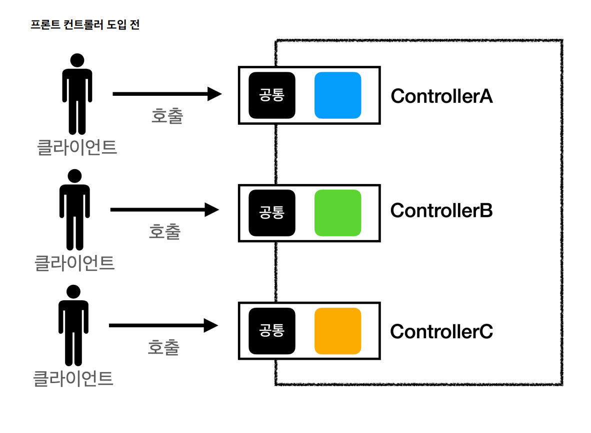
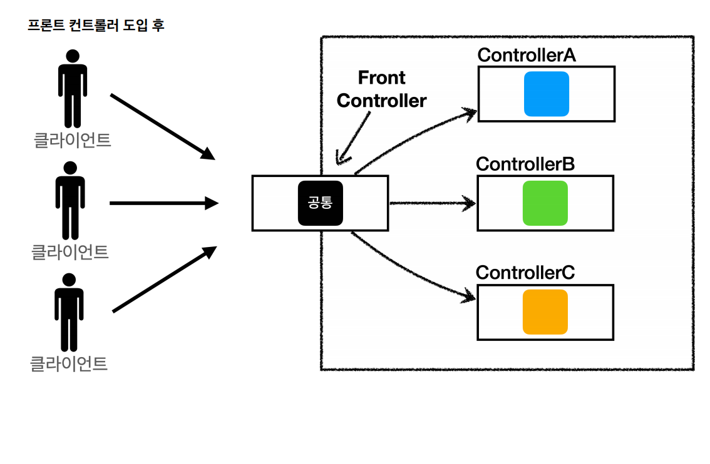
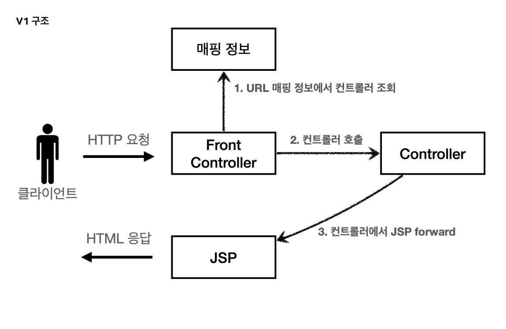
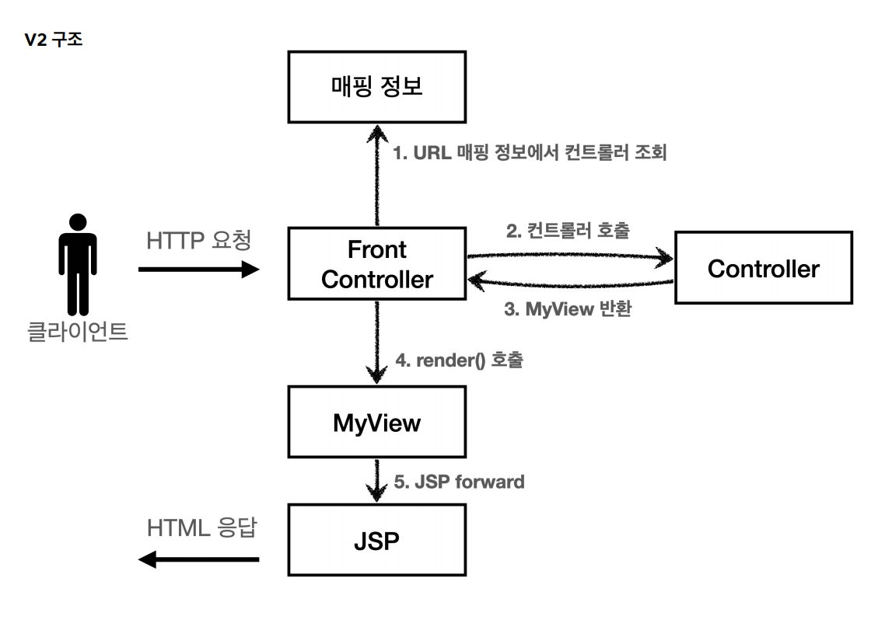
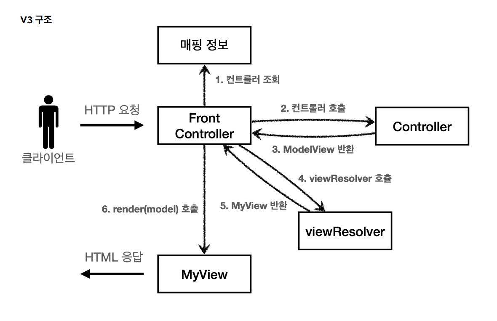
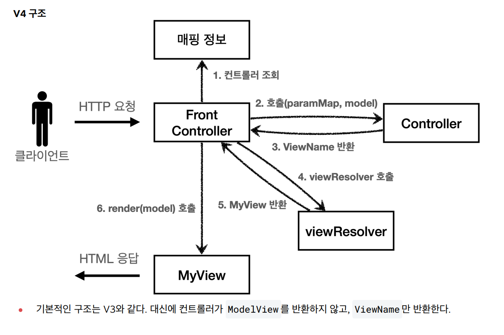
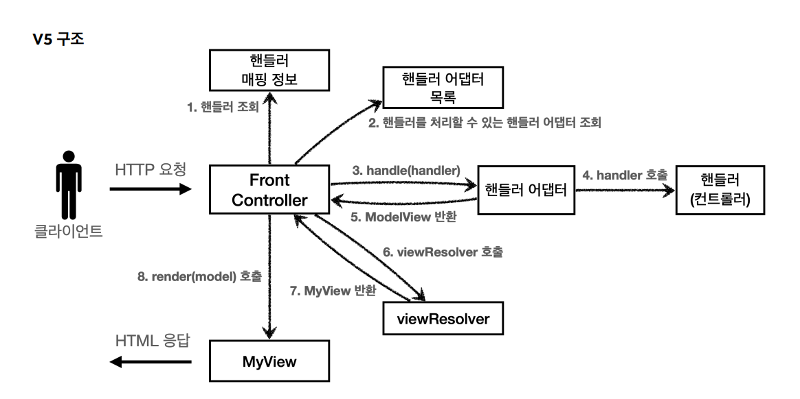

## 프론트 컨트롤러 패턴




**프론트 컨트롤러 패턴 특징**
- 프론트 컨트롤러 서블릿 하나로 클라이언트의 요청을 받는다.
- 프론트 컨트롤러가 요청에 맞는 컨트롤러를 찾아서 호출한다.
- 입구를 하나로 만들어서 공통 로직을 처리한다.
- 프론트 컨트롤러를 제외한 나머지 컨트롤러는 서블릿을 사용하지 않아도 된다.

스프링 웹 MVC의 핵심도 **FrontController**이다.

스프링 웹 MVC의 DispatchServlet이 프론트 컨트롤러 패턴으로 구현되어 있다.

<br>

## 프론트 컨트롤러 - V1



- 컨트롤러 인터페이스
```java
public interface ControllerV1 {
    void process(HttpServletRequest request, HttpServletResponse response) throws ServletException, IOException;
}
```
각 컨트롤러에서 이 인터페이스를 구현하고 프론트 컨트롤러는 이 인터페이스를 호출하면 일관성을 가져갈 수 있다.

- 회원 등록 컨트롤러
```java
public class MemberFormControllerV1 implements ControllerV1 {
    @Override
    public void process(HttpServletRequest request, HttpServletResponse response) throws ServletException, IOException {
        String viewPath = "/WEB-INF/views/new-form.jsp";
        RequestDispatcher dispatcher = request.getRequestDispatcher(viewPath);
        dispatcher.forward(request, response);
    }
}
```
- 회원 저장 컨트롤러
```java
public class MemberSaveControllerV1 implements ControllerV1 {

    private MemberRepository memberRepository = MemberRepository.getInstance();

    @Override
    public void process(HttpServletRequest request, HttpServletResponse response) throws ServletException, IOException {
        String username = request.getParameter("username");
        int age = Integer.parseInt(request.getParameter("age"));

        Member member = new Member(username, age);
        memberRepository.save(member);

        request.setAttribute("member", member);

        String viewPath = "/WEB-INF/views/save-result.jsp";
        RequestDispatcher dispatcher = request.getRequestDispatcher(viewPath);
        dispatcher.forward(request, response);
    }
}
```
- 회원 목록 컨트롤러
```java
public class MemberListControllerV1 implements ControllerV1 {

    private MemberRepository memberRepository = MemberRepository.getInstance();

    @Override
    public void process(HttpServletRequest request, HttpServletResponse response) throws ServletException, IOException {
        List<Member> members = memberRepository.findAll();

        request.setAttribute("members", members);
        String viewPath = "/WEB-INF/views/members.jsp";

        RequestDispatcher dispatcher = request.getRequestDispatcher(viewPath);
        dispatcher.forward(request, response);
    }
}
```
각 컨트롤러의 내부 로직은 기존 서블릿과 거의 똑같다.

- 프론트 컨트롤러
```java
@WebServlet(name = "frontControllerServletV1", urlPatterns = "/front-controller/v1/*")
public class FrontControllerServletV1 extends HttpServlet {

    private Map<String, ControllerV1> controllerV1Map = new HashMap<>();

    //생성자
    public FrontControllerServletV1() {
        controllerV1Map.put("/front-controller/v1/members/new-form", new MemberFormControllerV1());
        controllerV1Map.put("/front-controller/v1/members/save", new MemberSaveControllerV1());
        controllerV1Map.put("/front-controller/v1/members", new MemberListControllerV1());
    }

    @Override
    protected void service(HttpServletRequest request, HttpServletResponse response) throws ServletException, IOException {
        System.out.println("FrontControllerServletV1.service");

        String requestURI = request.getRequestURI();

        //인터페이스
        ControllerV1 controller = controllerV1Map.get(requestURI);

        if (controller == null) {
            response.setStatus(SC_NOT_FOUND);
            return;
        }

        controller.process(request, response);
    }
}
```
- controllerMap
  - key: 매핑 URL
  - value: 호출될 컨트롤러
- service()
  - ``requestURI``를 조회해서 호출할 컨트롤러를 ``controllerMap``에서 찾고 없다면 404 반환
  - 찾은 컨트롤러의 ``process(request, response)``를 실행한다.

프론트 컨트롤러를 제외하고 모든 컨트롤러에서 뷰로 이동하는 부분에 중복이 존재한다.

이 부분을 분리하기 위해 별도로 뷰를 처리하는 객체가 필요하다.

<br>

## 프론트 컨트롤러 - V2


- MyView
```java
public class MyView {
    private String viewPath;
    
    public MyView(String viewPath) { 
        this.viewPath = viewPath;
    }
    public void render(HttpServletRequest request, HttpServletResponse response) throws ServletException, IOException {
        RequestDispatcher dispatcher = request.getRequestDispatcher(viewPath);
        dispatcher.forward(request, response); 
    }
}
```

- 컨트롤러 인터페이스(뷰를 반환)
```java
public interface ControllerV2 {

    MyView process(HttpServletRequest request, HttpServletResponse response) throws ServletException, IOException;
}
```

- 회원 등록 폼 컨트롤러
```java
public class MemberFormControllerV2 implements ControllerV2 {

    @Override
    public MyView process(HttpServletRequest request, HttpServletResponse response) throws ServletException, IOException {
        return new MyView("/WEB-INF/views/new-form.jsp");
    }
}
```
지금처럼 각 컨트롤러는 이제 단순히 MyView 객체에 뷰 이름만 넣어서 반환하면 된다.

- 회원 저장 컨트롤러
```java
public class MemberSaveControllerV2 implements ControllerV2 {

    private MemberRepository memberRepository = MemberRepository.getInstance();

    @Override
    public MyView process(HttpServletRequest request, HttpServletResponse response) throws ServletException, IOException {

        String username = request.getParameter("username");
        int age = Integer.parseInt(request.getParameter("age"));

        Member member = new Member(username, age);
        memberRepository.save(member);

        request.setAttribute("member", member);

        return new MyView("/WEB-INF/views/save-result.jsp");
    }
}   
```

- 회원 목록 컨트롤러
```java
public class MemberListControllerV2 implements ControllerV2 {

    private MemberRepository memberRepository = MemberRepository.getInstance();

    @Override
    public MyView process(HttpServletRequest request, HttpServletResponse response) throws ServletException, IOException {
        List<Member> members = memberRepository.findAll();
        request.setAttribute("members", members);
        
        return new MyView("/WEB-INF/views/members.jsp");
    }
}
```

- 프론트 컨트롤러
```java
@WebServlet(name = "frontControllerServletV2", urlPatterns = "/front-controller/v2/*")
public class FrontControllerServletV2 extends HttpServlet {

    private Map<String, ControllerV2> controllerMap = new HashMap<>();

    public FrontControllerServletV2() {
        controllerMap.put("/front-controller/v2/members/new-form", new MemberFormControllerV2());
        controllerMap.put("/front-controller/v2/members/save", new MemberSaveControllerV2());
        controllerMap.put("/front-controller/v2/members", new MemberListControllerV2());
    }

    @Override
    protected void service(HttpServletRequest request, HttpServletResponse response) throws ServletException, IOException {
        String requestURI = request.getRequestURI();

        ControllerV2 controller = controllerMap.get(requestURI);

        if (controller == null) {
            response.setStatus(SC_NOT_FOUND);
            return;
        }

        MyView myView = controller.process(request, response);
        myView.render(request, response);
    }
}
```

프론트 컨트롤러와 MyView 객체로 각 컨트롤러는 MyView 객체를 생성해서 반환하면 MyView의 render()로 일관되게 처리할 수 있게 되었다.

<br>

## 프론트 컨트롤러 - V3
> 컨트롤러 입장에서 ``HttpServletRequest``, ``HttpServletResponse``는 꼭 필요하지 않다.<br>
> 요청 파라미터 정보를 Map으로 대신 넘기면 컨트롤러가 서블릿 기술을 몰라도 동작할 수 있다. 그리고 request 객체를 Model로 사용하는 대신에
> 별도의 객체를 만들어서 반환하면 된다. 컨트롤러를 서블릿 기술을 전혀 사용하지 않도록 해보자. 이런 구조는 구현 코드도 단순해지고 테스트 코드 작성도 쉬워진다.<br>
> 또한 뷰 이름이 중복이 있으므로 컨트롤러는 뷰의 논리 이름을 반환하고, 물리 위치 이름은 프론트 컨트롤러에서 처리하도록 할 수 있다.



- ModelView
  - 지금까지 컨트롤러에서 서블릿에 종속적인 ``HtttpServletRequest``를 사용해 모델에 데이터를 저장하고 뷰를 전달했다.
  - 서블릿 종속성을 제거하기 위해 모델을 직접 만들고 뷰 이름까지 전달하는 객체가 필요하다.
  - 이후 버전에서는 ``HtttpServletRequest``를 사용할 수 없기 때문에 모델이 별도로 필요하다.
```java
@Getter @Setter
public class ModelView {
    private String viewName;
    private Map<String, Object> model = new HashMap<>();

    public ModelView(String viewName) {
        this.viewName = viewName;
    }
}
```

- 컨트롤러 인터페이스
```java
public interface ControllerV3 {
    ModelView process(Map<String, String> paramMap);
}
```
서블릿 기술을 전혀 사용하지 않는다.

- 회원 등록 폼 컨트롤러
```java
public class MemberFormControllerV3 implements ControllerV3 {
    @Override
    public ModelView process(Map<String, String> paramMap) {
        return new ModelView("new-form");
    }
}
```
논리 이름만 지정하면 된다.

- 회원 저장 컨트롤러
```java
public class MemberSaveControllerV3 implements ControllerV3 {

    private MemberRepository memberRepository = MemberRepository.getInstance();

    @Override
    public ModelView process(Map<String, String> paramMap) {
        String username = paramMap.get("username");
        int age = Integer.parseInt(paramMap.get("age"));

        Member member = new Member(username, age);
        memberRepository.save(member);

        ModelView mv = new ModelView("save-result");
        mv.getModel().put("member", member);
        return mv;
    }
}
```

- 회원 목록 컨트롤러
```java
public class MemberListControllerV3 implements ControllerV3 {

    private MemberRepository memberRepository = MemberRepository.getInstance();

    @Override
    public ModelView process(Map<String, String> paramMap) {
        List<Member> members = memberRepository.findAll();
        ModelView mv = new ModelView("members");

        mv.getModel().put("members", members);
        return mv;
    }
}
```
- MyView 추가
```java
public class MyView {

    private String viewPath;

    public MyView(String viewPath) {
        this.viewPath = viewPath;
    }

    public void render(HttpServletRequest request, HttpServletResponse response) throws ServletException, IOException {
        RequestDispatcher dispatcher = request.getRequestDispatcher(viewPath);
        dispatcher.forward(request, response);
    }

    public void render(Map<String, Object> model, HttpServletRequest request, HttpServletResponse response) throws ServletException, IOException {
        modelToRequestAttribute(model, request);
        RequestDispatcher dispatcher = request.getRequestDispatcher(viewPath);
        dispatcher.forward(request, response);
    }

    private void modelToRequestAttribute(Map<String, Object> model, HttpServletRequest request) {
//        model.forEach(request::setAttribute);
         model.forEach((key, value) -> request.setAttribute(key, value));
    }
}
```

- 프론트 컨트롤러
```java
@WebServlet(name = "frontControllerServletV3", urlPatterns = "/front-controller/v3/*")
public class FrontControllerServletV3 extends HttpServlet {

    private Map<String, ControllerV3> controllerMap = new HashMap<>();

    public FrontControllerServletV3() {
        controllerMap.put("/front-controller/v3/members/new-form", new MemberFormControllerV3());
        controllerMap.put("/front-controller/v3/members/save", new MemberSaveControllerV3());
        controllerMap.put("/front-controller/v3/members", new MemberListControllerV3());
    }

    @Override
    protected void service(HttpServletRequest request, HttpServletResponse response) throws ServletException, IOException {
        String requestURI = request.getRequestURI();

        ControllerV3 controller = controllerMap.get(requestURI);

        if (controller == null) {
            response.setStatus(SC_NOT_FOUND);
            return;
        }
        Map<String, String> paramMap = createParamMap(request);
        ModelView mv = controller.process(paramMap);

        String viewName = mv.getViewName();
        MyView myView = viewResolver(viewName);

        myView.render(mv.getModel(), request, response);
    }

    private MyView viewResolver(String viewName) {
        return new MyView("/WEB-INF/views/" + viewName + ".jsp");
    }

    private Map<String, String> createParamMap(HttpServletRequest request) {
        Map<String, String> paramMap = new HashMap<>();
        request.getParameterNames()
                .asIterator()
                .forEachRemaining(
                paramName -> paramMap.put(paramName, request.getParameter(paramName)));
        return paramMap;
    }
}
```
- ``createParamMap()``
  - ``HttpServletRequest``에서 파라미터 정보를 꺼내서 Map으로 변환하고 해당 Map을 컨트롤러에 전달하면서 호출한다.
- ``viewResolver()``
  - 컨트롤러가 반환한 논리 뷰 이름을 실제 물리 뷰 경로로 변경한다. 그리고 실제 물리 경로가 있는 MyView객체를 반환한다.
- ``view.render()``
  - 뷰 객체를 통해서 HTML 화면을 렌더링한다.
  - 이 때 모델 정보도 함께 받는다.
  - JSP는 ``request.getAttribute()``로 데이터를 조회하기 때문에, 모델의 데이터를 꺼내서 ``request.setAttribute()``로 담아둔다.
  - JSP로 포워드해서 JSP를 렌더링한다.

<br>

## 컨트롤러 - V4
> V3는 서블릿 종속성도 제거하고 뷰 경로의 중복도 제거하는 등 잘 설계됐다. 그러나 항상 ModelView 객체를 생성하고 반환해야 하는 부분이 번거롭다.



- 컨트롤러 인터페이스
```java
public interface ControllerV4 {
    /**
     * @return viewName
     */
    String process(Map<String, String> paramMap, Map<String, Object> model);
}
```

- 회원 등록 폼 컨트롤러
```java
public class MemberFormControllerV4 implements ControllerV4 {
    @Override
    public String process(Map<String, String> paramMap, Map<String, Object> model) {
        return "new-form";
    }
}
```
뷰의 논리 이름만 반환한다.

- 회원 저장 컨트롤러
```java
public class MemberSaveControllerV4 implements ControllerV4 {

    private MemberRepository memberRepository = MemberRepository.getInstance();

    @Override
    public String process(Map<String, String> paramMap, Map<String, Object> model) {
        String username = paramMap.get("username");
        int age = Integer.parseInt(paramMap.get("age"));

        Member member = new Member(username, age);
        memberRepository.save(member);

        model.put("member", member);
        return "save-result";
    }
}
```
``model.put("member", member);``: 모델이 파라미터로 전달되기 때문에 모델을 직접 생성하지 않아도 된다.

- 회원 목록 컨트롤러
```java
public class MemberListControllerV4 implements ControllerV4 {

    private MemberRepository memberRepository = MemberRepository.getInstance();

    @Override
    public String process(Map<String, String> paramMap, Map<String, Object> model) {
        List<Member> members = memberRepository.findAll();
        model.put("members", members);
        return "members";
    }
}
```

- 프론트 컨트롤러
```java
@WebServlet(name = "frontControllerServletV4", urlPatterns = "/front-controller/v4/*")
public class FrontControllerServletV4 extends HttpServlet {

    private Map<String, ControllerV4> controllerMap = new HashMap<>();

    public FrontControllerServletV4() {
        controllerMap.put("/front-controller/v4/members/new-form", new MemberFormControllerV4());
        controllerMap.put("/front-controller/v4/members/save", new MemberSaveControllerV4());
        controllerMap.put("/front-controller/v4/members", new MemberListControllerV4());
    }

    @Override
    protected void service(HttpServletRequest request, HttpServletResponse response) throws ServletException, IOException {
        String requestURI = request.getRequestURI();

        ControllerV4 controller = controllerMap.get(requestURI);

        if (controller == null) {
            response.setStatus(SC_NOT_FOUND);
            return;
        }
        Map<String, String> paramMap = createParamMap(request);
        Map<String, Object> model = new HashMap<>();
        String viewName = controller.process(paramMap, model);

        MyView myView = viewResolver(viewName);

        myView.render(model, request, response);
    }

    private MyView viewResolver(String viewName) {
        return new MyView("/WEB-INF/views/" + viewName + ".jsp");
    }

    private Map<String, String> createParamMap(HttpServletRequest request) {
        Map<String, String> paramMap = new HashMap<>();
        request.getParameterNames()
                .asIterator()
                .forEachRemaining(
                paramName -> paramMap.put(paramName, request.getParameter(paramName)));
        return paramMap;
    }
}
```
이전 버전과 거의 같고 다른 것은 프론트 컨트롤러에서 모델 객체를 생성해서 컨트롤러에게 넘겨주면 로직 후에 모델에는 데이터가 담긴 상태가 된다.

<br>

## 컨트롤러 - V5
> **어댑터 패턴** : 지금까지 개발한 컨트롤러는 해당 인터페이스만 받을 수 있기 때문에 다른 버전끼리 호환이 불가능하다.<br>
> 어댑터 패턴을 사용해서 프론트 컨트롤러가 다양한 방식의 컨트롤러를 처리할 수 있다.



- **핸들러 어댑터**
  - 중간에서 어댑터 역할을 한다. 덕분에 다양한 종류의 컨트롤러를 호출할 수 있게 된다.
- **핸들러**
  - 컨트롤러의 이름을 더 넓은 범위인 핸들러로 변경한다.
  - 어댑터가 있기 때문에 컨트롤러의 개념 뿐만 아니라 해당하는 종류의 어댑터만 있으면 다 처리할 수 있기 때문이다.

<br>

- 어댑터용 인터페이스
```java
public interface MyHandlerAdapter {
    boolean supports(Object handler);
    ModelView handle(HttpServletRequest request, HttpServletResponse response, Object handler) throws ServletException, IOException;
}
```
- ``boolean supports()``
  - handler == 컨트롤러
  - 어댑터가 해당 컨트롤러를 처리할 수 있는지 판단한다.
- ``ModelView handle()``
  - 실제 컨트롤러를 호출하고 그 결과로 ModelView를 반환해야 한다.
  - 실제 컨트롤러가 ModelView를 반환하지 못하면 어댑터가 직접 생성해서라도 반환해야 한다.
  - 이전에는 프론트 컨트롤러가 실제 컨트롤러를 호출했지만 이제는 이 어댑터를 통해서 호출된다.

<br>

- V3 지원 어댑터
```java
public class ControllerV3HandlerAdapter implements MyHandlerAdapter {
    @Override
    public boolean supports(Object handler) {
        return (handler instanceof ControllerV3);
    }

    @Override
    public ModelView handle(HttpServletRequest request, HttpServletResponse response, Object handler) throws ServletException, IOException {
        ControllerV3 controller = (ControllerV3) handler;
        Map<String, String> paramMap = createParamMap(request);
        return controller.process(paramMap);
    }

    private Map<String, String> createParamMap(HttpServletRequest request) {
        Map<String, String> paramMap = new HashMap<>();
        request.getParameterNames().asIterator()
                .forEachRemaining(paramName -> paramMap.put(paramName,
                        request.getParameter(paramName)));
        return paramMap;
    }
}
```
- ``boolean supports()``
  - ``ControllerV3``를 처리할 수 있는지 판단한다.
- ``ModelView handle()``
  - handler를 V3로 변환한 다음 V3 형식에 맞도록 호출한다.
  - ControllerV3는 ModelView를 반환한다.

<br>

- V4 지원 어댑터
```java
public class ControllerV4HandlerAdapter implements MyHandlerAdapter {
    @Override
    public boolean supports(Object handler) {
        return (handler instanceof ControllerV4);
    }

    @Override
    public ModelView handle(HttpServletRequest request, HttpServletResponse response, Object handler) throws ServletException, IOException {
        ControllerV4 controller = (ControllerV4) handler;

        Map<String, String> paramMap = createParamMap(request);
        Map<String, Object> model = new HashMap<>();

        String viewName = controller.process(paramMap, model);
        ModelView mv = new ModelView(viewName);
        mv.setModel(model);

        return mv;
    }

    private Map<String, String> createParamMap(HttpServletRequest request) {
        Map<String, String> paramMap = new HashMap<>();
        request.getParameterNames().asIterator()
                .forEachRemaining(paramName -> paramMap.put(paramName,
                        request.getParameter(paramName)));
        return paramMap;
    }
}
```

<br>

- 프론트 컨트롤러
```java
@WebServlet(name = "frontControllerServletV5", urlPatterns = "/front-controller/v5/*")
public class FrontControllerServletV5 extends HttpServlet {
    private final Map<String, Object> handlerMappingMap = new HashMap<>();
    private final List<MyHandlerAdapter> handlerAdapters = new ArrayList<>();

    // 생성자
    public FrontControllerServletV5() {
        initHandlerMappingMap();
        initHandlerAdapters();
    }

    private void initHandlerMappingMap() {
        handlerMappingMap.put("/front-controller/v5/v3/members/new-form", new MemberFormControllerV3());
        handlerMappingMap.put("/front-controller/v5/v3/members/save", new MemberSaveControllerV3());
        handlerMappingMap.put("/front-controller/v5/v3/members", new MemberListControllerV3());

        handlerMappingMap.put("/front-controller/v5/v4/members/new-form", new MemberFormControllerV4());
        handlerMappingMap.put("/front-controller/v5/v4/members/save", new MemberSaveControllerV4());
        handlerMappingMap.put("/front-controller/v5/v4/members", new MemberListControllerV4());
    }

    private void initHandlerAdapters() {
        handlerAdapters.add(new ControllerV3HandlerAdapter());
        handlerAdapters.add(new ControllerV4HandlerAdapter());
    }

    @Override
    protected void service(HttpServletRequest request, HttpServletResponse response) throws ServletException, IOException {

        Object handler = getHandler(request);

        if (handler == null) {
            response.setStatus(SC_NOT_FOUND);
            return;
        }

        MyHandlerAdapter adapter = getHandlerAdapter(handler);

        ModelView mv = adapter.handle(request, response, handler);

        String viewName = mv.getViewName();
        MyView myView = viewResolver(viewName);

        myView.render(mv.getModel(), request, response);
    }

    private MyHandlerAdapter getHandlerAdapter(Object handler) {
        for (MyHandlerAdapter adapter : handlerAdapters) {
            if (adapter.supports(handler)) {
                return adapter;
            }
        }
        throw new IllegalArgumentException("handler adapter를 찾을 수 없습니다.");
    }

    private Object getHandler(HttpServletRequest request) {
        String requestURI = request.getRequestURI();

        return handlerMappingMap.get(requestURI);
    }

    private MyView viewResolver(String viewName) {
        return new MyView("/WEB-INF/views/" + viewName + ".jsp");
    }
}
```

> 어댑터가 호출하는 ControllerV4는 뷰 이름을 반환하지만 어댑터는 ModelView를 만들어서 형식을 맞춰서 반환한다. 이것이 어댑터가 필요한 이유다.