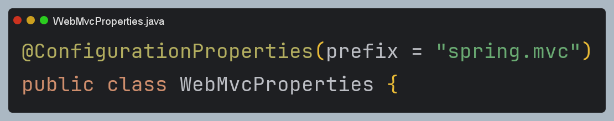
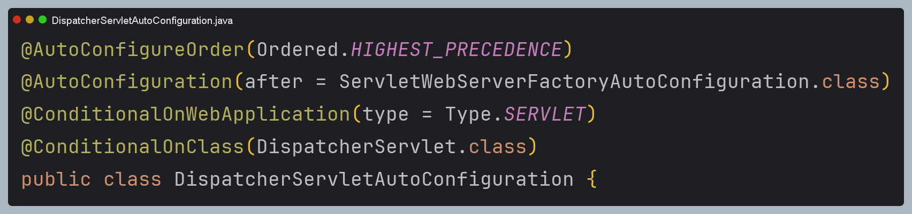
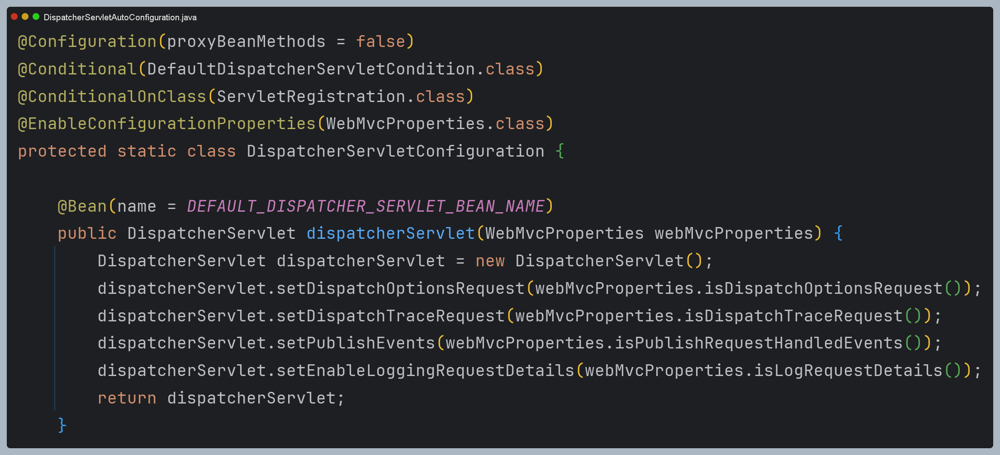
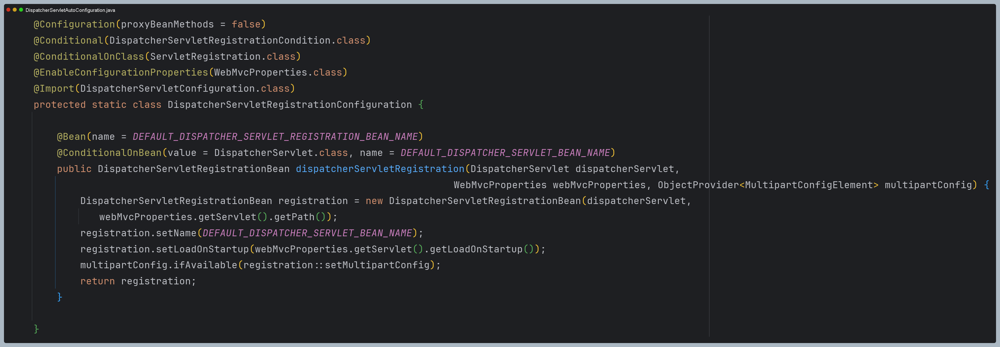
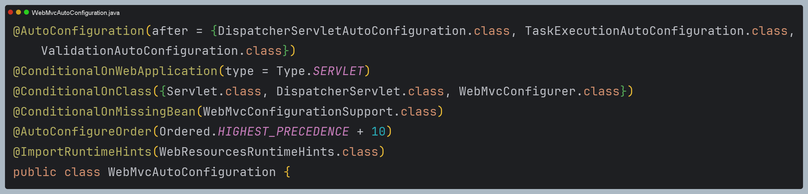
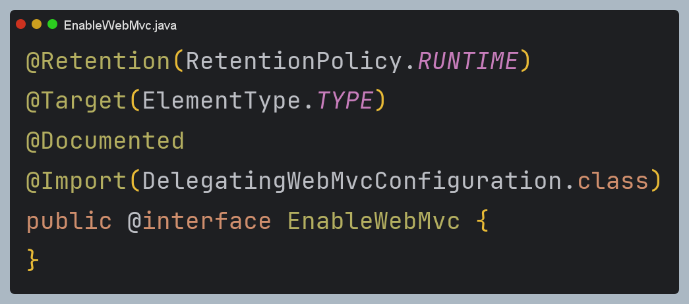
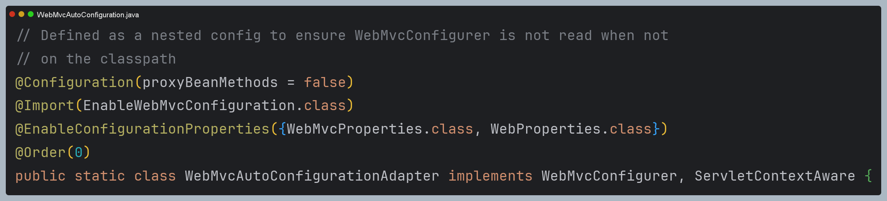
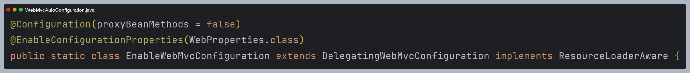
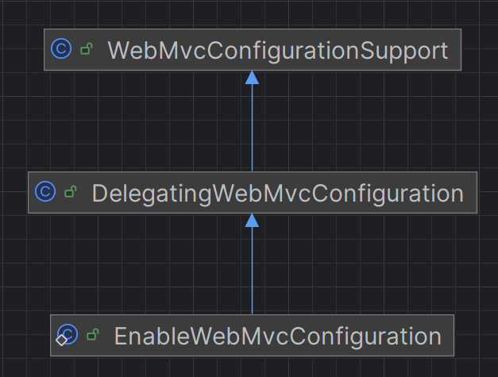
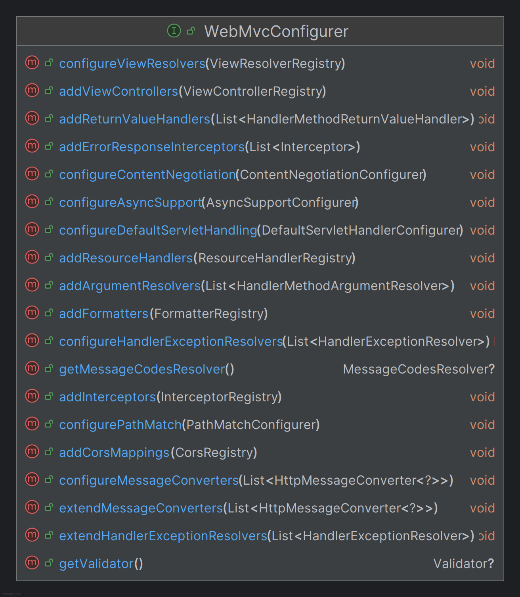

# 초기화 클래스들

스프링 부트는 웹 MVC 초기화와 실행을 위한 여러 빈들을 생성하고 초기 값들을 설정하기 위한 여러 클래스들을 정의하고 있다.

## WebMvcProperties

스프링 MVC의 여러 속성들을 환경 설정 파일(`application.yml` 등)을 통해 설정할 수 있다.

---

## DispatcherServletAutoConfiguration

### 내부 `DispatcherServletConfiguration` 클래스 

`DispatcherServlet`을 빈으로 등록

### 내부 `DispatcherServletRegistrationConfiguration` 클래스 
- `DispatcherServlet`을 서블릿으로 등록
- `DispatcherServletRegistrationBean`은 `ServletRegistrationBean`을 상속받아 스프링 부트에서 서블릿과 관련된
  설정(매핑, 부가 정보 등)을 수행한다.

> `DispatcherServlet`은 스프링 MVC에서 생성하는 유일한 서블릿으로써 서블릿 컨테이너 및 스프링 빈으로 스프링 컨테이너에서 관리한다.

---

## WebMvcAutoConfiguration

- `@EnableWebMvc`를 명시적으로 사용하지 않을 경우 스프링 부트 기반 스프링 MVC 설정을 자동으로 구성한다.
- `@EnableWebMvc`를 선언하면 `WebMvcConfigurationSupport` 빈이 생성되어 자동 설정이 실행되지 않는다.
- 메시지 컨버터, 뷰 리졸버, 포맷터, 인터셉터, 리소스 핸들러 등 웹 MVC에서 자주 사용하는 빈들이 이 클래스를 통해 자동 구성된다.

> - `@EnableWebMvc`는 `WebMvcConfigurationSupport`를 상속한 `DelegatingWebMvcConfiguration` 클래스를 **import** 하고 있다.
> - 따라서 `@EnableWebMvc`를 선언하면 `WebMvcAutoConfiguration` 클래스의 `@ConditionalOnMissingBean(WebMvcConfigurationSupport.class)` 조건에
>     맞지 않아 자동 설정이 실행되지 않는다.
> 
> 

### 내부 `WebMvcAutoConfigurationAdapter` 클래스

- `WebMvcConfigurer` 인터페이스를 구현한 추상 클래스로 스프링 부트에서 제공하는 여러 기본 MVC 설정을 제공한다. (뷰 리졸버, 포맷터 등)
- 개발자가 직접 `WebMvcConfigurer` 인터페이스를 구현해서 커스텀 할 수 있다.

### 내부 `EnableWebMvcConfiguration` 클래스

- 스프링 MVC의 핵심 설정을 제공하는 클래스로 `WebMvcConfigurationSupport`를 상속받아 스프링 MVC에서 필요한 다양한 설정을 구성한다.

---

## EnableWebMvcConfiguration

- `WebMvcConfigurationSupport` 
  - 전통적인 스프링 MVC에서 `@EnableWebMvc`를 사용할 때 MVC 구성에 필요한 핵심 빈(핸들러 매핑, 핸들러 어댑터, 뷰 리졸버 등)
    등록을 담당하는 추상 클래스로 스프링 MVC의 기본 골격이라고 볼 수 있다.
- `DelegatingWebMvcConfiguration` 
  - `WebMvcConfigurationSupport`를 확장하고 내부적으로 여러 개의 `WebMvcConfigurer`를 찾아서 적용해 주는 역할을 한다.
  - `@EnableWebMVc` 또는 스프링 부트가 제공하는 자동 설정과 사용자가 정의한 `WebMvcConfigurer`들을 연결해 주는 위임 클래스라 볼 수 있다.
- `WebMvcConfigurationSupport` 
  - 핸들러 매핑 및 핸들러 어댑터 설정
  - 뷰 리졸버 설정
  - 메시지 컨터버 설정
  - 검증기와 포맷터 설정
  - 인터셉터 및 기타 커스텀
  - 정적 리소스 제공 설정

---

## WebMvcConfigurer

- `WebMvcConfigurer`는 웹 MVC 관련 설정을 커스텀할 수 있는 다양한 메서드를 정의하고 있으며 스프링 부트가 기본적으로 제공하는
자동 구성을 유지하면서 필요한 부분만 맞춤형으로 설정할 수 있다.

