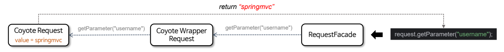
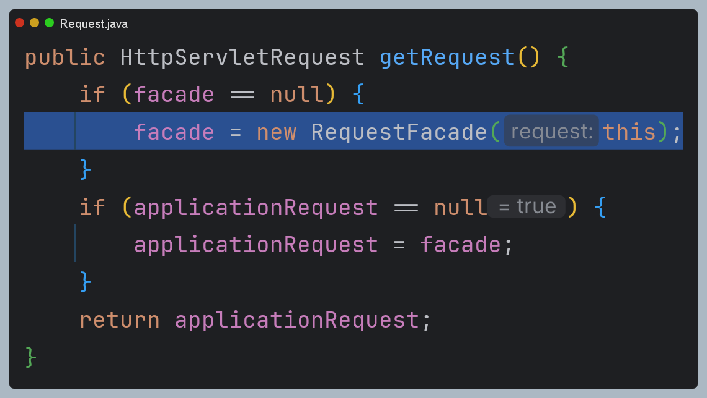

# HttpServletRequest 상세

`HttpServletRequest`는 클라이언트로부터 HTTP 요청이 들어오면 요청 데이터를 분석하고 분석한 정보들이 저장되어
`HttpServletResponse`와 함께 서블릿으로 전달되는 객체이다.


## HttpServletRequest 구조


## HttpServletRequest 생성


HTTP 요청 데이터를 분석하여 분석한 값들을 `org.apache.coyote.Request` 객체에 저장하고 이를 서블릿 컨테이너에서
동작할 수 있도록 `HttpServletRequest` 구현체들을 생성하고 연결한다.



### 스프링의 Request

- **WebRequest** : HTTP 요청의 파라미터, 헤더 등 메타데이터에 대한 추상화된 접근을 제공하는 인터페이스
- **NativeWebRequest** : 네이티브 서블릿 객체(HttpServletRequest)에 접근할 수 있는 인터페이스
- **ServletWebRequest** : `HttpServletRequest`와 `HttpServletResponse`를 감싸며 스프링 자체 추상화된 요청 및 응답 기능을 제공하는 구현체


예제 코드

```java
@GetMapping("/info")
public void info(HttpServletRequest request, HttpServletResponse response) throws IOException {
    ServletWebRequest servletWebRequest = new ServletWebRequest(request, response);
    String header = servletWebRequest.getHeader(HttpHeaders.USER_AGENT);
    System.out.println("header = " + header);

    String name = servletWebRequest.getParameter("name");
    System.out.println("name = " + name);

    HttpServletRequest nativeRequest = servletWebRequest.getNativeRequest(HttpServletRequest.class);
    String requestURI = nativeRequest.getRequestURI();
    System.out.println("requestURI = " + requestURI);

/*
    //밑의 코드와 동일한 기능
    HttpServletResponse nativeResponse = servletWebRequest.getNativeResponse(HttpServletResponse.class);
    nativeResponse.setStatus(HttpServletResponse.SC_OK);
    nativeResponse.getWriter().write("success");
*/
    servletWebRequest.getResponse().setStatus(HttpServletResponse.SC_OK);
    servletWebRequest.getResponse().getWriter().write("success");
}
```

---

## HttpServletRequest 생성 주요 과정 디버깅

### 1. Http11Processor

`org.apache.coyote.Request`를 생성 후 저장


HTTP 요청 데이터를 분석


### 2. CoyoteAdapter

` org.apache.catalina.connector.Request`를 생성해 `org.apache.coyote.Request`를 연결


### 3. org.apache.catalina.connector.Request

`RequestFacade` 생성자에 자신을 전달하여 `RequestFacade -> connector.Request -> coyote.Request` 구조 완성



### 4. 컨트롤러


