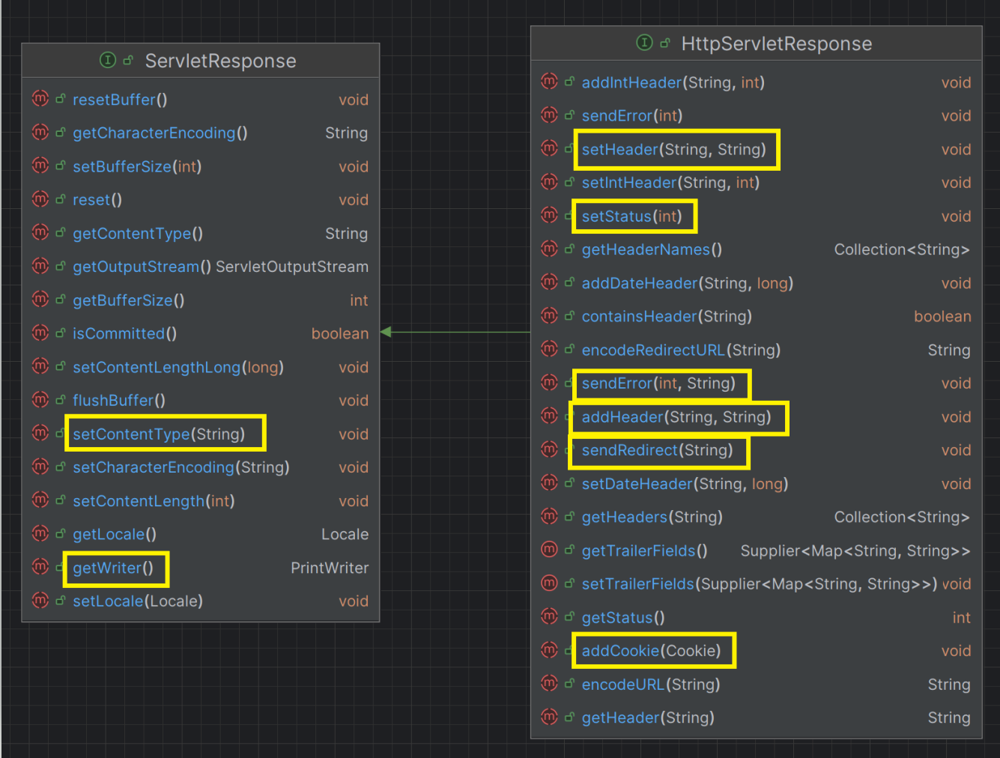
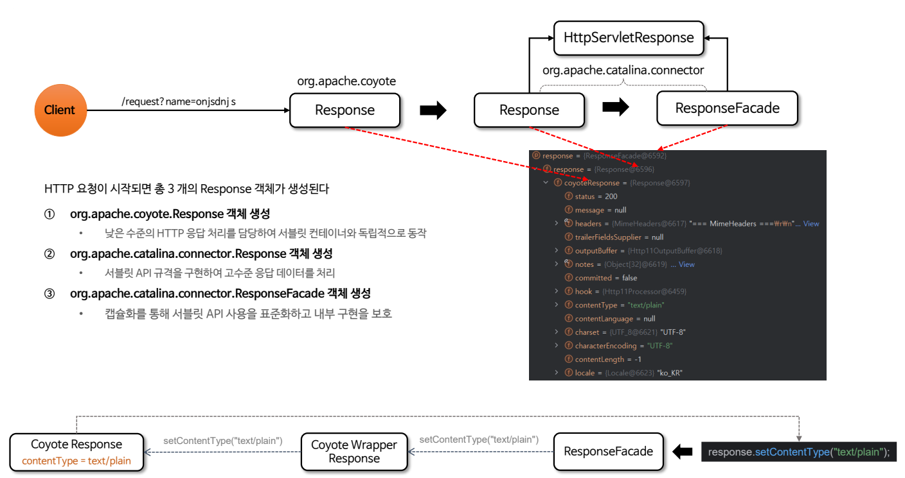

# HttpServletResponse 상세

`HttpServletResponse`는 서버가 클라이언트의 요청에 대한 응답을 생성하고 반환할 때 사용되며 HTTP 응답의 상태 코드,
헤더, 본문 데이터를 설정하고 제어하는 다양한 메서드를 제공한다.

> - `sendError()`를 실행하면 기존 응답 버퍼의 내용을 모두 지우고 오류 응답만 클라이언트에 전달되도록 보장한다.
> - `sendError()`는 설계상 정상적인 처리 흐름이 아니라 오류 상황을 클라이언트에 알리기 위해 존재한다. 따라서 
>   특별한 예외가 발생하지 않아도 응답이 오류로 전송된다.
> - `sendError()`를 실행하면 응답이 이미 커밋되었음을 나타내는 플래그가 설정되고 이후로는 응답을 수정할 수 없다.
>   - `response.getWriter()`로 추가 데이터를 출력하려고 시도하면 예외가 발생한다.

## HttpServletResponse 생성

