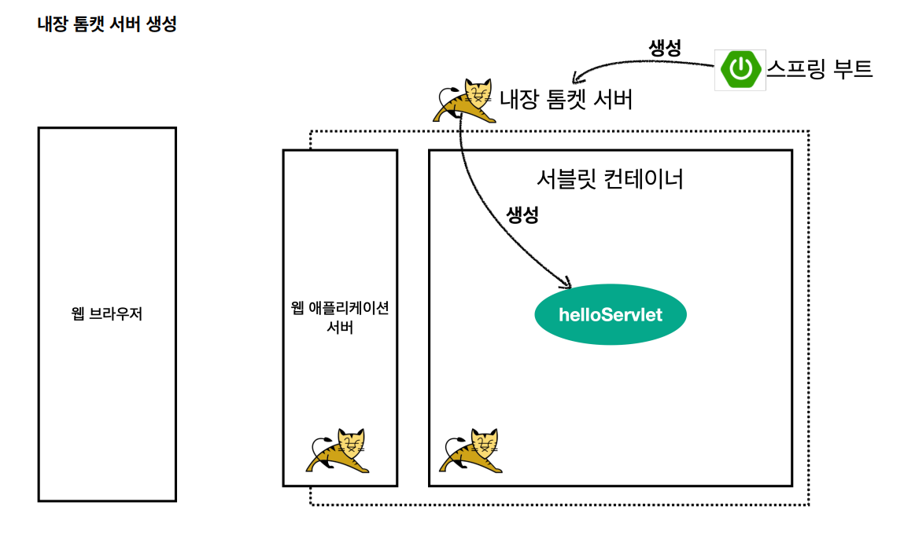
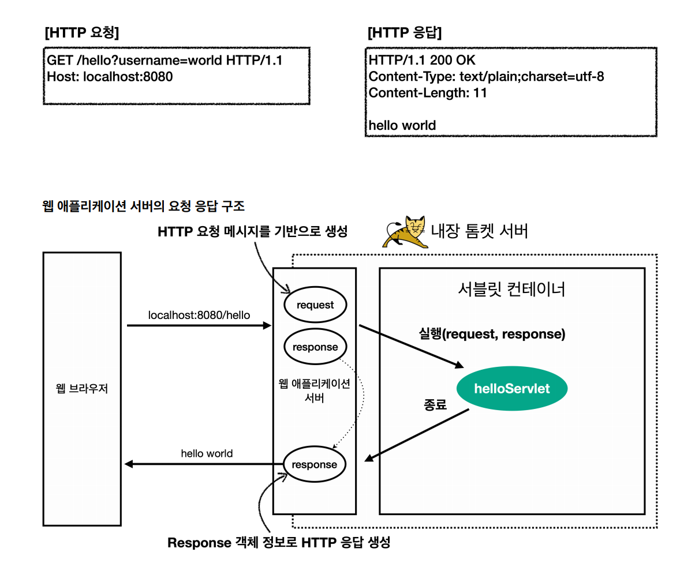

# 서블릿
> 서블릿은 톰캣 같은 웹 애플리케이션 서버(WAS)를 직접 설치하고, 그 위에 서블릿 코드를 클래스 파일로 빌드해서 올린 다음 톰캣 서버를 실행하면 된다.
> 스프링 부트는 톰캣 서버를 내장하고 있어 이러한 톰캣 서버 설치 없이 편리하게 사용할 수 있다.

```java
@ServletComponentScan // 서블릿 자동 등록
@SpringBootApplication
public class ServletApplication {

	public static void main(String[] args) {
		SpringApplication.run(ServletApplication.class, args);
	}

}
```
@ServletComponentScan : 서블릿을 자동으로 등록하고 실행할 수 있도록 해준다.

```java
// name : 서블릿 이름, urlPatterns : URL 매핑
// 서로 겹치면 안됨
@WebServlet(name = "helloServlet", urlPatterns = "/hello")
public class HelloServlet extends HttpServlet {

    @Override
    protected void service(HttpServletRequest request, HttpServletResponse response) throws ServletException, IOException {
        System.out.println("HelloServlet.service");
        System.out.println("request = " + request);
        System.out.println("response = " + response);

        String username = request.getParameter("username");
        System.out.println("username = " + username);
        
        response.setContentType("text/plain");
        response.setCharacterEncoding("utf-8");
        response.getWriter().write("hello " + username);
    }
}
```
HTTP 요청을 통해 매핑된 URL 호출되면 서블릿 컨테이너는 service 메서드를 실행한다.

요청 URL : http://localhost:8080/hello?username=world

콘솔 결과
```http request
HelloServlet.service
request = org.apache.catalina.connector.RequestFacade@e223ed1
response = org.apache.catalina.connector.ResponseFacade@e5c165
username = world
```

## 서블릿 컨테이너 동작 방식




<br>

## HttpServletRequest
> HTTP 요청 메시지를 개발자가 직접 파싱해서 사용해도 되지만, 매우 불편할 것이다. 서블릿은 개발자가 HTTP 요청 메시지를 편리하게 사용할 수 있도록
> 개발자 대신에 HTTP 요청 메시지를 파싱하고 그 결과를 ``HttpServletRequest``객체에 담아서 제공한다.

```http request
POST /save HTTP/1.1 // START LINE(HTTP Method, URL, 쿼리 스트링, 스키마, 프로토콜)
Host: localhost:8080 // 헤더
Content-Type: application/x-www-form-urlencoded // 헤더
// 공백
username=kim&age=20 // 바디
```

``HttpServletRequest``객체는 해당 HTTP 요청이 시작부터 끝날 때까지 유지되는 **임시 저장소**기능도 사용 가능하다.

저장 : ``request.setAttribute(name, value)``<br>
조회 : ``request.getAttribute(name)``

세션 관리 기능 : ``request.getSession(create: true)``

### HttpServletRequest 기본 사용법
```java
package hello.servlet.basic.request;

import jakarta.servlet.ServletException;
import jakarta.servlet.annotation.WebServlet;
import jakarta.servlet.http.Cookie;
import jakarta.servlet.http.HttpServlet;
import jakarta.servlet.http.HttpServletRequest;
import jakarta.servlet.http.HttpServletResponse;

import java.io.IOException;

@WebServlet(name = "requestHeaderServlet", urlPatterns = "/request-header")
public class RequestHeaderServlet extends HttpServlet {

    @Override
    protected void service(HttpServletRequest request, HttpServletResponse response) throws ServletException, IOException {
        printStartLine(request);
        printHeaders(request);
        printHeaderUtils(request);
        printEtc(request);
    }

    private void printStartLine(HttpServletRequest request) {
        System.out.println("--- REQUEST-LINE - start ---");
        System.out.println("request.getMethod() = " + request.getMethod()); //GET
        System.out.println("request.getProtocol() = " + request.getProtocol()); //HTTP/1.1
        System.out.println("request.getScheme() = " + request.getScheme()); //http
        // http://localhost:8080/request-header
        System.out.println("request.getRequestURL() = " + request.getRequestURL());
        // /request-header
        System.out.println("request.getRequestURI() = " + request.getRequestURI());
        //username=hi
        System.out.println("request.getQueryString() = " +
                request.getQueryString());
        System.out.println("request.isSecure() = " + request.isSecure()); //https 사용 유무
        System.out.println("--- REQUEST-LINE - end ---");
        System.out.println();
    }

    //Header 모든 정보
    private void printHeaders(HttpServletRequest request) {
        System.out.println("--- Headers - start ---");
        /*
            Enumeration<String> headerNames = request.getHeaderNames();
            while (headerNames.hasMoreElements()) {
                String headerName = headerNames.nextElement();
                System.out.println(headerName + ": " + request.getHeader(headerName));
            }
        */
        request.getHeaderNames().asIterator()
                .forEachRemaining(headerName -> System.out.println(headerName + ": " + request.getHeader(headerName)));
        System.out.println("--- Headers - end ---");
        System.out.println();
    }

    //Header 편리한 조회
    private void printHeaderUtils(HttpServletRequest request) {
        System.out.println("--- Header 편의 조회 start ---");
        System.out.println("[Host 편의 조회]");
        System.out.println("request.getServerName() = " + request.getServerName()); //Host 헤더
        System.out.println("request.getServerPort() = " + request.getServerPort()); //Host 헤더

        System.out.println();

        System.out.println("[Accept-Language 편의 조회]");
        request.getLocales().asIterator()
                .forEachRemaining(locale -> System.out.println("locale = " + locale));
        System.out.println("request.getLocale() = " + request.getLocale());

        System.out.println();

        System.out.println("[cookie 편의 조회]");
        if (request.getCookies() != null) {
            for (Cookie cookie : request.getCookies()) {
                System.out.println(cookie.getName() + ": " + cookie.getValue());
            }
        }

        System.out.println();

        System.out.println("[Content 편의 조회]");
        System.out.println("request.getContentType() = " + request.getContentType());
        System.out.println("request.getContentLength() = " + request.getContentLength());
        System.out.println("request.getCharacterEncoding() = " + request.getCharacterEncoding());
        System.out.println("--- Header 편의 조회 end ---");

        System.out.println();
    }

    //기타 정보
    private void printEtc(HttpServletRequest request) {
        System.out.println("--- 기타 조회 start ---");
        System.out.println("[Remote 정보]");
        System.out.println("request.getRemoteHost() = " + request.getRemoteHost());
        System.out.println("request.getRemoteAddr() = " + request.getRemoteAddr());
        System.out.println("request.getRemotePort() = " + request.getRemotePort());

        System.out.println();

        System.out.println("[Local 정보]");
        System.out.println("request.getLocalName() = " + request.getLocalName()); 
        System.out.println("request.getLocalAddr() = " + request.getLocalAddr()); 
        System.out.println("request.getLocalPort() = " + request.getLocalPort()); 
        System.out.println("--- 기타 조회 end ---");

        System.out.println();
    }
}
```
요청 URL : http://localhost:8080/request-header

결과
- printStartLine(request)
```java
--- REQUEST-LINE - start ---
request.getMethod() = GET
request.getProtocol() = HTTP/1.1
request.getScheme() = http
request.getRequestURL() = http://localhost:8080/request-header
request.getRequestURI() = /request-header
request.getQueryString() = username=hello
request.isSecure() = false
--- REQUEST-LINE - end ---
```

-  printHeaders(request)
```java
--- Headers - start ---
host: localhost:8080
connection: keep-alive
cache-control: max-age=0
sec-ch-ua: "Not_A Brand";v="8", "Chromium";v="120", "Google Chrome";v="120"
sec-ch-ua-mobile: ?0
sec-ch-ua-platform: "Windows"
upgrade-insecure-requests: 1
user-agent: Mozilla/5.0 (Windows NT 10.0; Win64; x64) AppleWebKit/537.36 (KHTML, like Gecko) Chrome/120.0.0.0 Safari/537.36
accept: text/html,application/xhtml+xml,application/xml;q=0.9,image/avif,image/webp,image/apng,*/*;q=0.8,application/signed-exchange;v=b3;q=0.7
sec-fetch-site: none
sec-fetch-mode: navigate
sec-fetch-user: ?1
sec-fetch-dest: document
accept-encoding: gzip, deflate, br
accept-language: ko,en-US;q=0.9,en;q=0.8,ko-KR;q=0.7
cookie: Idea-52a55763=ae459913-83f5-4a79-976e-c1b95061b327
--- Headers - end ---
```

- printHeaderUtils(request)
```java
--- Header 편의 조회 start ---
[Host 편의 조회]
request.getServerName() = localhost
request.getServerPort() = 8080

[Accept-Language 편의 조회]
locale = ko
locale = en_US
locale = en
locale = ko_KR
request.getLocale() = ko

[cookie 편의 조회]
Idea-52a55763: ae459913-83f5-4a79-976e-c1b95061b327

[Content 편의 조회]
request.getContentType() = null
request.getContentLength() = -1
request.getCharacterEncoding() = UTF-8
--- Header 편의 조회 end ---
```
- printEtc(request)
```java
--- 기타 조회 start ---
[Remote 정보]
request.getRemoteHost() = 0:0:0:0:0:0:0:1
request.getRemoteAddr() = 0:0:0:0:0:0:0:1
request.getRemotePort() = 59279

[Local 정보]
request.getLocalName() = DESKTOP-EQSA0EM
request.getLocalAddr() = 0:0:0:0:0:0:0:1
request.getLocalPort() = 8080
--- 기타 조회 end ---
```

<br>

## HTTP 요청 데이터
- ``GET`` - 쿼리 파라미터
  - /url?{key}={value}&{key}={value}
  - 메시지 바디 없이 URL의 쿼리 파라미터에 데이터를 포함해서 전달
- ``POST`` - HTML Form
  - content-type: application/x-www-form-urlencoded
  - 메시지 바디에 쿼리 파리미터 형식으로 전달
- HTTP message body에 데이터를 직접 담아서 요청
  - HTTP API에서 주로 JSON으로 사용한다.
  - POST, PUT, PATCH

### ``GET`` - 쿼리 파라미터
> 서버에서 ``HttpServletRequest``가 제공하는 메서드를 통해 쿼리 파라미터를 편리하게 조회할 수 있다.

```java
@WebServlet(name = "requestParamServlet", urlPatterns = "/request-param")
public class RequestParamServlet extends HttpServlet {
    @Override
    protected void service(HttpServletRequest request, HttpServletResponse response) throws ServletException, IOException {
        System.out.println("[전체 파라미터 조회] - start");
        /*
                Enumeration<String> parameterNames = request.getParameterNames();
                while (parameterNames.hasMoreElements()) {
                    String paramName = parameterNames.nextElement();
                    System.out.println(paramName + "=" +
        request.getParameter(paramName));
        }
        */
        request.getParameterNames().asIterator()
                .forEachRemaining(paramName -> System.out.println(paramName + "=" + request.getParameter(paramName)));
        System.out.println("[전체 파라미터 조회] - end");

        System.out.println();

        System.out.println("[단일 파라미터 조회]");
        String username = request.getParameter("username");
        System.out.println("request.getParameter(username) = " + username);
        String age = request.getParameter("age");
        System.out.println("request.getParameter(age) = " + age);

        System.out.println();

        System.out.println("[이름이 같은 복수 파라미터 조회]");
        System.out.println("request.getParameterValues(username)");
        String[] usernames = request.getParameterValues("username");
        for (String name : usernames) {
            System.out.println("username=" + name);
        }
        response.getWriter().write("ok");
    }
}
```

요청 : http://localhost:8080/request-param?username=hello&age=20&username=hello2

결과
```java
[전체 파라미터 조회] - start
username=hello
age=20
[전체 파라미터 조회] - end

[단일 파라미터 조회]
request.getParameter(username) = hello
request.getParameter(age) = 20

[이름이 같은 복수 파라미터 조회]
request.getParameterValues(username)
username=hello
username=hello2
```

<br>

### ``POST`` - HTML Form
> content-type : application/x-www-form-urlencoded<br>
> 메시지 바디에 쿼리 파라미터 형식으로 데이터를 전달한다.

Form
```html
<!DOCTYPE html>
<html>
<head>
    <meta charset="UTF-8">
    <title>Title</title>
</head>
<body>
<form action="/request-param" method="post">
    username: <input type="text" name="username" /> 
    age:      <input type="text" name="age" /> 
    <button type="submit">전송</button>
</form> 
</body> 
</html>
```

서블릿
```java
@WebServlet(name = "requestParamServlet", urlPatterns = "/request-param")
public class RequestParamServlet extends HttpServlet {
    @Override
    protected void service(HttpServletRequest request, HttpServletResponse response) throws ServletException, IOException {
        System.out.println("[전체 파라미터 조회] - start");
        /*
                Enumeration<String> parameterNames = request.getParameterNames();
                while (parameterNames.hasMoreElements()) {
                    String paramName = parameterNames.nextElement();
                    System.out.println(paramName + "=" +
        request.getParameter(paramName));
        }
        */
        request.getParameterNames().asIterator()
                .forEachRemaining(paramName -> System.out.println(paramName + "=" + request.getParameter(paramName)));
        System.out.println("[전체 파라미터 조회] - end");

        System.out.println();

        System.out.println("[단일 파라미터 조회]");
        String username = request.getParameter("username");
        System.out.println("request.getParameter(username) = " + username);
        String age = request.getParameter("age");
        System.out.println("request.getParameter(age) = " + age);

        System.out.println();

        System.out.println("[이름이 같은 복수 파라미터 조회]");
        System.out.println("request.getParameterValues(username)");
        String[] usernames = request.getParameterValues("username");
        for (String name : usernames) {
            System.out.println("username=" + name);
        }
        response.getWriter().write("ok");
    }
}
```

POST HTML Form 형식은 데이터를 message body에 쿼리 파라미터 형식으로 넣어주기 때문에 서버에서는 GET 쿼리 파라미터의 데이터를 받을 때랑 똑같이 할 수 있다.

참고로 GET URL 쿼리 파라미터 형식은 HTTP 메시지 바디를 사용하지 않기 때문에 content-type이 없고
  
POST HTML Form 형식은 HTTP 메시지 바디에 해당 데이터를 포함해서 보내기 때문에 해당 데이터가 어떤 형식인지 content-type을 꼭 지정해 줘야 한다.

이렇게 폼으로 데이터를 전송하는 형식을 ``application/x-www-form-urlencoded``이라고 한다. 웬만하면 포스트맨으로 편리하게 테스트 해보자!

### API 메시지 바디
서블릿(텍스트 메시지) - content-type: text-plain
```java
@WebServlet(name = "requestBodyStringServlet", urlPatterns = "/request-body-string")
public class RequestBodyStringServlet extends HttpServlet {
    @Override
    protected void service(HttpServletRequest request, HttpServletResponse response) throws ServletException, IOException {
        ServletInputStream inputStream = request.getInputStream();
        // 바이트->문자, 문자->바이트를 바꿀 때는 항상 인코딩 정보를 포함해줘야 한다.
        String messageBody = StreamUtils.copyToString(inputStream, StandardCharsets.UTF_8);
        System.out.println("messageBody = " + messageBody);

        response.getWriter().write("OK");
    }
}
```

서블릿(JSON) - content-type: application/json
```java
//JSON 파싱할 객체
@Getter @Setter
public class HelloData {

    private String username;
    private int age;
}
```

```java
@WebServlet(name = "requestBodyJsonServlet", urlPatterns = "/request-body-json")
public class RequestBodyJsonServlet extends HttpServlet {
    private final ObjectMapper objectMapper = new ObjectMapper();

    @Override
    protected void service(HttpServletRequest request, HttpServletResponse response) throws ServletException, IOException {
        ServletInputStream inputStream = request.getInputStream();
        String messageBody = StreamUtils.copyToString(inputStream, StandardCharsets.UTF_8);
        System.out.println("messageBody = " + messageBody);

        HelloData helloData = objectMapper.readValue(messageBody, HelloData.class);

        System.out.println("helloData.username = " + helloData.getUsername());
        System.out.println("helloData.age = " + helloData.getAge());

        response.getWriter().write("ok");
    }
}
```

출력:<br>
messageBody = {"username": "hello", "age": 20}<br>
helloData.username = hello<br>
helloData.age = 20

JSON 결과를 파싱해서 자바 객체로 변환하려면 Jackson, Gson 같은 JSON 변환 라이브러리가 필요한데 스프링 부트는 기본적으로 ``ObjectMapper``라는 
Jackson 라이브러리를 제공해준다.

<br>

## HttpServletResponse 기본 사용법
- HTTP 응답 메시지 생성
  - HTTP 응답 코드 지정
  - 헤더 생성
  - 바디 생성
- 편의 기능
  - Content-Type, 쿠키, Redirect

서블릿
```java
@WebServlet(name = "responseHeaderServlet", urlPatterns = "/response-header")
public class ResponseHeaderServlet extends HttpServlet {
    @Override
    protected void service(HttpServletRequest request, HttpServletResponse response) throws ServletException, IOException {
        //[status-line]
        response.setStatus(HttpServletResponse.SC_OK); //200
        //[response-headers]
        response.setHeader("Content-Type", "text/plain;charset=utf-8");
        response.setHeader("Cache-Control", "no-cache, no-store, must- revalidate");
        response.setHeader("Pragma", "no-cache");
        response.setHeader("my-header","hello");
        //[Header 편의 메서드]
        content(response);
        cookie(response);
        //redirect(response);
        //[message body]
        PrintWriter writer = response.getWriter();
        writer.println("ok");
    }

    private void content(HttpServletResponse response) {
        //Content-Type: text/plain;charset=utf-8
        //Content-Length: 2
        //response.setHeader("Content-Type", "text/plain;charset=utf-8");
        response.setContentType("text/plain");
        response.setCharacterEncoding("utf-8");
        //response.setContentLength(2); //(생략시 자동 생성)
    }

    private void cookie(HttpServletResponse response) {
        //Set-Cookie: myCookie=good; Max-Age=600;
        //response.setHeader("Set-Cookie", "myCookie=good; Max-Age=600");
        Cookie cookie = new Cookie("myCookie", "good");
        cookie.setMaxAge(600); //600초
        response.addCookie(cookie);
    }

    private void redirect(HttpServletResponse response) throws IOException {
        //Status Code 302
        //Location: /basic/hello-form.html

//        response.setStatus(HttpServletResponse.SC_FOUND); //302
//        response.setHeader("Location", "/basic/hello-form.html");
        response.sendRedirect("/basic/hello-form.html");
    }
}
```

### HTTP 응답 - 단순 텍스트, HTML
단순 텍스트 - ``writer.println("ok");`` 

서블릿
```java
@WebServlet(name = "responseHtmlServlet", urlPatterns = "/response-html")
public class ResponseHtmlServlet extends HttpServlet {
    @Override
    protected void service(HttpServletRequest request, HttpServletResponse response) throws ServletException, IOException {
        //Content-Type: text/html;charset=utf-8
        response.setContentType("text/html");
        response.setCharacterEncoding("UTF-8");
        PrintWriter writer = response.getWriter();
        writer.println("<html>");
        writer.println("<body>");
        writer.println("  <div>안녕하세요</div>");
        writer.println("</body>");
        writer.println("</html>");
    }
}
```

### HTTP 응답 - API JSON
서블릿
```java
@WebServlet(name = "responseJsonServlet", urlPatterns = "/response-json")
public class ResponseJsonServlet extends HttpServlet {
    private ObjectMapper objectMapper = new ObjectMapper();

    @Override
    protected void service(HttpServletRequest request, HttpServletResponse response) throws ServletException, IOException {
        //Content-Type: application/json
        response.setContentType("application/json");
        response.setCharacterEncoding("utf-8");
        HelloData data = new HelloData();
        data.setUsername("kim");
        data.setAge(20);
        //{"username":"kim","age":20}
        String result = objectMapper.writeValueAsString(data); //객체 -> JSON
        response.getWriter().write(result);
    }
}
```