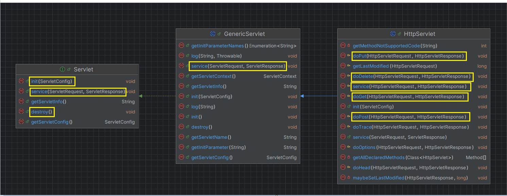
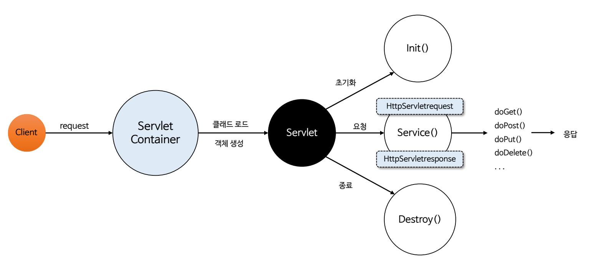
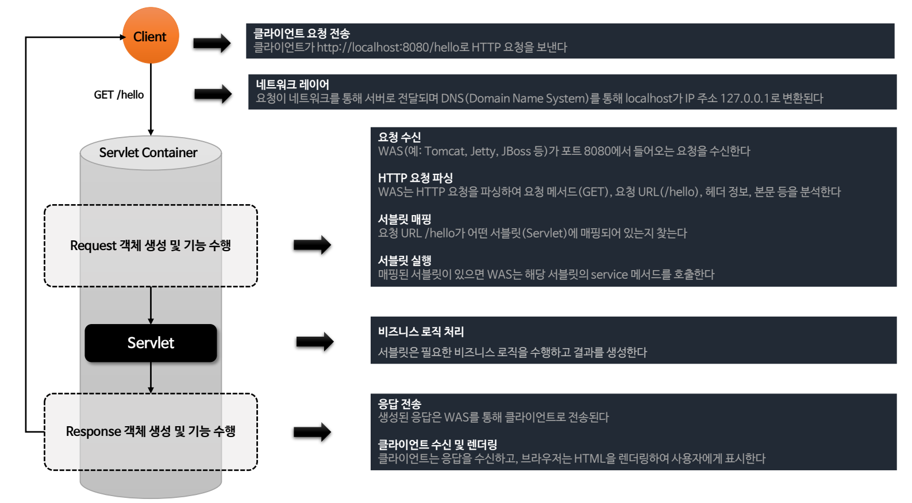

# Servlet 상세

- 서블릿은 Jakarta EE (Enterprise Edition) 플랫폼의 핵심 기술 중 하나로 클라이언트-서버 모델에서 서버 측에서 실행되는
작은 자바 프로그램이다.
- 주로 HTTP 요청과 응답을 처리하기 위해 사용되며 자바 서블릿 API를 통해 웹 애플리케이션 개발을 쉽게 할 수 있도록 해준다.

> 서블릿을 구현 하기 위해서 `GenericServlet` 또는 `HttpServlet`을 상속 받아 구현할 수 있다. (`HttpServlet` 상속이 일반적)

## 서블릿 로드 및 생성

서블릿 컨테이너는 서블릿을 처음으로 요청받거나 혹은 애플리케이션이 시작될 때 서블릿을 메모리에 로드하는 두 가지 방식이 있다.

- **지연 로딩 (Lazy Loading)** : 첫번째 클라이언트 요청이 들어올 때 서블릿이 로드되고 서블릿 객체를 생성한다. (Default)
- **즉시 로딩 (Eager Loading)** : 애플리케이션이 시작될 때 서블릿이 로드되고 객체가 생성된다.

이를 위해 `load-on-startup` 속성을 사용한다.

- **음수 값 또는 미설정** : 지연 로딩
- **양수 값** : 즉시 로딩, 값이 낮을 수록 높은 우선 순위를 가진다.
- **0** : 즉시 로딩이지만 양수 값들보다 우선하지 않을 수 있다.

## 서블릿 생명 주기

### init() - 초기화 작업
- 서블릿이 생성되고 `init()` 메서드를 통해 초기화되며 최초 한 번만 호출된다.
- 주로 초기화 파라미터를 읽거나 DB 연결 설정 등 초기 설정 작업을 수행한다.

### service() - 요청 처리 작업
- 클라이언트로부터의 모든 요청은 `service()` 메서드를 통해 처리되며 `HttpServletRequest`와 `HttpServletResponse` 객체가
생성되어 전달된다.
- HTTP 메서드에 따라 `doGet()`, `doPost()` 등의 메서드를 호출한다.

### destroy() - 종료 작업
- 서블릿이 서비스에서 제외되면 `destroy()` 메서드를 통해 종료되고 이후 가비지 컬렉션 및 finalize 과정을 거친다.
- 종료시 한 번만 호출된다.

## 서블릿 요청 및 응답 흐름

