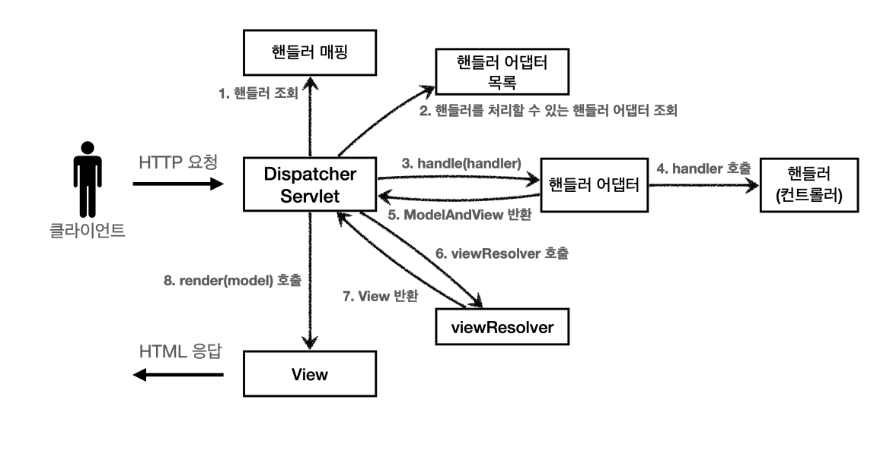
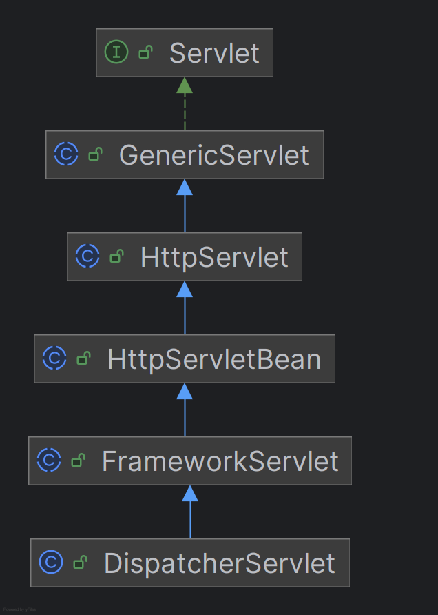
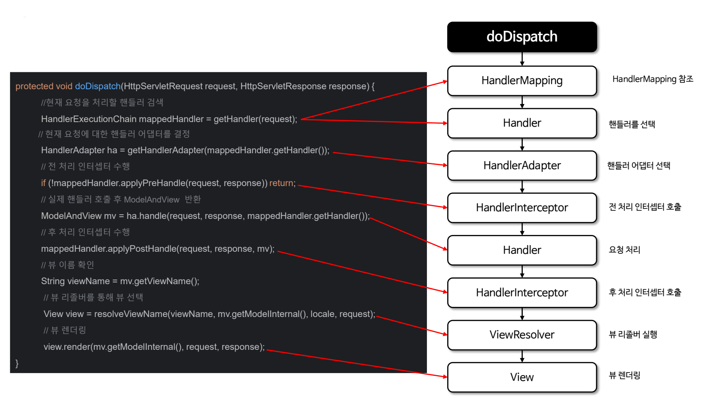
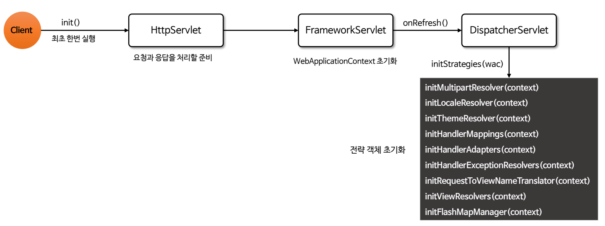
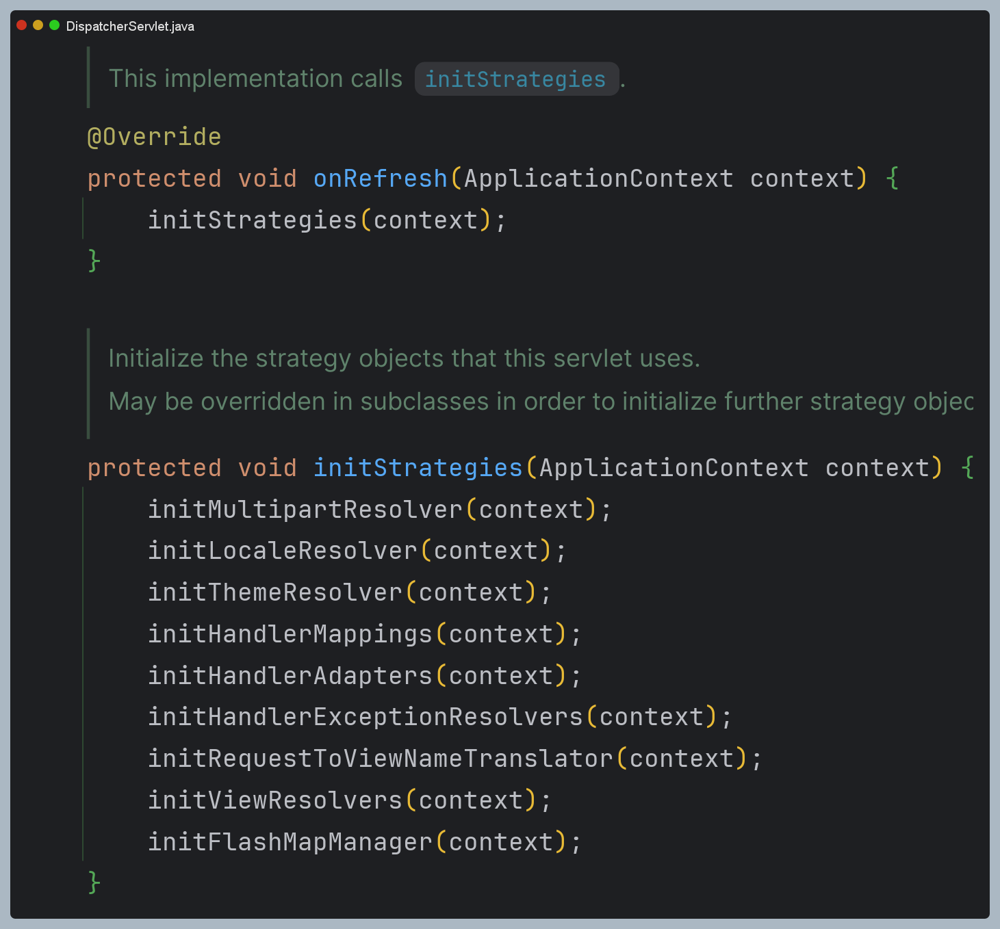

# 스프링 MVC 구조 



구조는 전에 직접 만든 mvc 프레임워크랑 똑같다.

명칭만 좀 다른데
- `FrontController` -> **DispatcherServlet**
- `handlerMappingMap` -> **HandlerMapping**
- `MyHandlerAdapter` -> **HandlerAdapter**
- `viewResolver` -> **ViewResolver** (인터페이스)
- `MyView` -> **View** (인터페이스)

## DispatcherServlet 구조
> 스프링 MVC도 프론트 컨트롤러 패턴으로 구현되어 있는데 스프링 MVC의 프론트 컨트롤러가 ``DispatcherServlet``이다. 이것이 스프링 MVC의 핵심이다.



부모 클래스에서 ``HttpServlet``을 상속 받아서 사용하고 있다.

스프링 부트는 ``DispatcherServlet``을 서블릿으로 자동으로 등록하면서 모든 경로("/")에 대해서 매핑한다.

### 요청 흐름
- 서블릿이 호출되면 `HttpServlet`이 제공하는 `service()`가 호출된다.
- 스프링 MVC는 `DispatcherServlet`의 부모인 `FrameworkServlet`에서 `service()`를 오버라이드 해두었다.
- `FrameworkServlet.service()`를 시작으로 여러 메서드가 호출되면서 `DispatcherServlet.doDispatch()`가 호출된다.

`doDispatch()` 내부 코드 일부



### 핵심 인터페이스

- `HandlerMapping`
  - 클라이언트 요청을 적절한 핸들러와 매핑하고, 이 과정에서 요청 전후에 실행할 인터셉터 목록도 함께 관리한다.
- `HandlerAdapter`
  - `DispatcherServlet`이 요청에 매핑된 핸들러를 호출할 때 핸들러의 호출 방식에 관계없이 일관되게 동작할 수 있도록 처리한다.
- `HandlerExceptionResolver`
  - 예외가 발생했을 때 이를 적절하게 처리하는 전략을 제공한다.
- `ViewResolver`
  - 컨트롤러가 반환한 뷰 이름을 실제 뷰로 변환하여 응답으로 렌더링할 수 있도록 한다.
- `LocaleResolver`, `LocaleContextResolver`
  - 사용자가 요청한 언어와 지역 설정(Locale)을 해석하여 적절한 국제화된 뷰를 제공할 수 있게 한다. (다국어 처리)
- `MultipartResolver`
  - 브라우저에서 파일 업로드와 같은 멀티파트 요청을 처리한다.
- `FlashMapManager`
  - 리다이렉션 후에 속성을 전달할 수 있도록 데이터를 임시로 저장하고 전달하는 역할을 한다.

> 개발자는 위 인터페이스를 직접 구현하여 스프링의 기본 기능을 확장하거나 새롭게 구현할 수 있다.

### init()

- 요청이 시작되면 `DispatcherServlet`의 `init()` 메서드가 호출되며 최초 한 번만 실행된다.
- `WebApplicationContext`를 생성 및 초기화하며 핵심 인터페이스와 같은 필수 구성 요소를 초기화하고 모든 요청을 처리할 준비를 완료한다.





---

## 스프링 MVC 
> 스프링은 어노테이션 기반 컨트롤러를 제공해 매우 유연하고 실용적이다.

가장 우선순위가 높은 핸들러 매핑과 어댑터는 ``RequestMappingHandlerMapping``, ``RequestMappingHandlerAdapter``이다.

`@RequestMapping`은 이것의 앞글자를 따서 만든 것인데 지금 스프링에서 주로 사용하는 어노테이션 기반의 핸들러 매핑과 어댑터이다.

### V1

회원 등록 폼 컨트롤러
```java
@Controller
public class SpringMemberFormControllerV1 {

    @RequestMapping("/springmvc/v1/members/new-form")
    public ModelAndView process() {
        return new ModelAndView("new-form");
    }
}
```

- `@Controller`
  - 스프링이 자동으로 스프링 빈으로 등록한다.(내부에 `@Component`가 있어 ComponentScan의 대상이 된다.)
  - 스프링 MVC에서 어노테이션 기반 컨트롤러로 인식한다.
- `@RequestMapping`
  - 요청 정보를 매핑한다. 해당 URL이 호출되면 이 메서드가 호출된다.
- `ModelAndView`
  - 모델과 뷰 정보를 담아서 반환한다.

`RequestMappingHandlerMapping`은 클래스 레벨에 `@Controller`가 붙어 있는 경우에 매핑 정보로 인식한다.

회원 저장 컨트롤러
```java
@Controller
public class SpringMemberSaveControllerV1 {

    private MemberRepository memberRepository = MemberRepository.getInstance();

    @RequestMapping("/springmvc/v1/members/save")
    public ModelAndView process(HttpServletRequest request, HttpServletResponse response) {
        String username = request.getParameter("username");
        int age = Integer.parseInt(request.getParameter("age"));

        Member member = new Member(username, age);

        System.out.println("member = " + member);

        memberRepository.save(member);

        ModelAndView mv = new ModelAndView("save-result");
        mv.addObject("member", member);
        return mv;
    }
}
```

회원 목록 컨트롤러
```java
@Controller
public class SpringMemberListControllerV1 {

    private MemberRepository memberRepository = MemberRepository.getInstance();

    @RequestMapping("/springmvc/v1/members")
    public ModelAndView process() {
        List<Member> members = memberRepository.findAll();
        ModelAndView mv = new ModelAndView("members");
        mv.addObject("members", members);

        return mv;
    }
}
```

### V2
> `@RequestMapping`을 클래스 단위에 적용하여 유연하게 하나로 통합할 수 있다.

통합 컨트롤러
```java
/**
 * 클래스 단위 -> 메서드 단위
 * @RequestMapping 클래스 레벨과 메서드 레벨 조합
 */
@Controller
@RequestMapping("/springmvc/v2/members")
public class SpringMemberControllerV2 {

    private final MemberRepository memberRepository = MemberRepository.getInstance();

    @RequestMapping("/new-form")
    public ModelAndView newForm() {
        return new ModelAndView("new-form");
    }

    @RequestMapping("/save")
    public ModelAndView save(HttpServletRequest request, HttpServletResponse response) {
        String username = request.getParameter("username");
        int age = Integer.parseInt(request.getParameter("age"));
        Member member = new Member(username, age);

        memberRepository.save(member);

        ModelAndView mav = new ModelAndView("save-result");
        mav.addObject("member", member);

        return mav;
    }

    @RequestMapping
    public ModelAndView members() {
        List<Member> members = memberRepository.findAll();
        ModelAndView mav = new ModelAndView("members");
        mav.addObject("members", members);
        return mav;
    }
}
```
클래스 레벨 URL + 메서드 레벨 URL로 조합된다.

### V3
> 스프링 MVC는 편리하게 개발할 수 있도록 수 많은 편의 기능을 제공한다.

```java
@Controller
@RequestMapping("/springmvc/v3/members")
public class SpringMemberControllerV3 {
    private final MemberRepository memberRepository = MemberRepository.getInstance();

    @GetMapping( "/new-form")
    public String newForm() {
        return "new-form";
    }

    @PostMapping("/save")
    public String save(@RequestParam("username") String username, 
                       @RequestParam("age") int age, 
                       Model model) {

        Member member = new Member(username, age);
        memberRepository.save(member);
        model.addAttribute("member", member);

        return "save-result";
    }

    @GetMapping
    public String members(Model model) {
        List<Member> members = memberRepository.findAll();
        model.addAttribute("members", members);
        return "members";
    }
}
```
- 컨트롤러에서 Model을 파라미터로 받을 수 있다.
- 뷰의 논리 이름을 직접 반환할 수 있다.
- HTTP 요청 파라미터를 ``@RequertParam``으로 받을 수 있다.
- ``@GetMapping``, ``@PostMapping``: URL만 매핑하는 것이 아니라 HTTP Method도 구분할 수 있다.