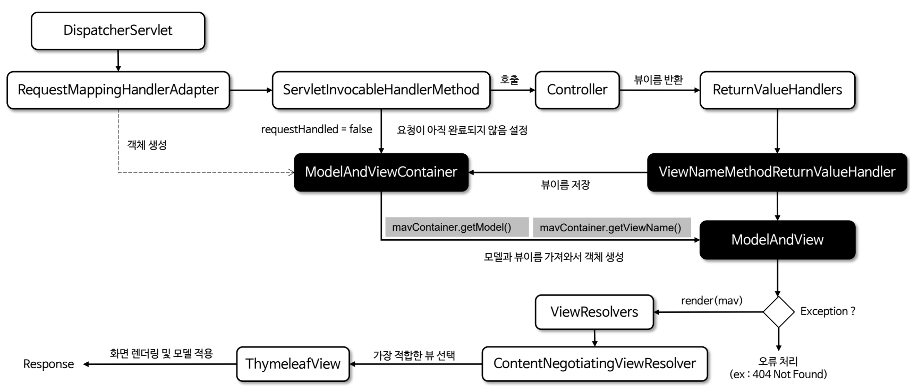

# ViewResolver 이해

## View

- 스프링 MVC에서 `View`는 웹 페이지를 사용자에게 보여주는 역할을 한다.
- `View`는 컨트롤러가 처리한 데이터를 사용자에게 보여주는 화면이며 사용자가 볼 수 있는 HTML, JSON 같은 결과물을 만들어주는 역할을 한다.
- 주요 구현체로는 `ThymeleafView`, `JstlView`, `MappingJackson2JsonView`, `MappingJackson2XmlView` 등이 있다.

## ViewResolver

- 스프링의 뷰 시스템은 `ViewResolver`와 `View` 인터페이스를 기반으로 동작한다.
- `ViewResolver`는 특정 URL 요청에 따라 어떤 `View`를 사용할지 결정하는 역할을 하고 `View`는 최종적으로 데이터를 렌더링하여
클라이언트에 반환한다.

- 스프링 MVC는 초기화 시점에 자동으로 기본 `ViewResolver` 구현체를 생성하고 등록한다.
- 기본적으로 `ContentNegotiatingViewResolver`, `InternalResourceViewResolver`, `ViewResolverComposite`를 포함하며 타임리프 의존성이 추가되면
`ThymeleafViewResolver`까지 포함한다.
- 이 중 `ContentNegotiatingViewResolver`가 가장 우선 순위가 높으며 이 클래스 안에 위 나머지 구현체들이 목록으로 저장되어 있다.
그리고 그 중에서는 `ThymeleafViewResolver`가 가장 우선 순위가 높다.

**`ContentNegotiatingViewResolver`는 각 `ViewResolver`에 의해 생성된 `View` 객체를 순회하며 가장 적절한 `View`를 결정해서 반환한다.**

1. 클라이언트의 요청 헤더에 포함된 **MediaType** (Accept 헤더) 목록과 `View`의 **Content-Type**을 비교해서 서로 호환이 되는 **MediaType**이 존재하는지 확인한다.
2. **MediaType**이 호환되는 첫번째 `View`가 최종 선택되어 반환된다. 만약 적절한 `View`를 찾지 못하면 예외가 발생한다.

> **View** vs **HttpMessageConverter**
> 
> | View                             | HttpMessageConverter                                 |
> |----------------------------------|------------------------------------------------------|
> | 템플릿 기반 HTML 렌더링                  | REST API 응답 데이터 변환                                   |
> | 모델 데이터를 기반으로 HTML 등으로 변환         | 객체를 JSON, Text 등으로 변환                                |
> | `@Controller`, `@RequestMapping` | `@RestController`, `@ResponseBody`, `ResponseEntity` |
> | `ViewResolver`에 의해 `View`를 선택`    | `ViewResolver`와 독립적                                  |

## 흐름도 및 주요 내부 코드

`ModelAndViewContainer`에 뷰 이름을 저장한다.

`ModelAndViewContainer`에 담긴 모델과 뷰 이름을 가져와서 `ModelAndView` 객체를 생성한다.

`ViewResolver`를 통해 적절한 `View`를 반환받는다.

선택된 `View`로 렌더링을 수행한다.

